---  
share: true  
aliases:  
  - 2024-11-23  
title: 2024-11-23  
URL: https://bagrounds.org/reflections/2024-11-23  
Author: "[[bryan-grounds]]"  
tags:   
---  
[Home](index.md) > [Reflections](reflections/index.md) | [⏮️](reflections/2024-11-21.md)  
# 2024-11-23  
## ➕ Improving My Reflection Template  
### 🖼️ Context  
1. ✍️ [I Blog From Obsidian](2024-04-21.md#✍%20Blogging%20From%20Obsidian)  
2. 🤖 I automate the creation of reflections with [Templater](https://github.com/SilentVoid13/Templater).  
3. 😿 But my process isn't fully automated.  
    1. 🔗🔨🥵 I manually update the ⏮️ link.  
    2. 🔗🕹️🥵 And I semi-manually add the ⏭️ link to the previous reflection.  
4. 📢📢 I want to blog more.  
5. 🥧✅ Theory: (all else equal) the easier it is, the more often I'll do it. See the [Tiny Habits Behavior Model](books/tiny-habits.md#Behavior%20model).  
  
### 🎯 Goal  
✍️🤖 Streamline blogging.  
  
### 📐 Specification  
🔧 Update my reflection template to  
1. ⏮️ Insert the link to the previous reflection  
2. ⏭️ Insert the link to this reflection in the previous reflection  
  
### 🪜 Steps  
#### 1) 🤖 ChatGPT  
##### 🗣️❓🤖 Initial Prompt  
> I have an obsidian templater template to create a file in a folder.  
Each file in this folder is named after the current date: YYYY-MM-DD.  
I want to update the template to include a link to the most recent file.  
Can you write me a snippet of templater code to do this?  
  
##### 🤖💬🤔 Initial Response (Sans Explanation)  
_⚠️ Warning: this code is slightly broken_  
```js  
<%*  
const folderPath = 'your/folder/path'; // Replace with the path to your folder  
const today = tp.date.now("YYYY-MM-DD");  
const files = app.vault.getFiles();  
const recentFile = files  
  .filter(file => file.path.startsWith(folderPath) && file.name <= today)  
  .sort((a, b) => b.name.localeCompare(a.name))[0]; // Get the most recent file  
const link = recentFile ? `[[${recentFile.name}]]` : "No recent file found"; // Create link  
link  
%>  
```  
  
#### 2) 🔧Modify -> ▶️👀Test -> ♻️Repeat  
The first snippet didn't work.  
ChatGPT and I fixed errors and iterated.  

```mermaid  
flowchart  
    subgraph Loop [ ];  
        R("▶️ Run Template") --> F("🐛👀 Failure") --> C("🔧 Change Code") --> R  
    end  
  
    R --> S("💰👀 Success")  
  
style Loop fill:none, stroke:none  
```  
  

  
### 📜 Result  
My reflection template now automatically creates a previous link pointing to the most recent reflection and modifies that reflection to link to the new one! 🎉🤖🥂🥳  
  
```js  
[[index|Home]] > [[reflections/index|Reflections]] | <%*  
const folderPath = 'reflections'  
const today = tp.date.now("YYYY-MM-DD")  
const files = app.vault.getFiles()  
const recentFile = files  
  .filter(file => file.path.startsWith(folderPath) && file.name <= today)  
  .sort((a, b) => b.name.localeCompare(a.name))[0]  
  
const stripExtension = p => p.replace(/\.[^.]+$/, '')  
  
if (recentFile) {  
  const recentFilePath = stripExtension(recentFile.path)  
  const currentFilePath = recentFilePath.replace(/\d{4}(-\d{2}){2}/, today)  
  tR += `[[${recentFilePath}|⏮️]]`  
  const recentFileContent = await app.vault.read(recentFile)  
  const nextLink = `⏮️]] [[${currentFilePath}|⏭️]]`  
  const updatedContent = recentFileContent.replace('⏮️]]', nextLink)  
  await app.vault.modify(recentFile, updatedContent)  
} else {  
  tR += "No recent file found"  
}  
%>  
```  
  
### 🪞 Reflections  
1. 🤖 Chat bots help.  
    1. 🧐 They're not perfect.  
    2. 🚄 But with good prompts, some patience, and iteration, they can dramatically speed up writing (code or otherwise) by quickly generating pretty good drafts.  
2. :) I ❤️ emojis.  
3. 🤖 I ❤️ automation.  
    1. 🥧 Easier -> ✅ More  
4. 📣 I ❤️ Blogging.  
    1. 🥳 I'm having fun.  
  
## 🧑‍🚀 Exploring Quartz Features  
- [Free RSS feed and sitemap](https://quartz.jzhao.xyz/plugins/ContentIndex)  
- 💬 [Giscus Comments?!](https://quartz.jzhao.xyz/features/comments)  
  - 🤯 Did Quartz do this before or after [I did](reflections/2024-11-20.md)?  
- 🤯 Obsidian and Quartz support [YouTube video embeds](https://quartz.jzhao.xyz/plugins/ObsidianFlavoredMarkdown) via markdown image syntax!  
  - I've been planning to eventually go through my video pages and figure out how to embed the YouTube video in the page.  
  - Now it's super easy.  
  - Check it out: [Parables on the Power of Planning in AI: From Poker to Diplomacy: Noam Brown (OpenAI)](videos/parables-on-the-power-of-planning-in-ai-from-poker-to-diplomacy-noam-brown-openai.md)  
  
## 🧜 Troubleshooting Mermaid  
- 🤔 the graph on this page renders in Obsidian but not on my website.  
  - 🐛 on my site: syntax error, version 10.7.0  
- 🤞 let's try upgrading mermaidjs to the latest version: 11.4.0  
- 🤔 nope... Same error, different version  
- 💰 There we go...  
  - 🚛 adding a semicolon after the end bracket fixed it  
  - ⬜ I think some compilation step added whitespace after the square bracket and broke the parser  
  - ❗ I guess punctuation can be important  
  
## ⚡ Tuning the Build  
- Is 1 - 2 minutes too long to wait for my blog posts to publish? Yes. Let's  
  - cache dependencies  
  - combine jobs  
  - update actions  
  - reduce polling frequency  
  - use smaller containers with node pre-installed  
- here's the GitHub workflow file  
  - [before](https://github.com/bagrounds/obsidian-github-publisher-sync/blob/981b9d7c511c9745098124030cec80cabef00798/.github/workflows/deploy.yml)  
  - [after](https://github.com/bagrounds/obsidian-github-publisher-sync/blob/97203b53e27c508001360f7834c34c00d921e140/.github/workflows/deploy.yml)  
- we went from typically 1 - 2 minutes to typically 30 - 40 seconds  
  - most of the time spent over 30 seconds is waiting for a runner  
  - previously, most of the time spent over ~1 minutes was spent  
  
## 📥 Invitation  
[I recently added comments to this site.](reflections/2024-11-20.md)  
1. 👂 What do you think?  
2. ⚖️ Have you found practical or entertainment value in anything I've written?  
3. 🪙🪙 Do you have any advice?  
4. 💬 If you have a GitHub account, let me know what you think by leaving a comment below (or how you feel by leaving an emoji reaction for this page).  
