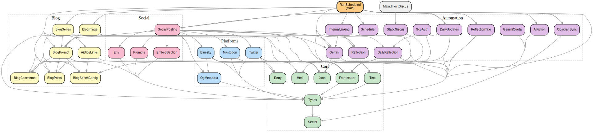

# 📚 obsidian-github-publisher-sync

🏗️ A publishing pipeline that transforms an [Obsidian](https://obsidian.md) vault into a public website at [bagrounds.org](https://bagrounds.org/). 🔄 Content flows one way: from the Obsidian vault (source of truth) on a mobile device, through the [Enveloppe](https://github.com/Enveloppe/obsidian-enveloppe) plugin, into this GitHub repository, and out to GitHub Pages via [Quartz](https://quartz.jzhao.xyz/).

🤖 On top of this static publishing layer, **three GitHub Actions workflows** power all AI-powered features: a Haskell CI workflow that builds and tests the automation binaries, a single hourly scheduler for blog generation, social media posting, internal linking, and image generation — plus a deploy workflow for building and publishing the site. All automation logic is implemented in Haskell, compiled to native binaries, and distributed as GitHub Actions artifacts.

## 🌐 Architecture Overview

```
┌─────────────────────┐      Enveloppe        ┌──────────────────────┐
│  Obsidian Vault      │ ─────────────────────▶ │  GitHub Repository   │
│  (phone, read-only)  │ ◀──── ob sync ─────── │  content/ directory   │
└─────────────────────┘                        └──────────┬───────────┘
                                                          │
                                  ┌───────────────────────┼──────────────────┐
                                  │                       │                  │
                            GitHub Actions          GitHub Pages         Giscus
                            (3 workflows)          (Quartz SSG)       (comments)
                                  │                       │                  │
                    ┌─────────────┼─────────────┐         │                  │
                    │             │             │          │                  │
               Blog Gen     Social Post    Internal     Deploy           Comment
              + Images       to X/BS/M     Linking    (build +          injection
                                                      deploy)           (SEO)
```

### 📱 Obsidian Vault → GitHub (Enveloppe)

📝 The `content/` directory is a **read-only mirror** of the Obsidian vault. 🔒 No GitHub Action or script ever commits to the repository. 📤 The [Enveloppe](https://github.com/Enveloppe/obsidian-enveloppe) Obsidian plugin pushes notes marked with `share: true` in their frontmatter to this repo.

### 🔄 GitHub → Obsidian Vault (ob sync)

🔙 Generated content (blog posts, images, updated frontmatter) flows back to the vault via the [`obsidian-headless`](https://www.npmjs.com/package/obsidian-headless) CLI (`ob sync`). 📂 The Haskell `run-scheduled` binary manages vault synchronization through the `Automation.ObsidianSync` module.

### 🌍 GitHub → Website (Quartz + GitHub Pages)

🏗️ On every push to `main`, the **Deploy** workflow builds the site with [Quartz 4](https://quartz.jzhao.xyz/) (a static site generator for Obsidian vaults) and deploys to GitHub Pages. 💬 After building, the Haskell `inject-giscus` binary fetches [Giscus](https://giscus.app/) discussion comments via the GitHub GraphQL API and injects static HTML for SEO visibility.

## 📂 Content Organization

| 📁 Directory | 📊 Count | 📝 Description |
|---|---|---|
| 📚 `books/` | ~957 | 📖 Book reports and reading notes |
| 🪞 `reflections/` | ~492 | 📝 Daily journal / blog entries |
| 📺 `videos/` | ~700 | 🎬 Video notes and summaries |
| 🌌 `topics/` | ~91 | 💡 Topic pages (philosophy, CS, etc.) |
| 📄 `articles/` | ~81 | 📰 Article notes |
| 🤖💬 `bot-chats/` | ~49 | 🗣️ Conversations with AI |
| 💾 `software/` | ~31 | 🖥️ Software tool notes |
| 👥 `people/` | ~18 | 🧑 People notes |
| 🛍️ `products/` | ~6 | 🛒 Product reviews |
| 🎤 `presentations/` | 2 | 🎙️ Talk slides and notes |
| 🧰 `tools/` | 1 | 🧮 Interactive tools (calculator) |
| 🎮 `games/` | 1 | 🧬 Interactive games (Valence) |
| 🤖 `auto-blog-zero/` | ~12 | 📝 AI-generated daily blog posts |
| 🐔 `chickie-loo/` | ~12 | 🐣 AI-generated chicken-themed blog posts |
| 🏛️ `systems-for-public-good/` | ~1 | 🏛️ AI-generated democracy and public good blog posts |
| 🤖 `ai-blog/` | ~30 | 📝 AI agent blog posts about code changes |

## ⚙️ GitHub Actions Workflows

### 1. 🚀 Deploy (`deploy.yml`)

🔄 Triggers on every push. 🏗️ Builds the Quartz site, downloads the pre-built `inject-giscus` Haskell binary, injects static Giscus comments for SEO, and deploys to GitHub Pages. 🔍 After deployment to `main`, runs a broken link audit sampling 30 pages from the live site.

### 2. ⏰ Scheduled Tasks (`scheduled.yml`)

🕐 Runs hourly. 🧠 The pre-built Haskell `run-scheduled` binary determines which tasks to run based on the current Pacific hour. It orchestrates all automation:

| ⏰ Pacific Hour | 🏷️ Task | 📝 Description |
|---|---|---|
| 8 | 🐔 Chickie Loo | 🐣 AI blog post with chicken-keeping personality |
| 9 | 🤖 Auto Blog Zero | 📝 AI blog post based on reflections and discussions |
| 10 | 🏛️ Systems for Public Good | 🏛️ AI blog with Google Search grounding for current events |
| 23 | 🖼️ Backfill Blog Images | 🔍 Generate missing cover images for all blog posts |
| 1 | 🔗 Internal Linking | 📥 BFS-driven wikilink insertion in Obsidian vault |
| Even hours | 📢 Social Posting | 📱 Discover and post unposted content to X/Bluesky/Mastodon |

### 3. 🔨 Haskell CI (`haskell.yml`)

🏗️ Triggers on pushes that modify `haskell/` or the workflow itself. Builds all Haskell executables with GHC 9.14.1 and `-Werror`, runs the full test suite (719+ tests), and uploads compiled binaries as artifacts for other workflows to download.

## 🏗️ Haskell Automation (`haskell/`)

All automation logic is implemented in Haskell, compiled to native Linux binaries, and distributed via GitHub Actions artifacts. The Haskell codebase lives in the `haskell/` directory.

### 🔧 Executables

| 🔧 Binary | 📝 Purpose |
|---|---|
| `run-scheduled` | ⏰ Main scheduler — orchestrates all hourly tasks (blog gen, social posting, internal linking, image backfill, daily reflections, vault sync) |
| `inject-giscus` | 💬 Post-build — fetches Giscus discussion comments and injects static HTML into the built site for SEO |

### 📚 Library Modules (`haskell/src/Automation/`)

| 📦 Module | 📝 Purpose |
|---|---|
| `Scheduler` | ⏰ Pure scheduling logic — maps Pacific hours to task IDs |
| `InternalLinking` | 🔗 BFS traversal, Gemini book identification, wikilink insertion |
| `BlogImage` | 🖼️ Image generation pipeline (Cloudflare, HuggingFace, Together, Pollinations, Gemini) |
| `BlogSeries` | 📝 Blog post generation with series context |
| `BlogPrompt` | 🤖 Prompt engineering for blog generation |
| `ObsidianSync` | 📤 Obsidian vault pull/push via headless CLI |
| `Frontmatter` | 📋 YAML frontmatter parsing and note I/O |
| `DailyReflection` | 📝 Daily reflection creation, section insertion, post linking |
| `DailyUpdates` | 📝 Link updates for daily reflections |
| `Gemini` | 🤖 Gemini API client with streaming support |
| `GeminiQuota` | 📊 Quota checking via GCP APIs |
| `GcpAuth` | 🔐 GCP service account authentication |
| `SocialPosting` | 📢 BFS content discovery and social media orchestration |
| `Platforms.Twitter` | 🐦 Twitter/X API v2 integration |
| `Platforms.Bluesky` | 🦋 Bluesky/ATProto integration |
| `Platforms.Mastodon` | 🐘 Mastodon Fediverse integration |
| `Platforms.OgMetadata` | 🔗 Open Graph metadata extraction |
| `StaticGiscus` | 💬 Static Giscus comment injection |
| `AiBlogLinks` | 🤖 AI blog navigation link generation |
| `AiFiction` | 📖 AI fiction section generation |
| `ReflectionTitle` | 📝 Daily reflection title generation via Gemini |
| `BlogComments` | 💬 Fetch Giscus discussion comments |
| `BlogSeriesConfig` | ⚙️ Blog series configuration |
| `BlogPosts` | 📄 Blog post file I/O |
| `EmbedSection` | 📎 Section embedding from other files |
| `Prompts` | 🧠 Prompt engineering utilities |
| `Types` | 📐 Shared domain types |
| `Secret` | 🔐 Secret newtype for redacting sensitive values |
| `Env` | 🔧 Environment variable validation |
| `Retry` | 🔄 Exponential backoff retry logic |
| `Text` | ✂️ Text processing and truncation |
| `Html` | 🌐 HTML parsing utilities |
| `Timer` | ⏱️ Timing utilities |
| `Pipeline` | 🔀 Async pipeline orchestration |
| `Json` | 📋 JSON parsing and encoding |

### 📊 Module Dependency Graph



🟢 Green nodes are core infrastructure modules. 🔵 Blue nodes are platform integrations. 🟡 Yellow nodes are blog-related modules. 🩷 Pink nodes are social posting modules. 🟣 Purple nodes are automation/AI modules. 🟠 The orange node is the main entry point.

## 🔗 Internal Linking System

🧠 The internal linking system uses a **BFS-driven, AI-identification architecture** to insert wikilinks for book references, operating directly on the Obsidian vault.

### 📊 Pipeline

```
Pull Vault → BFS from Most Recent Reflection → For Each File:
  ├─ Check link_analysis_model (skip if already analyzed)
  ├─ Check force_analyze_links (override skip)
  ├─ Filter eligible books (not already linked)
  ├─ Gemini identifies genuine book references
  ├─ extractJsonArray handles messy AI responses
  ├─ Record link_analysis_model + link_analysis_time
  ├─ Find text positions (deterministic regex)
  ├─ Log diff (both dry-run and live)
  └─ Insert wikilinks → Push Vault
```

### 🔑 Key Design Decisions

- 📱 **Vault-native** — Reads from and writes to the Obsidian vault directly (`--content-dir` flag). The `content/` directory in the repo stays read-only.
- 🤖 **AI identifies, code positions** — Gemini receives the full document body + all available book titles and identifies which books are genuinely referenced as literary works. Deterministic regex matching only runs after AI confirmation.
- 📚 **Books-only index** — `linkableDirs = ["books"]` constrains link targets to book pages, avoiding false positives from generic words matching topic or software pages.
- 🔒 **Incremental analysis** — Each analyzed file gets `link_analysis_model` and `link_analysis_time` frontmatter. Files with a `link_analysis_model` are skipped. Use `force_analyze_links: true` in frontmatter for manual re-analysis.
- 🔧 **Robust JSON parsing** — `extractJsonArray` handles Gemini responses wrapped in code fences, with trailing text, or other formatting quirks.
- 🛡️ **Rate-limit resilience** — Per-minute 429s trigger retry with exponential backoff. Daily quota exhaustion throws `QuotaExhaustedError` to halt the pipeline cleanly.
- 📊 **Summary statistics** — Completion log includes `filesVisited`, `filesModified`, `filesSkipped`, and `totalLinksAdded`.
- 📝 **Diff logging for all runs** — Both dry runs and live runs emit diff events with line-level changes.

## 🌐 Quartz Site Features

🏗️ The website at [bagrounds.org](https://bagrounds.org/) is built with Quartz 4 and includes:

- 🔊 **Text-to-Speech (TTS)** — Browser-based speech synthesis with play/pause controls, wake lock to prevent screen sleep during playback, and auto-play for continuous reading across pages.
- 💬 **Giscus Comments** — GitHub Discussions-backed comments on every page, with static HTML injection for search engine visibility.
- 🎮 **Interactive Games** — Games like [Valence](https://bagrounds.org/games/valence) built with Pixi.js, loaded as external static JS files.
- 🧮 **Interactive Tools** — Browser-based calculator and other utility pages.
- 🎨 **Solarized Theme** — Dark/light mode using the Solarized color palette.
- 📊 **OG Images** — Auto-generated Open Graph images for social sharing.
- 🔍 **Full-text Search** — FlexSearch-powered client-side search.
- 📡 **RSS Feed** — Full-HTML RSS with up to 1000 items.

## 🔧 Environment Variables

### 🔑 Secrets

| 🔐 Variable | 📝 Purpose |
|---|---|
| `GEMINI_API_KEY` | 🤖 Google Gemini API key (used by blog gen, social posting, internal linking, image description) |
| `CLOUDFLARE_API_TOKEN` | ☁️ Cloudflare Workers AI API token (image generation) |
| `CLOUDFLARE_ACCOUNT_ID` | ☁️ Cloudflare account identifier |
| `HUGGINGFACE_API_TOKEN` | 🤗 Hugging Face Inference API token (fallback image generation) |
| `OBSIDIAN_AUTH_TOKEN` | 📤 Obsidian headless sync authentication token |
| `OBSIDIAN_VAULT_NAME` | 📂 Name of the Obsidian vault to sync with |
| `OBSIDIAN_VAULT_PASSWORD` | 🔒 Obsidian vault encryption password (social posting only) |
| `TWITTER_API_KEY` | 🐦 Twitter/X API key |
| `TWITTER_API_SECRET` | 🐦 Twitter/X API secret |
| `TWITTER_ACCESS_TOKEN` | 🐦 Twitter/X access token |
| `TWITTER_ACCESS_SECRET` | 🐦 Twitter/X access secret |
| `BLUESKY_IDENTIFIER` | 🦋 Bluesky handle |
| `BLUESKY_APP_PASSWORD` | 🦋 Bluesky app password |
| `MASTODON_INSTANCE_URL` | 🐘 Mastodon instance URL |
| `MASTODON_ACCESS_TOKEN` | 🐘 Mastodon access token |
| `GCP_SERVICE_ACCOUNT_KEY` | ☁️ GCP service account JSON (quota monitoring) |
| `GITHUB_TOKEN` | 🔑 GitHub token (blog gen reads discussions, Giscus comments) |

### ⚙️ Configuration Variables (GitHub Repository Variables)

| 🔧 Variable | 📝 Default | 📝 Purpose |
|---|---|---|
| `BLOG_GEMINI_MODEL` | `gemini-3.1-flash-lite-preview` | 🤖 Model for blog post generation |
| `LINKING_MODEL` | `gemini-3.1-flash-lite-preview` | 🔗 Model for internal link identification |
| `IMAGE_GEMINI_MODEL` | `gemini-3.1-flash-image-preview` | 🖼️ Model for native image generation |
| `PROMPT_DESCRIBER_MODEL` | `gemini-3.1-flash-lite-preview` | 📝 Model for image prompt description |
| `CLOUDFLARE_IMAGE_MODEL` | `@cf/black-forest-labs/flux-1-schnell` | ☁️ Cloudflare image generation model |
| `HUGGINGFACE_IMAGE_MODEL` | `black-forest-labs/FLUX.1-schnell` | 🤗 Hugging Face image generation model |
| `GEMINI_MODEL` | `gemma-3-27b-it` | 📱 Model for social media post generation |
| `AUTO_BLOG_ZERO_PRIORITY_USER` | `bagrounds` | 👤 GitHub user for blog discussion priority |
| `CHICKIE_LOO_PRIORITY_USER` | `ChickieLoo` | 🐔 GitHub user for Chickie Loo priority |
| `SYSTEMS_FOR_PUBLIC_GOOD_PRIORITY_USER` | `bagrounds` | 🏛️ GitHub user for Systems for Public Good priority |
| `DISABLE_TWITTER` | _(empty)_ | 🚫 Set to disable Twitter posting |
| `DISABLE_BLUESKY` | _(empty)_ | 🚫 Set to disable Bluesky posting |
| `DISABLE_MASTODON` | _(empty)_ | 🚫 Set to disable Mastodon posting |

## 🧪 Testing

```bash
# Run Haskell tests (870+ tests)
cd haskell && cabal update && cabal test --test-show-details=direct

# Run Quartz TypeScript tests
npx tsx --test quartz/**/*.test.ts

# Run broken link audit tests
npx tsx --test scripts/**/*.test.ts

# Type check (Quartz + remaining scripts)
tsc --noEmit

# Format check
npx prettier . --check
```

📊 870+ Haskell tests covering all automation modules, plus Quartz TypeScript component tests.

## 🏗️ Development

```bash
# Install Node.js dependencies (for Quartz)
npm ci

# Build the Quartz site locally
npx quartz build --serve

# Build Haskell automation
cd haskell && cabal update && cabal build all

# Run Haskell tests
cd haskell && cabal test --test-show-details=direct
```

## 📐 Design Principles

- 🏗️ **Strong static types** — Haskell for automation, TypeScript with strict mode for Quartz
- 🧩 **Functional declarative patterns** — Pure functions, algebraic data types, pattern matching, composition
- 🔧 **Unix philosophy** — Small, composable modules with clear boundaries
- 📐 **Domain-driven design** — Explicit types for domain concepts
- 📖 **Self-documenting code** — Well-named functions and types over comments
- 📱 **Obsidian vault is source of truth** — `content/` is read-only; all mutations flow through vault sync
- 🚫 **Never commit from workflows** — GitHub Actions use `contents: read` permissions only

## 📋 Specs

📄 Detailed product and engineering design specs live in `specs/`:

| 📄 Spec | 📝 Description |
|---|---|
| [`scheduled-tasks.md`](specs/scheduled-tasks.md) | ⏰ Consolidated task scheduler — hourly cron, Haskell scheduling logic, task pipelines |
| [`image-generation.md`](specs/image-generation.md) | 🖼️ Image generation pipeline — architecture, provider resolution, frontmatter schema, rate limiting, backfill prioritization |
| [`daily-reflection.md`](specs/daily-reflection.md) | 📝 Daily reflection auto-update — template-based creation, series section insertion, post linking, workflow integration |
| [`systems-for-public-good.md`](specs/systems-for-public-good.md) | 🏛️ Systems for Public Good blog series — democracy, public goods, grounding with Google Search, editorial guidelines |
| [`ai-blog-sync.md`](specs/ai-blog-sync.md) | 🤖 AI blog vault sync — automated navigation links, daily reflection linking, TTS-friendly writing |
| [`tts.md`](specs/tts.md) | 🎧 Text-to-Speech player — Web Speech API, content extraction, sentence highlighting, auto-play, comment reading |
