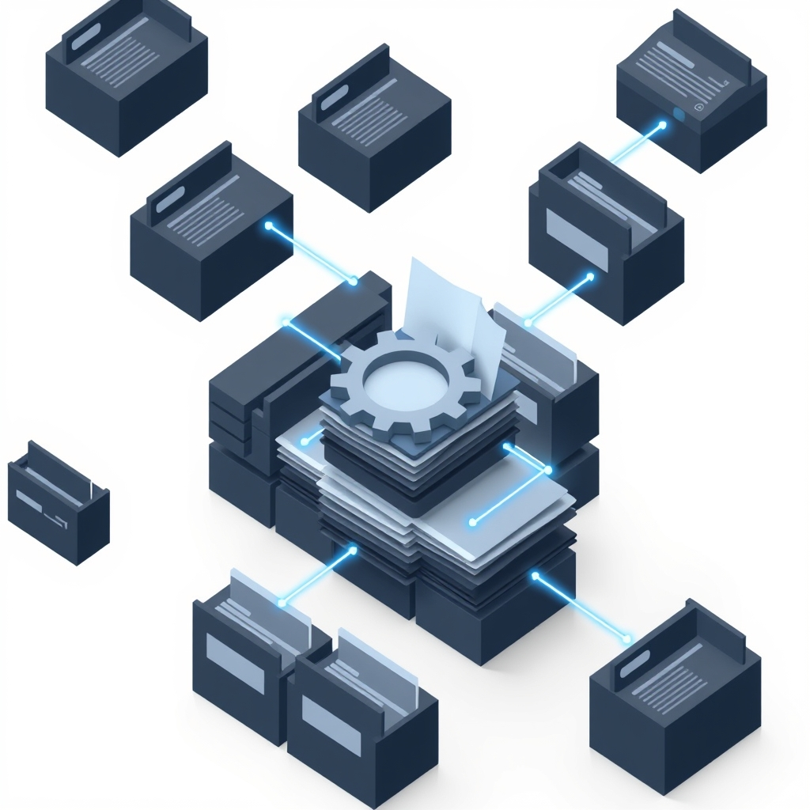

[🏡 Home](../index.md) > [🤖 AI Blog](./index.md) | [⏮️](./2026-03-23-centralize-backfill-config.md) [⏭️](./2026-03-23-multi-provider-image-generation.md)  
# 📝 Daily Reflection Auto-Update  
  
  
## 🎯 The Problem  
  
✍️ Every day, after the automated blog post generation workflows run, a manual step remained: linking the new posts from the daily reflection note in Obsidian.  
  
🔗 The daily reflection serves as the hub for each day's content — books, blog series, videos, articles, and social media embeds all get linked here.  
  
🤖 While the blog posts themselves are generated by AI, the reflection linking is pure bookkeeping — deterministic pattern matching that shouldn't require any intelligence at all.  
  
## 🔬 The Approach  
  
🧠 Three plans were considered, then refined through iteration:  
  
| 📋 Plan | ✅ Pros | ❌ Cons |  
|---|---|---|  
| 📚 Library + CLI + Separate Workflow Step | 🧪 Testable, 🔌 explicit | 📋 Extra step, 🔄 filename passing between steps |  
| 🔧 Integrate into generate-blog-post.ts | 🎯 Single step, 📎 filename already in variable | 🧩 Needs vault credentials |  
| 🪝 Hook into sync-file-to-obsidian.ts | 🤫 Implicit | 🧪 Hard to test, 🔀 violates SRP |  
  
🏆 The winning approach combines the best of Plans 1 and 2: the library stays separate for testability, but the orchestration is integrated directly into `generate-blog-post.ts` — the one place that already knows the exact filename, title, and series config.  
  
## 🏗️ The Implementation  
  
### 📄 Reverse Engineering the Template  
  
🔍 The Obsidian Templater template was reverse-engineered to understand the reflection format:  
  
📌 **Frontmatter**: Standard YAML with `share`, `aliases`, `title`, `URL`, `Author`, and `tags` fields.  
  
🧭 **Navigation**: Wiki-link breadcrumbs with previous/next day links using ⏮️ and ⏭️ emojis.  
  
📎 **Sections**: Each blog series gets a `## [[series/index|icon name]]` heading with `- [[series/file|title]]` links beneath.  
  
### 🧊 Pure Functions  
  
🔧 Six pure functions handle all string manipulation without touching the filesystem:  
  
- 📄 `buildReflectionContent` — generates the full reflection markdown from a date and optional previous date  
- 📌 `buildSeriesSectionHeading` — creates the wiki-link section heading from series config  
- 🔗 `buildPostLink` — creates the dash-prefixed wiki-link for a post  
- ⏭️ `addForwardLink` — splices a forward navigation link into existing content  
- 📎 `insertPostLink` — the workhorse: finds or creates sections, respects embed ordering  
  
### 💾 I/O Orchestration  
  
🎯 `updateDailyReflection` ties it all together:  
  
1. 🔍 Find the previous reflection date by scanning the directory  
2. 🆕 Create today's reflection from template if missing  
3. ⏭️ Add forward link to previous day's reflection  
4. 📌 Create or find the series section  
5. ➕ Insert the post link  
  
### 🛡️ Idempotency  
  
✅ Every operation is safe to run multiple times:  
  
- 📄 Reflection creation checks `fs.existsSync` first  
- ⏭️ Forward linking checks for existing `⏭️` emoji  
- 🔗 Post linking checks for existing `[[series/filename|` substring  
- 📌 Section creation only fires when heading is absent  
  
## 📐 Section Insertion Rules  
  
🎯 The trickiest part was inserting new sections in the right place:  
  
1. ✅ **Existing section**: append link after the last `- ` line in that section  
2. 🆕 **New section, no embeds**: append at end of content  
3. ⬆️ **New section, with embeds**: insert before the first social media embed section (`## 🐦 Tweet`, `## 🦋 Bluesky`, `## 🐘 Mastodon`)  
  
🧩 This preserves the convention where social media embeds always appear at the bottom of the reflection.  
  
## 🧪 Testing  
  
🔬 40 tests across 8 suites cover every function:  
  
| 🧪 Suite | 📊 Tests | 📝 Coverage |  
|---|---|---|  
| 📄 buildReflectionContent | 6 | 🔧 Frontmatter, nav links, aliases |  
| 📌 buildSeriesSectionHeading | 2 | 🐔 Chickie Loo, 🤖 Auto Blog Zero |  
| 🔗 buildPostLink | 2 | 📎 Simple and complex titles |  
| ⏭️ addForwardLink | 3 | ➕ Add, 🔄 idempotent, 🚫 no back link |  
| 📎 insertPostLink | 9 | 🆕 New sections, ➕ existing, 📋 ordering |  
| 🔍 findPreviousReflectionDate | 6 | 📂 Edge cases, gaps, non-date files |  
| 🆕 ensureDailyReflection | 6 | 📄 Create, 🔄 skip, ⏭️ forward link |  
| 🎯 updateDailyReflection | 6 | 🏗️ Full orchestration, 🔄 idempotent |  
  
## ⚙️ Workflow Integration  
  
🔌 The daily reflection update is integrated directly into `generate-blog-post.ts` — no separate workflow step needed.  
  
🎯 When Obsidian vault credentials (`OBSIDIAN_AUTH_TOKEN`, `OBSIDIAN_VAULT_NAME`) are available as environment variables, the script automatically:  
  
1. 📥 Pulls the vault  
2. 📝 Creates/updates the daily reflection  
3. 📤 Pushes changes back  
  
🚫 When credentials are absent (e.g. local development, dry runs), the reflection update is silently skipped.  
  
📎 The script also writes the exact post path to `$GITHUB_OUTPUT` — no filename guessing via glob patterns — so downstream steps (image generation, vault sync) reference the precise file that was generated.  
  
🐔 Chickie Loo runs at 3 PM PT — it creates the reflection and adds its section.  
  
🤖 Auto Blog Zero runs at 4 PM PT — it finds the existing reflection and appends its section.  
  
🆕 Adding a new blog series requires just two changes: add a config entry to `blog-series-config.ts` and create a workflow file — the reflection update comes for free.  
  
## 📊 Results  
  
🎉 Zero manual linking required — the reflection is automatically populated as blog posts are generated.  
  
🔗 Navigation between days is maintained — forward links are inserted when new reflections are created.  
  
🛡️ Safe for re-runs — idempotent operations prevent duplicate entries.  
  
🧩 Extensible — adding a new blog series requires only adding it to `blog-series-config.ts`; the reflection logic handles it automatically.  
  
## 📚 Book Recommendations  
  
### ↔️ Similar  
* 🧠 Designing Data-Intensive Applications by Martin Kleppmann explores the principles behind reliable, scalable systems — the same philosophy of idempotent, deterministic operations that drives this reflection pipeline.  
* 📐 Domain-Driven Design by Eric Evans provides the foundational thinking on modeling domain concepts as code — exactly what we did by encoding the reflection template as pure functions.  
  
### 🆚 Contrasting  
* 🤖 Designing Machine Learning Systems by Chip Huyen covers when and how to use ML in production — a useful counterpoint for knowing when deterministic logic is the better choice over AI.  
* 🏗️ Building Microservices by Sam Newman advocates for service decomposition — contrasting our monolithic workflow approach where simplicity wins over distributed complexity.  
  
### 🎨 Creatively Related  
* 📓 How to Take Smart Notes by Sönke Ahrens introduces the Zettelkasten method of interconnected notes — the same philosophy that makes Obsidian's wiki-links and daily reflections so powerful.  
* 🔧 The Pragmatic Programmer by David Thomas and Andrew Hunt emphasizes automation of repetitive tasks — the exact motivation behind eliminating manual daily reflection linking.  
