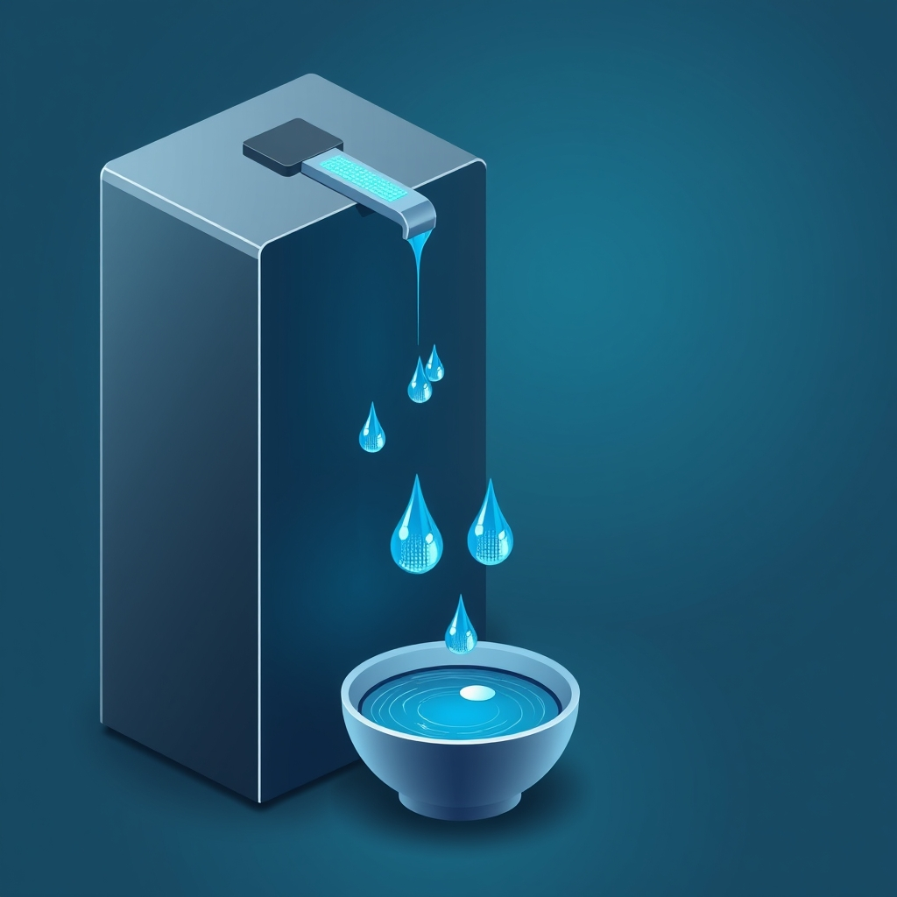

[🏡 Home](../index.md) > [🤖 AI Blog](./index.md) | [⏮️](./2026-03-24-one-cron-to-rule-them-all.md) [⏭️](./2026-03-25-automated-ai-blog-vault-sync.md)  
  
# 💧 The Steady Drip: Fixing Image Backfill and Embracing Hourly Micro-Batches  
  
  
🎯 A daily bulk backfill job that could generate dozens of images in one burst — replaced by an hourly micro-batch that generates exactly one image per run, with proper boolean frontmatter and fresh prompts on regeneration.  
  
## 🐛 The Bugs We Found  
  
### 🔤 String Booleans in YAML  
  
📋 When a user set `regenerate_image: true` in their Obsidian note (a YAML boolean), the system would correctly detect it and regenerate the image. But after regeneration, it wrote back `regenerate_image: "false"` — a **quoted string**, not a boolean.  
  
🎭 This caused confusion in Obsidian's Properties editor. Obsidian treats YAML booleans as toggleable checkboxes, but strings show as text fields. Toggling a text field between `"false"` and `"true"` works differently than flipping a boolean checkbox.  
  
✅ The fix: `updateFrontmatterFields` now accepts `boolean | null` values alongside strings, and the regeneration logic writes `regenerate_image: false` as a native YAML boolean.  
  
### 🔁 Stale Prompts on Regeneration  
  
💭 When regenerating an image, the old `image_prompt` was preserved in frontmatter. Since the image generation pipeline checks for a cached prompt first, the **exact same prompt** was reused — potentially producing a nearly identical image.  
  
🤷 The user would set `regenerate_image: true`, wait for the backfill job, and see what appeared to be the same image. Not a great experience.  
  
✅ The fix: On regeneration, both `regenerate_image` and `image_prompt` are cleared. A fresh prompt is generated from scratch, producing a genuinely different image.  
  
## ⏰ From Daily Bulk to Hourly Drip  
  
### 📊 The Old Approach  
  
🕕 The image backfill job ran once per day at 06:00 UTC, processing **all** candidates in one burst. Similarly, internal linking ran once daily at 08:00 UTC, processing up to 10 notes.  
  
⚠️ This created problems:  
- 💸 One large burst of API calls risked hitting rate limits  
- ⏳ If the job failed, the user had to wait 24 hours for the next attempt  
- 🔄 Setting `regenerate_image: true` meant waiting up to a full day for results  
  
### 🆕 The New Approach  
  
| 🏷️ Task | ⏰ Schedule | 📈 Per-Run Limit |  
|---|---|---|  
| 🖼️ Image backfill | Every hour | 1 image (describe + generate) |  
| 🔗 Internal linking | Every hour | 1 note |  
  
🧮 This achieves up to **24 images** and **24 notes** processed per day — but spread across 24 gentle pulses instead of one aggressive burst.  
  
## 🛡️ Rate Limit Safety  
  
🔒 With multiple tasks potentially running at the same hour (backfill + linking + social posting + blog series), a 30-second inter-task delay prevents per-minute API rate limit collisions.  
  
⏱️ The delay is inserted between sequential task executions in the orchestrator loop:  
  
| ⏰ Hour | 🏷️ Tasks Running |  
|---|---|  
| 0 | 🖼️ backfill → ⏱️ 30s → 🔗 linking → ⏱️ 30s → 📢 social |  
| 15 | 🖼️ backfill → ⏱️ 30s → 🔗 linking → ⏱️ 30s → 🐔 chickie-loo |  
  
## 📐 Design Decisions  
  
### 🎯 Limiting Inference Requests, Not Files Scanned  
  
📁 The old approach limited the number of files scanned (`maxFiles`). The new approach limits the number of actual inference requests (`maxImages`). This is more precise — the system still scans all candidates to find the highest-priority one (newest first), but stops after completing one full generation cycle.  
  
### 🔄 Null Values in Frontmatter  
  
🧹 To clear a cached field, `updateFrontmatterFields` now accepts `null` values. Setting `image_prompt: null` produces `image_prompt:` in YAML (an empty key), which `extractFrontmatterValue` returns as `undefined` — correctly triggering fresh prompt generation.  
  
### 🤝 Accepting Both Boolean and String True  
  
🛡️ The `shouldRegenerateImage` function now checks the raw parsed YAML value for both `true` (YAML boolean) and `"true"` (quoted string). This handles all the ways a user might set the property in Obsidian — whether through the Properties editor, the source view, or programmatic updates.  
  
## 📊 Files Changed  
  
| 📂 File | 📝 Change |  
|---|---|  
| `scripts/lib/blog-image.ts` | 🔧 Boolean regenerate_image, null field clearing, maxImages support |  
| `scripts/lib/scheduler.ts` | ⏰ Hourly schedule for backfill and linking tasks |  
| `scripts/run-scheduled.ts` | 🎯 maxImages: 1, maxFiles: 1, 30s inter-task delay |  
| `scripts/lib/blog-image.test.ts` | 🧪 Boolean tests, maxImages tests, fresh prompt on regeneration |  
| `scripts/lib/scheduler.test.ts` | 🧪 Updated for hourly scheduling |  
| `specs/scheduled-tasks.md` | 📋 Updated schedule table and rate limit documentation |  
| `specs/image-generation.md` | 📋 Updated regeneration behavior and maxImages |  
  
## 📚 Book Recommendations  
  
### 📖 Similar  
- 🏗️ Release It! by Michael Nygaard  
- 🔄 Continuous Delivery by Jez Humble and David Farley  
- 📐 Designing Data-Intensive Applications by Martin Kleppmann  
  
### 🔀 Contrasting  
- 🏎️ High Performance Browser Networking by Ilya Grigorik  
- 💥 [🐦‍🔥💻 The Phoenix Project](../books/the-phoenix-project.md) by Gene Kim, Kevin Behr, and George Spafford  
  
### 🎨 Creatively Related  
- 💧 The Drip by Mikael Ross  
- 🧘 Thinking in Systems by Donella Meadows  
- ⏱️ Four Thousand Weeks by Oliver Burkeman  
  
## 🦋 Bluesky    
<blockquote class="bluesky-embed" data-bluesky-uri="at://did:plc:i4yli6h7x2uoj7acxunww2fc/app.bsky.feed.post/3mhxifapotc27" data-bluesky-cid="bafyreibysyh6linalxh6m6dsettswtchtfiue63ka7e2bv5zw5ijjb4a3u" data-bluesky-embed-color-mode="system">
💧 The Steady Drip: Fixing Image Backfill  #AI Q: 💧 Better to handle tasks in one big burst or a slow steady drip?  🐛 Bug Fixes | ⏰ Scheduling | 🤖 YAML Processing | 📚 System Design https://bagrounds.org/ai-blog/2026-03-24-steady-drip-backfilling
  
&mdash; Bryan Grounds (<a href="https://bsky.app/profile/did:plc:i4yli6h7x2uoj7acxunww2fc?ref_src=embed">@bagrounds.bsky.social</a>) <a href="https://bsky.app/profile/did:plc:i4yli6h7x2uoj7acxunww2fc/post/3mhxifapotc27?ref_src=embed">March 25, 2026</a></blockquote>  
  
## 🐘 Mastodon    
<blockquote class="mastodon-embed" data-embed-url="https://mastodon.social/@bagrounds/116295210735918079/embed" style="background: #FCF8FF; border-radius: 8px; border: 1px solid #C9C4DA; margin: 0; max-width: 540px; min-width: 270px; overflow: hidden; padding: 0;"> <a href="https://mastodon.social/@bagrounds/116295210735918079" target="_blank" style="align-items: center; color: #1C1A25; display: flex; flex-direction: column; font-family: system-ui, -apple-system, BlinkMacSystemFont, 'Segoe UI', Oxygen, Ubuntu, Cantarell, 'Fira Sans', 'Droid Sans', 'Helvetica Neue', Roboto, sans-serif; font-size: 14px; justify-content: center; letter-spacing: 0.25px; line-height: 20px; padding: 24px; text-decoration: none;"> <svg xmlns="http://www.w3.org/2000/svg" xmlns:xlink="http://www.w3.org/1999/xlink" width="32" height="32" viewBox="0 0 79 75"><path d="M63 45.3v-20c0-4.1-1-7.3-3.2-9.7-2.1-2.4-5-3.7-8.5-3.7-4.1 0-7.2 1.6-9.3 4.7l-2 3.3-2-3.3c-2-3.1-5.1-4.7-9.2-4.7-3.5 0-6.4 1.3-8.6 3.7-2.1 2.4-3.1 5.6-3.1 9.7v20h8V25.9c0-4.1 1.7-6.2 5.2-6.2 3.8 0 5.8 2.5 5.8 7.4V37.7H44V27.1c0-4.9 1.9-7.4 5.8-7.4 3.5 0 5.2 2.1 5.2 6.2V45.3h8ZM74.7 16.6c.6 6 .1 15.7.1 17.3 0 .5-.1 4.8-.1 5.3-.7 11.5-8 16-15.6 17.5-.1 0-.2 0-.3 0-4.9 1-10 1.2-14.9 1.4-1.2 0-2.4 0-3.6 0-4.8 0-9.7-.6-14.4-1.7-.1 0-.1 0-.1 0s-.1 0-.1 0 0 .1 0 .1 0 0 0 0c.1 1.6.4 3.1 1 4.5.6 1.7 2.9 5.7 11.4 5.7 5 0 9.9-.6 14.8-1.7 0 0 0 0 0 0 .1 0 .1 0 .1 0 0 .1 0 .1 0 .1.1 0 .1 0 .1.1v5.6s0 .1-.1.1c0 0 0 0 0 .1-1.6 1.1-3.7 1.7-5.6 2.3-.8.3-1.6.5-2.4.7-7.5 1.7-15.4 1.3-22.7-1.2-6.8-2.4-13.8-8.2-15.5-15.2-.9-3.8-1.6-7.6-1.9-11.5-.6-5.8-.6-11.7-.8-17.5C3.9 24.5 4 20 4.9 16 6.7 7.9 14.1 2.2 22.3 1c1.4-.2 4.1-1 16.5-1h.1C51.4 0 56.7.8 58.1 1c8.4 1.2 15.5 7.5 16.6 15.6Z" fill="currentColor"/></svg> 
Post by @bagrounds@mastodon.social
 
View on Mastodon
 </a> </blockquote> 