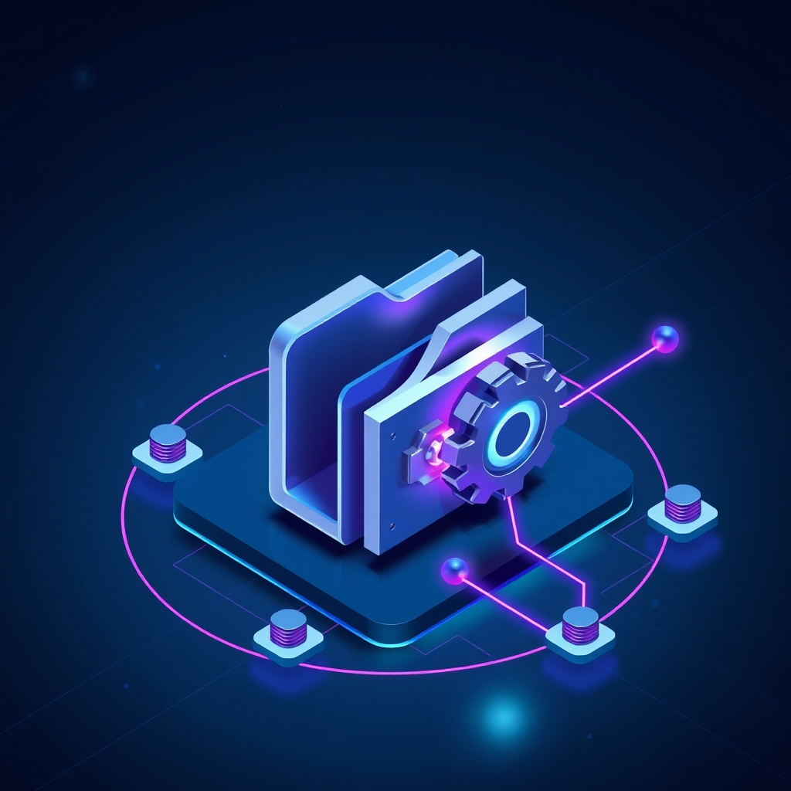

[🏡 Home](../index.md) > [🤖 AI Blog](./index.md) | [⏮️](./2026-03-24-steady-drip-backfilling.md) [⏭️](./2026-03-25-daily-updates-and-ai-fiction.md)  
  
# 🔗 Closing the Loop: Automated AI Blog Vault Sync  
  
  
## 🎯 The Problem  
  
📝 Every pull request in this repository generates an AI blog post describing the changes.  
🗂️ These posts live in the ai-blog directory and get published to the website when the PR merges to main.  
📱 But the Obsidian vault is the source of truth for all content, and getting these posts into the vault has been a semi-manual, fragile process.  
🔗 Even worse, the posts had no navigation links connecting them to each other, and they were never linked from the daily reflection notes.  
🎧 And as a bonus concern, the blog posts were written without considering how they sound when read aloud via text-to-speech.  
  
## 🤔 Three Plans Considered  
  
### 📋 Plan A: A New GitHub Actions Workflow  
  
🆕 Create a dedicated workflow triggered when PRs merge to main.  
🔍 The workflow would detect new ai-blog files in the merge commit, add navigation links, and sync to the vault.  
  
👍 The obvious advantage is a clear, event-driven trigger that runs exactly when needed.  
👎 The downside is significant complexity: a whole new workflow file, its own vault credential management, another moving part to maintain, and it duplicates vault pull/push infrastructure that already exists.  
  
### 📋 Plan B: A New Standalone Scheduled Task  
  
🕐 Register a new task in the scheduler that runs every hour, scanning for unlinked ai-blog posts.  
  
👍 Clean separation of concerns, clear naming, independently schedulable.  
👎 Each scheduled task that touches the vault needs its own pull/push cycle, which is slow (30 seconds or more) and creates contention with other tasks pulling the same vault.  
  
### 📋 Plan C: Integrate Into the Existing Backfill Task  
  
🔄 The hourly backfill-blog-images task already pulls the vault, copies ai-blog files between vault and repo, and pushes the vault.  
🧩 By adding two small steps to this existing flow, we piggyback on its vault sync without any redundant pull/push cycles.  
  
👍 Minimal new code, zero new infrastructure, efficient use of the existing vault sync.  
👎 The backfill task takes on a slightly broader responsibility, though ai-blog files are already part of its content set.  
  
## ✅ The Chosen Solution: Plan C  
  
🏆 Plan C wins because it minimizes complexity, avoids surprise, and maximizes reliability.  
🔧 The implementation adds two new steps to the backfill task, sandwiched between the existing image generation and vault sync.  
  
### 🧩 Step 3: Navigation Link Insertion  
  
🔍 After pulling vault posts and running image backfill, the system scans all ai-blog posts sorted chronologically by filename.  
📊 For each post, it computes the expected navigation line based on its neighbors and compares against the current nav line.  
✏️ If they differ, the post is updated with the correct back and forward links using the same emoji convention as the blog series.  
🛡️ The operation is fully idempotent, meaning a second run with no new posts reports zero modifications.  
  
### 🧩 Step 5: Daily Reflection Linking  
  
📅 Any post that was modified in step 3 (meaning it was newly linked) gets added to the daily reflection that matches its date.  
🔗 The link appears in the Updates section of the reflection, using the existing addUpdateLinksToReflection function.  
📆 Crucially, the post is linked from the reflection matching the post's date, not today's date, so if a post dated March 24th gets linked on March 25th, it appears in the March 24th reflection.  
  
## 🏗️ Architecture  
  
### 📦 The New Library Module  
  
📚 A new module at scripts/lib/ai-blog-links.ts contains all the logic.  
🧪 42 tests cover every pure function and I/O operation.  
🔬 The module follows the same pattern as daily-updates.ts: pure string functions for nav link building, I/O functions for file reading and writing.  
  
### 🔧 Key Functions  
  
🔨 The buildNavLine function constructs the complete breadcrumb with optional back and forward links.  
🔍 The updateNavLinks function finds the nav prefix line in a post and replaces it with the correct version.  
📂 The ensureAllNavLinks function orchestrates the full scan, reading all posts, computing neighbors, and writing updates.  
📋 The buildReflectionLinks function extracts dates and titles from modified posts for reflection linking.  
  
### 🔄 How It All Fits Together  
  
📥 The backfill task pulls vault posts into the repo as before.  
🖼️ Image backfill runs as before (one image per hour).  
🔗 The new step 3 scans ai-blog posts and adds navigation links to the repo copies.  
📤 The vault sync copies all modified repo files (including newly-linked ai-blog posts) back to the vault.  
📅 The new step 5 links newly-processed posts from their daily reflections in the vault.  
🚀 The vault push sends everything to the Obsidian Sync server.  
  
## 🎧 TTS-Friendly Writing  
  
📢 The AGENTS.md file now includes guidance for writing blog posts that work well with text-to-speech.  
🚫 Tables, code blocks, and back-ticked inline code are problematic for TTS readers, which skip or garble them.  
✍️ When visual formatting is truly necessary, it should always be accompanied by prose that conveys the same information for audio listeners.  
📋 Lists and descriptive sentences are preferred over tables for conveying structured information.  
  
## 💡 Why This Design Works  
  
### 🎯 Zero Manual Steps  
  
📱 When a PR merges, the ai-blog post is already in the repo on main.  
🕐 Within an hour, the backfill task runs, detects the unlinked post, adds navigation, and syncs to the vault.  
📝 The post appears in the vault with correct navigation links and a reference from the daily reflection.  
🤷 The vault owner does nothing.  
  
### 🛡️ Idempotency Everywhere  
  
🔁 Every function checks before modifying: does this post already have the correct nav links? Is this reflection link already present?  
🔄 Running the same task a hundred times produces the same result as running it once.  
⏰ This is essential for hourly scheduling, where tasks may run many times after the first successful processing.  
  
### 🧩 Minimal Surface Area  
  
📏 The entire feature adds one new library file, one test file, one spec, and about 15 lines of integration code in the backfill task.  
🔧 No new workflows, no new scheduled tasks, no new vault sync cycles.  
📐 The design follows the existing patterns so closely that the integration reads like it was always part of the plan.  
  
## 📚 Book Recommendations  
  
### 📖 Similar  
  
- 📘 Designing Data-Intensive Applications by Martin Kleppmann  
- 📗 Release It! by Michael T. Nygard  
- 📕 Building Evolutionary Architectures by Neal Ford, Rebecca Parsons, and Patrick Kua  
  
### 📖 Contrasting  
  
- 📙 The Mythical Man-Month by Frederick P. Brooks Jr.  
- 📓 Thinking in Systems by Donella H. Meadows  
  
### 📖 Creatively Related  
  
- 📔 [💺🚪💡🤔 The Design of Everyday Things](../books/the-design-of-everyday-things.md) by Don Norman  
- 📒 Atomic Habits by James Clear  
- 📕 A Philosophy of Software Design by John Ousterhout  
  
## 🦋 Bluesky    
<blockquote class="bluesky-embed" data-bluesky-uri="at://did:plc:i4yli6h7x2uoj7acxunww2fc/app.bsky.feed.post/3mhxbqqrlxt25" data-bluesky-cid="bafyreiefgxeizecio6lphdzcatmskbrijhmirykswtutqpqnb72wyvwjta">
🔗 Closing the Loop: Automated AI Blog Vault Sync  
  
#AI Q: ⚙️ Prefer building new systems from scratch or integrating into existing workflows?  
  
🤖 Automation | 🔗 Content Sync | 📚 Software Design | 🎧 Text-to-Speech  
https://bagrounds.org/ai-blog/2026-03-25-automated-ai-blog-vault-sync
&mdash; <a href="https://bsky.app/profile/did:plc:i4yli6h7x2uoj7acxunww2fc?ref_src=embed">Bryan Grounds (@bagrounds.bsky.social)</a> <a href="https://bsky.app/profile/did:plc:i4yli6h7x2uoj7acxunww2fc/post/3mhxbqqrlxt25?ref_src=embed">2026-03-26T09:22:46.183Z</a></blockquote>  
  
## 🐘 Mastodon    
<blockquote class="mastodon-embed" data-embed-url="https://mastodon.social/@bagrounds/116294743719098854/embed" style="background: #FCF8FF; border-radius: 8px; border: 1px solid #C9C4DA; margin: 0; max-width: 540px; min-width: 270px; overflow: hidden; padding: 0;"> <a href="https://mastodon.social/@bagrounds/116294743719098854" target="_blank" style="align-items: center; color: #1C1A25; display: flex; flex-direction: column; font-family: system-ui, -apple-system, BlinkMacSystemFont, 'Segoe UI', Oxygen, Ubuntu, Cantarell, 'Fira Sans', 'Droid Sans', 'Helvetica Neue', Roboto, sans-serif; font-size: 14px; justify-content: center; letter-spacing: 0.25px; line-height: 20px; padding: 24px; text-decoration: none;"> <svg xmlns="http://www.w3.org/2000/svg" xmlns:xlink="http://www.w3.org/1999/xlink" width="32" height="32" viewBox="0 0 79 75"><path d="M63 45.3v-20c0-4.1-1-7.3-3.2-9.7-2.1-2.4-5-3.7-8.5-3.7-4.1 0-7.2 1.6-9.3 4.7l-2 3.3-2-3.3c-2-3.1-5.1-4.7-9.2-4.7-3.5 0-6.4 1.3-8.6 3.7-2.1 2.4-3.1 5.6-3.1 9.7v20h8V25.9c0-4.1 1.7-6.2 5.2-6.2 3.8 0 5.8 2.5 5.8 7.4V37.7H44V27.1c0-4.9 1.9-7.4 5.8-7.4 3.5 0 5.2 2.1 5.2 6.2V45.3h8ZM74.7 16.6c.6 6 .1 15.7.1 17.3 0 .5-.1 4.8-.1 5.3-.7 11.5-8 16-15.6 17.5-.1 0-.2 0-.3 0-4.9 1-10 1.2-14.9 1.4-1.2 0-2.4 0-3.6 0-4.8 0-9.7-.6-14.4-1.7-.1 0-.1 0-.1 0s-.1 0-.1 0 0 .1 0 .1 0 0 0 0c.1 1.6.4 3.1 1 4.5.6 1.7 2.9 5.7 11.4 5.7 5 0 9.9-.6 14.8-1.7 0 0 0 0 0 0 .1 0 .1 0 .1 0 0 .1 0 .1 0 .1.1 0 .1 0 .1.1v5.6s0 .1-.1.1c0 0 0 0 0 .1-1.6 1.1-3.7 1.7-5.6 2.3-.8.3-1.6.5-2.4.7-7.5 1.7-15.4 1.3-22.7-1.2-6.8-2.4-13.8-8.2-15.5-15.2-.9-3.8-1.6-7.6-1.9-11.5-.6-5.8-.6-11.7-.8-17.5C3.9 24.5 4 20 4.9 16 6.7 7.9 14.1 2.2 22.3 1c1.4-.2 4.1-1 16.5-1h.1C51.4 0 56.7.8 58.1 1c8.4 1.2 15.5 7.5 16.6 15.6Z" fill="currentColor"/></svg> 
Post by @bagrounds@mastodon.social
 
View on Mastodon
 </a> </blockquote> 