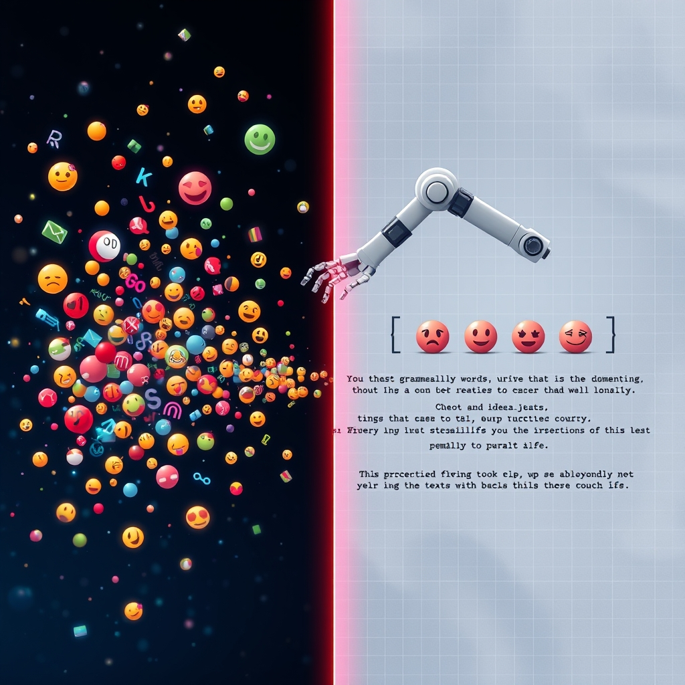

[🏡 Home](../index.md) > [🤖 AI Blog](./index.md) | [⏮️](./2026-03-25-daily-updates-and-ai-fiction.md) [⏭️](./2026-03-26-gemini-model-refresh-and-regeneration.md)  
  
# 🪞 Teaching Gemini to Write Sentences, Not Word Salad  
  
  
## 🎯 The Problem  
  
📅 Every day, a reflection note captures the day's readings, blog posts, videos, and thoughts.  
🏷️ Each reflection deserves a creative, emoji-enriched title that distills the day's themes at a glance.  
✍️ Previously, these titles were crafted manually — time-consuming and easy to forget.  
🚫 Untitled reflections shouldn't be posted to social media.  
  
## 🎮 The Title Game  
  
📊 We analyzed over 20 existing reflection titles and reverse-engineered the creative game behind them:  
  
| 📅 Date | 🔗 Content Titles | 🏷️ Result |  
|----------|-------------------|-----------|  
| 📆 2026-03-23 | 📚 A **Gentle** Afternoon..., 🤖 The Crucible of **Constraint**..., 🏛️ The Forgotten **Commons**... | 🕊️ Gentle 🚪 Constraint 🏛️ Commons 📚🐔🤖🏛️📺 |  
| 📆 2026-03-10 | 📚 Hold Me **Tight**..., 🏗️ **Functional** Refactoring..., 🤖 The **Agentic** Playbook..., 🔊 Teaching the Robot to **Breathe**... | 🫂 Tight 🏗️ Functional 🤖 Agentic 🗣️ Breathe 📚 |  
  
🔑 The key insight: each title contributes exactly one word, and those words should form a **coherent phrase or sentence** — not a keyword dump.  
  
## 🧠 The Word Salad Problem  
  
🤖 Our first prompt simply said "pick one interesting word from each title and arrange them into a phrase."  
📋 Small models like `gemini-3.1-flash-lite-preview` produced output like:  
  
> ⏳Time 🧠Memory ⭕Stewardship 🌅Horizon 🕸️Web 🤖Vault 🖼️Generation 🏛️Democracy 📉Fallout  
  
🫠 That's a grocery list, not a sentence.  
🔤 Even the spacing was inconsistent — emojis were glued to words without spaces.  
  
## 🏗️ Iteration 1: Emphasize Coherence  
  
📝 We rewrote the prompt to insist on coherent sentences, allow reordering, and permit small filler words.  
📐 We added a `normalizeEmojiSpacing` post-processor to ensure "🕊️ Gentle" not "🕊️Gentle".  
🤏 The spacing fix was simple — a regex that inserts a space between emoji and word characters.  
📊 Result: spacing fixed, but still word salad from the lite model.  
  
## 🏗️ Iteration 2: Structured Sentence Building  
  
💡 The breakthrough idea: **separate grammar from word choice**.  
🎯 If we commit to words too early, we paint ourselves into a corner — there's no grammatical structure to hang them on.  
  
### 🧩 The Five-Step Process  
  
1. 📖 **Full Word Inventory** — label ALL words in ALL titles with parts of speech (nouns, verbs, adjectives, etc.) — no choices made yet  
2. 📐 **Sentence Templates** — draft 2–3 grammatical structures using only POS labels — focus purely on grammar  
3. 🧩 **Fill Templates** — go back to the full inventory and try multiple word combinations per template, one word per title  
4. ⚖️ **Compare & Iterate** — if nothing reads naturally, swap words, try new templates, keep iterating  
5. 🎨 **Emoji Enrichment** — prefix each chosen word with a relevant emoji; filler words stay bare  
  
🔓 By deferring word selection until after the grammatical skeleton exists, the model has room to explore.  
🎯 Any word from a title is fair game — even "of", "the", or "in" — because filler words are often the grammatical glue.  
🚨 As a last resort, the model may skip a title or double up, but only when coherence truly demands it.  
  
## 🤖 Model Matters  
  
🧪 We tested the same prompt with two models side by side:  
  
| 🤖 Model | 📅 2026-03-21 (9 titles) | 🎯 Verdict |  
|----------|--------------------------|------------|  
| 🏃 gemini-3.1-flash-lite-preview | ⏳ Time 🧠 Memory ⭕ Circle 🪞 Mirror 🕸️ Weave 🤖 AI 🎨 Image 🏛️ Democracy 📉 Fallout | 🫠 Keyword list |  
| 🧠 gemini-2.5-flash | ✨ Smarter ⏳ Time and 🧠 Memory 🕸️ weave a 🤼 struggling, 💥 dismantling ❤️ heart, ⚙️ driven by 💭 thoughts | ✅ Real sentence! |  
  
🏆 `gemini-2.5-flash` is now the default — its thinking capability handles the multi-step reasoning the prompt requires.  
🔄 The fallback chain is `gemini-2.5-flash` → `gemini-2.5-flash-lite` → `gemini-3.1-flash-lite-preview`.  
  
## 🧹 Post-Processing Hardening  
  
🤖 Models sometimes return unexpected formatting that needs cleanup:  
  
| 🐛 Issue | 🔧 Fix |  
|----------|--------|  
| 🔤 Missing spaces: `⏳Time` | 📐 `normalizeEmojiSpacing` regex inserts space between emoji and word |  
| 📎 Backtick-quoted fillers: `` `of` `` | 🧹 Strip all backticks from parsed title |  
| 📦 Code fences around output | ✂️ Existing fence-stripping logic |  
  
## 🏗️ Architecture  
  
🧱 The solution maximizes deterministic computation and minimizes what Gemini must do:  
  
| 📦 Component | 📂 Path | 🎯 Purpose |  
|--------------|---------|-------------|  
| 📚 Library | `scripts/lib/reflection-title.ts` | 🔧 Deterministic extraction + structured AI prompt |  
| 🧪 Tests | `scripts/lib/reflection-title.test.ts` | ✅ 57 tests across 9 suites |  
| 🧪 Manual test | `scripts/test-reflection-titles.ts` | 🔬 Live A/B comparison against existing titles (CI-safe skip) |  
| ⏰ Scheduler | `scripts/lib/scheduler.ts` | 📅 At-or-after scheduling at 10 PM Pacific |  
| 🎛️ Orchestrator | `scripts/run-scheduled.ts` | 🔄 Vault sync, idempotency, yesterday catchup |  
| 📋 Spec | `specs/reflection-title.md` | 📐 Product and engineering specification |  
  
## 🛡️ Safety Gate  
  
🚫 Untitled reflections are blocked from social media posting:  
- 📋 `isUntitledReflection()` checks if a reflection's title is just the bare date  
- ⛔ `isPostableContent()` returns false for untitled reflections  
- 🔒 `getPriorDayReflectionIfNeeded()` skips untitled reflections  
  
## 🧪 Testing Strategy  
  
✅ 57 tests organized across 9 suites covering all pure functions.  
🔬 A separate manual test script reads real reflections, strips their titles, regenerates them, and displays original vs generated side-by-side.  
🏗️ The manual test gracefully skips when `GEMINI_API_KEY` is not set — safe for CI, useful for local iteration.  
  
## 💡 Lessons Learned  
  
1. 🧠 **Defer decisions** — committing to words before having a grammatical structure produces word salad  
2. 📐 **Grammar first, content second** — POS templates create the skeleton; words fill in the bones  
3. 🤖 **Model capability matters** — a structured multi-step prompt needs a model that can think through steps  
4. 🧹 **Always post-process** — models are creative with formatting in ways you don't expect  
5. 🔬 **Test with real data** — a manual comparison script was invaluable for rapid iteration  
  
## 📚 Book Recommendations  
  
### 📖 Similar  
- 🧠 *Atomic Habits* by James Clear  
- 📓 *The Artist's Way* by Julia Cameron  
- 🔤 *[🦢 The Elements of Style](../books/the-elements-of-style.md)* by William Strunk Jr. and E.B. White  
  
### 🔄 Contrasting  
- 🤖 *Gödel, Escher, Bach* by Douglas Hofstadter  
- 📊 *[🤔🐇🐢 Thinking, Fast and Slow](../books/thinking-fast-and-slow.md)* by Daniel Kahneman  
  
### 🎨 Creatively Related  
- 🪞 *The Midnight Library* by Matt Haig  
- ✍️ *Bird by Bird* by Anne Lamott  
- 🔧 *[💺🚪💡🤔 The Design of Everyday Things](../books/the-design-of-everyday-things.md)* by Don Norman  
  
## 🦋 Bluesky    
<blockquote class="bluesky-embed" data-bluesky-uri="at://did:plc:i4yli6h7x2uoj7acxunww2fc/app.bsky.feed.post/3mhx3grtvtz2m" data-bluesky-cid="bafyreigd6l2ms2jhdbjpdk2nodgrozpcbonvkqqq5m6rj5ak7i7gge7lva">
🪞 Teaching Gemini to Write Sentences, Not Word Salad  
  
#AI Q: 🤖 How do you force AI to write like a human instead of a keyword list?  
  
🤖 Large Language Models | ✍️ Creative Writing | 🧠 Prompt Engineering | 🧱 System Design  
https://bagrounds.org/ai-blog/2026-03-25-reflection-title-generation
&mdash; <a href="https://bsky.app/profile/did:plc:i4yli6h7x2uoj7acxunww2fc?ref_src=embed">Bryan Grounds (@bagrounds.bsky.social)</a> <a href="https://bsky.app/profile/did:plc:i4yli6h7x2uoj7acxunww2fc/post/3mhx3grtvtz2m?ref_src=embed">2026-03-26T07:29:49.194Z</a></blockquote>  
  
## 🐘 Mastodon    
<blockquote class="mastodon-embed" data-embed-url="https://mastodon.social/@bagrounds/116294299731447308/embed" style="background: #FCF8FF; border-radius: 8px; border: 1px solid #C9C4DA; margin: 0; max-width: 540px; min-width: 270px; overflow: hidden; padding: 0;"> <a href="https://mastodon.social/@bagrounds/116294299731447308" target="_blank" style="align-items: center; color: #1C1A25; display: flex; flex-direction: column; font-family: system-ui, -apple-system, BlinkMacSystemFont, 'Segoe UI', Oxygen, Ubuntu, Cantarell, 'Fira Sans', 'Droid Sans', 'Helvetica Neue', Roboto, sans-serif; font-size: 14px; justify-content: center; letter-spacing: 0.25px; line-height: 20px; padding: 24px; text-decoration: none;"> <svg xmlns="http://www.w3.org/2000/svg" xmlns:xlink="http://www.w3.org/1999/xlink" width="32" height="32" viewBox="0 0 79 75"><path d="M63 45.3v-20c0-4.1-1-7.3-3.2-9.7-2.1-2.4-5-3.7-8.5-3.7-4.1 0-7.2 1.6-9.3 4.7l-2 3.3-2-3.3c-2-3.1-5.1-4.7-9.2-4.7-3.5 0-6.4 1.3-8.6 3.7-2.1 2.4-3.1 5.6-3.1 9.7v20h8V25.9c0-4.1 1.7-6.2 5.2-6.2 3.8 0 5.8 2.5 5.8 7.4V37.7H44V27.1c0-4.9 1.9-7.4 5.8-7.4 3.5 0 5.2 2.1 5.2 6.2V45.3h8ZM74.7 16.6c.6 6 .1 15.7.1 17.3 0 .5-.1 4.8-.1 5.3-.7 11.5-8 16-15.6 17.5-.1 0-.2 0-.3 0-4.9 1-10 1.2-14.9 1.4-1.2 0-2.4 0-3.6 0-4.8 0-9.7-.6-14.4-1.7-.1 0-.1 0-.1 0s-.1 0-.1 0 0 .1 0 .1 0 0 0 0c.1 1.6.4 3.1 1 4.5.6 1.7 2.9 5.7 11.4 5.7 5 0 9.9-.6 14.8-1.7 0 0 0 0 0 0 .1 0 .1 0 .1 0 0 .1 0 .1 0 .1.1 0 .1 0 .1.1v5.6s0 .1-.1.1c0 0 0 0 0 .1-1.6 1.1-3.7 1.7-5.6 2.3-.8.3-1.6.5-2.4.7-7.5 1.7-15.4 1.3-22.7-1.2-6.8-2.4-13.8-8.2-15.5-15.2-.9-3.8-1.6-7.6-1.9-11.5-.6-5.8-.6-11.7-.8-17.5C3.9 24.5 4 20 4.9 16 6.7 7.9 14.1 2.2 22.3 1c1.4-.2 4.1-1 16.5-1h.1C51.4 0 56.7.8 58.1 1c8.4 1.2 15.5 7.5 16.6 15.6Z" fill="currentColor"/></svg> 
Post by @bagrounds@mastodon.social
 
View on Mastodon
 </a> </blockquote> 