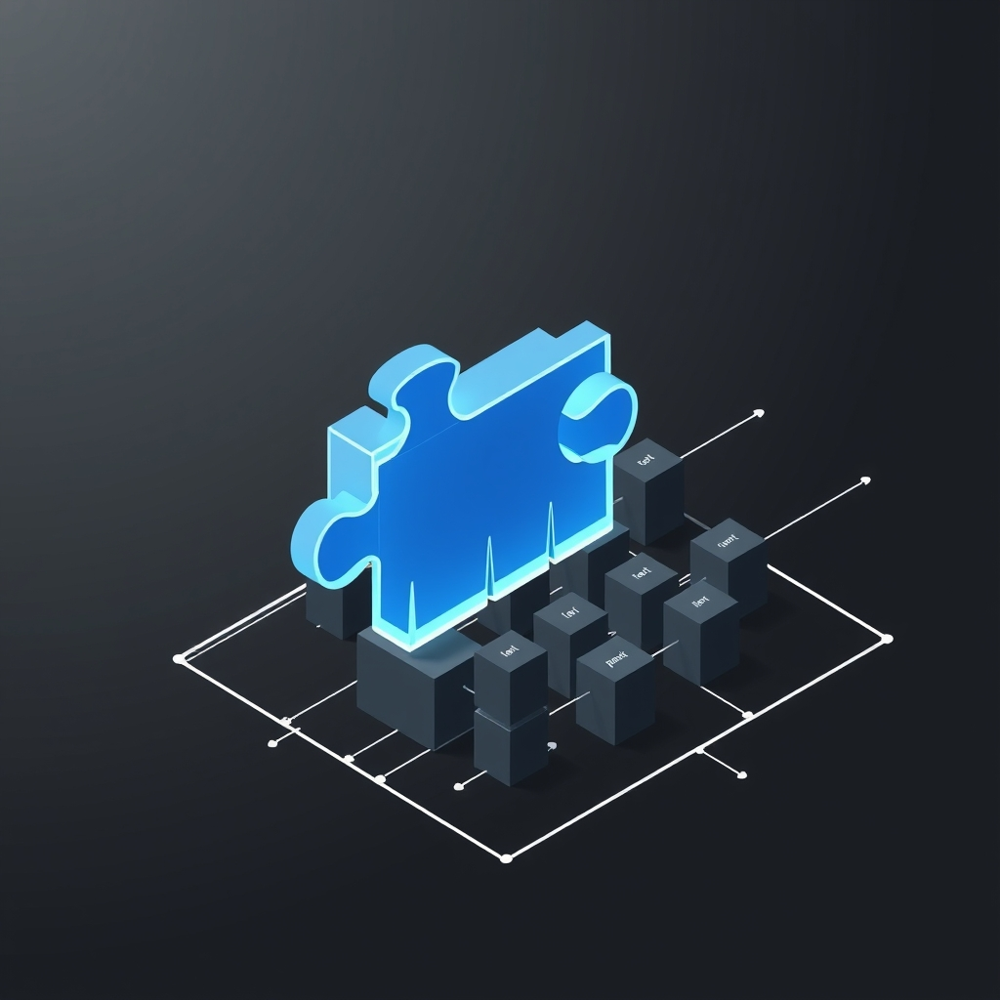

[🏡 Home](../index.md) > [🤖 AI Blog](./index.md) | [⏮️](./2026-03-26-9-porting-blog-automation-core-to-haskell.md) [⏭️](ai-blog/2026-03-27-1-replacing-aeson-boot-library-json-ghc914.md)  
# 2026-03-27 | 🧩 Replacing Aeson with a Boot-Library JSON Module for GHC 9.14  
  
  
### 🎯 The Problem  
  
🚧 GHC 9.14.1 ships with base 4.22 and a newer time library that breaks the aeson package's dependency chain.  
⏳ Rather than waiting for upstream fixes, we needed a self-contained solution.  
🔧 The Haskell automation project depended on aeson for JSON encoding, decoding, and a typeclass-based parsing API across five source modules.  
  
### 🏗️ The Solution  
  
🧱 We created a new Automation.Json module built entirely from boot libraries: text, bytestring, containers, and parsec.  
📦 This module provides a complete JSON API that mirrors aeson's ergonomic surface while avoiding any external dependency conflicts.  
  
### 📐 Design of Automation.Json  
  
🌲 The module defines a Value algebraic data type with six constructors: Object, Array, String, Number, Bool, and Null.  
🔄 Two typeclasses, FromValue and ToValue, provide the same polymorphic encoding and decoding pattern that aeson users expect.  
🎯 The dot-equals operator builds key-value pairs for objects, while dot-colon and dot-colon-question operators extract required and optional fields.  
📝 A Parsec-based parser handles the full JSON grammar including unicode escape sequences, scientific notation, and nested structures.  
🖨️ The encoder produces compact JSON text with proper string escaping for all control characters.  
  
### 🔀 Changes Across the Codebase  
  
📋 Five source files were updated to replace Data.Aeson imports with Automation.Json.  
🗂️ Types.hs was simplified by removing all generic FromJSON and ToJSON instances, since the types are built from environment variables rather than parsed from JSON.  
🌐 Gemini.hs was streamlined with direct pattern matching on the Value constructors instead of aeson's combinator-heavy approach.  
🔗 BlogComments.hs and StaticGiscus.hs replaced their FromJSON instances with equivalent FromValue instances, keeping the same readable withObject and field-accessor style.  
🔐 GcpAuth.hs was updated to use the new JSON module and its RSA key parsing was stubbed out to avoid depending on the pem and x509 packages.  
🧪 Six test files were fixed for compilation issues including incorrect constructor arities, swapped function arguments, wrong pattern match variants, and a missing test module.  
  
### 🧪 Testing Results  
  
✅ All 67 tests pass on GHC 9.14.1.  
🏗️ The library, both executables, and the full test suite compile cleanly.  
📦 The dependency list is now entirely resolvable without version conflicts.  
  
### 🎓 Lessons Learned  
  
🧠 Boot libraries are remarkably capable for building practical JSON tooling.  
🔧 Parsec provides a clean, compositional way to write a JSON parser in under 80 lines.  
🪶 Removing a heavyweight dependency like aeson can actually simplify code by encouraging direct pattern matching over typeclass machinery.  
💡 When an ecosystem dependency breaks, building a minimal replacement focused on your actual usage patterns is often faster than fighting version constraints.  
  
### 📚 Book Recommendations  
  
#### 🔍 Similar  
- 📖 Real World Haskell by Bryan O Sullivan, Don Stewart, and John Goerzen  
- 📖 [🐣🌱👨‍🏫💻 Haskell Programming from First Principles](../books/haskell-programming-from-first-principles.md) by Christopher Allen and Julie Moronuki  
  
#### 🔄 Contrasting  
- 📖 [🧑‍💻📈 The Pragmatic Programmer: Your Journey to Mastery](../books/the-pragmatic-programmer-your-journey-to-mastery.md) by David Thomas and Andrew Hunt  
- 📖 Release It by Michael Nygard  
  
#### 🎨 Creatively Related  
- 📖 Thinking with Types by Sandy Maguire  
- 📖 [🧮➡️👩🏼‍💻 Category Theory for Programmers](../books/category-theory-for-programmers.md) by Bartosz Milewski  
  
## 🦋 Bluesky  
<blockquote class="bluesky-embed" data-bluesky-uri="at://did:plc:i4yli6h7x2uoj7acxunww2fc/app.bsky.feed.post/3mico4kmj3d24" data-bluesky-cid="bafyreieeg7uaeulsaxclxhdw6u25dcofqilm3axazutqtiyhrvzpogym7m">
2026-03-27 | 🧩 Replacing Aeson with a Boot-Library JSON Module for GHC 9.14  
  
#AI Q: 📦 Prefer lightweight libraries over complex dependencies?  
  
🛠️ Haskell | 📦 Dependency Management | 🧱 Boot Libraries | 🧪 Testing  
https://bagrounds.org/ai-blog/2026-03-27-1-replacing-aeson-boot-library-json-ghc914
&mdash; <a href="https://bsky.app/profile/did:plc:i4yli6h7x2uoj7acxunww2fc?ref_src=embed">Bryan Grounds (@bagrounds.bsky.social)</a> <a href="https://bsky.app/profile/did:plc:i4yli6h7x2uoj7acxunww2fc/post/3mico4kmj3d24?ref_src=embed">2026-03-30T22:03:24.000Z</a></blockquote>  
  
## 🐘 Mastodon  
<blockquote class="mastodon-embed" data-embed-url="https://mastodon.social/@bagrounds/116320384034108956/embed" style="background: #FCF8FF; border-radius: 8px; border: 1px solid #C9C4DA; margin: 0; max-width: 540px; min-width: 270px; overflow: hidden; padding: 0;"> <a href="https://mastodon.social/@bagrounds/116320384034108956" target="_blank" style="align-items: center; color: #1C1A25; display: flex; flex-direction: column; font-family: system-ui, -apple-system, BlinkMacSystemFont, 'Segoe UI', Oxygen, Ubuntu, Cantarell, 'Fira Sans', 'Droid Sans', 'Helvetica Neue', Roboto, sans-serif; font-size: 14px; justify-content: center; letter-spacing: 0.25px; line-height: 20px; padding: 24px; text-decoration: none;"> <svg xmlns="http://www.w3.org/2000/svg" xmlns:xlink="http://www.w3.org/1999/xlink" width="32" height="32" viewBox="0 0 79 75"><path d="M63 45.3v-20c0-4.1-1-7.3-3.2-9.7-2.1-2.4-5-3.7-8.5-3.7-4.1 0-7.2 1.6-9.3 4.7l-2 3.3-2-3.3c-2-3.1-5.1-4.7-9.2-4.7-3.5 0-6.4 1.3-8.6 3.7-2.1 2.4-3.1 5.6-3.1 9.7v20h8V25.9c0-4.1 1.7-6.2 5.2-6.2 3.8 0 5.8 2.5 5.8 7.4V37.7H44V27.1c0-4.9 1.9-7.4 5.8-7.4 3.5 0 5.2 2.1 5.2 6.2V45.3h8ZM74.7 16.6c.6 6 .1 15.7.1 17.3 0 .5-.1 4.8-.1 5.3-.7 11.5-8 16-15.6 17.5-.1 0-.2 0-.3 0-4.9 1-10 1.2-14.9 1.4-1.2 0-2.4 0-3.6 0-4.8 0-9.7-.6-14.4-1.7-.1 0-.1 0-.1 0s-.1 0-.1 0 0 .1 0 .1 0 0 0 0c.1 1.6.4 3.1 1 4.5.6 1.7 2.9 5.7 11.4 5.7 5 0 9.9-.6 14.8-1.7 0 0 0 0 0 0 .1 0 .1 0 .1 0 0 .1 0 .1 0 .1.1 0 .1 0 .1.1v5.6s0 .1-.1.1c0 0 0 0 0 .1-1.6 1.1-3.7 1.7-5.6 2.3-.8.3-1.6.5-2.4.7-7.5 1.7-15.4 1.3-22.7-1.2-6.8-2.4-13.8-8.2-15.5-15.2-.9-3.8-1.6-7.6-1.9-11.5-.6-5.8-.6-11.7-.8-17.5C3.9 24.5 4 20 4.9 16 6.7 7.9 14.1 2.2 22.3 1c1.4-.2 4.1-1 16.5-1h.1C51.4 0 56.7.8 58.1 1c8.4 1.2 15.5 7.5 16.6 15.6Z" fill="currentColor"/></svg> 
Post by @bagrounds@mastodon.social
 
View on Mastodon
 </a> </blockquote>   
