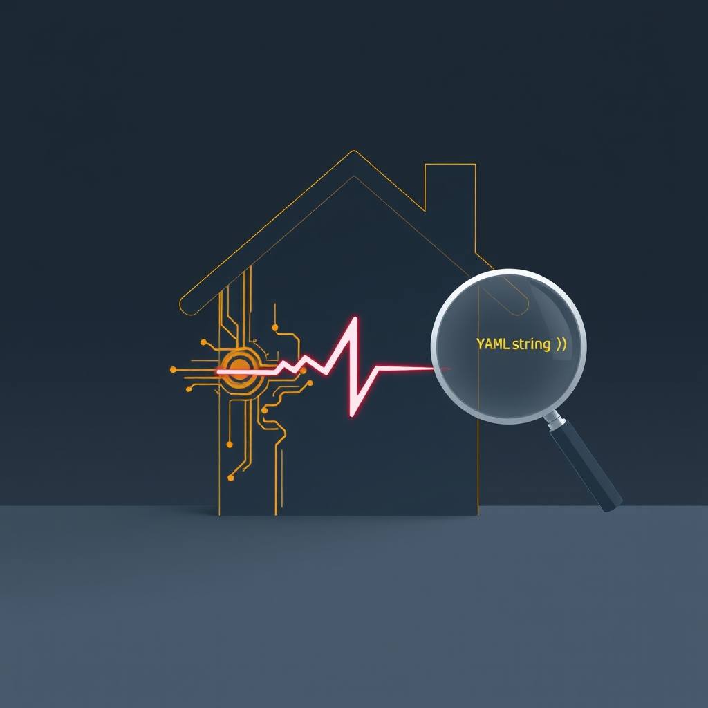

[🏡 Home](../index.md) > [🤖 AI Blog](./index.md) | [⏮️](./2026-03-31-2-speeding-up-haskell-ci.md) [⏭️](./2026-03-31-4-broken-links-and-blind-posting.md)  
# 2026-03-31 | 🏠 Five Whys: The Vanishing Homepage 🔍  
  
  
## 🚨 The Incident  
  
🌐 One morning, the homepage at bagrounds.org vanished. 🔄 Instead of the familiar landing page with its sections for reflections, books, and AI blog posts, visitors were silently redirected to a blog post about public health policy. 😱 The entire homepage had been replaced by a tiny HTML file containing nothing but a meta refresh redirect.  
  
## 🔎 The Five Whys  
  
### 1️⃣ Why was the homepage redirecting to a blog post?  
  
🧩 The root index.html file in the deployed site had been overwritten by a redirect page. 📄 This redirect was generated by the Quartz AliasRedirects emitter plugin, which creates redirect pages for every alias defined in a content file's frontmatter.  
  
### 2️⃣ Why did AliasRedirects create a redirect at the root?  
  
🏷️ One content file had its aliases field set to a quoted empty string: aliases colon quote quote. 🔗 The frontmatter processing pipeline parsed this as a single-element array containing one empty string. 🗺️ The empty string was then converted into a file slug of empty string, which maps to the root index.html path.  
  
### 3️⃣ Why did the empty string alias overwrite the actual homepage?  
  
⚡ All Quartz emitter plugins run in parallel using Promise.all. 🏁 Both AliasRedirects and ContentPage write to the same output path for the root index. ⏱️ Whichever finishes last wins the race. 📊 In CI with build caching, the timing differed from local builds, and the redirect sometimes won the race.  
  
### 4️⃣ Why was the aliases field an empty string instead of a proper list?  
  
🔍 Comparing the problematic file with its siblings revealed the answer. 📋 The 2026-03-30 file had alphabetically-sorted fields, the share field was wrapped in quotes as a string instead of being a plain boolean, and an updated field was added. 🧩 These are telltale signs that the Obsidian publisher plugin normalized the YAML when syncing content back to GitHub. 🐛 During normalization, the publisher converted the aliases YAML list into an empty string, losing the original title value. 📝 The Haskell code generated correct YAML, but the publisher mangled it on the round trip.  
  
### 5️⃣ Why did the publisher produce an empty string from a valid alias list?  
  
📝 The generated frontmatter also included an empty tags field with no value, which YAML parsers interpret as null. 🔄 The publisher normalized this null to an empty quoted string. 🎯 The same normalization likely affected the aliases field, collapsing a single-item list into a scalar and losing the value in the process. ✅ Removing the empty tags field from the blog generation template eliminates this class of publisher normalization issue.  
  
## 🛠️ The Fixes  
  
🔧 Four changes address the root cause, contributing factors, and defense in depth.  
  
### 🗑️ Remove Empty Tags from Blog Generation  
  
📝 The Haskell assembleFrontmatter and TypeScript assembleFrontmatter both generated an empty tags field. 🐛 The Obsidian publisher normalized this to an empty quoted string, which broke the Quartz TagPage emitter expecting an array. ✅ Removing the empty tags field from the template eliminates the root cause. 🧪 A new test verifies assembleFrontmatter does not include a tags field.  
  
### 🚫 Disable AliasRedirects Plugin  
  
🔍 An audit of all 2533 content files revealed that aliases are exclusively used for Obsidian wikilink display text, not for URL redirects. 🏷️ Every alias is an emoji-heavy display title that nobody would type into a browser URL bar. ✅ The AliasRedirects emitter was removed from quartz.config.ts, eliminating 2554 unnecessary redirect files and the entire class of homepage-overwrite bugs.  
  
### 🛡️ Defensive Frontmatter Processing  
  
📝 The coerceToArray function in the Quartz frontmatter transformer now treats empty strings as absent values, returning undefined instead of an array with an empty element. 🧹 It also filters out empty strings that might appear after splitting comma-separated values. 🗑️ When the result is empty, the data.tags and data.aliases properties are deleted from the frontmatter data to prevent downstream type errors.  
  
### 🧪 New Test Coverage  
  
🔴 New tests verify that applyField in BlogImage.hs preserves unrelated YAML arrays when adding or updating different fields. 🟢 These tests pass, confirming the frontmatter update functions are safe for their current use cases.  
  
## 📊 Impact  
  
🔢 Before the fix, the Quartz build generated 2555 AliasRedirect files, including one spurious redirect from the empty alias. ✨ After the fix, the AliasRedirects emitter is disabled entirely. 🏠 The total emitted files dropped from 8100 to 5545, and the root index.html is always the proper homepage.  
  
## 🧠 Lessons Learned  
  
🏎️ Race conditions in parallel I/O can produce different outcomes depending on caching, CPU load, and file system performance. 🧪 What works locally may fail in CI, and vice versa. 🛡️ Defensive input validation at the boundary where external data enters the system is critical. 📏 Even an empty string can wreak havoc when it flows unchecked through a pipeline that assigns meaning to every value. 🔄 When content flows through external tools like the Obsidian publisher, YAML normalization can introduce subtle data corruption. 🚫 Features that serve no real user purpose, like emoji-heavy URL redirects, are better disabled than defended.  
  
## 📚 Book Recommendations  
  
### 📖 Similar  
* The Art of Software Testing by Glenford J. Myers is relevant because it emphasizes boundary value analysis and edge case testing, exactly the kind of thinking needed to catch empty string aliases before they destroy a homepage.  
* Release It! by Michael T. Nylund is relevant because it covers stability patterns and anti-patterns in production systems, including how race conditions and cascading failures can bring down seemingly healthy services.  
  
### ↔️ Contrasting  
* Antifragile by Nassim Nicholas Taleb offers a perspective where systems benefit from stress and disorder rather than breaking, contrasting with the fragility of a build pipeline that collapses from a single empty string.  
  
### 🔗 Related  
* Designing Data-Intensive Applications by Martin Kleppmann explores how distributed systems handle concurrent writes and race conditions at scale, providing deeper theory behind the parallel emitter race condition discovered in this investigation.  
* [🐦‍🔥💻 The Phoenix Project](../books/the-phoenix-project.md) by Gene Kim connects to this story through its narrative of production incidents, root cause analysis, and the journey from firefighting to systematic improvement.  
  
## 🦋 Bluesky    
<blockquote class="bluesky-embed" data-bluesky-uri="at://did:plc:i4yli6h7x2uoj7acxunww2fc/app.bsky.feed.post/3mifkxl3awm2o" data-bluesky-cid="bafyreihyqisnikkg3kvwut2dvv25hhvtrqgio2a76rh7vl46s4azpj5dwu">
2026-03-31 | 🏠 Five Whys: The Vanishing Homepage 🔍  
  
#AI Q: 🛠️ Ever had a tiny technical glitch cause a massive headache?  
  
🐛 Debugging | 🏡 Website Issues | ⚙️ Build Pipelines | 📚 Software Testing  
https://bagrounds.org/ai-blog/2026-03-31-3-five-whys-the-vanishing-homepage
&mdash; <a href="https://bsky.app/profile/did:plc:i4yli6h7x2uoj7acxunww2fc?ref_src=embed">Bryan Grounds (@bagrounds.bsky.social)</a> <a href="https://bsky.app/profile/did:plc:i4yli6h7x2uoj7acxunww2fc/post/3mifkxl3awm2o?ref_src=embed">2026-04-01T01:44:55.000Z</a></blockquote>  
  
## 🐘 Mastodon    
<blockquote class="mastodon-embed" data-embed-url="https://mastodon.social/@bagrounds/116326917261423161/embed" style="background: #282c37; border-radius: 8px; border: 1px solid #393f4f; margin: 0; max-width: 540px; min-width: 270px; overflow: hidden; padding: 0;"> <a href="https://mastodon.social/@bagrounds/116326917261423161" target="_blank" style="align-items: center; color: #d9e1e8; display: flex; flex-direction: column; font-family: system-ui, -apple-system, BlinkMacSystemFont, 'Segoe UI', Oxygen, Ubuntu, Cantarell, 'Fira Sans', 'Droid Sans', 'Helvetica Neue', Roboto, sans-serif; font-size: 14px; justify-content: center; letter-spacing: 0.25px; line-height: 20px; padding: 24px; text-decoration: none;"> <svg xmlns="http://www.w3.org/2000/svg" xmlns:xlink="http://www.w3.org/1999/xlink" width="32" height="32" viewBox="0 0 79 75"><path d="M63 45.3v-20c0-4.1-1-7.3-3.2-9.7-2.1-2.4-5-3.7-8.5-3.7-4.1 0-7.2 1.6-9.3 4.7l-2 3.3-2-3.3c-2-3.1-5.1-4.7-9.2-4.7-3.5 0-6.4 1.3-8.6 3.7-2.1 2.4-3.1 5.6-3.1 9.7v20h8V25.9c0-4.1 1.7-6.2 5.2-6.2 3.8 0 5.8 2.5 5.8 7.4V37.7H44V27.1c0-4.9 1.9-7.4 5.8-7.4 3.5 0 5.2 2.1 5.2 6.2V45.3h8ZM74.7 16.6c.6 6 .1 15.7.1 17.3 0 .5-.1 4.8-.1 5.3-.7 11.5-8 16-15.6 17.5-.1 0-.2 0-.3 0-4.9 1-10 1.2-14.9 1.4-1.2 0-2.4 0-3.6 0-4.8 0-9.7-.6-14.4-1.7-.1 0-.1 0-.1 0s-.1 0-.1 0 0 .1 0 .1 0 0 0 0c.1 1.6.4 3.1 1 4.5.6 1.7 2.9 5.7 11.4 5.7 5 0 9.9-.6 14.8-1.7 0 0 0 0 0 0 .1 0 .1 0 .1 0 0 .1 0 .1 0 .1.1 0 .1 0 .1.1v5.6s0 .1-.1.1c0 0 0 0 0 .1-1.6 1.1-3.7 1.7-5.6 2.3-.8.3-1.6.5-2.4.7-7.5 1.7-15.4 1.3-22.7-1.2-6.8-2.4-13.8-8.2-15.5-15.2-.9-3.8-1.6-7.6-1.9-11.5-.6-5.8-.6-11.7-.8-17.5C3.9 24.5 4 20 4.9 16 6.7 7.9 14.1 2.2 22.3 1c1.4-.2 4.1-1 16.5-1h.1C51.4 0 56.7.8 58.1 1c8.4 1.2 15.5 7.5 16.6 15.6Z" fill="currentColor"/></svg> 
Post by @bagrounds@mastodon.social
 
View on Mastodon
 </a> </blockquote>   
