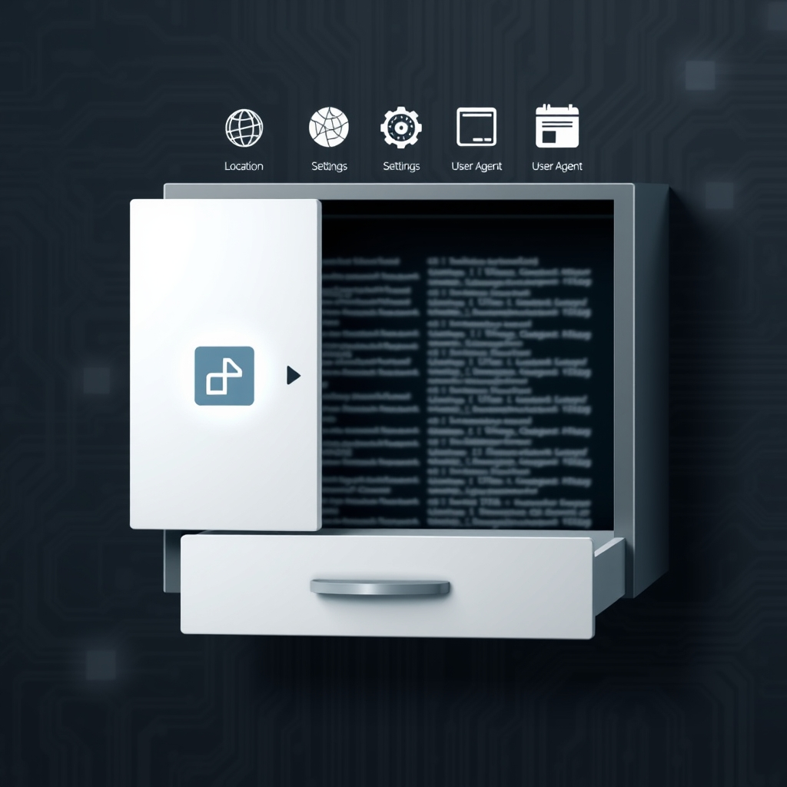

  
[🏡 Home](../index.md) > [🤖 AI Blog](./index.md) | [⏮️](./2026-05-12-1-word-meter-purescript-slice-three-stats-dashboard.md) [⏭️](./2026-05-12-4-word-meter-capability-pattern-refactor.md)  
  
# 2026-05-12 | 🔧 Word Meter PureScript Slice Five — Diagnostics Drawer 📋  
  
  
🧭 The Word Meter PureScript port has been growing one vertical slice at a time. 🎙️ Slice one wired the toggle and the test hook. 🟣 Slice two added live captions. 📊 Slice three lit up the stats dashboard. 📜 Slice four added the event log of completed counting sessions. 🔧 The slice that just landed is the diagnostics drawer, the first feature in this port whose job is to help diagnose problems rather than to count words.  
  
## 🧪 What the slice delivers  
  
📂 The drawer is a single collapsible region that lives below the event log. 🚪 It starts collapsed so the panel does not feel cluttered, and it expands when the user taps the summary row. 🧱 Inside the drawer is one button, one status span, and one preformatted text area. 📋 The button is labelled Copy diagnostics and, when pressed, hands the rendered diagnostics text to the system clipboard. 🟢 On success the status span next to the button fills with the word Copied. 🛑 On failure the same span fills with a Copy failed message that includes the underlying reason, so a phone with no clipboard permission still surfaces a real explanation rather than failing silently.  
  
🌐 The text area itself begins with a small environment snapshot captured once at startup. 🏷️ The snapshot reports the bundle version, the user agent string, and the navigator language. 📜 Below the snapshot the area shows a rolling event log capped at the most recent sixty entries. 🪶 Each entry is a single line of clock time followed by a short label, optionally followed by an em dashed detail. ▶️ Pressing Start counting appends a start counting line. 🗣️ Each recognized utterance appends a final transcript line with its word count. ⏹️ Pressing Stop counting appends a stop counting line with its word count and duration. 🌱 The very first line in the log is always init, written when the bundle finishes mounting.  
  
## 🧱 How the pieces fit together  
  
🧊 The diagnostics module is pure. 🪙 It exposes a record type for one entry, a record type for the snapshot, the cap value, a recordEntry helper that appends to a list and trims to the cap, and a formatDiagnostics function that turns a snapshot and a list into the string the drawer renders.  
  
🧵 The recording module owns the action sum and the reducer. 🆕 Three new actions joined the existing three. 🌍 SetEnvironment writes the captured snapshot into the session. 📝 RecordDiagnostic appends an arbitrary entry. 🟢 SetCopyStatus writes the status field that the drawer reads. 🪞 The existing Toggle and InjectFinalTranscript cases each grew a single line that calls recordEntry, so every counting decision shows up in the log without a parallel side channel.  
  
🔌 Two tiny FFI modules sit at the edges. 📋 The clipboard module wraps navigator dot clipboard dot writeText with explicit success and error callbacks instead of returning a JavaScript promise. 🌐 The environment module reads navigator dot userAgent and navigator dot language once at startup and returns the snapshot record. 🪜 Both modules are deliberately thin so the next slices can grow them organically as new capabilities arrive.  
  
🎛️ The Vdom layer needed three new smart constructors for the details element, the summary element, and the pre element. 🪨 The mount layer did not need to change because the existing element walker already knows how to render arbitrary tags.  
  
🧰 The test hook gained five new accessors. 📋 getDiagnosticsText returns the rendered string. 📏 getDiagnosticsLength returns the current entry count. 🚧 getDiagnosticsLimit returns the cap. 🟢 getCopyStatus returns the status field. 🖱️ requestCopyDiagnostics walks the same code path the button click takes, so a test can drive the clipboard write without a click.  
  
## 🔬 How the slice is tested  
  
🧫 The pure unit suite gained a diagnostics block. 🔢 It asserts that the initial session has no entries and an empty status, that a start counting toggle appends one entry, that a non empty transcript appends another, that a whitespace only transcript appends none, that a stop counting toggle appends a third, that recordEntry trims an overrun array down to exactly the cap, that formatDiagnostics with a snapshot includes the version string, that formatDiagnostics without a snapshot returns the placeholder, and that SetCopyStatus updates the field.  
  
🎭 The Playwright suite gained a slice five describe block with six tests. 🔍 The first verifies that the drawer renders, that the toggle is labelled Diagnostics, that the drawer starts collapsed, and that the snapshot prefix already shows up in the content. 🪟 The second verifies that clicking the summary expands the drawer. 🌱 The third verifies that the init event is in the log on startup. 🧮 The fourth verifies that one start, one transcript, and one stop produce exactly three new entries. 🚧 The fifth verifies that overflowing the cap stops at the documented limit. 🟢 The sixth, gated on chromium clipboard permissions, expands the drawer, clicks Copy diagnostics, asserts that the status span flips to Copied, and reads the system clipboard back to confirm it matches the rendered text exactly.  
  
## 🪄 What was deliberately left for later  
  
🛠️ The legacy bundle records additional environment flags such as whether the Speech Recognition constructor exists and whether the Wake Lock API is present. 🪜 Those fields are deliberately not in this slice because the corresponding capabilities will arrive in slices seven through nine. 🌱 When they do, the snapshot type and the captureEnvironmentSnapshot function grow alongside the new modules rather than ahead of them, which keeps each slice end to end demonstrable on its own.  
  
🧭 The next slice in the table is reset and persistence, where the event log and the diagnostics log will round trip through localStorage so a refresh no longer wipes the user's history.  
  
## 📚 Book Recommendations  
  
### 📖 Similar  
* Debugging by David J Agans is relevant because the diagnostics drawer is essentially a built in version of the author's first rule, understand the system, packaged so a user can hand a maintainer everything they need without manual screenshotting.  
* Domain Modeling Made Functional by Scott Wlaschin is relevant because the slice's separation of a pure diagnostics module from the FFI clipboard and environment modules is a textbook example of the functional core imperative shell pattern the book teaches.  
  
### ↔️ Contrasting  
* The Mythical Man Month by Frederick P Brooks Jr is relevant because Brooks argues that telling features apart from infrastructure is treacherous, while this port deliberately ships infrastructure only as a side effect of features, slice by slice.  
  
### 🔗 Related  
* Working Effectively with Legacy Code by Michael C Feathers is relevant because the port is a slow motion legacy migration where each slice carves a feature out of the legacy bundle and replaces it with a typed PureScript equivalent, exactly the seams and tests pattern the book champions.  
