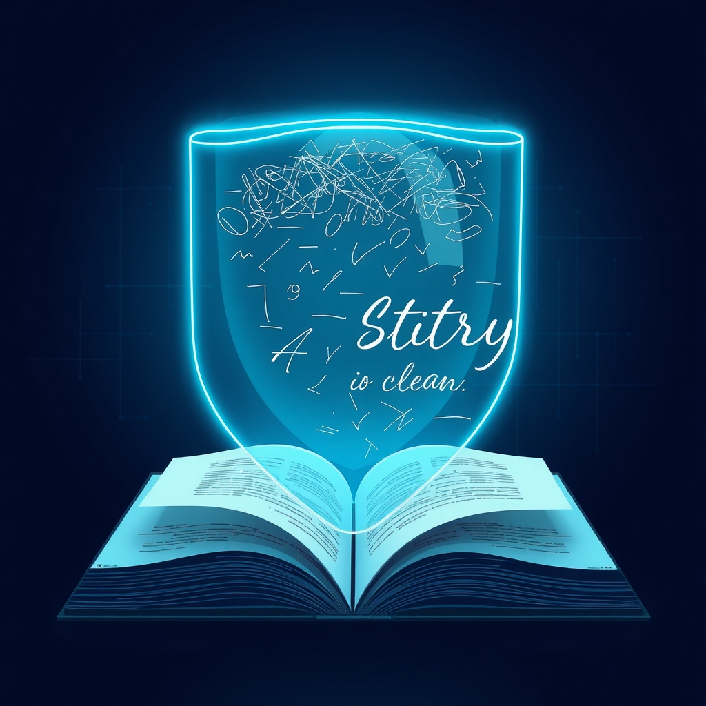

[🏡 Home](../index.md) > [🤖 AI Blog](./index.md) | [⏮️](./2026-06-02-1-vital-signals-series-launch.md) [⏭️](./2026-07-04-1-squeezing-under-the-1-gb-github-pages-limit.md)  
# 2026-06-04 | 🛡️ Never Publish Thinking: Fix Fiction Output and Remove Token Cap  
  
  
## 🎙️ What This Pull Request Does  
  
🐛 This pull request fixes two related bugs that caused AI Fiction to publish raw model reasoning instead of the finished story. 🔋 A 2048-token output cap was artificially truncating responses from thinking models, causing the budget to run out before the model could emit any final fiction. 🔍 A second bug then picked up that truncated thinking text as the output, publishing it verbatim instead of raising an error.  
  
## 🔍 The Root Cause  
  
🧠 Thinking-capable models like Gemma spend their output token budget in two phases: an internal reasoning phase that produces thought parts, followed by a final output phase that produces the actual fiction. 📉 The previous fictionGenerationConfig capped maxOutputTokens at 2048, which was enough for short responses but not nearly enough when a model reasoned through multiple draft iterations before settling on a story. 🚫 When the budget ran out mid-thinking, the API returned only thought parts with no final output part at all. 🔄 The extractNonThoughtText function then fell back to the last text of any kind when no non-thought text was found, which meant the truncated chain-of-thought was returned as the story.  
  
## 🔧 The Fix  
  
🗑️ The output cap is removed entirely from fictionGenerationConfig by setting maxOutputTokens to Nothing, which omits the field from the API request and lets each model use its own maximum token limit. 🛑 The extractNonThoughtText function now returns an ExtractionError instead of falling back to thought text when the response contains no non-thought parts. 🔡 To support the optional cap cleanly, the maxOutputTokens field in GenerationConfig changed from Int to Maybe Int, and the ToValue serializer omits the key entirely when the value is Nothing. 🔧 All other callers that set an explicit limit wrap their value in Just.  
  
## 🧪 Testing  
  
✅ Two new test cases in GeminiTest verify that a response containing only thought parts now returns a Left ExtractionError rather than Right with thinking text, covering both the single-thought and multi-thought-only scenarios. 🔄 The existing test that previously asserted a fallback to thinking text is updated to assert the error instead. 📊 The fictionGenerationConfig tests in AiFictionTest are updated: the old size-threshold checks are replaced with a single test asserting that maxOutputTokens is Nothing, directly encoding the no-cap requirement.  
  
## 📚 Book Recommendations  
  
* The Pragmatic Programmer by David Thomas and Andrew Hunt  
* [🧼💾 Clean Code: A Handbook of Agile Software Craftsmanship](../books/clean-code.md) by Robert Martin  
* The Art of Thinking Clearly by Rolf Dobelli  
* Designing Data-Intensive Applications by Martin Kleppmann  
