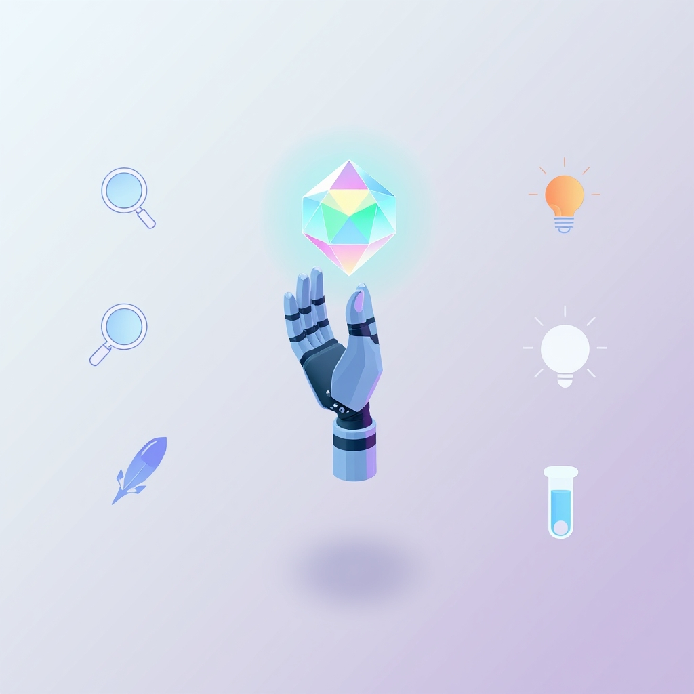

[Home](../index.md) > [Articles](./index.md)  
# [🌱🤖⚙️🖐️ 5 tips on getting started with Gems, your custom AI experts](https://blog.google/products/gemini/google-gems-tips)  
  
  
## 🤖 AI Summary  
**Getting Started with ([Gemini](../software/gemini.md)) Gems 💎✨**  
* **Clarity 🎯:** Define your Gem's specific purpose.  
* **Detail 📝:** Provide thorough instructions and context.  
* **Examples 💡:** Use examples to guide the Gem's output.  
* **Iteration 🔄:** Refine instructions based on feedback.  
* **Exploration 🧪:** Experiment with prompts.  
  
**Recommendations:**  
* **Alternate:** Google's official [Gemini API documentation](https://ai.google.dev/gemini-api/docs) for up-to-date info. 📚💻  
* **Tangential:** "[Prompt Engineering for Developers](https://www.deeplearning.ai/short-courses/chatgpt-prompt-engineering-for-developers)" (DeepLearning.AI) for prompt mastery. 🧠💡  
* **Opposed:** "[Deep Work](../books/deep-work.md)" (Cal Newport) on human focus vs. AI. 🧘🚫🤖  
* **Fiction:** "Klara and the Sun" (Kazuo Ishiguro) explores AI companionship. 🤖❤️☀️  
  
## 💬 [Gemini](https://Gemini.google.com) Prompt  
> Summarize the article: [5 tips on getting started with Gems, your custom AI experts](https://blog.google/products/gemini/google-gems-tips). Emphasize practical takeaways. Make the following additional recommendations: the best alternate resource on the same topic, the best resource that is tangentially related, the best resource that is diametrically opposed, and the best fiction that incorporates related ideas. Use lots of emojis.