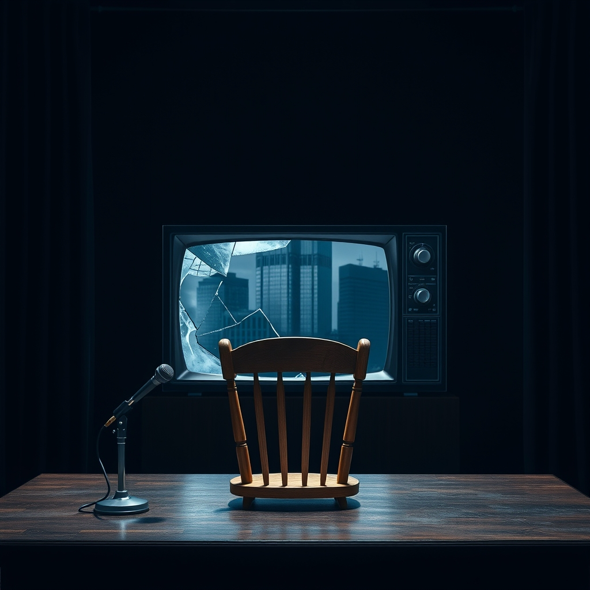

[Home](../index.md) > [Articles](./index.md)  
# [⏱️⚔️🏛️ '60 Minutes' chief resigns, saying show's independence was compromised](https://www.npr.org/2025/04/22/nx-s1-5372733/60-minutes-bill-owens-cbs-trump-paramount)  
  
## 🤖 AI Summary  
  
* 🎬 Bill Owens, the Executive Producer of CBS's "60 Minutes", 💼 resigned from his position after 3️⃣7️⃣ years with CBS News.  
* 🗣️ Owens stated the reason for his departure was a 📉 loss of editorial independence, saying it had "become clear that I would not be allowed to run the show as I have always run it."  
* 🚫 He specified he could no longer "make independent decisions based on what was right for 60 Minutes, right for the audience." 🎯  
* 🏢 Owens reportedly told colleagues he had "lost independence from corporate." 🤝  
* ⚖️ The resignation occurred amidst significant pressure related to a 💰 $20 billion lawsuit filed by President Donald Trump against CBS and its parent company, Paramount Global. 🤯  
* 👨‍⚖️ Trump's lawsuit alleged that "60 Minutes" engaged in "unlawful acts of election and voter interference" 🗳️ through "deceptive" editing of a 2024 interview with then-Vice President Kamala Harris. 🤥  
* 📺 CBS News defended its editing as standard practice for clarity and time constraints, stating the broadcast was "not doctored or deceitful." ✅  
* 📰 Reports indicate Paramount Global executives were seeking to settle the lawsuit, 🤝 potentially influenced by the company's pending merger 🤝 with Skydance Media, which requires regulatory approval. 📝  
* 💪 Owens reportedly resisted settling the lawsuit or issuing an apology to Trump, standing firm on the show's reporting. 💯  
* 😡 Trump had publicly attacked "60 Minutes" and CBS, calling for the network's broadcast license to be revoked (though local stations, not networks, hold licenses). 📡  
* 🥶 The situation is seen by some commentators as an example of political pressure potentially having a "chilling effect" on journalistic independence. 📰  
* 👏 CBS News President Wendy McMahon praised Owens, stating "Standing behind what he stood for was an easy decision for me." 👍  
* 👩‍💼 Tanya Simon, Owens' deputy, will lead "60 Minutes" in the interim. 🚀  
  
## 📚 Book Recommendations  
  
**📰 On Journalism Ethics and Independence:**  
  
* ✍️ *The Elements of Journalism, Fourth Edition: What Newspeople Should Know and the Public Should Expect* by Bill Kovach and Tom Rosenstiel: 🏛️ A foundational text outlining the core principles and practices of journalism.  
* 🎤 *Sound Reporting: The NPR Guide to Audio Journalism and Production* by Jonathan Kern: 🎧 While focused on audio, it offers deep insights into journalistic standards, 🧭 ethics, and 🧐 decision-making relevant to any newsroom, particularly one like NPR or ⏰ 60 Minutes.  
  
**🏦 On Media, Power, and Corporate Influence:**  
  
* [🏭🫡 Manufacturing Consent: The Political Economy of the Mass Media](../books/manufacturing-consent.md) by Edward S. Herman and Noam Chomsky: 🧐 A classic critical analysis of how 🏢 corporate ownership, 📣 advertising, and 📍 sourcing can shape news coverage.  
* 🗞️ *The Media Monopoly* by Ben H. Bagdikian: 📉 A seminal work documenting the concentration of media ownership and its potential impact on democracy and the free flow of information.  
* 💸 *Rich Media, Poor Democracy: Communication Politics in Dubious Times* by Robert W. McChesney: 🗣️ Explores the effects of media deregulation and consolidation on public discourse.  
  
**👹 On Trump and the Media:**  
  
* 🦊 *Hoax: Donald Trump, Fox News, and the Dangerous Distortion of Truth* by Brian Stelter: 📢 Examines the relationship between Trump and a specific media outlet, highlighting issues of bias and influence.  
* 🏛️ *The Divider: Trump in the White House, 2017-2021* by Peter Baker and Susan Glasser: 📰 Provides extensive reporting on the Trump presidency, including his administration's interactions and conflicts with the press.  
* [🙅🗣️💻 Antisocial: Online Extremists, Techno-Utopians, and the Hijacking of the American Conversation](../books/antisocial-online-extremists-techno-utopians-and-the-hijacking-of-the-american-conversation.md) by Andrew Marantz: 📱 Looks at how media, including social media, has been influenced and manipulated in the modern political era.  
  
**🔎 On the History and Practice of Investigative Journalism:**  
  
* 🕵️ *All the President's Men* by Carl Bernstein and Bob Woodward: Watergate 🏛️ The iconic account of investigative journalism that uncovered the Watergate scandal, showcasing the potential impact and challenges of in-depth reporting.  
* ✊🏿 *The Race Beat: The Press, the Civil Rights Struggle, and the Awakening of a Nation* by Gene Roberts and Hank Klibanoff: 📰 Explores the crucial role the press played during the Civil Rights Movement, demonstrating journalism's power to effect change and face down pressure.  
  
## 🦋 Bluesky    
<blockquote class="bluesky-embed" data-bluesky-uri="at://did:plc:i4yli6h7x2uoj7acxunww2fc/app.bsky.feed.post/3mlxeccaden2o" data-bluesky-cid="bafyreie57shevhf7txqipduh5fbwar3q3rlupppkcs2gyilpljoipcrhba">
⏱️⚔️🏛️ &#39;60 Minutes&#39; chief resigns, saying show&#39;s independence was compromised  
  
#AI Q: ⚖️ Can corporate news coexist?  
  
📰 Journalistic Ethics | 🏢 Corporate Influence | ⚖️ Media Litigation | 🗳️  
https://bagrounds.org/articles/60-minutes-chief-resigns-saying-shows-independence-was-compromised
&mdash; <a href="https://bsky.app/profile/did:plc:i4yli6h7x2uoj7acxunww2fc?ref_src=embed">Bryan Grounds (@bagrounds.bsky.social)</a> <a href="https://bsky.app/profile/did:plc:i4yli6h7x2uoj7acxunww2fc/post/3mlxeccaden2o?ref_src=embed">2026-05-16T07:49:08.000Z</a></blockquote>  
  
## 🐘 Mastodon    
<blockquote class="mastodon-embed" data-embed-url="https://mastodon.social/@bagrounds/116583153091649777/embed" style="background: #282c37; border-radius: 8px; border: 1px solid #393f4f; margin: 0; max-width: 540px; min-width: 270px; overflow: hidden; padding: 0;"> <a href="https://mastodon.social/@bagrounds/116583153091649777" target="_blank" style="align-items: center; color: #d9e1e8; display: flex; flex-direction: column; font-family: system-ui, -apple-system, BlinkMacSystemFont, 'Segoe UI', Oxygen, Ubuntu, Cantarell, 'Fira Sans', 'Droid Sans', 'Helvetica Neue', Roboto, sans-serif; font-size: 14px; justify-content: center; letter-spacing: 0.25px; line-height: 20px; padding: 24px; text-decoration: none;"> <svg xmlns="http://www.w3.org/2000/svg" xmlns:xlink="http://www.w3.org/1999/xlink" width="32" height="32" viewBox="0 0 79 75"><path d="M63 45.3v-20c0-4.1-1-7.3-3.2-9.7-2.1-2.4-5-3.7-8.5-3.7-4.1 0-7.2 1.6-9.3 4.7l-2 3.3-2-3.3c-2-3.1-5.1-4.7-9.2-4.7-3.5 0-6.4 1.3-8.6 3.7-2.1 2.4-3.1 5.6-3.1 9.7v20h8V25.9c0-4.1 1.7-6.2 5.2-6.2 3.8 0 5.8 2.5 5.8 7.4V37.7H44V27.1c0-4.9 1.9-7.4 5.8-7.4 3.5 0 5.2 2.1 5.2 6.2V45.3h8ZM74.7 16.6c.6 6 .1 15.7.1 17.3 0 .5-.1 4.8-.1 5.3-.7 11.5-8 16-15.6 17.5-.1 0-.2 0-.3 0-4.9 1-10 1.2-14.9 1.4-1.2 0-2.4 0-3.6 0-4.8 0-9.7-.6-14.4-1.7-.1 0-.1 0-.1 0s-.1 0-.1 0 0 .1 0 .1 0 0 0 0c.1 1.6.4 3.1 1 4.5.6 1.7 2.9 5.7 11.4 5.7 5 0 9.9-.6 14.8-1.7 0 0 0 0 0 0 .1 0 .1 0 .1 0 0 .1 0 .1 0 .1.1 0 .1 0 .1.1v5.6s0 .1-.1.1c0 0 0 0 0 .1-1.6 1.1-3.7 1.7-5.6 2.3-.8.3-1.6.5-2.4.7-7.5 1.7-15.4 1.3-22.7-1.2-6.8-2.4-13.8-8.2-15.5-15.2-.9-3.8-1.6-7.6-1.9-11.5-.6-5.8-.6-11.7-.8-17.5C3.9 24.5 4 20 4.9 16 6.7 7.9 14.1 2.2 22.3 1c1.4-.2 4.1-1 16.5-1h.1C51.4 0 56.7.8 58.1 1c8.4 1.2 15.5 7.5 16.6 15.6Z" fill="currentColor"/></svg> 
Post by @bagrounds@mastodon.social
 
View on Mastodon
 </a> </blockquote> 