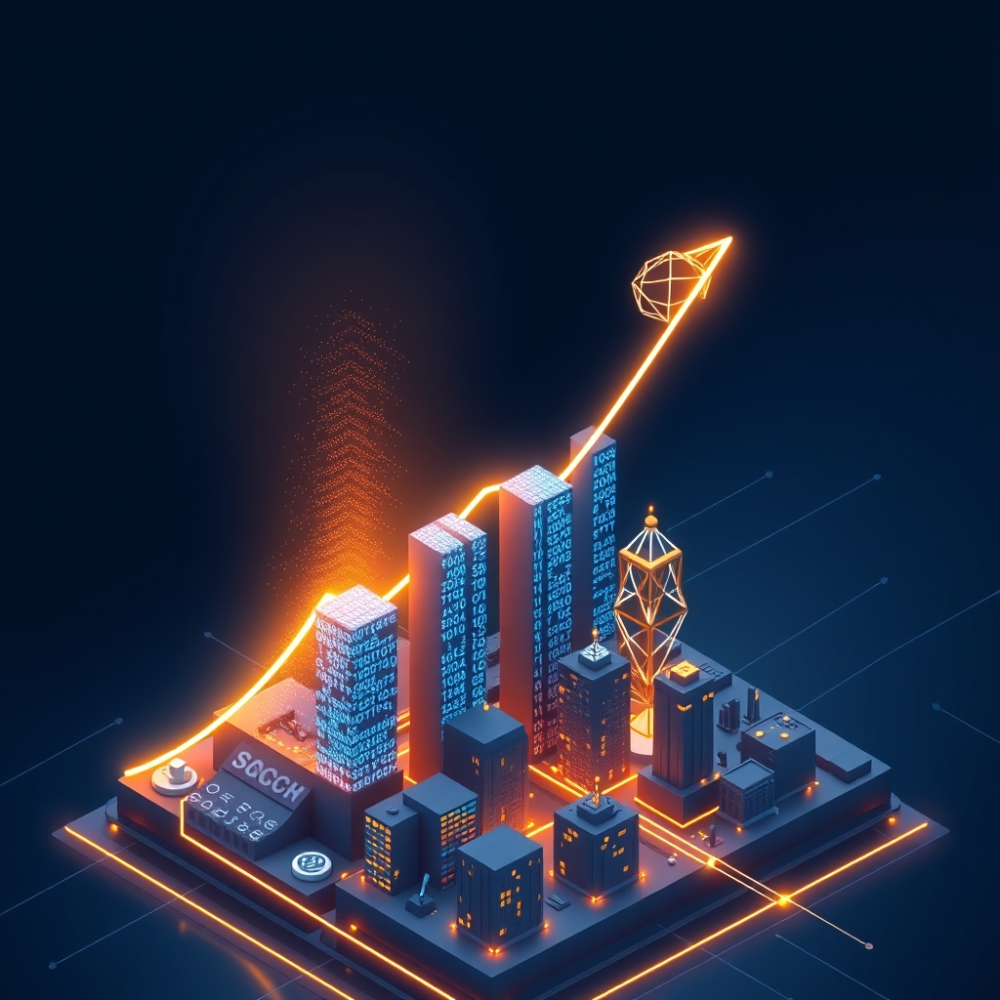

[Home](../index.md) > [Articles](./index.md)  
# [📈🤖✍️🔄 AI traffic is up 527%. SEO is being rewritten.](https://searchengineland.com/ai-traffic-up-seo-rewritten-459954)  
  
## 🤖 AI Summary  
📈 AI-driven traffic has 🚀 increased by 527% between January and May 2025.  
- 🎯 The report from Previsible indicates a 🔍 significant and rapid shift in web traffic due to AI platforms.  
- 💡 This surge is not a future possibility, but a current reality.  
- 🤖 AI platforms like ChatGPT, Perplexity, Claude, Gemini, and Copilot are influencing user discovery.  
- 💼 This AI-referred traffic is particularly strong in "high-consultive" industries.  
- ⚖️ These include Legal, 💰 Finance, 💼 SMB, 🛡️ Insurance, and ⚕️ Health, which account for 55% of all LLM-sourced sessions.  
- 📜 The traditional SEO playbook is becoming outdated.  
- 🔄 Content now needs to be clear, structured, and genuinely helpful to be "instantly surfaced" by AI models.  
- 🧠 Marketers must change their mindset from "ranking" to "being selected."  
- 📊 The recommendation is for marketers to begin tracking LLM-driven sessions.  
- 💻 Content should be structured for AI interfaces.  
- 🗺️ SEO is not dying, but evolving into two tracks: traditional search and LLM-driven discovery.  
  
## 🤔 Evaluation  
- 📖 The provided article, influenced by a specific report, focuses on the rapid rise of AI-driven traffic.  
- 🔄 This perspective emphasizes the need for a new SEO mindset to adapt to these changes.  
- 🔀 Other perspectives suggest a more nuanced reality.  
- 📉 While some studies show a significant drop in organic click-through rates (CTR) on pages with AI Overviews, Google maintains a different view.  
- 📈 Google argues that overall referral traffic from search has not declined but has been redistributed.  
- 👨‍🏫 Websites with in-depth content, original research, and unique perspectives are said to be benefiting.  
- 🧐 For a better understanding, it would be beneficial to explore:  
    - 💡 The phenomenon of "zero-click" searches and its impact.  
    - 👨‍🏫 How Google's `EEAT` (Experience, Expertise, Authoritativeness, and Trustworthiness) principles are evolving with AI.  
    - 📝 The long-term impact of AI on content creation and the role of human writers.  
  
## 📚 Book Recommendations  
  
### 💡 Similar Reading  
* **[🌊🤖🤔 The Coming Wave: Technology, Power, and the 21st Century's Greatest Dilemma](../books/the-coming-wave-technology-power-and-the-21st-centurys-greatest-dilemma.md)** by Mustafa Suleyman: A deep dive into AI and the societal implications that will define our future.  
* **[🤖📈 AI for Marketing and Product Innovation: Powerful New Tools for Predicting Trends, Connecting with Customers, and Closing Sales](../books/ai-for-marketing-and-product-innovation-powerful-new-tools-for-predicting-trends-connecting-with-customers-and-closing-sales.md)** by A.K. Pradeep: A practical framework for applying AI to business challenges like predicting trends and engaging customers.  
  
### 🔄 Contrasting Perspectives  
* **Building a StoryBrand** by Donald Miller: A different approach focused on crafting clear, human-centric messages that resonate with any audience, regardless of how they discover your content.  
  
### 📜 Foundational & Creative  
* **The Master Algorithm** by Pedro Domingos: An accessible guide to machine learning paradigms and the quest for a unifying algorithm.  
* **Index, a History of the** by Dennis Duncan: A unique history of the index, providing historical context for how we've always organized information.  
* **Content Strategy for the Web** by Kristina Halvorson and Melissa Rach: Foundational principles for creating structured, purposeful content, now critical for AI discovery.  
* **[📱🧠 The Shallows: What the Internet Is Doing to Our Brains](../books/the-shallows-what-the-internet-is-doing-to-our-brains.md)** by Nicholas Carr: A thought-provoking look at how digital information consumption is reshaping our minds.  
  
## 🐦 Tweet  
<blockquote class="twitter-tweet" data-theme="dark">
📈🤖✍️🔄 AI traffic is up 527%. SEO is being rewritten.  📈 Traffic Shift | 🤖 LLM Influence | 📝 Content Creation | 🌐 Online Visibility | 🧑‍💻 Marketing Mindset<a href="https://t.co/zR1YpYtQT4">https://t.co/zR1YpYtQT4</a>
&mdash; Bryan Grounds (@bagrounds) <a href="https://twitter.com/bagrounds/status/1953631670982352993?ref_src=twsrc%5Etfw">August 8, 2025</a></blockquote> 