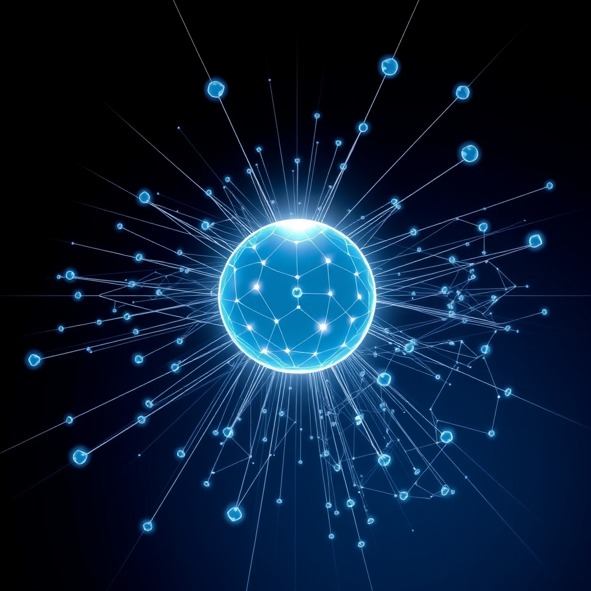

[Home](../index.md) > [Articles](./index.md)  
# [👀 Attention Is All You Need](https://arxiv.org/pdf/1706.03762)  
  
## 🤖 AI Summary  
😴 **TL;DR:** 📄 This paper came up with a new way for computers to process language, called the "Transformer." 🤖 It's really good at tasks like translation 🗣️ because it pays attention 👀 to all parts of a sentence at once, instead of reading it word by word.  
  
**Explanation:**  
  
* 🧒 **For a Child:** 🧠 Imagine you're trying to understand a story 📖. 🤔 Would it be easier to get it if you read one word at a time ☝️, or if you could look at all the words at once 👁️? This paper is about teaching computers 💻 to "look at all the words at once" when they're doing things like translating languages 🌍. 👍 It helps them do a better job!  
     
* 🧑‍🎓 **For a Beginner:** 📄 The paper introduces a new neural network architecture called the Transformer. 🕸️ Traditional sequence transduction models (like those used for machine translation) rely on recurrent or convolutional neural networks. ➡️ These models process data sequentially, which can be 🐌 inefficient. ⚙️ The Transformer uses "attention mechanisms" to weigh the importance of different parts of the input data 📊, allowing for parallel processing ⚡. 🏆 This architecture achieves state-of-the-art results in translation tasks and can be trained more efficiently 💪.  
     
* 🤯 **For a World Expert:** 🌐 This work challenges the dominance of recurrent and convolutional neural networks in sequence transduction by proposing the Transformer architecture. 🔑 The key innovation is the exclusive use of self-attention mechanisms, enabling the model to capture global dependencies with constant complexity per layer. ⏳ This departs from the O(n) sequential computation of RNNs and the O(logk(n)) or O(n/k) path length of CNNs, offering significant advantages in parallelization and long-range dependency learning. 📈 The paper demonstrates substantial empirical gains on WMT 2014 translation tasks, achieving new state-of-the-art BLEU scores and reduced training costs 💰. 🎭 Furthermore, the model's strong performance on constituency parsing highlights its architectural versatility.  
  
## 📚 Books  
📚 **1. For the Foundation of Deep Learning:**  
* **[🧠💻🤖 Deep Learning](../books/deep-learning.md) by Ian Goodfellow, Yoshua Bengio, and Aaron Courville:**  
    * 💡 This is a comprehensive textbook covering the fundamentals of deep learning, including neural networks, backpropagation, and various architectures. 🏗️ It provides the necessary background to understand the context in which the Transformer was developed and why it was a significant departure from previous approaches. 🚀  
  
📚 **2. For Natural Language Processing Context:**  
* 🗣️ **"Speech and Language Processing" by Daniel Jurafsky and James H. Martin:**  
    * 📜 A classic and widely used textbook in Natural Language Processing. 🗣️ It delves into the core concepts of NLP, including language modeling, syntax, semantics, and machine translation. 🌐 Understanding these concepts is crucial for appreciating the impact of the Transformer on NLP tasks. 🌟  
  
📚 **3. To Dive Deeper into Neural Networks:**  
* 🕸️ **"Neural Networks and Deep Learning" by Michael Nielsen:**  
    * 💻 This online book offers a clear and accessible introduction to neural networks and deep learning. 🤔 It's great for building intuition about how these models work, which can help in grasping the innovations of the attention mechanism. 💡  
  
📚 **4. Specifically on Transformers:**  
* **[🗣️💻 Natural Language Processing with Transformers](../books/natural-language-processing-with-transformers.md) by Lewis Tunstall, Leandro von Werra, and Thomas Wolf:**  
    * 🚀 This book focuses specifically on the Transformer architecture and its applications in NLP. 🛠️ It's a practical guide that covers implementation details, fine-tuning techniques, and various use cases of Transformers. ⚙️  
  
📚 **5. For Broader AI Context:**  
* 🤖 **[🤖🧠 Artificial Intelligence: A Modern Approach](../books/artificial-intelligence-a-modern-approach.md) by Stuart Russell and Peter Norvig:**  
    * 🌍 While not solely focused on deep learning or NLP, this book provides a comprehensive overview of artificial intelligence. 🔭 It helps to situate the Transformer within the broader landscape of AI research and its potential impact on the field. ✨  
  
📚 **6. To Consider the Implications:**  
* ❓ **"The Alignment Problem: Machine Learning and Human Values" by Brian Christian:**  
    * 🕊️ This book delves into the challenges of aligning advanced AI systems with human values. ⚖️ As Transformer models become more powerful and are used in various applications, it's important to consider the ethical implications and potential societal impact, which this book explores. 💭  
  
## 🦋 Bluesky    
<blockquote class="bluesky-embed" data-bluesky-uri="at://did:plc:i4yli6h7x2uoj7acxunww2fc/app.bsky.feed.post/3mlzfuwgo3m26" data-bluesky-cid="bafyreiaricmhbcqetlibzyfl2sbndqhhygpb56mp43yaptnqnij7xu6wwm">
👀 Attention Is All You Need  
  
#AI Q: 🤖 Does paying attention to everything at once make for better understanding?  
  
🧠 Neural Networks | 🌍 Machine Translation | 🏗️ Transformer Architecture  
https://bagrounds.org/articles/attention-is-all-you-need
&mdash; <a href="https://bsky.app/profile/did:plc:i4yli6h7x2uoj7acxunww2fc?ref_src=embed">Bryan Grounds (@bagrounds.bsky.social)</a> <a href="https://bsky.app/profile/did:plc:i4yli6h7x2uoj7acxunww2fc/post/3mlzfuwgo3m26?ref_src=embed">2026-05-17T03:22:46.000Z</a></blockquote>  
  
## 🐘 Mastodon    
<blockquote class="mastodon-embed" data-embed-url="https://mastodon.social/@bagrounds/116588879419481626/embed" style="background: #282c37; border-radius: 8px; border: 1px solid #393f4f; margin: 0; max-width: 540px; min-width: 270px; overflow: hidden; padding: 0;"> <a href="https://mastodon.social/@bagrounds/116588879419481626" target="_blank" style="align-items: center; color: #d9e1e8; display: flex; flex-direction: column; font-family: system-ui, -apple-system, BlinkMacSystemFont, 'Segoe UI', Oxygen, Ubuntu, Cantarell, 'Fira Sans', 'Droid Sans', 'Helvetica Neue', Roboto, sans-serif; font-size: 14px; justify-content: center; letter-spacing: 0.25px; line-height: 20px; padding: 24px; text-decoration: none;"> <svg xmlns="http://www.w3.org/2000/svg" xmlns:xlink="http://www.w3.org/1999/xlink" width="32" height="32" viewBox="0 0 79 75"><path d="M63 45.3v-20c0-4.1-1-7.3-3.2-9.7-2.1-2.4-5-3.7-8.5-3.7-4.1 0-7.2 1.6-9.3 4.7l-2 3.3-2-3.3c-2-3.1-5.1-4.7-9.2-4.7-3.5 0-6.4 1.3-8.6 3.7-2.1 2.4-3.1 5.6-3.1 9.7v20h8V25.9c0-4.1 1.7-6.2 5.2-6.2 3.8 0 5.8 2.5 5.8 7.4V37.7H44V27.1c0-4.9 1.9-7.4 5.8-7.4 3.5 0 5.2 2.1 5.2 6.2V45.3h8ZM74.7 16.6c.6 6 .1 15.7.1 17.3 0 .5-.1 4.8-.1 5.3-.7 11.5-8 16-15.6 17.5-.1 0-.2 0-.3 0-4.9 1-10 1.2-14.9 1.4-1.2 0-2.4 0-3.6 0-4.8 0-9.7-.6-14.4-1.7-.1 0-.1 0-.1 0s-.1 0-.1 0 0 .1 0 .1 0 0 0 0c.1 1.6.4 3.1 1 4.5.6 1.7 2.9 5.7 11.4 5.7 5 0 9.9-.6 14.8-1.7 0 0 0 0 0 0 .1 0 .1 0 .1 0 0 .1 0 .1 0 .1.1 0 .1 0 .1.1v5.6s0 .1-.1.1c0 0 0 0 0 .1-1.6 1.1-3.7 1.7-5.6 2.3-.8.3-1.6.5-2.4.7-7.5 1.7-15.4 1.3-22.7-1.2-6.8-2.4-13.8-8.2-15.5-15.2-.9-3.8-1.6-7.6-1.9-11.5-.6-5.8-.6-11.7-.8-17.5C3.9 24.5 4 20 4.9 16 6.7 7.9 14.1 2.2 22.3 1c1.4-.2 4.1-1 16.5-1h.1C51.4 0 56.7.8 58.1 1c8.4 1.2 15.5 7.5 16.6 15.6Z" fill="currentColor"/></svg> 
Post by @bagrounds@mastodon.social
 
View on Mastodon
 </a> </blockquote> 