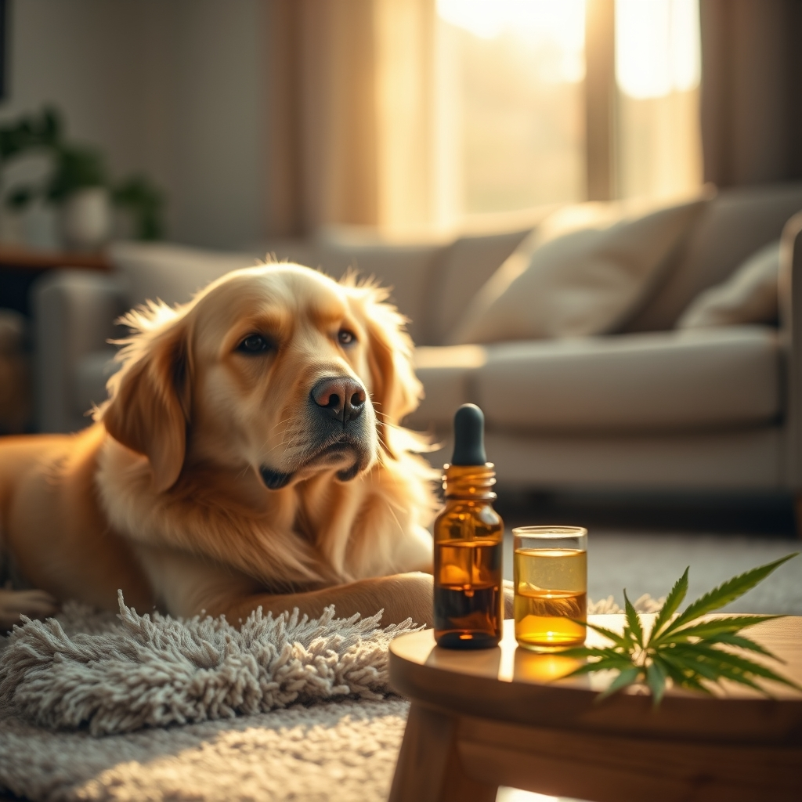

[Home](../index.md) > [Articles](./index.md)  
  
# [🐕🌿⚕️🎗️ Cannabis for Pets With Cancer](https://acfoundation.org/cannabis-for-pets-with-cancer)  
  
> Cannabinoids may play an integral role in treating pets with cancer.  Incorporating cannabis products (both high and low THC varieties) may provide antitumor activity on its own or in combination with conventional therapy.  It may also provide palliative support and improve the quality of life for your pet.