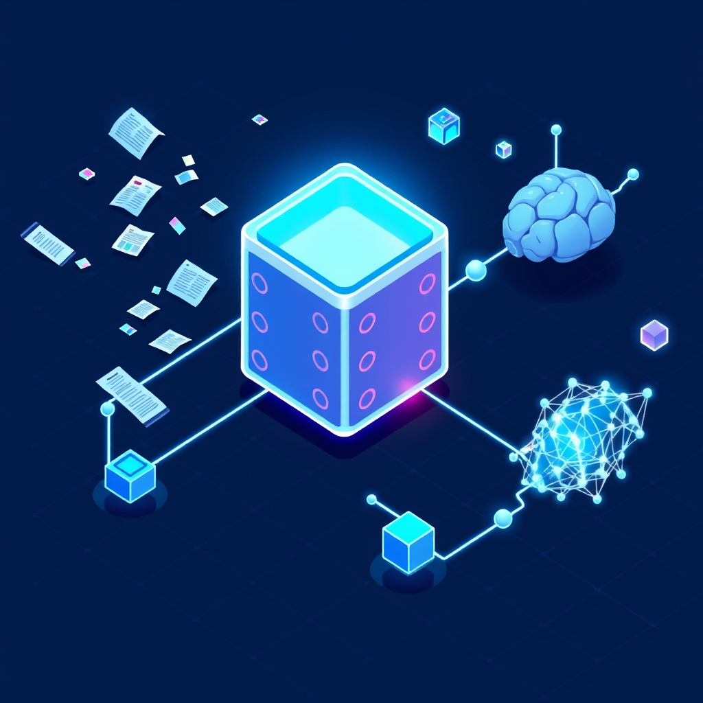

[Home](../index.md) > [Articles](./index.md)  
# [📚🧩🤖 Guide Comprehensive RAG Implementation Guide](https://medium.com/@saraswathilakshman/comprehensive-rag-implementation-guide-a4be00826224)  
  
  
## 🤖 AI Summary  
* The 💡 core concept of RAG is to retrieve relevant 📚 information at inference time to generate more accurate and up-to-date responses for [🤖🦜 Large Language Models (LLMs)](../topics/large-language-models.md).  
* The system comprises 🛠️ four core components: the Document Processing Pipeline, the Vector Database, the Retriever, and the Generator (LLM).  
* The Document Processing Pipeline 🔄 transforms raw data into a retrievable format.  
* The Vector Database 💾 stores document embeddings and enables semantic search.  
* The Retriever 🔍 is responsible for finding relevant information based on user queries.  
* The Generator (LLM) ✍️ combines retrieved information with the query to create a response.  
* There are 🔟 different RAG architectures, including Standard RAG, Corrective RAG, Speculative RAG, Fusion RAG, Agentic RAG, Self RAG, Hierarchical RAG, Multi-modal RAG, Adaptive RAG, and Fine-tuned RAG.  
* Key implementation concepts involve 🧠 best practices for document processing (intelligent chunking, preserving semantics, enriching metadata, preprocessing).  
* Retrieval optimization ⚡ includes hybrid search, re-ranking, query expansion, and filtering.  
* Prompting strategies 🗣️ encompass context-aware prompts, citation instructions, fallback guidance, and role definition.  
* Common challenges addressed include 👻 hallucinations, ⏱️ latency, 📏 context window limitations, and 🗑️ irrelevant retrievals.  
* The article discusses 📊 evaluation metrics for RAG systems.  
* Popular tools and frameworks 💻 like LangChain and LlamaIndex are mentioned.  
* Crucial production deployment considerations include 📈 scaling, ⚙️ monitoring, 🔒 security, and 💰 cost optimization.  
  
## 🤔 Evaluation  
This article provides a 🌐 comprehensive overview of RAG, detailing its components and various architectures. It contrasts different RAG approaches by highlighting their specific use cases, such as Corrective RAG for factual accuracy versus Speculative RAG for cost-effectiveness. The discussion on challenges like 👻 hallucinations and latency, along with proposed solutions, offers a practical perspective. To gain a deeper understanding, it would be beneficial to explore specific case studies where different RAG architectures have been successfully implemented and their quantifiable impacts. Further investigation into the technical nuances of vector database indexing strategies and the trade-offs between different embedding models would also be valuable.  
  
## 📚 Book Recommendations  
* **[🤖⚙️🔁 Designing Machine Learning Systems: An Iterative Process for Production-Ready Applications](../books/designing-machine-learning-systems-an-iterative-process-for-production-ready-applications.md)** by Chip Huyen: A 📖 valuable resource for understanding the broader context of deploying and maintaining machine learning systems, including considerations relevant to RAG in production.  
* **[🗣️💻 Natural Language Processing with Transformers](../books/natural-language-processing-with-transformers.md)** by Lewis Tunstall, Leandro von Werra, and Thomas Wolf: This book  delves into the 🤖 core of LLMs and transformers, providing a foundational understanding essential for working with the generator component of RAG.  
* **Vector Databases for Dummies** by Neo4j: While a simpler read, it could offer a good 🧭 starting point for understanding the principles and applications of vector databases, which are central to RAG.  
* **[🧠💻🤖 Deep Learning](../books/deep-learning.md)** by Ian Goodfellow, Yoshua Bengio, and Aaron Courville: A more academic but 🧠 fundamental text for grasping the underlying theories of deep learning, which power both LLMs and embedding models used in RAG.