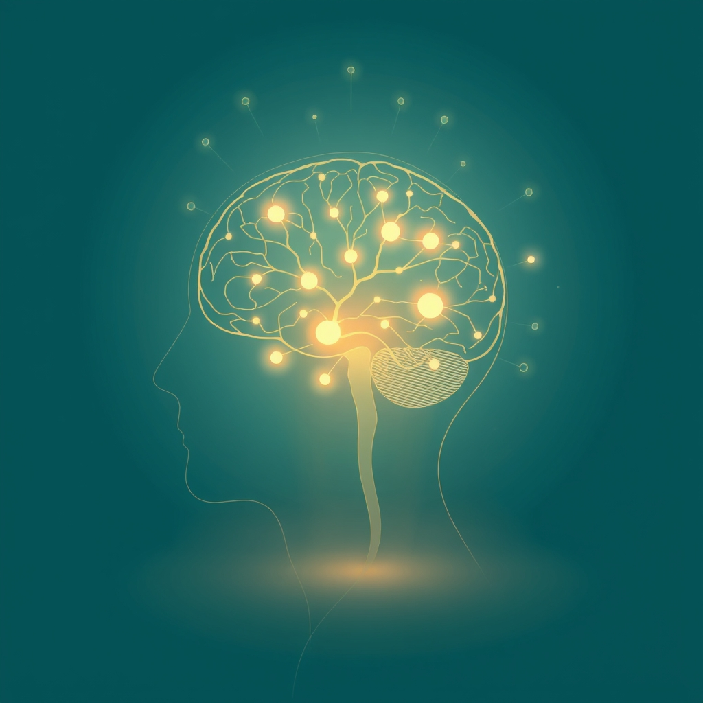

[Home](../index.md) > [Articles](./index.md)  
# 💪🧠📉💊🔎 [Creatine Supplementation in Depression: A Review of Mechanisms, Efficacy, Clinical Outcomes, and Future Directions](https://pmc.ncbi.nlm.nih.gov/articles/PMC11567172)  
  
  
## 🤖 AI Summary  
* [💪🏋️‍♂️ Creatine](../topics/creatine.md), traditionally recognized for boosting physical performance, has recently shown potential as an adjunctive therapy for treating depression 😔.  
* 🧠 Creatine's ability to enhance brain energy metabolism and provide neuroprotection 🛡️ suggests it can alleviate mood disorders by improving mitochondrial function, increasing cellular resilience, and modulating neurotransmitter systems that regulate mood 😌.  
* 🧪🔬 Both animal models and human trials indicate creatine's efficacy for the treatment of depression.  
* 💊 Creatine supplementation reduces depressive symptoms, particularly when combined with selective serotonin reuptake inhibitors, and may improve brain energy metabolism and neuroplasticity 🌱.  
* ⚠️ It is generally well tolerated, though caution is warranted due to potential side effects such as manic episodes in bipolar disorder 🤯 and renal function impairment in patients with kidney dysfunction 😾.  
* ✨ Overall, creatine presents a promising addition to current depression treatments, though further research is needed 🧐 to establish optimal dosing, long-term efficacy, and safety across diverse patient populations.  
* 📝 The review highlights that creatine, traditionally used to enhance physical performance 🏋️, shows promise as an adjunctive management option for depression, especially when combined with antidepressants at a dose of 4-5 g/day for two to eight weeks 📅.  
* 💡 Current research highlights significant promise, particularly among female ♀️ and adolescent patients 🧑‍🦱 with treatment-resistant depression and those with low baseline creatine.  
  
## 📚 Book Recommendations  
* 🧠 **On Depression and Mental Health:**  
    * 📖 [😊👍 Feeling Good: The New Mood Therapy](../books/feeling-good-the-new-mood-therapy.md) by David D. Burns (for cognitive behavioral therapy approaches to depression)  
    * [☀️👿 The Noonday Demon: An Atlas of Depression](../books/the-noonday-demon-an-atlas-of-depression.md) by Andrew Solomon (a comprehensive look at depression)  
    * 📖 *Lost Connections: Why You’re Depressed and How to Find Hope* by Johann Hari (exploring societal causes of depression and anxiety)  
* 🍎 **On Nutrition, Supplements, and Brain Health:**  
    * 📖 *Brain Food: The Surprising Science of Eating Smart* by Lisa Mosconi (focuses on the impact of diet on brain health)  
    * 📖 *The Better Brain Book: The Best Tool for Improving Memory, Sharpness, Mood, and Sleep* by David Perlmutter (discusses nutritional strategies for brain health)  
    * 🔎 *Supplements for Brain Health* (a general guide to various supplements and their effects on cognitive function and mood, found through online search for "supplements brain health book")  
  
## 🦋 Bluesky    
<blockquote class="bluesky-embed" data-bluesky-uri="at://did:plc:i4yli6h7x2uoj7acxunww2fc/app.bsky.feed.post/3mpggkxkewb24" data-bluesky-cid="bafyreihwq7sv5vuitkyyzggnb2lj5qjkitp3z5ambqfbjpcunzgucqc4ym">
💪🧠📉💊🔎 Creatine Supplementation in Depression: A Review of Mechanisms, Efficacy, Clinical Outcomes, and Future Directions  
  
#AI Q: 💊 Tried mood supplements?  
https://bagrounds.org/articles/creatine-supplementation-in-depression-a-review-of-mechanisms-efficacy-clinical-outcomes-and-future-directions
&mdash; <a href="https://bsky.app/profile/did:plc:i4yli6h7x2uoj7acxunww2fc?ref_src=embed">Bryan Grounds (@bagrounds.bsky.social)</a> <a href="https://bsky.app/profile/did:plc:i4yli6h7x2uoj7acxunww2fc/post/3mpggkxkewb24?ref_src=embed">2026-06-29T11:55:17.000Z</a></blockquote>  
  
## 🐘 Mastodon    
<blockquote class="mastodon-embed" data-embed-url="https://mastodon.social/@bagrounds/116844450837109461/embed" style="background: #282c37; border-radius: 8px; border: 1px solid #393f4f; margin: 0; max-width: 540px; min-width: 270px; overflow: hidden; padding: 0;"> <a href="https://mastodon.social/@bagrounds/116844450837109461" target="_blank" style="align-items: center; color: #d9e1e8; display: flex; flex-direction: column; font-family: system-ui, -apple-system, BlinkMacSystemFont, 'Segoe UI', Oxygen, Ubuntu, Cantarell, 'Fira Sans', 'Droid Sans', 'Helvetica Neue', Roboto, sans-serif; font-size: 14px; justify-content: center; letter-spacing: 0.25px; line-height: 20px; padding: 24px; text-decoration: none;"> <svg xmlns="http://www.w3.org/2000/svg" xmlns:xlink="http://www.w3.org/1999/xlink" width="32" height="32" viewBox="0 0 79 75"><path d="M63 45.3v-20c0-4.1-1-7.3-3.2-9.7-2.1-2.4-5-3.7-8.5-3.7-4.1 0-7.2 1.6-9.3 4.7l-2 3.3-2-3.3c-2-3.1-5.1-4.7-9.2-4.7-3.5 0-6.4 1.3-8.6 3.7-2.1 2.4-3.1 5.6-3.1 9.7v20h8V25.9c0-4.1 1.7-6.2 5.2-6.2 3.8 0 5.8 2.5 5.8 7.4V37.7H44V27.1c0-4.9 1.9-7.4 5.8-7.4 3.5 0 5.2 2.1 5.2 6.2V45.3h8ZM74.7 16.6c.6 6 .1 15.7.1 17.3 0 .5-.1 4.8-.1 5.3-.7 11.5-8 16-15.6 17.5-.1 0-.2 0-.3 0-4.9 1-10 1.2-14.9 1.4-1.2 0-2.4 0-3.6 0-4.8 0-9.7-.6-14.4-1.7-.1 0-.1 0-.1 0s-.1 0-.1 0 0 .1 0 .1 0 0 0 0c.1 1.6.4 3.1 1 4.5.6 1.7 2.9 5.7 11.4 5.7 5 0 9.9-.6 14.8-1.7 0 0 0 0 0 0 .1 0 .1 0 .1 0 0 .1 0 .1 0 .1.1 0 .1 0 .1.1v5.6s0 .1-.1.1c0 0 0 0 0 .1-1.6 1.1-3.7 1.7-5.6 2.3-.8.3-1.6.5-2.4.7-7.5 1.7-15.4 1.3-22.7-1.2-6.8-2.4-13.8-8.2-15.5-15.2-.9-3.8-1.6-7.6-1.9-11.5-.6-5.8-.6-11.7-.8-17.5C3.9 24.5 4 20 4.9 16 6.7 7.9 14.1 2.2 22.3 1c1.4-.2 4.1-1 16.5-1h.1C51.4 0 56.7.8 58.1 1c8.4 1.2 15.5 7.5 16.6 15.6Z" fill="currentColor"/></svg> 
Post by @bagrounds@mastodon.social
 
View on Mastodon
 </a> </blockquote> 