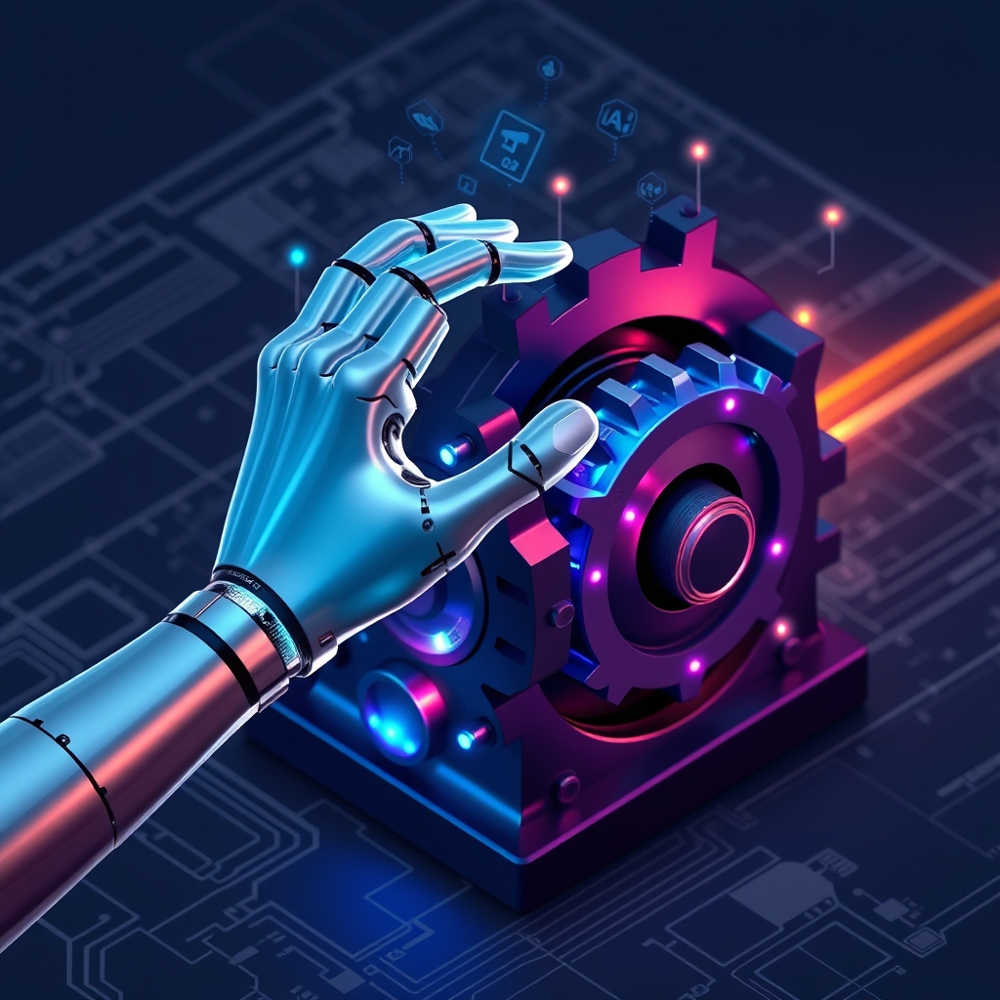

[Home](../index.md) > [Articles](./index.md)  
# [⚙️🤖📈🤝 Engineering and AI: Advancing the synergy](https://academic.oup.com/pnasnexus/article/4/3/pgaf030/8063608)  
  
## 🤖 AI Summary  
  
* 🧠 **Recent developments** 🔬 in artificial intelligence (AI) and machine learning (ML), 📊 driven by unprecedented data and computing capabilities, have transformed fields from computer vision to medicine, beginning to influence culture at large.  
* 🛡️ These advances face **key challenges**, 🔒 including accuracy and trustworthiness issues, security vulnerabilities, algorithmic bias, a lack of interpretability, and performance degradation when deployment conditions differ from training data.  
* 🧪 **The paper** 📝 examines AI and ML's growing influence on engineering systems, from self-driving vehicles to materials discovery, while addressing safety and performance assurance.  
* 🤖 **Autonomous vehicles** 🚗 are a prime example of AI's integration with engineering, but have faced significant issues, such as making nonintuitive mistakes and having trouble with real-world complexities like inconsistent signage.  
* 💡 The video also discusses AI's application in **materials discovery**, 🔬 including accelerating the search for new materials by predicting their properties and exploring vast chemical spaces.  
* 🔬 AI and engineering are being applied to **complex systems**, 💡 from robotics to smart infrastructure, to create more resilient and efficient solutions.  
* 🌐 It is imperative that the **engineering community** 🤝 works to ensure that AI systems are safe, trustworthy, and effective.  
  
## 🤔 Evaluation   
The provided article from *PNAS Nexus* gives a forward-looking perspective on the synergy between engineering and AI, acknowledging the challenges while maintaining an optimistic tone. 🤖 This perspective aligns with much of the current discussion in academia and industry, which often focuses on the **potential benefits and grand challenges** of AI integration.  
  
🤔 However, other sources offer more critical and cautionary views. ⚖️ They highlight the very real-world consequences of AI failures, such as the widely reported stumbles of autonomous vehicles that make nonintuitive mistakes or the propagation of **racial and gender biases** in rushed applications of AI. 🚫 These contrasting perspectives emphasize that the gap between a controlled training environment and the unpredictable real world presents a significant engineering hurdle, and that AI often lacks the "common sense" expected by average consumers.  
  
📚 Topics to explore for a better understanding include:  
  
* 🧠 **Context Engineering**: 💡 How can engineers consciously plan and design the data, parameters, rules, and constraints under which an AI operates to improve its reliability and precision?  
* ⚖️ **The Role of Regulation**: 🏛️ How can we address the reality that AI, in its current form, is largely unregulated and unfettered, and what measures can be taken to ensure accountability?  
* 🌳 **Environmental Impact**: 💨 What is the carbon footprint of AI, and how can green, sustainable algorithms be designed to work with minimal environmental impact?  
  
## 📚 Book Recommendations  
  
* **[🤖🏗️ AI Engineering: Building Applications with Foundation Models](../books/ai-engineering-building-applications-with-foundation-models.md)** by Chip Huyen: A book on the systems side of AI engineering, explaining how to develop and operate AI applications.  
* 🛠️ **The LLM Engineering Handbook** by Paul Iusztin and Maxime Labonne: A guide to understanding the entire Large Language Model (LLM) stack, from foundational models to vector databases.  
* **[📊📉🏛️ Weapons of Math Destruction: How Big Data Increases Inequality and Threatens Democracy](../books/weapons-of-math-destruction-how-big-data-increases-inequality-and-threatens-democracy.md)** by Cathy O'Neil: A contrasting perspective that explores how big data and algorithms can increase inequality and threaten democracy.  
* 🧐 **[⚖️🤖 The Alignment Problem](../books/the-alignment-problem.md)** by Brian Christian: A book on the complex challenge of aligning machine learning models with human values.  
* 🚗 **Autonomous Vehicle Safety Solutions** by Aparna Kumari: A detailed look at the safety assurance complexities in the design and operation of autonomous driving systems.  
* 🧪 **AI and Robotic Technology in Materials and Chemistry Research** by Xi Zhu: A creatively related book that focuses on the practical application of AI and robotics in materials science and chemistry research.  
* 🤖 **Rebooting AI** by Gary F. Marcus: A critical look at the current state of AI and a roadmap for building artificial intelligence we can truly trust.  
  
## 🦋 Bluesky    
<blockquote class="bluesky-embed" data-bluesky-uri="at://did:plc:i4yli6h7x2uoj7acxunww2fc/app.bsky.feed.post/3miodwddx742s" data-bluesky-cid="bafyreidln4ivooxticdchaqn64yujqhxo42q2pgkrsswm6r6icff3pib6q">
⚙️🤖📈🤝 Engineering and AI: Advancing the synergy  
  
#AI Q: ⚙️ Should engineers prioritize AI speed or safety in real world systems?  
  
🤖 AI Applications | 🚗 Autonomous Systems | 🧪 Materials Science | 🏛️ AI Regulation  
https://bagrounds.org/articles/engineering-and-ai-advancing-the-synergy
&mdash; <a href="https://bsky.app/profile/did:plc:i4yli6h7x2uoj7acxunww2fc?ref_src=embed">Bryan Grounds (@bagrounds.bsky.social)</a> <a href="https://bsky.app/profile/did:plc:i4yli6h7x2uoj7acxunww2fc/post/3miodwddx742s?ref_src=embed">2026-04-04T13:32:54.000Z</a></blockquote>  
## 🐘 Mastodon    
<blockquote class="mastodon-embed" data-embed-url="https://mastodon.social/@bagrounds/116346688277122914/embed" style="background: #282c37; border-radius: 8px; border: 1px solid #393f4f; margin: 0; max-width: 540px; min-width: 270px; overflow: hidden; padding: 0;"> <a href="https://mastodon.social/@bagrounds/116346688277122914" target="_blank" style="align-items: center; color: #d9e1e8; display: flex; flex-direction: column; font-family: system-ui, -apple-system, BlinkMacSystemFont, 'Segoe UI', Oxygen, Ubuntu, Cantarell, 'Fira Sans', 'Droid Sans', 'Helvetica Neue', Roboto, sans-serif; font-size: 14px; justify-content: center; letter-spacing: 0.25px; line-height: 20px; padding: 24px; text-decoration: none;"> <svg xmlns="http://www.w3.org/2000/svg" xmlns:xlink="http://www.w3.org/1999/xlink" width="32" height="32" viewBox="0 0 79 75"><path d="M63 45.3v-20c0-4.1-1-7.3-3.2-9.7-2.1-2.4-5-3.7-8.5-3.7-4.1 0-7.2 1.6-9.3 4.7l-2 3.3-2-3.3c-2-3.1-5.1-4.7-9.2-4.7-3.5 0-6.4 1.3-8.6 3.7-2.1 2.4-3.1 5.6-3.1 9.7v20h8V25.9c0-4.1 1.7-6.2 5.2-6.2 3.8 0 5.8 2.5 5.8 7.4V37.7H44V27.1c0-4.9 1.9-7.4 5.8-7.4 3.5 0 5.2 2.1 5.2 6.2V45.3h8ZM74.7 16.6c.6 6 .1 15.7.1 17.3 0 .5-.1 4.8-.1 5.3-.7 11.5-8 16-15.6 17.5-.1 0-.2 0-.3 0-4.9 1-10 1.2-14.9 1.4-1.2 0-2.4 0-3.6 0-4.8 0-9.7-.6-14.4-1.7-.1 0-.1 0-.1 0s-.1 0-.1 0 0 .1 0 .1 0 0 0 0c.1 1.6.4 3.1 1 4.5.6 1.7 2.9 5.7 11.4 5.7 5 0 9.9-.6 14.8-1.7 0 0 0 0 0 0 .1 0 .1 0 .1 0 0 .1 0 .1 0 .1.1 0 .1 0 .1.1v5.6s0 .1-.1.1c0 0 0 0 0 .1-1.6 1.1-3.7 1.7-5.6 2.3-.8.3-1.6.5-2.4.7-7.5 1.7-15.4 1.3-22.7-1.2-6.8-2.4-13.8-8.2-15.5-15.2-.9-3.8-1.6-7.6-1.9-11.5-.6-5.8-.6-11.7-.8-17.5C3.9 24.5 4 20 4.9 16 6.7 7.9 14.1 2.2 22.3 1c1.4-.2 4.1-1 16.5-1h.1C51.4 0 56.7.8 58.1 1c8.4 1.2 15.5 7.5 16.6 15.6Z" fill="currentColor"/></svg> 
Post by @bagrounds@mastodon.social
 
View on Mastodon
 </a> </blockquote>   
