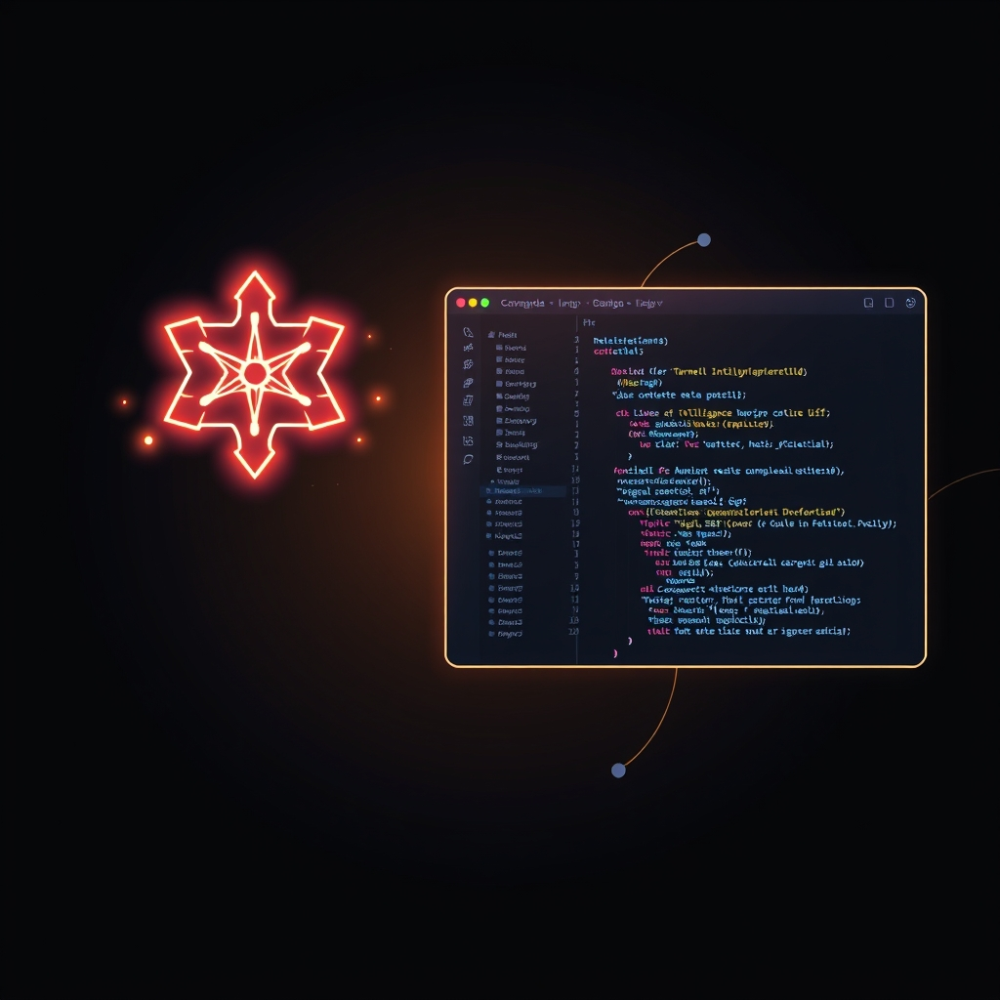

[Home](../index.md) > [Articles](./index.md)  
# ♊💻🆚 Gemini CLI + VS Code: Native diffing and context-aware workflows  
  
## 🤖 AI Summary  
The latest ✨ update for the Gemini CLI introduces a **deep integration** with VS Code, aiming to enhance developer workflows.  
- 💡 **Context-aware suggestions**: The Gemini CLI now understands the developer's workspace and the files that are currently open. It can also access selected text to provide **targeted and contextually relevant suggestions**.  
- 🖥️ **Native in-editor diffing**: Suggestions from the CLI trigger a **full-screen diff view** directly within VS Code. This allows for a comprehensive, side-by-side review of changes.  
- ✍️ **In-diff editing**: Developers can **modify the code** directly within the diff view before accepting the proposed changes.  
  
## 🤔 Evaluation  
This integration 🤝 significantly differs from a standalone CLI by moving the interaction from a simple text-based output to a rich, integrated development environment experience. Instead of just presenting a suggestion in the terminal, it offers a visual, interactive diff view that allows for immediate code modification. This is a powerful step toward a more intuitive and efficient AI-assisted workflow. A topic for further exploration is how this integration handles more complex, multi-file changes or if it can be extended to other popular IDEs. It would also be interesting to see how the Gemini CLI's context-awareness compares to other code assistants that rely on pre-indexed project data rather than real-time workspace access.  
  
## 📚 Book Recommendations  
- **[🧑‍💻📈 The Pragmatic Programmer: Your Journey to Mastery](../books/the-pragmatic-programmer-your-journey-to-mastery.md)** by David Thomas and Andrew Hunt: Offers timeless advice on improving software development skills and workflow, which complements the idea of an efficient, integrated toolchain.  
- **[🧼💾 Clean Code: A Handbook of Agile Software Craftsmanship](../books/clean-code.md)** by Robert C. Martin: Focuses on writing readable and maintainable code, which would be essential when working with AI-suggested changes.  
- **[🧱🛠️ Working Effectively with Legacy Code](../books/working-effectively-with-legacy-code.md)** by Michael C. Feathers: Provides strategies for handling and improving existing codebases, a common task where a context-aware tool like Gemini CLI could be very useful.  
- [🤖💻 AI-Powered Developer: Build great software with ChatGPT and Copilot](../books/ai-powered-developer-build-great-software-with-chatgpt-and-copilot.md) by Nathan B. Crocker: A relevant book that explores how developers can harness AI to boost productivity and handle various tasks.  
- The Linux Command Line by William Shotts: A contrasting recommendation that focuses on the foundational skills of using the terminal, highlighting that a deep understanding of the command line is still crucial, even with AI tools.  
- Context-Aware Pervasive Systems by Seng Loke: A creatively related book that delves into the architectures and principles of context-aware systems, providing a theoretical foundation for the technology powering the Gemini CLI's new features.  
- [🤖🧩 Patterns of Application Development Using AI](../books/patterns-of-application-development-using-ai.md) by Obie Fernandez: Offers a pragmatic approach to integrating AI components into application architectures, with real-world examples and lessons learned.