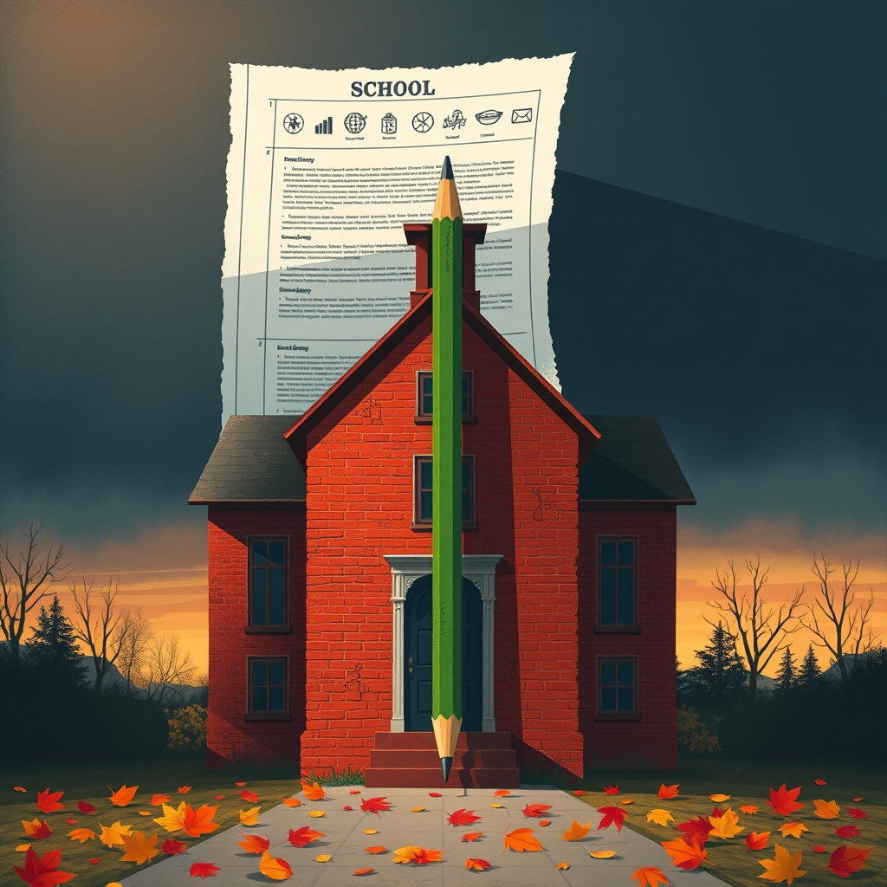

[Home](../index.md) > [Articles](./index.md)  
# [📉🍎🔥🚫 How Project 2025 Would Devastate Public Education](https://www.nea.org/nea-today/all-news-articles/how-project-2025-would-devastate-public-education)  
  
## 🤖 AI Summary  
* **Prioritization of "Parental Rights" and School Choice:** 👨‍👩‍👧‍👦➡️🏫 Project 2025 advocates for expanding "parental rights," which often translates to promoting voucher programs and charter schools. 💸 The NEA argues this diverts public funds from traditional public schools, undermining their resources and stability. 📉 It is feared this will increase segregation and inequality within the education system. 💔  
* **Ideological Curriculum Control:** 📚🚫 The project aims to impose a conservative ideological framework on school curricula. 📜 This could lead to restrictions on teaching topics like critical race theory, LGBTQ+ issues, and certain aspects of history. 🤐 The NEA expresses concern about the suppression of diverse perspectives and the erosion of academic freedom. 🗽➡️🔒  
* **Dismantling the Department of Education:** 🏛️➡️🏚️ Project 2025 proposes significant restructuring or even elimination of the U.S. Department of Education. 📉 This would weaken federal oversight and accountability, potentially leading to reduced protections for students with disabilities, minority students, and other vulnerable populations. 🛡️➡️❌ Federal funding distribution would be altered, and could lead to large funding gaps in public schools. 💰➡️➖  
* **Reduction of Federal Education Funding:** 💸📉 The project's fiscal policies are expected to result in cuts to federal education funding. ✂️ This would disproportionately impact underfunded public schools, leading to larger class sizes, fewer resources, and reduced educational opportunities. 🏫➖ This includes funding for programs such as title one, and special education. ♿➖  
* **Attacks on Teacher Unions:** 🧑‍🏫✊➡️🚫 Project 2025 is anticipated to adopt an anti-union stance, seeking to weaken the influence of teacher unions. 📉 This could lead to reduced teacher protections, lower wages, and diminished collective bargaining rights. 💼➡️➖ This is seen as an attack on teachers professional rights, and their ability to advocate for students. 📣➡️🔇  
* **Increased Privatization:** 🏫➡️🏢 The project is seen to push public education towards a more privatized model. 💰 This means an increase in for profit schools, and a decrease in public oversight of schools. 👁️‍🗨️➡️🙈  
  
## 🦋 Bluesky    
<blockquote class="bluesky-embed" data-bluesky-uri="at://did:plc:i4yli6h7x2uoj7acxunww2fc/app.bsky.feed.post/3mpxzbeldmp24" data-bluesky-cid="bafyreihfxvtayxs2vwf5yoh5q5jgfbtf2gnzsobuv7p3ckb2ayj5pocgpy">
📉🍎🔥🚫 How Project 2025 Would Devastate Public Education  
  
#AI Q: 🏫 Should public funding remain strictly for public schools?  
  
🏛️ Federal Policy | 💸 School Privatization | 🤐 Curriculum Control |  
https://bagrounds.org/articles/how-project-2025-would-devastate-public-education
&mdash; <a href="https://bsky.app/profile/did:plc:i4yli6h7x2uoj7acxunww2fc?ref_src=embed">Bryan Grounds (@bagrounds.bsky.social)</a> <a href="https://bsky.app/profile/did:plc:i4yli6h7x2uoj7acxunww2fc/post/3mpxzbeldmp24?ref_src=embed">2026-07-06T11:45:12.000Z</a></blockquote>