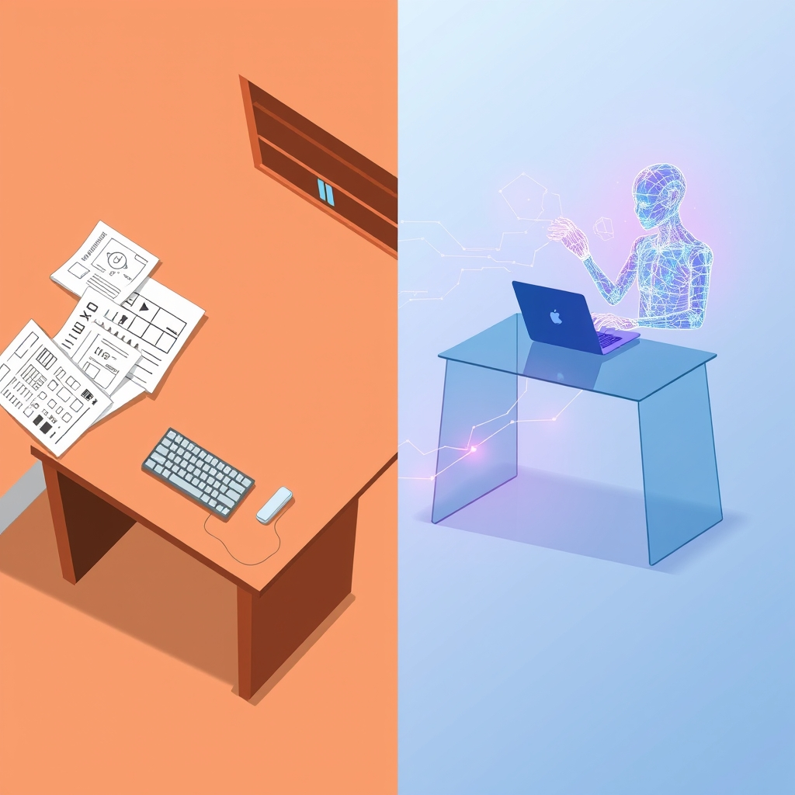

[Home](../index.md) > [Articles](./index.md)  
# [🤖👨‍💻📈⏳ Learnings from two years of using AI tools for software engineering](https://newsletter.pragmaticengineer.com/p/two-years-of-using-ai)  
  
## 🤖 AI Summary  
  
* AI coding assistants like [🤖💻🪄 GitHub Copilot for VS Code](../software/github-copilot-for-vs-code.md) are used to scaffold entire classes 📚 and auto-complete logical structures.  
* ChatGPT has evolved 📈 from a coding assistant to a sounding board for architectural discussions 🤔, ideation, and problem-solving.  
* The mental shift from viewing AI as a tool to a collaborator 🤝 is critical for exponential gains 🚀.  
* Productivity gains come from thinking in parallel 👯‍♀️ and delegating ✍️ subtasks to AI.  
* Engineers must act as managers 🧑‍💼, providing precise context and detailed feedback 📝 to the AI.  
* A key to quality is restraint 🛑 and continuous refactoring, as AI may produce over-engineered 🛠️ or complex solutions.  
* The entire work experience for engineers is evolving 🔄 weekly.  
  
## 🤔 Evaluation  
The provided content offers a perspective 🧐 from a company that has successfully adopted AI 🤖 tools in its workflow. It provides a practical, real-world account of AI integration, contrasting with more theoretical discussions about AI's impact on software engineering. The piece focuses on the practical application and the cultural shift required for success, moving beyond the simple "productivity boost" narrative. For a better understanding, it would be beneficial to explore perspectives 🗣️ from individuals or teams that have had negative experiences with AI integration, perhaps due to challenges with code quality, security vulnerabilities, or the 'black box' nature of AI outputs. It would also be valuable to explore how AI affects junior versus senior developers 🧑‍💻.  
  
## 📚 Book Recommendations  
* [🧑‍💻📈 The Pragmatic Programmer: Your Journey to Mastery](../books/the-pragmatic-programmer-your-journey-to-mastery.md) by Andrew Hunt and David Thomas: This book is relevant for its focus on practical advice for professional software developers, aligning with the "pragmatic" approach to AI 🤖 integration.  
* [📉🧪🚀 The Lean Startup: How Today's Entrepreneurs Use Continuous Innovation to Create Radically Successful Businesses](../books/the-lean-startup.md) by Eric Ries: Relevant for its emphasis on iterative development ♻️ and validated learning, which can be applied to the process of integrating and refining AI tools 🛠️ in a workflow.  
* [📜🌍⏳ Sapiens: A Brief History of Humankind](../books/sapiens-a-brief-history-of-humankind.md) by Yuval Noah Harari: A creatively related book that offers a macro perspective 🔭 on how new technologies, like AI, can fundamentally alter human societies, roles, and the nature of work 🏢.  
* [⚖️🤖 The Alignment Problem](../books/the-alignment-problem.md) by Brian Christian: 🧠 A crucial book that tackles the difficult question ❓ of how to make sure AI systems do what we actually want them to do, a concept known as "value alignment."  
* [🤖🏗️ AI Engineering: Building Applications with Foundation Models](../books/ai-engineering-building-applications-with-foundation-models.md) by Chip Huyen: 🛠️ This guide provides a hands-on look at building AI systems that go beyond a simple Jupyter notebook 📓 and are ready for real-world production environments.  
* Rise of the Robots by Martin Ford: 🏭 This book offers a thought-provoking and sometimes alarming perspective on how automation and AI could impact jobs across all sectors, not just software engineering 💻.  
* [🧑‍🤝‍🤖 Co-Intelligence: The Definitive, Bestselling Guide to Living and Working with AI](../books/co-intelligence-the-definitive-bestselling-guide-to-living-and-working-with-ai.md) by Ethan Mollick: 🤝 A practical guide that explores the new paradigm of human-AI teamwork, offering insights into how to effectively collaborate with AI tools.  
* The Hundred-Page Machine Learning Book by Andriy Burkov: 💡 A concise and accessible book that distills the core building blocks of machine learning into a digestible format, perfect for developers who want a practical foundation in the technology 📚.  
* [📱🧠 The Shallows: What the Internet Is Doing to Our Brains](../books/the-shallows-what-the-internet-is-doing-to-our-brains.md) by Nicholas Carr: 🧠 This book examines how the Internet and other digital tools are rewiring our brains 🤯 and changing the way we think, offering a critical perspective on our relationship with technology.  
* The Big Nine by Amy Webb: 👩‍💼 This book provides a detailed look at the nine tech giants 🏢 shaping the future of AI and raises concerns about the concentration of power and influence in their hands.  
* [🤖⚠️📈 Superintelligence: Paths, Dangers, Strategies](../books/superintelligence-paths-dangers-strategies.md) by Nick Bostrom: 🤖 A foundational text in the field of AI safety, this book explores the potential for an "intelligence explosion" and the existential risks posed by highly advanced artificial intelligence 🚀.  
* The Age of AI: And Our Human Future by Henry Kissinger, Eric Schmidt, and Daniel Huttenlocher: 🗣️ This book brings together three unique perspectives to discuss how AI is already changing human knowledge, identity, and geopolitical power, providing a broad and philosophical overview of its societal impact 🌍.  
* [🤖📈 The Second Machine Age: Work, Progress, and Prosperity in a Time of Brilliant Technologies](../books/the-second-machine-age-work-progress-and-prosperity-in-a-time-of-brilliant-technologies.md) by Erik Brynjolfsson and Andrew McAfee: 💻 A classic exploration of how digital technologies, including AI, are transforming the economy and the workforce, highlighting the unprecedented speed and scale of these changes 📈.  
  
## 🦋 Bluesky    
<blockquote class="bluesky-embed" data-bluesky-uri="at://did:plc:i4yli6h7x2uoj7acxunww2fc/app.bsky.feed.post/3mio4faqkkf2o" data-bluesky-cid="bafyreifyuqebopbczqus2rbiwrx6x7em53z7djspk3ycg6xdj2kj42wwpm">
🤖👨‍💻📈⏳ Learnings from two years of using AI tools for software engineering  
  
#AI Q: 🤖 AI: manager or creator?  
  
🤖 AI Collaboration | 🧑‍💻 Software Craftsmanship | 📚 Tech Recommendations  
https://bagrounds.org/articles/learnings-from-two-years-of-using-ai-tools-for-software-engineering
&mdash; <a href="https://bsky.app/profile/did:plc:i4yli6h7x2uoj7acxunww2fc?ref_src=embed">Bryan Grounds (@bagrounds.bsky.social)</a> <a href="https://bsky.app/profile/did:plc:i4yli6h7x2uoj7acxunww2fc/post/3mio4faqkkf2o?ref_src=embed">2026-04-04T11:18:05.000Z</a></blockquote>  
## 🐘 Mastodon    
<blockquote class="mastodon-embed" data-embed-url="https://mastodon.social/@bagrounds/116346158126792891/embed" style="background: #282c37; border-radius: 8px; border: 1px solid #393f4f; margin: 0; max-width: 540px; min-width: 270px; overflow: hidden; padding: 0;"> <a href="https://mastodon.social/@bagrounds/116346158126792891" target="_blank" style="align-items: center; color: #d9e1e8; display: flex; flex-direction: column; font-family: system-ui, -apple-system, BlinkMacSystemFont, 'Segoe UI', Oxygen, Ubuntu, Cantarell, 'Fira Sans', 'Droid Sans', 'Helvetica Neue', Roboto, sans-serif; font-size: 14px; justify-content: center; letter-spacing: 0.25px; line-height: 20px; padding: 24px; text-decoration: none;"> <svg xmlns="http://www.w3.org/2000/svg" xmlns:xlink="http://www.w3.org/1999/xlink" width="32" height="32" viewBox="0 0 79 75"><path d="M63 45.3v-20c0-4.1-1-7.3-3.2-9.7-2.1-2.4-5-3.7-8.5-3.7-4.1 0-7.2 1.6-9.3 4.7l-2 3.3-2-3.3c-2-3.1-5.1-4.7-9.2-4.7-3.5 0-6.4 1.3-8.6 3.7-2.1 2.4-3.1 5.6-3.1 9.7v20h8V25.9c0-4.1 1.7-6.2 5.2-6.2 3.8 0 5.8 2.5 5.8 7.4V37.7H44V27.1c0-4.9 1.9-7.4 5.8-7.4 3.5 0 5.2 2.1 5.2 6.2V45.3h8ZM74.7 16.6c.6 6 .1 15.7.1 17.3 0 .5-.1 4.8-.1 5.3-.7 11.5-8 16-15.6 17.5-.1 0-.2 0-.3 0-4.9 1-10 1.2-14.9 1.4-1.2 0-2.4 0-3.6 0-4.8 0-9.7-.6-14.4-1.7-.1 0-.1 0-.1 0s-.1 0-.1 0 0 .1 0 .1 0 0 0 0c.1 1.6.4 3.1 1 4.5.6 1.7 2.9 5.7 11.4 5.7 5 0 9.9-.6 14.8-1.7 0 0 0 0 0 0 .1 0 .1 0 .1 0 0 .1 0 .1 0 .1.1 0 .1 0 .1.1v5.6s0 .1-.1.1c0 0 0 0 0 .1-1.6 1.1-3.7 1.7-5.6 2.3-.8.3-1.6.5-2.4.7-7.5 1.7-15.4 1.3-22.7-1.2-6.8-2.4-13.8-8.2-15.5-15.2-.9-3.8-1.6-7.6-1.9-11.5-.6-5.8-.6-11.7-.8-17.5C3.9 24.5 4 20 4.9 16 6.7 7.9 14.1 2.2 22.3 1c1.4-.2 4.1-1 16.5-1h.1C51.4 0 56.7.8 58.1 1c8.4 1.2 15.5 7.5 16.6 15.6Z" fill="currentColor"/></svg> 
Post by @bagrounds@mastodon.social
 
View on Mastodon
 </a> </blockquote>   
