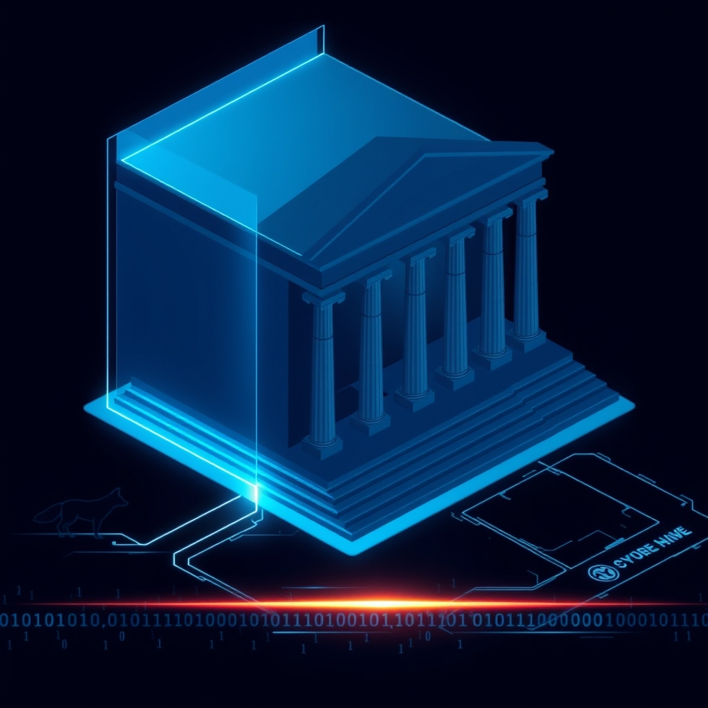

[Home](../index.md) > [Articles](./index.md)  
# [🏛️🗞️🦊 More than 50 House Democrats demand answers after whistleblower report on DOGE](https://www.npr.org/2025/04/24/nx-s1-5375118/congress-doge-nlrb-whistleblower)  
  
## 🤖 AI Summary  
**🗳️ Democratic Lawmakers Demand NLRB Investigate DOGE Data Breach Allegations**  
  
• 📜 Over fifty Democratic lawmakers sent a letter ✉️ to the National Labor Relations Board (NLRB) demanding answers ❓ regarding a whistleblower report 📣 alleging that DOGE, led by Elon Musk 🚀, may have accessed sensitive worker data 💻.  
  
• 🕵️ The whistleblower, an NLRB IT employee 🧑‍💻, claims that a large amount of data 💾 was removed 🗑️ around the time security controls 🔒 were disabled 🔓, raising concerns ⚠️ about potential exposure of sensitive information 🚨.  
  
• 🤔 Lawmakers express concern 😟 over the potential conflict of interest ⚖️, given Musk's ongoing legal battles 👨‍⚖️ with the NLRB and his companies' involvement 🏢 in cases before the board 📰.  
  
• 🚫 The NLRB denies 🙅 granting DOGE access to its systems or receiving an official request 📝, while the whistleblower argues 🗣️ that further investigation 🔎 is warranted.  
  
• ➡️ This incident follows numerous court cases 👨‍⚖️ alleging DOGE's mishandling of sensitive government data 🏢 across various agencies 🏛️, highlighting broader concerns 🌍 about data security 🛡️.  
  
## 📚 Book Recommendations  
* **"Data and Goliath: The Hidden Battles to Collect Your Data and Control Your World" by Bruce Schneier:**  
    * This book provides a comprehensive overview of how data is collected and used in the modern world, raising important questions about privacy and surveillance.  
* **"The Cybersecurity Handbook" by Uri Litvitz:**  
    * This offers practical guidance on cybersecurity best practices, which is highly relevant to the concerns raised in the whistleblower complaint.  
* **"Permanent Record" by Edward Snowden:**  
    * While focused on a specific case, this book provides insights into the complexities of government surveillance and data handling, which are central to the current situation.  
* **[🤥😈 Liars and Outliers: Enabling the Trust That Society Needs to Thrive](../books/liars-and-outliers.md) by Bruce Schneier:**  
    * This book goes into the different security models used in society, and how those models can be broken. This is very relevant to data security, and governmental security.  
* **"Zero Trust Security: Building Networks That Defend Themselves" by Jason Garbis, and Jerry Chapman:**  
    * This book goes into the zero trust security model, which is a modern security model that focuses on verifying every user and device, regardless of if they are in the organizations network or not. This is a very important concept in modern cyber security, and very relevant to the security concerns raised in this article.