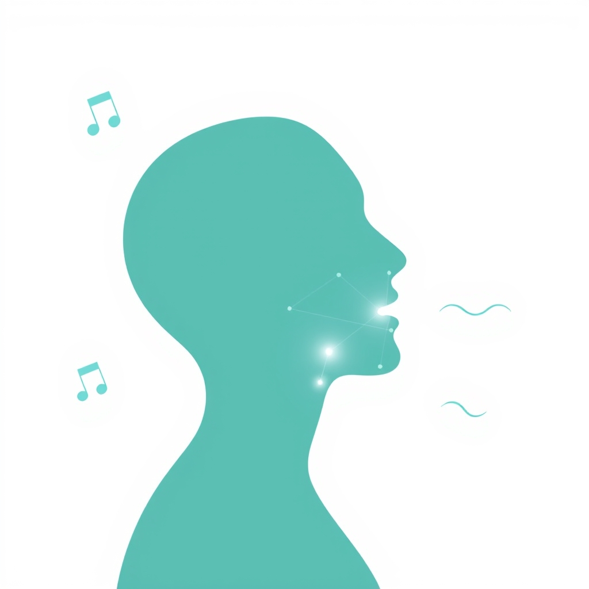

[Home](../index.md) > [Articles](./index.md)  
# [😴👄🧘 Mouth And Throat Exercises to Help Stop Snoring and Improve OSA](https://www.sleepfoundation.org/snoring/mouth-exercises-to-stop-snoring)  
  
  
## 🤖 AI Summary  
  
* 😴👄🧘 Mouth and throat exercises (oropharyngeal exercises) can help reduce snoring and improve mild to moderate obstructive sleep apnea (OSA) by strengthening airway muscles.  
* 🏋️ These exercises work by strengthening the tongue, soft palate, and throat muscles and promoting nasal breathing.  
* ⏰ To see benefits, practice these exercises two to three times a day for about three months.  
* ⚠️ These exercises are not a standalone treatment for sleep apnea and should be used alongside medical guidance and other therapies.  
  
## 🦅 Key Exercises  
  
### 👅 Tongue Exercises  
* 👅 **Tongue Slide**: Place tip against back of top front teeth, slide backward along roof of mouth. Repeat 5-10 times.  
* 👅 **Tongue Stretch**: Stick out tongue as far as possible, try to touch chin. Hold 10-15 seconds. Repeat 5 times.  
* 👅 **Tongue Push Up**: Press tongue upward against roof of mouth, hold 10 seconds. Repeat 5 times.  
* 👅 **Tongue Push Down**: Push back of tongue flat against floor of mouth, hold 10 seconds. Repeat 5 times.  
  
### 😮 Face Exercises  
* 😮 **Cheek Hook**: Pull right cheek outward with finger, then use facial muscles to pull back inward. Repeat 10 times each side.  
* 😮 **Jaw Stretch**: Pursed lips, then open mouth wide. Repeat 10 times.  
  
### 🫁 Other Exercises  
* 🫁 **Nasal Breathing**: With mouth closed, inhale through nose. Close one nostril, breathe out. Alternate 10 times.  
* 🔤 **Vowel Sounds**: Repeat A, E, I, O, U sounds, stretching and rapidly repeating. Helps tone throat muscles.  
* 🎤 **Singing**: Activates multiple muscles in mouth and throat; focused singing training may reduce snoring.  
  
## 📊 How They Help  
  
Mouth exercises are also called "myofunctional therapy." Researchers have found that doing repetitive oropharyngeal exercises while awake can help keep tissue from becoming excessively floppy and vibrating during sleep.  
  
### ⏱️ How Often  
* ⏰ Do exercises for at least 10 minutes per day for three months  
* 🔄 Most people perform exercises two to three times per day  
* 🧠 Like any workout, consistency is key—don't expect overnight results  
  
## 🩺 When to See a Doctor  
  
Snoring can be a sign of obstructive sleep apnea. See a doctor if you experience:  
* 😮‍💨 Gasping, choking, or snorting during sleep  
* 😴 Notable daytime sleepiness or fatigue  
* 🤕 Morning headaches  
* 💓 High blood pressure  
* ⚖️ Recent weight gain  
  
## 🦋 Bluesky    
<blockquote class="bluesky-embed" data-bluesky-uri="at://did:plc:i4yli6h7x2uoj7acxunww2fc/app.bsky.feed.post/3mnqq6prxks2n" data-bluesky-cid="bafyreifoav7txunbelzgq5uegc4hv25gst6wfnavvi2kkbw4tc3ftwwqnq">
😴👄🧘 Mouth And Throat Exercises to Help Stop Snoring and Improve OSA  
  
#AI Q: 😴 Would you try daily mouth exercises to stop snoring?  
  
🛌 Sleep Hygiene | 👅 Myofunctional Therapy | 🌬️ Airway Health |  
https://bagrounds.org/articles/mouth-and-throat-exercises-to-help-stop-snoring-and-improve-osa
&mdash; <a href="https://bsky.app/profile/did:plc:i4yli6h7x2uoj7acxunww2fc?ref_src=embed">Bryan Grounds (@bagrounds.bsky.social)</a> <a href="https://bsky.app/profile/did:plc:i4yli6h7x2uoj7acxunww2fc/post/3mnqq6prxks2n?ref_src=embed">2026-06-08T03:23:38.000Z</a></blockquote>  
  
## 🐘 Mastodon    
<blockquote class="mastodon-embed" data-embed-url="https://mastodon.social/@bagrounds/116718544408864583/embed" style="background: #282c37; border-radius: 8px; border: 1px solid #393f4f; margin: 0; max-width: 540px; min-width: 270px; overflow: hidden; padding: 0;"> <a href="https://mastodon.social/@bagrounds/116718544408864583" target="_blank" style="align-items: center; color: #d9e1e8; display: flex; flex-direction: column; font-family: system-ui, -apple-system, BlinkMacSystemFont, 'Segoe UI', Oxygen, Ubuntu, Cantarell, 'Fira Sans', 'Droid Sans', 'Helvetica Neue', Roboto, sans-serif; font-size: 14px; justify-content: center; letter-spacing: 0.25px; line-height: 20px; padding: 24px; text-decoration: none;"> <svg xmlns="http://www.w3.org/2000/svg" xmlns:xlink="http://www.w3.org/1999/xlink" width="32" height="32" viewBox="0 0 79 75"><path d="M63 45.3v-20c0-4.1-1-7.3-3.2-9.7-2.1-2.4-5-3.7-8.5-3.7-4.1 0-7.2 1.6-9.3 4.7l-2 3.3-2-3.3c-2-3.1-5.1-4.7-9.2-4.7-3.5 0-6.4 1.3-8.6 3.7-2.1 2.4-3.1 5.6-3.1 9.7v20h8V25.9c0-4.1 1.7-6.2 5.2-6.2 3.8 0 5.8 2.5 5.8 7.4V37.7H44V27.1c0-4.9 1.9-7.4 5.8-7.4 3.5 0 5.2 2.1 5.2 6.2V45.3h8ZM74.7 16.6c.6 6 .1 15.7.1 17.3 0 .5-.1 4.8-.1 5.3-.7 11.5-8 16-15.6 17.5-.1 0-.2 0-.3 0-4.9 1-10 1.2-14.9 1.4-1.2 0-2.4 0-3.6 0-4.8 0-9.7-.6-14.4-1.7-.1 0-.1 0-.1 0s-.1 0-.1 0 0 .1 0 .1 0 0 0 0c.1 1.6.4 3.1 1 4.5.6 1.7 2.9 5.7 11.4 5.7 5 0 9.9-.6 14.8-1.7 0 0 0 0 0 0 .1 0 .1 0 .1 0 0 .1 0 .1 0 .1.1 0 .1 0 .1.1v5.6s0 .1-.1.1c0 0 0 0 0 .1-1.6 1.1-3.7 1.7-5.6 2.3-.8.3-1.6.5-2.4.7-7.5 1.7-15.4 1.3-22.7-1.2-6.8-2.4-13.8-8.2-15.5-15.2-.9-3.8-1.6-7.6-1.9-11.5-.6-5.8-.6-11.7-.8-17.5C3.9 24.5 4 20 4.9 16 6.7 7.9 14.1 2.2 22.3 1c1.4-.2 4.1-1 16.5-1h.1C51.4 0 56.7.8 58.1 1c8.4 1.2 15.5 7.5 16.6 15.6Z" fill="currentColor"/></svg> 
Post by @bagrounds@mastodon.social
 
View on Mastodon
 </a> </blockquote> 