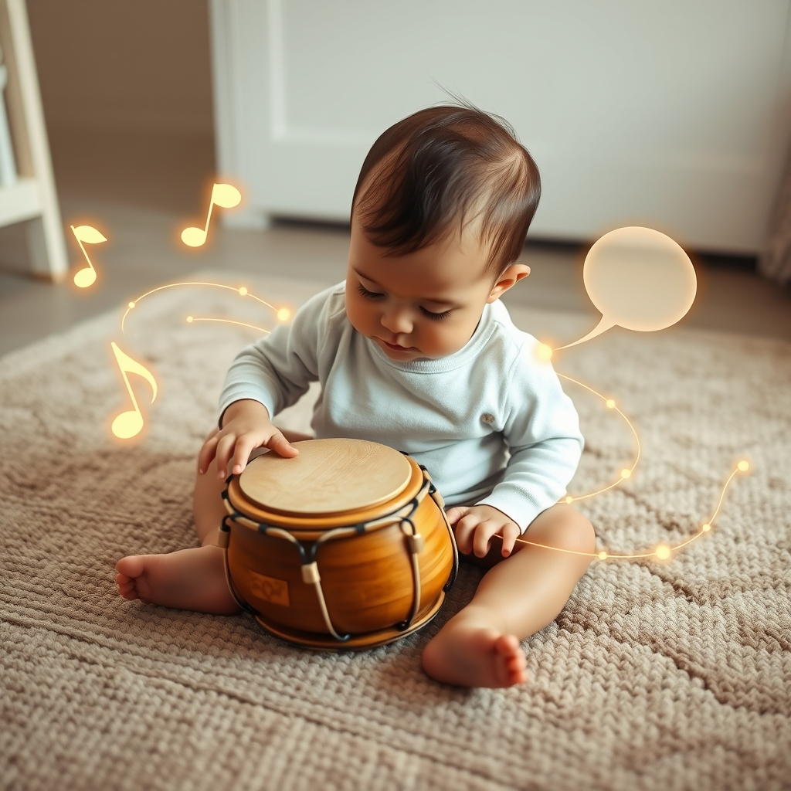

[Home](../index.md) > [Articles](./index.md)  
# [🎶👶🧠🗣️ Musical intervention enhances infants’ neural processing of temporal structure in music and speech](https://www.pnas.org/doi/epdf/10.1073/pnas.1603984113)  
  
## 🤖 AI Summary  
### 💬 [ChatGPT](https://chat.com) Prompt  
> Summarize the paper [Musical intervention enhances infants’ neural processing of temporal structure in music and speech](https://www.pnas.org/doi/epdf/10.1073/pnas.1603984113). Emphasize practical takeaways for new parents. Provide references to high quality resources on related topics. Format your response as markdown with inline links, starting at H4 heading.  
  
### Response  
#### Summary of the Study  
The study by Zhao and Kuhl (2016) examined whether a short-term, structured music intervention could enhance the neural processing of temporal structure in both music and speech for 9‑month‑old infants. In this randomized controlled experiment, one group of infants participated in 12 interactive, 15‑minute sessions over a month. During these sessions, infants experienced music in triple meter (similar to a waltz) while engaging in rhythmic body movements—such as tapping, bouncing, and playing simple percussive instruments—with their caregivers. A control group, meanwhile, enjoyed similar social play without any musical component.  
  
Using magnetoencephalography (MEG), the researchers measured the infants’ brain responses via the mismatch response (MMR) when the expected rhythmic pattern was disrupted. They found that infants in the music intervention group showed significantly larger neural responses to these disruptions in both the auditory (temporal) cortex and the prefrontal regions, which are involved in higher-level predictive processing. Importantly, these enhanced responses were also evident when the infants listened to foreign speech sounds, suggesting that early musical engagement can generalize to improve the processing of temporal patterns in language.  
  
#### Practical Takeaways for New Parents  
- **Engage in Interactive Musical Play:** Incorporating regular, short sessions of musical play—such as singing rhythmic songs, clapping, or tapping simple instruments—can help support your baby's developing ability to detect and predict patterns in sound.    
- **Enhance Social Bonding:** Musical activities provide a rich, interactive environment that not only stimulates cognitive development but also strengthens the emotional bond between you and your baby.    
- **Integrate Music into Daily Routines:** You don’t need formal classes; try to integrate music into daily activities (e.g., during playtime, while rocking, or at bedtime) to create a stimulating auditory environment.  
  
#### Additional Resources and References  
- Read the [original study in the Proceedings of the National Academy of Sciences](https://www.pnas.org/doi/epdf/10.1073/pnas.1603984113) for full details.    
- For a more accessible summary, check out this [ScienceDaily article](https://www.sciencedaily.com/releases/2016/04/160425161148.htm) on how music improves infant brain responses.    
- Learn more about how musical training can support language development in infants by reading the [Parenting Science article](https://parentingscience.com/can-musical-training-help-babies-learn-language/).  
