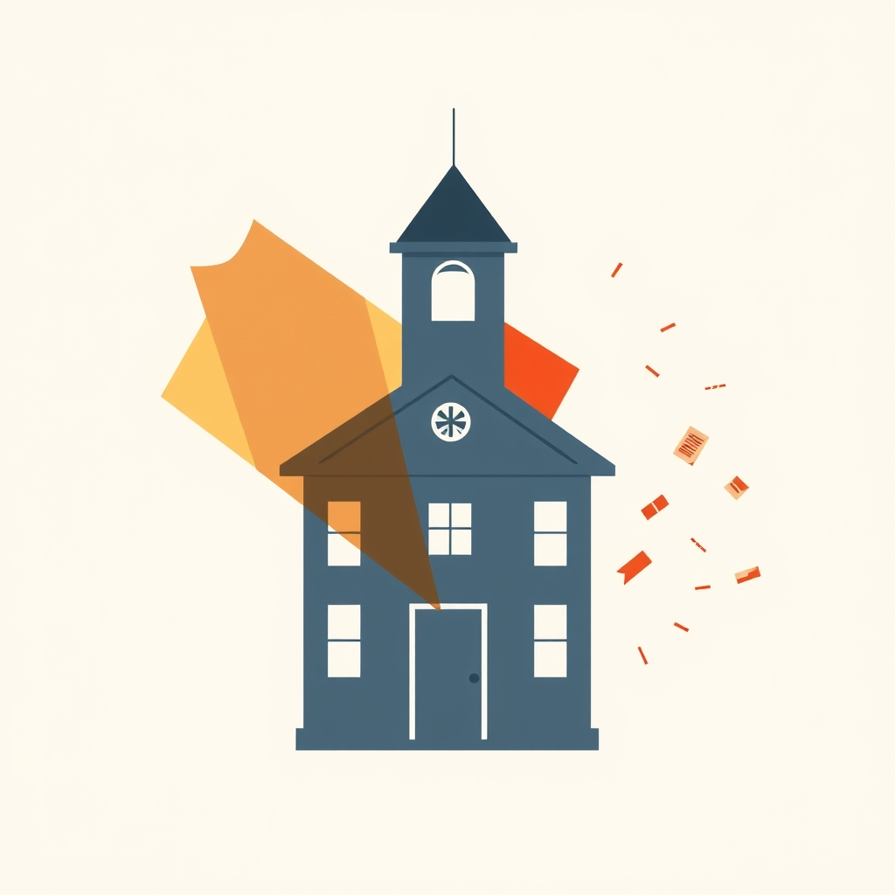

[Home](../index.md) > [Articles](./index.md)  
# [🚫🏫📉⚠️ Project 2025 and education: A lot of bad ideas, some more actionable than others](https://www.brookings.edu/articles/project-2025-and-education-a-lot-of-bad-ideas-some-more-actionable-than-others)  
  
  
## 🤖 AI Summary  
Project 2025's education proposals represent a significant and comprehensive shift in the landscape of American education 🇺🇸📚. To provide a thorough overview, here's a breakdown of the key elements:  
  
**Core Ideological Shifts:**  
* **Dismantling the Federal Role:** 🏛️📉  
    * A central tenet is a dramatic reduction in the federal government's involvement in education. This includes plans to significantly curtail the power and scope of the U.S. Department of Education, aiming to return greater control to state and local levels. 🏘️➡️  
    * This shift reflects a belief in local control and a distrust of federal oversight in education. 🧐✋  
* **Emphasis on "Parental Rights":** 👨‍👩‍👧‍👦📢  
    * Project 2025 prioritizes parental authority in education, advocating for increased parental control over curriculum, instructional materials, and school policies. 📝👀  
    * This includes the right to opt children out of lessons deemed objectionable, and increased transparency regarding curriculum content. 🚫📖  
* **Combating "Woke" Ideology:** ⚔️💭  
    * A key focus is the removal of what proponents consider "woke" ideology from schools. This encompasses opposition to critical race theory, certain aspects of gender ideology, and some forms of social-emotional learning. 🛑🌈  
    * This reflects a desire to promote a more traditional and conservative approach to education. 🏛️➡️  
  
**Specific Policy Proposals:**  
* **Expanding School Choice:** 🏫➡️🚪  
    * Project 2025 strongly advocates for the expansion of school choice programs, including voucher programs, charter schools, and education savings accounts (ESAs). 💰🏫  
    * This aims to provide parents with greater flexibility in choosing their children's educational settings. 🔄🏫  
* **Changes to Federal Funding:** 💸📉  
    * Proposals include significant changes to federal education funding, such as:  
        * Potential elimination or restructuring of Title I funding, which supports schools with high concentrations of low-income students. 📉🏫  
        * Shifting towards block grants, which provide states with greater flexibility in how they allocate federal funds but with less federal oversight. 📦➡️  
        * Elimination of programs such as Head Start. 👶📉  
* **Civil Rights and Protections:** ⚖️⏪  
    * The agenda aims to roll back certain civil rights protections, particularly those related to LGBTQ+ students. 🏳️‍🌈🚫  
    * This includes potential changes to Title IX regulations and efforts to limit the enforcement of civil rights laws in educational settings. 📜🛑  
* **Curriculum and Censorship:** 📚🚫  
    * Project 2025 promotes increased scrutiny and potential censorship of curriculum materials, particularly those related to race, gender, and sexuality. 🔍🚫  
    * This could lead to increased book bans and restrictions on classroom discussions. 🤐📖  
* **Higher education changes:** 🎓🔄  
    * Changes to student loan programs, with aims to end loan forgiveness programs. 💸🛑  
    * Changes to the way that universities handle diversity, equity and inclusion programs. 🤝📉  
  
**Potential Implications:**  
* Concerns exist about the potential for increased segregation and inequality in education. 🏘️📉  
* Critics argue that the proposals could weaken public education and reduce access to quality education for disadvantaged students. 📉🏫  
* The emphasis on parental rights could lead to increased conflicts between parents and schools. 💥🤝  
* The rollback of civil rights protections could create a hostile environment for LGBTQ+ students. 🏳️‍🌈💔  
  
It's important to note that the implementation of these proposals would have far-reaching consequences for the American education system. 🇺🇸⚠️  
  
## 🦋 Bluesky    
<blockquote class="bluesky-embed" data-bluesky-uri="at://did:plc:i4yli6h7x2uoj7acxunww2fc/app.bsky.feed.post/3mq2hwetcoa24" data-bluesky-cid="bafyreiavyqg4qmxoff5accco4zpb6kiyfsjqc7hons2bdsxenzcu3cq4t4">
🚫🏫📉⚠️ Project 2025 and education: A lot of bad ideas, some more actionable than others  
  
#AI Q: 🏫 Should schools be local?  
  
🏛️ Federal Governance | 🏫 School Choice | ⚖️ Civil Rights | 👨‍  
https://bagrounds.org/articles/project-2025-and-education-a-lot-of-bad-ideas-some-more-actionable-than-others
&mdash; <a href="https://bsky.app/profile/did:plc:i4yli6h7x2uoj7acxunww2fc?ref_src=embed">Bryan Grounds (@bagrounds.bsky.social)</a> <a href="https://bsky.app/profile/did:plc:i4yli6h7x2uoj7acxunww2fc/post/3mq2hwetcoa24?ref_src=embed">2026-07-07T11:12:48.000Z</a></blockquote>  
  
## 🐘 Mastodon    
<blockquote class="mastodon-embed" data-embed-url="https://mastodon.social/@bagrounds/116892673282883809/embed" style="background: #282c37; border-radius: 8px; border: 1px solid #393f4f; margin: 0; max-width: 540px; min-width: 270px; overflow: hidden; padding: 0;"> <a href="https://mastodon.social/@bagrounds/116892673282883809" target="_blank" style="align-items: center; color: #d9e1e8; display: flex; flex-direction: column; font-family: system-ui, -apple-system, BlinkMacSystemFont, 'Segoe UI', Oxygen, Ubuntu, Cantarell, 'Fira Sans', 'Droid Sans', 'Helvetica Neue', Roboto, sans-serif; font-size: 14px; justify-content: center; letter-spacing: 0.25px; line-height: 20px; padding: 24px; text-decoration: none;"> <svg xmlns="http://www.w3.org/2000/svg" xmlns:xlink="http://www.w3.org/1999/xlink" width="32" height="32" viewBox="0 0 79 75"><path d="M63 45.3v-20c0-4.1-1-7.3-3.2-9.7-2.1-2.4-5-3.7-8.5-3.7-4.1 0-7.2 1.6-9.3 4.7l-2 3.3-2-3.3c-2-3.1-5.1-4.7-9.2-4.7-3.5 0-6.4 1.3-8.6 3.7-2.1 2.4-3.1 5.6-3.1 9.7v20h8V25.9c0-4.1 1.7-6.2 5.2-6.2 3.8 0 5.8 2.5 5.8 7.4V37.7H44V27.1c0-4.9 1.9-7.4 5.8-7.4 3.5 0 5.2 2.1 5.2 6.2V45.3h8ZM74.7 16.6c.6 6 .1 15.7.1 17.3 0 .5-.1 4.8-.1 5.3-.7 11.5-8 16-15.6 17.5-.1 0-.2 0-.3 0-4.9 1-10 1.2-14.9 1.4-1.2 0-2.4 0-3.6 0-4.8 0-9.7-.6-14.4-1.7-.1 0-.1 0-.1 0s-.1 0-.1 0 0 .1 0 .1 0 0 0 0c.1 1.6.4 3.1 1 4.5.6 1.7 2.9 5.7 11.4 5.7 5 0 9.9-.6 14.8-1.7 0 0 0 0 0 0 .1 0 .1 0 .1 0 0 .1 0 .1 0 .1.1 0 .1 0 .1.1v5.6s0 .1-.1.1c0 0 0 0 0 .1-1.6 1.1-3.7 1.7-5.6 2.3-.8.3-1.6.5-2.4.7-7.5 1.7-15.4 1.3-22.7-1.2-6.8-2.4-13.8-8.2-15.5-15.2-.9-3.8-1.6-7.6-1.9-11.5-.6-5.8-.6-11.7-.8-17.5C3.9 24.5 4 20 4.9 16 6.7 7.9 14.1 2.2 22.3 1c1.4-.2 4.1-1 16.5-1h.1C51.4 0 56.7.8 58.1 1c8.4 1.2 15.5 7.5 16.6 15.6Z" fill="currentColor"/></svg> 
Post by @bagrounds@mastodon.social
 
View on Mastodon
 </a> </blockquote> 