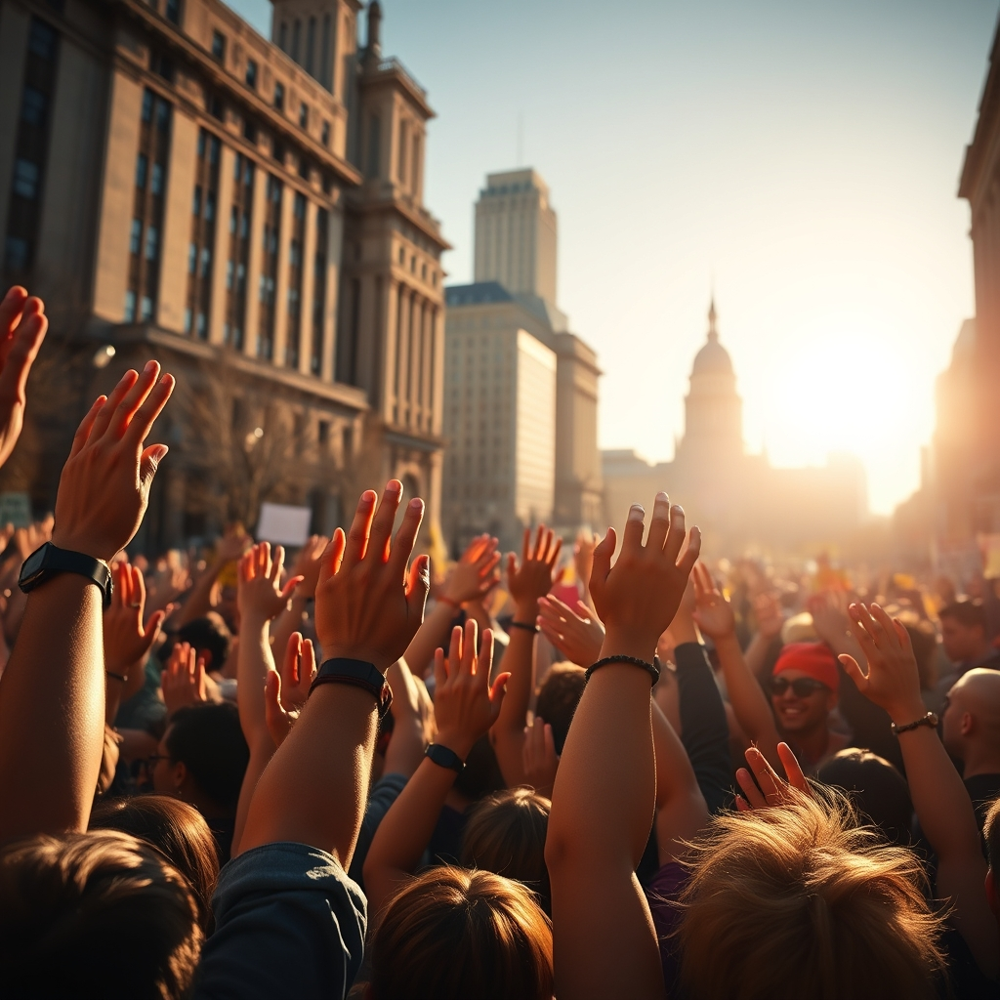

[Home](../index.md) > [Articles](./index.md)  
# ✊🏾✊🏽✊🏿 [Protesters unite against Trump in hundreds of rallies across the U.S.](https://www.npr.org/2025/04/19/nx-s1-5369483/anti-trump-protests-50501-tesla-takedown)  
  
## 🤖 AI Summary  
### 📢 50501 Movement's Nationwide Protests Against Trump Administration  
  
• ✊ The 50501 Movement organized a day of action on Saturday with 💯 hundreds of protests 🇺🇸 across the U.S. against the 🏛️ Trump administration's policies.  
  
• 🗣️ Demonstrations focused on various concerns, including 🛂 deportations, ✂️ funding cuts to 🍎 education, and 📜 executive overreach, with 📣 participants emphasizing the need for 💪 continued resistance.  
  
• 🌐 The decentralized movement, encompassing various groups like the ⚡ 'Tesla Takedown' campaign, unites under principles of 🗳️ pro-democracy, 📜 constitutional preservation, 🚫 opposition to executive overreach, and 🕊️ non-violence.  
  
• ❤️ Beyond protests, the movement encourages 🤝 community-focused actions such as 🫂 mutual aid and 🍎 food drives to strengthen communities against the perceived ⚔️ assaults on democracy.