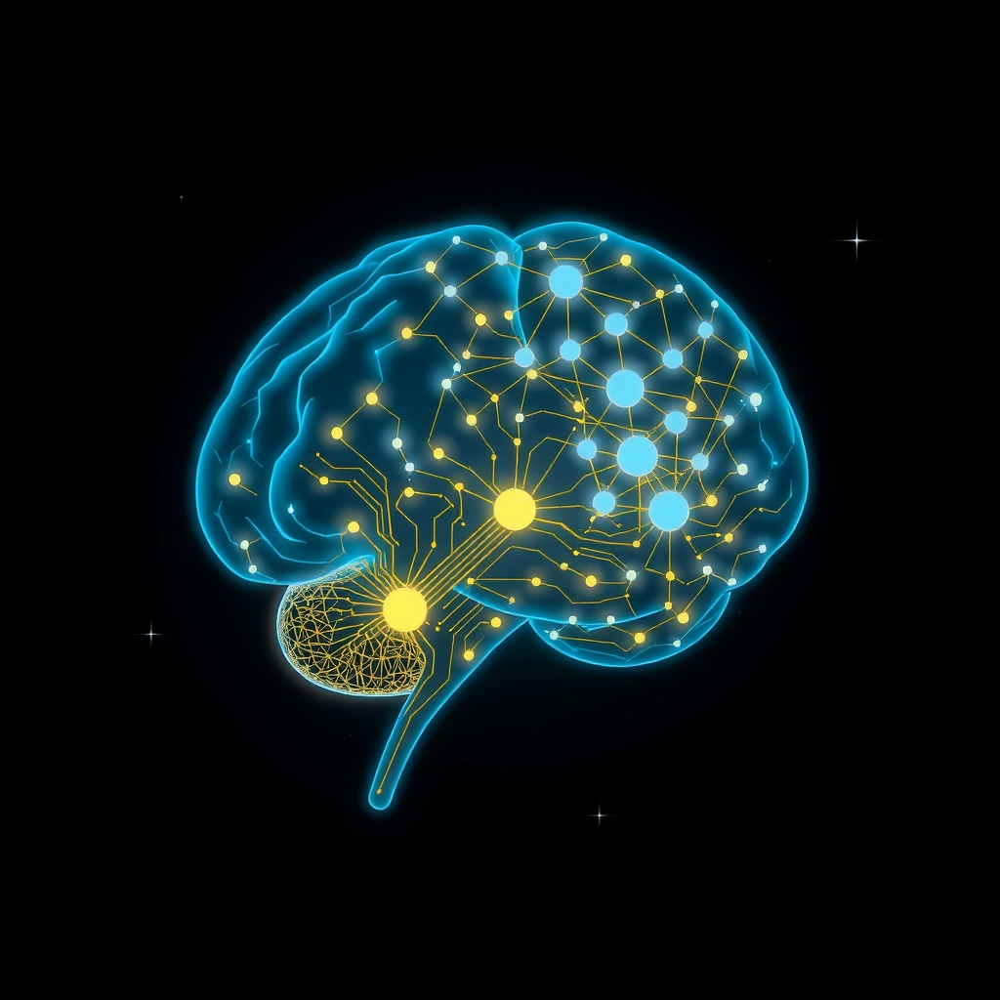

[Home](../index.md) > [Articles](./index.md) | [🧠🪜⏱️📈 Hierarchical gradients of multiple timescales in the mammalian forebrain](./hierarchical-gradients-of-multiple-timescales-in-the-mammalian-forebrain.md)  
# [🧠🤖📈 Scientists just developed a new AI modeled on the human brain — it's outperforming LLMs like ChatGPT at reasoning tasks](https://www.livescience.com/technology/artificial-intelligence/scientists-just-developed-an-ai-modeled-on-the-human-brain-and-its-outperforming-llms-like-chatgpt-at-reasoning-tasks)  
  
## 🤖 AI Summary  
  
🧠 A new AI model, the **hierarchical reasoning model (HRM)**, has been developed to mimic the human brain's 🧠 processing.  
* 📈 The model 🤖 consists of a high-level module for slow, abstract planning and a low-level module for rapid, detailed computations.  
* 💯 HRM's performance on the **ARC-AGI-1 benchmark** was 40.3%, outperforming OpenAI's o3-mini-high (34.5%) and Anthropic's Claude 3.7 (21.2%).  
* 🚀 It also showed near-perfect performance on complex tasks like **Sudoku** and maze navigation.  
* 📉 The model is more efficient, requiring only **27 million parameters** and 1,000 training examples compared to the billions of parameters in large language models.  
  
## 🤔 Evaluation  
  
The ⚖️ HRM presents a compelling alternative to current **large language models (LLMs)**. While LLMs excel at generating text and general knowledge tasks through massive data consumption, HRM demonstrates that a different architectural approach, inspired by **cognitive science**, can lead to superior performance on specific, logic-based reasoning tasks. This highlights a fundamental difference in how these models "think." The HRM's efficiency and reasoning ability suggest that future AI development may not be solely a race for more parameters but could also involve more sophisticated, brain-inspired architectures. 🤔 Further topics to explore include how to scale this hierarchical approach to handle the massive datasets LLMs use, and whether a hybrid model could combine the strengths of both approaches.  
  
## 📚 Book Recommendations  
  
### 🧠 Similar  
  
- **[🧠🔄 Livewired: The Inside Story of the Ever-Changing Brain](../books/livewired-the-inside-story-of-the-ever-changing-brain.md)** by David Eagleman: This book explores the brain's 🧠 constant state of change and adaptability, which offers a great parallel to the new, adaptable AI models being developed.  
  
- **[🧠🧠🧠🧠 A Thousand Brains: A New Theory of Intelligence](../books/a-thousand-brains.md)** by Jeff Hawkins: This book proposes that intelligence comes from the brain building a predictive "world model," a view highly relevant to the new AI model's hierarchical design.  
  
- **[🧠🔄🏆 The Brain That Changes Itself: Stories of Personal Triumph from the Frontiers of Brain Science](../books/the-brain-that-changes-itself.md)** by Norman Doidge: It provides a fascinating look into the concept of **neuroplasticity**, showing how the brain can rewire itself. This directly relates to the idea of creating AI models that can adapt and "learn" in new, dynamic ways.  
  
### ⚖️ Contrasting  
  
- **The Master Algorithm** by Pedro Domingos: This book compares and contrasts the five major schools of machine learning, giving a broad perspective on different AI approaches and their fundamental differences.  
  
- **An Artificial History of Natural Intelligence: Thinking with Machines from Descartes to the Digital Age** by David W. Bates: This book offers a philosophical and historical perspective, arguing that our understanding of the human mind is shaped by the machines we create.  
  
- **The Emperor's New Mind** by Roger Penrose: A classic in the field, this book argues that human consciousness cannot be replicated by any known computer algorithm, providing a stark contrast to the claims of brain-like AI.  
  
### ✨ Creatively Related  
  
- **[⚖️🤖 The Alignment Problem](../books/the-alignment-problem.md)** by Brian Christian: This book tackles the critical question of ensuring AI's goals align with human values, a vital topic as these models become more capable and integrated into society.  
  
- **[🌊🤖🤔 The Coming Wave: Technology, Power, and the 21st Century's Greatest Dilemma](../books/the-coming-wave-technology-power-and-the-21st-centurys-greatest-dilemma.md)** by Mustafa Suleyman: An insider's look at the immense power and societal risks of AI, this book puts new model developments into a real-world, geopolitical context.  
  
- **Grokking Deep Learning** by Andrew W. Trask: This is a technical but accessible guide on building neural networks, providing a foundational understanding of the underlying principles behind brain-inspired models. It's a great "creatively related" choice as it teaches the reader to build the concepts themselves.  
  
## 🦋 Bluesky    
<blockquote class="bluesky-embed" data-bluesky-uri="at://did:plc:i4yli6h7x2uoj7acxunww2fc/app.bsky.feed.post/3mt4kgizwwm2p" data-bluesky-cid="bafyreig7js5rfdrdjbi6ebabr3wmlrkokd5pckchirn4rltlgojri5mjge">
#AI Q: 🧠 Can machines outthink us?  
https://bagrounds.org/articles/scientists-just-developed-a-new-ai-modeled-on-the-human-brain-its-outperforming-llms-like-chatgpt-at-reasoning-tasks
&mdash; <a href="https://bsky.app/profile/did:plc:i4yli6h7x2uoj7acxunww2fc?ref_src=embed">Bryan Grounds (@bagrounds.bsky.social)</a> <a href="https://bsky.app/profile/did:plc:i4yli6h7x2uoj7acxunww2fc/post/3mt4kgizwwm2p?ref_src=embed">2026-08-15T11:18:32.000Z</a></blockquote>  
  
## 🐘 Mastodon    
<blockquote class="mastodon-embed" data-embed-url="https://mastodon.social/@bagrounds/117107764316303727/embed" style="background: #282c37; border-radius: 8px; border: 1px solid #393f4f; margin: 0; max-width: 540px; min-width: 270px; overflow: hidden; padding: 0;"> <a href="https://mastodon.social/@bagrounds/117107764316303727" target="_blank" style="align-items: center; color: #d9e1e8; display: flex; flex-direction: column; font-family: system-ui, -apple-system, BlinkMacSystemFont, 'Segoe UI', Oxygen, Ubuntu, Cantarell, 'Fira Sans', 'Droid Sans', 'Helvetica Neue', Roboto, sans-serif; font-size: 14px; justify-content: center; letter-spacing: 0.25px; line-height: 20px; padding: 24px; text-decoration: none;"> <svg xmlns="http://www.w3.org/2000/svg" xmlns:xlink="http://www.w3.org/1999/xlink" width="32" height="32" viewBox="0 0 79 75"><path d="M63 45.3v-20c0-4.1-1-7.3-3.2-9.7-2.1-2.4-5-3.7-8.5-3.7-4.1 0-7.2 1.6-9.3 4.7l-2 3.3-2-3.3c-2-3.1-5.1-4.7-9.2-4.7-3.5 0-6.4 1.3-8.6 3.7-2.1 2.4-3.1 5.6-3.1 9.7v20h8V25.9c0-4.1 1.7-6.2 5.2-6.2 3.8 0 5.8 2.5 5.8 7.4V37.7H44V27.1c0-4.9 1.9-7.4 5.8-7.4 3.5 0 5.2 2.1 5.2 6.2V45.3h8ZM74.7 16.6c.6 6 .1 15.7.1 17.3 0 .5-.1 4.8-.1 5.3-.7 11.5-8 16-15.6 17.5-.1 0-.2 0-.3 0-4.9 1-10 1.2-14.9 1.4-1.2 0-2.4 0-3.6 0-4.8 0-9.7-.6-14.4-1.7-.1 0-.1 0-.1 0s-.1 0-.1 0 0 .1 0 .1 0 0 0 0c.1 1.6.4 3.1 1 4.5.6 1.7 2.9 5.7 11.4 5.7 5 0 9.9-.6 14.8-1.7 0 0 0 0 0 0 .1 0 .1 0 .1 0 0 .1 0 .1 0 .1.1 0 .1 0 .1.1v5.6s0 .1-.1.1c0 0 0 0 0 .1-1.6 1.1-3.7 1.7-5.6 2.3-.8.3-1.6.5-2.4.7-7.5 1.7-15.4 1.3-22.7-1.2-6.8-2.4-13.8-8.2-15.5-15.2-.9-3.8-1.6-7.6-1.9-11.5-.6-5.8-.6-11.7-.8-17.5C3.9 24.5 4 20 4.9 16 6.7 7.9 14.1 2.2 22.3 1c1.4-.2 4.1-1 16.5-1h.1C51.4 0 56.7.8 58.1 1c8.4 1.2 15.5 7.5 16.6 15.6Z" fill="currentColor"/></svg> 
Post by @bagrounds@mastodon.social
 
View on Mastodon
 </a> </blockquote> 