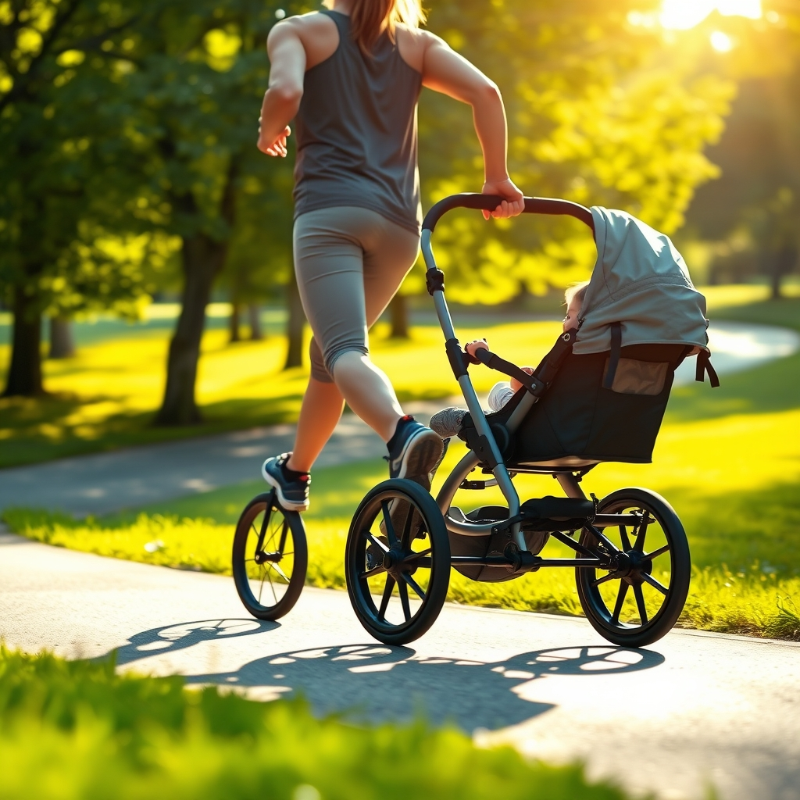

[Home](../index.md) > [Articles](./index.md)  
# 👀👶🏼🏃🏼‍♀️🛣️ [What to Look for in a Jogging Stroller](https://www.consumerreports.org/babies-kids/strollers/jogging-stroller-what-to-look-for-a1118048843)  
  
## 🤖 AI Summary  
When shopping for a **jogging stroller** 👶 🛒, there are a few key features to keep in mind to keep your child safe and your run smooth 🏃‍♀️. Here’s what CR recommends:  
  
- ⚙️ **Wheel Design:** True jogging strollers have three large wheels 🛞 🛞 🛞, with the front wheel locked straight for stability while running. Some models let you switch the front wheel between locked (for jogging) and swivel (for everyday use).  
- ⚖️ **Weight:** Jogging strollers can weigh 24 to 43 pounds. Make sure to check both the stroller’s weight and the maximum child weight it supports, so you know how long you’ll be able to use it.  
- 🔒 **Harness:** Look for a five-point harness for the best safety. It should be easy for you to use but tough for little hands to unfasten, and the straps should be adjustable and securely anchored.  
- 🖐️ **Handle:** The handle should be comfortable and ideally height-adjustable. A wrist strap 🎽 is a great safety feature to prevent the stroller from getting away from you.  
- 🛑 **Brakes:** Good brakes are essential. Hand-operated brakes offer better control while running, but foot brakes are common too.  
- ☀️ **Canopy:** A large, adjustable canopy protects your child from sun 🌞 and light rain 🌧️, and a peekaboo window 👀 is a nice touch for keeping an eye on your little one.  
  
## [🛍️ Products](../products/index.md)  
- [👶🏃🌆 Thule Urban Glide 3](../products/thule-urban-glide-3.md)  
  
## [📚 Books](../books/index.md)  
* **[🏃🏆👵 The Complete Guide to Running: How to Be a Champion from 9 to 90](../books/the-complete-guide-to-running.md) by Amby Burfoot**: Comprehensive guide on running fundamentals, training, and injury prevention, ideal for integrating stroller running.  
* 🧘 **"Running with the Mind of Meditation: Lessons for Training Body, Mind, and Spirit" by Sakyong Mipham**: 🧘 Explores mindfulness in running, offering a reflective approach to physical activity.  
* 👶 **"The Wonder Weeks" by Hetty van de Rijt and Frans Plooij**: 🧠 Insights into baby developmental leaps, helping parents time jogging activities appropriately.  
* 🍎 **"Nourishing Traditions" by Sally Fallon Morell**: 🍎 Focuses on traditional diets and nutrition, supporting active parent and child health.  
* **[🏃‍♂️⛰️ Born to Run: A Hidden Tribe, Superathletes, and the Greatest Race the World Has Never Seen](../books/born-to-run-a-hidden-tribe-superathletes-and-the-greatest-race-the-world-has-never-seen.md) by Christopher McDougall**: 🏞️ Inspiring story about human running capacity and outdoor movement, motivating parents to embrace stroller jogging adventures.  
* 👩‍👧‍👦 **"The Mother Runners" by Dimity McDowell and Sarah Bowen Shea**: 🏃‍♀️ Practical advice and relatable experiences for mothers balancing running and parenting.  
* 🍳 **"Run Fast. Eat Slow." by Shalane Flanagan and Elyse Kopecky**: 🍲 Cookbook with wholesome recipes and nutrition tips from elite runners, fueling active families.  
* 🛒 **"Stroller" by Amanda Parrish Morgan**: 🛒 A unique "Object Lesson" exploring the cultural significance, history, and role of strollers in modern parenthood.  
* 🤰 **"Go Ahead Stop and Pee" by Leigh Boyle and Jessica Mena**: 🤰 Written by physical therapists, this book debunks myths about running during pregnancy and postpartum, empowering new mothers.  
* 🗓️ **"The Ultimate Running Guide for New Mothers" by J.M. Parker**: 🗓️ Provides a structured 6-week diet and exercise plan for new mothers to regain pre-pregnancy fitness.  
  
## 🐘 Mastodon    
<blockquote class="mastodon-embed" data-embed-url="https://mastodon.social/@bagrounds/116600964421130320/embed" style="background: #282c37; border-radius: 8px; border: 1px solid #393f4f; margin: 0; max-width: 540px; min-width: 270px; overflow: hidden; padding: 0;"> <a href="https://mastodon.social/@bagrounds/116600964421130320" target="_blank" style="align-items: center; color: #d9e1e8; display: flex; flex-direction: column; font-family: system-ui, -apple-system, BlinkMacSystemFont, 'Segoe UI', Oxygen, Ubuntu, Cantarell, 'Fira Sans', 'Droid Sans', 'Helvetica Neue', Roboto, sans-serif; font-size: 14px; justify-content: center; letter-spacing: 0.25px; line-height: 20px; padding: 24px; text-decoration: none;"> <svg xmlns="http://www.w3.org/2000/svg" xmlns:xlink="http://www.w3.org/1999/xlink" width="32" height="32" viewBox="0 0 79 75"><path d="M63 45.3v-20c0-4.1-1-7.3-3.2-9.7-2.1-2.4-5-3.7-8.5-3.7-4.1 0-7.2 1.6-9.3 4.7l-2 3.3-2-3.3c-2-3.1-5.1-4.7-9.2-4.7-3.5 0-6.4 1.3-8.6 3.7-2.1 2.4-3.1 5.6-3.1 9.7v20h8V25.9c0-4.1 1.7-6.2 5.2-6.2 3.8 0 5.8 2.5 5.8 7.4V37.7H44V27.1c0-4.9 1.9-7.4 5.8-7.4 3.5 0 5.2 2.1 5.2 6.2V45.3h8ZM74.7 16.6c.6 6 .1 15.7.1 17.3 0 .5-.1 4.8-.1 5.3-.7 11.5-8 16-15.6 17.5-.1 0-.2 0-.3 0-4.9 1-10 1.2-14.9 1.4-1.2 0-2.4 0-3.6 0-4.8 0-9.7-.6-14.4-1.7-.1 0-.1 0-.1 0s-.1 0-.1 0 0 .1 0 .1 0 0 0 0c.1 1.6.4 3.1 1 4.5.6 1.7 2.9 5.7 11.4 5.7 5 0 9.9-.6 14.8-1.7 0 0 0 0 0 0 .1 0 .1 0 .1 0 0 .1 0 .1 0 .1.1 0 .1 0 .1.1v5.6s0 .1-.1.1c0 0 0 0 0 .1-1.6 1.1-3.7 1.7-5.6 2.3-.8.3-1.6.5-2.4.7-7.5 1.7-15.4 1.3-22.7-1.2-6.8-2.4-13.8-8.2-15.5-15.2-.9-3.8-1.6-7.6-1.9-11.5-.6-5.8-.6-11.7-.8-17.5C3.9 24.5 4 20 4.9 16 6.7 7.9 14.1 2.2 22.3 1c1.4-.2 4.1-1 16.5-1h.1C51.4 0 56.7.8 58.1 1c8.4 1.2 15.5 7.5 16.6 15.6Z" fill="currentColor"/></svg> 
Post by @bagrounds@mastodon.social
 
View on Mastodon
 </a> </blockquote> 