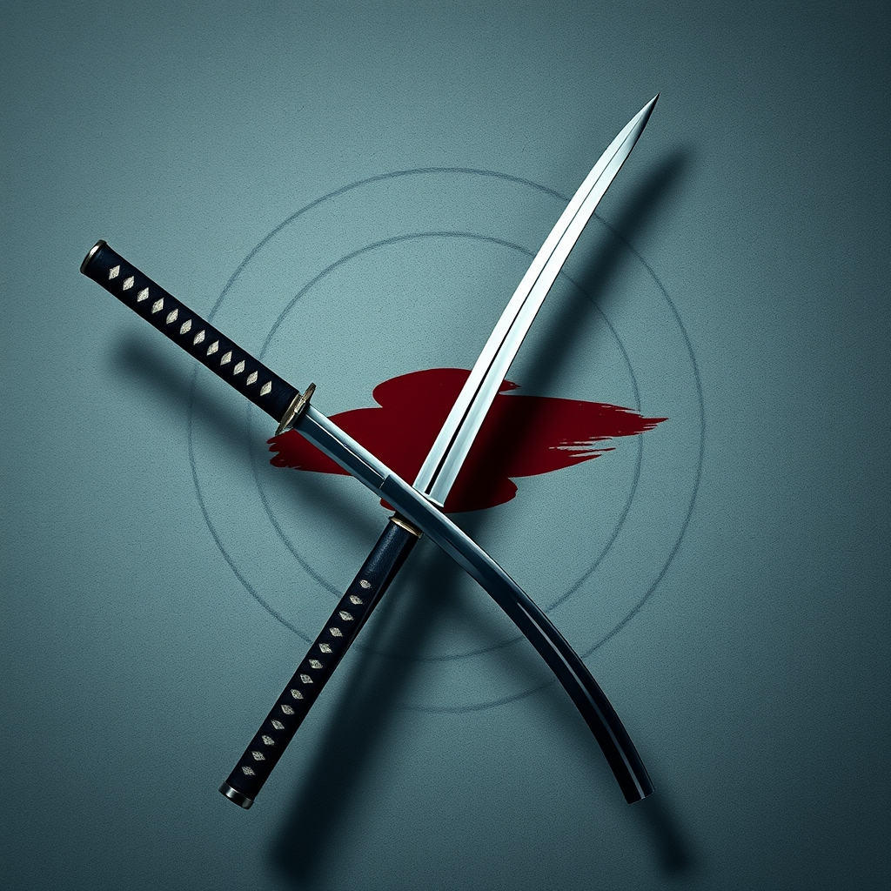

[Home](../index.md) > [Books](./index.md)  
# 🇯🇵⚔️ A Book of Five Rings: The Classic Guide to Strategy  
  
[🛒 A Book of Five Rings: The Classic Guide to Strategy. As an Amazon Associate I earn from qualifying purchases.](https://amzn.to/4bdrddS)  
  
⚔️🧠🎯 A concise 17th-century guide to strategy, rooted in swordsmanship but offering timeless, adaptable principles for achieving mastery, decisive action, and competitive advantage in all aspects of life.  
  
## 🤖 AI Summary  
  
### 🧠 Core Philosophy  
* 🛣️ **The Way of Strategy:** Mastery through continuous training and objective understanding.  
* 🚫 **No-nonsense Approach:** Reject superficiality; focus on practical effectiveness.  
* 🌍 **Generality Across Disciplines:** Principles learned in one domain apply universally.  
* 🧘‍♀️ **Integrated Mindset:** Maintain a consistent mental state in daily life, training, and combat.  
  
### 🖐️ The Five Rings (Go Rin no Sho)  
* 🌎 **Earth Book (Ground):** Establishes foundational principles, posture, and the broad Way of strategy.  
    * 💪 Solid understanding of one's field.  
    * 🔭 Clear vision and sound strategy.  
    * 🛡️ Resilient personality for uncertainty.  
* 💧 **Water Book:** Emphasizes flexibility, adaptability, and fluid movement.  
    * 🌊 Adjust strategy to circumstances.  
    * 🕺 Impose your rhythm while disrupting the opponent's.  
* 🔥 **Fire Book:** Focuses on aggressive, decisive action and seizing opportunity.  
    * ⚡ Speed and vigor in execution.  
    * 💥 Force opponent's retreat and capitalize on mistakes.  
* 🌬️ **Wind Book (Tradition):** Analyzes strategies of other schools and understanding opponents.  
    * 👥 Know self by knowing others.  
    * 📈 Learn from competitors, stay innovative.  
    * 🛤️ Avoid imitation; define own course.  
* 🌌 **Void Book:** The deepest, philosophical section on intuition, insight, and perceiving the unseeable.  
    * ☯️ Emptiness and nothingness; virtue, no evil.  
    * ✨ Intuitive judgment, holistic awareness.  
  
### 📜 Nine Principles of the Way  
* ❌ Do not think dishonestly.  
* 🥋 The Way is in training.  
* 🎨 Become acquainted with every art.  
* 🧑‍💼 Know the Ways of all professions.  
* 💰 Distinguish between gain and loss in worldly matters.  
* 🤔 Develop an intuitive judgment and understanding for everything.  
* 👁️‍🗨️ Perceive those things which cannot be seen.  
* 🤏 Pay attention even to trifles.  
* 🗑️ Do nothing which is of no use.  
  
## ⚖️ Evaluation  
  
* ⏳ **Timeless Relevance:** Miyamoto Musashi's principles, though written in 17th-century Japan for swordsmanship, are widely considered applicable to modern business, leadership, and personal development by abstracting enemy as competitor or obstacle.  
* 🛠️ **Practicality over Theory:** Musashi emphasizes direct experience and continuous practice (investigate this thoroughly through practice) over mere theoretical understanding.  
* 🧘 **Holistic Approach:** The book addresses strategy from physical, mental, and spiritual standpoints, advocating for a balanced spirit and presence.  
* 💎 **Conciseness and Depth:** Despite its brevity, A Book of Five Rings is lauded for its profound insights, often requiring multiple readings for deeper comprehension.  
* 🌟 **Influence:** It remains a foundational text in martial arts and has garnered broad attention globally, particularly among business leaders.  
* ⚠️ **Potential for Misinterpretation:** The martial context can sometimes lead to overly aggressive interpretations if the metaphors are not properly adapted to modern, non-combat situations.  
  
## 🔍 Topics for Further Understanding  
  
* 🏯 The historical context of feudal Japan and its influence on Musashi's philosophy.  
* 📊 Comparative analysis of Eastern and Western strategic thought (e.g., Sun Tzu vs. Clausewitz).  
* 🧠 The concept of Mushin (no-mind) in martial arts and its application in high-pressure environments.  
* ⚡ Neuroscience of intuition and fast decision-making, correlating with Musashi's perceive what cannot be seen.  
* 🤔 Ethical implications of applying warrior strategies in non-combat domains.  
* 📈 The role of deliberate practice and skill acquisition in achieving mastery across diverse fields.  
  
## ❓ Frequently Asked Questions (FAQ)  
  
### 💡 Q: What is A Book of Five Rings about?  
✅ A: A Book of Five Rings is a 17th-century Japanese text on kenjutsu and general martial arts strategy, written by the legendary swordsman Miyamoto Musashi, offering timeless principles for conflict, mastery, and decisive action across various aspects of life.  
  
### 💡 Q: Who was Miyamoto Musashi?  
✅ A: Miyamoto Musashi (c. 1584–1645) was a renowned Japanese samurai, considered one of history's most skilled swordsmen, famous for remaining undefeated in over 60 duels, and the founder of the Hyōhō Niten Ichi-ryū style of swordsmanship.  
  
### 💡 Q: What are the five rings in A Book of Five Rings?  
✅ A: The five rings, or books, correspond to elements from Buddhist esotericism and represent different aspects of strategy: Earth (foundation), Water (fluidity/adaptability), Fire (decisive action), Wind (understanding others), and Void (intuition/transcendence).  
  
### 💡 Q: How can A Book of Five Rings be applied to modern business?  
✅ A: A Book of Five Rings can be applied to modern business by reinterpreting martial metaphors; for instance, enemy becomes competitor. Its lessons advocate for strong foundational knowledge, adaptable strategies, decisive leadership, competitor analysis, and intuitive decision-making.  
  
### 💡 Q: What is the core message of Musashi's philosophy in A Book of Five Rings?  
✅ A: The core message of A Book of Five Rings centers on achieving mastery through relentless training, an objective and no-nonsense approach, adaptability to circumstances, understanding one's opponents, and developing an intuitive awareness that transcends mere technique.  
  
## 📚 Book Recommendations  
  
### 🤝 Similar  
* [🎨⚔️ The Art of War](./the-art-of-war.md) by Sun Tzu: Classic Eastern strategic thought, military focus with broad applicability.  
* 🌸 Bushido Shoshinshu by Taira Shigesuke: Guidance on the Japanese Bushido Code for aspiring warriors.  
* 🧘‍♂️ The Unfettered Mind by Takuan Sōhō: Zen Buddhist principles applied to swordsmanship and life.  
  
### ↔️ Contrasting  
* 🇩🇪 On War by Carl von Clausewitz: A foundational Western text on military strategy, emphasizing politics and rationality over individual combat.  
* 👑 The Prince by Niccolò Machiavelli: A pragmatic and often ruthless guide to political power, contrasting Musashi's more disciplined and spiritual Way.  
  
### 🔗 Related  
* 📖 Eiji Yoshikawa's Musashi: A fictionalized historical novel expanding on Miyamoto Musashi's life and journey.  
* ♟️ The 33 Strategies of War by Robert Greene: Modern synthesis of historical military and strategic principles.  
* [🤔🧘 Meditations](./meditations.md) by Marcus Aurelius: Roman Stoic philosophy, emphasizing self-control and living in accordance with principles, similar to aspects of Musashi's approach.  
  
## 🫵 What Do You Think?  
💭 Which of Musashi's Five Rings resonates most with your personal or professional challenges, and how have you tried to embody its principles?