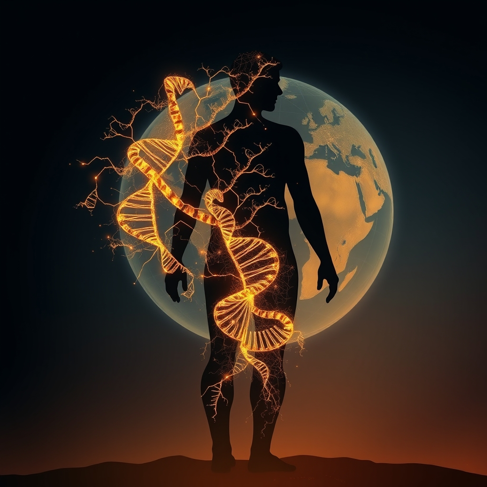

[Home](../index.md) > [Books](./index.md)  
# 📜🌍👥 A Brief History of Everyone Who Ever Lived  
  
[🛒 A Brief History of Everyone Who Ever Lived. As an Amazon Associate I earn from qualifying purchases.](https://amzn.to/3Irost0)  
  
## 📚 Book Report: ⏳ A Brief History of Everyone Who Ever Lived  
  
### 📝 Introduction  
  
* 📖 **Title:** ⏳ A Brief History of Everyone Who Ever Lived: 🧬 The Human Story Retold Through Our Genes  
* ✍️ **Author:** 👨‍🔬 Adam Rutherford  
* 📅 **Published:** 2016  
* 🎯 **Main Topic:** 🧬 This book explores the history of humanity through the 🔬 lens of genetics, using DNA to reveal insights about our evolution, 🌍 migration patterns, and 🤝 interconnectedness.  
  
### 🧬 Key Themes and Concepts  
  
* 🧬 **Genetics as History:** 📜 Rutherford demonstrates how the human genome is not just an instruction manual but an "epic poem" containing the story of our species. 🔍 DNA analysis provides a powerful tool to uncover the ancient history of humanity, often complementing or challenging traditional historical and archaeological records.  
* 🚶‍♂️🚶‍♀️ **Human Evolution and Migration:** ➡️ The book delves into the evolutionary journey of *Homo sapiens*, highlighting that evolution is a continuous process and debunking the idea of a simple, linear progression. 🌍 It traces human migration patterns out of Africa and across the globe, showing how environmental and cultural changes have left their mark on our genes.  
* 🚫 **Debunking Myths:** 🔬 Rutherford uses genetic evidence to challenge common misconceptions about ancestry and identity. ☝️ A significant point is the scientific refutation of the concept of biological race, emphasizing that genetic variation is continuous and that racial categories are not supported by genetic science. 👑 He also explores how genetic analysis can shed light on historical figures and events, like the identification of Richard III's remains or the genetic legacy of figures like Charlemagne and Genghis Khan, demonstrating that nearly everyone is descended from royalty.  
* 🤝 **Interconnectedness of Humanity:** 🌍 A central message is the profound genetic similarity and interconnectedness of all humans, highlighting our shared ancestry and the relatively recent common ancestors we share.  
  
### ✍️ Style and Approach  
  
* 🗣️ **Accessible Science Communication:** 👨‍🔬 Rutherford, a geneticist and science communicator, presents complex scientific concepts in a lucid and engaging manner, making them understandable to readers without a strong scientific background.  
* 📖 **Engaging Narrative:** 🗺️ The book is structured as a captivating journey, blending scientific explanations with fascinating anecdotes and historical examples.  
* 😂 **Humor and Tone:** 🤣 Rutherford employs an unapologetic yet often humorous tone, which helps to keep the heavy topic engaging and accessible.  
* 📊 **Emphasis on Data:** 🔬 The narrative is strongly backed by scientific research and the latest findings in genomics and ancient DNA analysis.  
  
### 🎯 Conclusion  
  
* ⭐ *A Brief History of Everyone Who Ever Lived* is a highly illuminating and thought-provoking exploration of human history through the revolutionary lens of genetics.  
* 🧬 The book successfully demonstrates how DNA reveals not only our individual stories but also the collective history of our species, emphasizing our shared origins and interconnectedness.  
* 🤔 By using genetic science to challenge established ideas, particularly regarding race and ancestry, Rutherford provides a compelling and demystifying portrait of who we are and how we came to be.  
  
## 📚 Book Recommendations  
  
### 🧬 Similar Books (Genetics, Evolution, Deep History)  
  
* 📚 ***The Gene: An Intimate History*** 👨‍🔬 **by Siddhartha Mukherjee:** 🧬 Explores the history and science of genetics, its impact on human life, and its future. 👨‍🔬 Like Rutherford, Mukherjee makes complex genetic science accessible and personal.  
* 📚 ***Who We Are and How We Got Here: Ancient DNA and the New Science of the Human Past*** 👨‍🔬 **by David Reich:** 🔬 Written by a leading researcher in ancient DNA, this book details how the study of ancient genomes is transforming our understanding of human history, migration, and mixture.  
* 📚 ***The Seven Daughters of Eve*** 👨‍🔬 **by Bryan Sykes:** 🧬 An earlier popular science book that traces human ancestry through mitochondrial DNA, focusing on the genetic lineages of Europeans.  
* 📚 ***Origin: A Genetic History of the Americas*** 👨‍🔬 **by Jennifer Raff:** 🗺️ A recent book focusing specifically on the genetic history of the Indigenous peoples of the Americas, using DNA to explore migration routes and ancient populations.  
* 📚 ***Before the Dawn: Recovering the Lost History of Our Ancestors*** 👨‍🔬 **by Nicholas Wade:** 🚶‍♂️ Explores early human history and migration using genetic and archaeological evidence.  
* 📚 ***A Pocket History of Human Evolution: How We Became Sapiens*** 👨‍🔬 **by Silvana Condemi:** 🚶‍♂️ A concise overview of the human evolutionary story, incorporating recent genetic findings about our relationships with other hominins like Neanderthals.  
  
### ⚖️ Contrasting Books (Different Historical/Scientific Focus)  
  
* **[📜🌍⏳ Sapiens: A Brief History of Humankind](./sapiens-a-brief-history-of-humankind.md)** 👨‍🏫 **by Yuval Noah Harari:** 🌍 While also a history of humanity, *Sapiens* focuses more on cognitive, agricultural, and scientific revolutions and the development of human societies and cultures, offering a broader historical and philosophical perspective compared to Rutherford's genetic focus.  
* **[🔫🦠🔩 Guns, Germs, and Steel: The Fates of Human Societies](./guns-germs-and-steel-the-fates-of-human-societies.md)** 👨‍🏫 **by Jared Diamond:** 🌍 Explores how environmental and geographical factors, rather than genetics, contributed to the rise of different civilizations, offering a contrasting materialist perspective on historical inequality.  
* 📚 ***The Secret of Our Success: How Culture Is Driving Human Evolution, Domesticating Our Species, and Making Us Smarter*** 👨‍🏫 **by Joseph Henrich:** 🗣️ Argues that cultural evolution and our ability to learn from others have been the primary drivers of human success, offering a counterpoint to purely genetic explanations.  
* 📚 ***At the Water's Edge: Fish with Fingers, Whales with Legs, and How Life Came Ashore But Then Went Back to Sea*** 👨‍🔬 **by Carl Zimmer:** 🌊 While still science, this book focuses on major evolutionary transitions in the broader tree of life, rather than solely on human history and genetics.  
  
### ✨ Creatively Related Books (Themes of Connection, Identity, Deep Time)  
  
* 📚 ***Cloud Atlas*** ✍️ **by David Mitchell:** 📖 A novel that weaves together interconnected stories across different time periods, exploring themes of how actions in one era can resonate and influence others throughout history.  
* **[🍄🌍🧠🔮 Entangled Life: How Fungi Make Our Worlds, Change Our Minds & Shape Our Futures](./entangled-life-how-fungi-make-our-worlds-change-our-minds-shape-our-futures.md)** 🍄 **by Merlin Sheldrake:** 🌍 Explores the fascinating and interconnected world of fungi, highlighting the hidden biological networks that underpin life on Earth and offering a different perspective on biological interconnectedness.  
* 📚 ***The Immortal Life of Henrietta Lacks*** 👩‍⚕️ **by Rebecca Skloot:** 🧬 Tells the story of Henrietta Lacks and the immortal cell line (HeLa) derived from her tissues, raising profound ethical questions about genetics, identity, race, and the ownership of biological material.  
* 📚 ***Underland: A Deep Time Journey*** 🌍 **by Robert Macfarlane:** ⛰️ A lyrical exploration of the world beneath our feet, delving into geological time, deep history, and our relationship with the Earth, providing a sense of immense temporal scale akin to genetic deep history.  
* 📚 ***Orlando*** 🎭 **by Virginia Woolf:** ⏳ A novel that follows a protagonist who lives for centuries and changes sex, offering a fluid and unconventional look at identity, history, and change over long periods.  
  
## 💬 [Gemini](../software/gemini.md) Prompt (gemini-2.5-flash-preview-04-17)  
> Write a markdown-formatted (start headings at level H2) book report, followed by a plethora of additional similar, contrasting, and creatively related book recommendations on A Brief History of Everyone Who Ever Lived. Be thorough in content discussed but concise and economical with your language. Structure the report with section headings and bulleted lists to avoid long blocks of text.