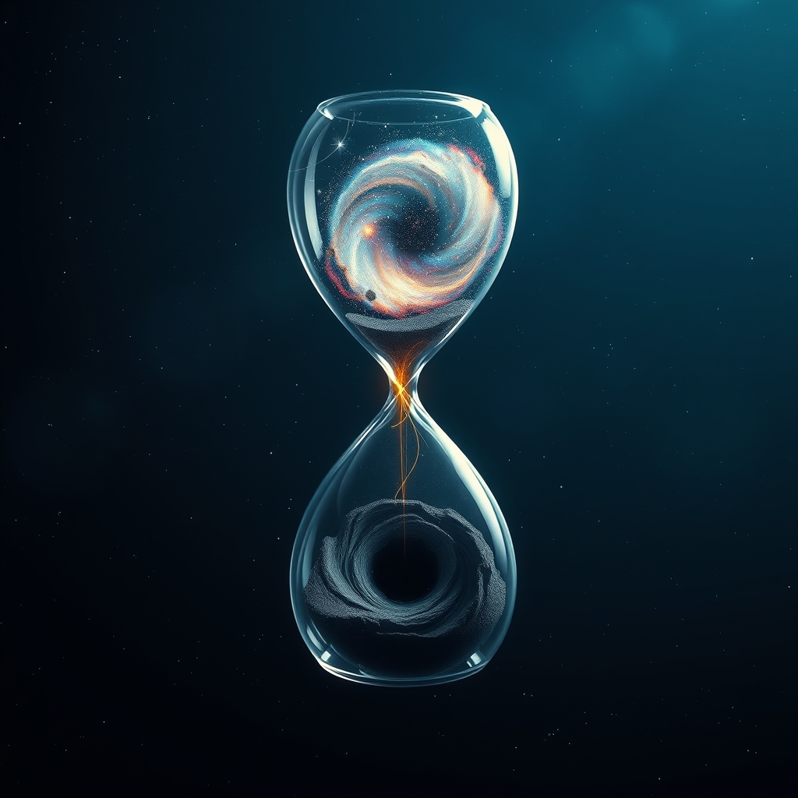

[Home](../index.md) > [Books](./index.md)  
# 🤏📜⏳ A Brief History of Time  
  
[🛒 A Brief History of Time. As an Amazon Associate I earn from qualifying purchases.](https://amzn.to/4jsHpZa)  
  
## 🤖 AI Summary  
### A Brief History of Time 🌌  
  
**TL;DR:** "A Brief History of Time" demystifies complex cosmological concepts, from the Big Bang to black holes, making them accessible to a general audience, and exploring the universe's fundamental questions. 🤯  
  
**New or Surprising Perspective:** Hawking's ability to translate intricate physics into understandable prose is remarkable. He provides a perspective that bridges the gap between theoretical physics and everyday understanding, revealing the awe-inspiring nature of the universe. 🌠 The book challenges our intuitive notions of space and time, presenting a universe far stranger and more fascinating than we typically imagine. 🧐  
  
**Deep Dive:**  
  
* **Topics:** The book covers topics such as the Big Bang theory, black holes, the nature of space and time, the expanding universe, elementary particles, and the search for a unified theory of physics. ⚛️  
* **Methods:** Hawking uses thought experiments, analogies, and simplified explanations to convey complex scientific concepts. He also provides historical context, tracing the development of cosmological ideas from Aristotle to modern physics. 📜  
* **Research:** The book discusses groundbreaking research in theoretical physics, including Hawking's own work on black holes and the origins of the universe. 🧑‍🔬  
* **Theories and Theses:**  
    * The universe is expanding from an initial singularity, the Big Bang. 💥  
    * Black holes emit radiation (Hawking radiation) and eventually evaporate. ♨️  
    * The concept of imaginary time, which allows for a universe without boundaries. ⏳  
    * The search for a unified theory of physics, combining quantum mechanics and general relativity. 🧩  
* **Mental Models:**  
    * The idea of spacetime as a four-dimensional fabric. 🕸️  
    * The concept of singularities as points of infinite density. ♾️  
    * The probabilistic nature of quantum mechanics. 🎲  
* **Prominent Examples:**  
    * The expanding universe as evidenced by the redshift of galaxies. 🔭  
    * The formation and properties of black holes. 🖤  
    * The thought experiment of a particle-antiparticle pair appearing near a black hole's event horizon, leading to Hawking radiation. ✨  
  
**Practical Takeaways:**  
  
* While not a "how-to" book, it encourages a deeper appreciation for the universe and the scientific process. 🧠  
* It fosters critical thinking about the nature of reality and our place within it. 🤔  
* It demonstrates the power of theoretical physics to explain seemingly incomprehensible phenomena. 💡  
* It highlights the importance of asking fundamental questions about the universe. ❓  
* It encourages a lifelong learning approach to scientific exploration. 🚀  
  
**Critical Analysis:**  
  
* Hawking's reputation as a leading theoretical physicist lends significant credibility to the book. 🏆  
* The book is widely praised for its clarity and accessibility, making complex ideas understandable to a broad audience. 👏  
* It has been a bestseller and has had a profound impact on popular science writing. 📚  
* However, some of the theories discussed are still subject to ongoing research and debate. 🗣️  
* The book presents complex ideas without deep math, which is good for accessibility, but could be limiting to some readers. 🤓  
  
**Additional Book Recommendations:**  
  
* **Best Alternate Book (Same Topic):** The Universe in a Nutshell by Stephen Hawking. (Also by Hawking, but more visually descriptive) 🌰  
* **Best Tangentially Related Book:** [🌌 Cosmos](./cosmos.md) by Carl Sagan. (Explores the universe with a philosophical and poetic touch) 🌌  
* **Best Diametrically Opposed Book:** [🗺️❤️📐 Flatland: A Romance of Many Dimensions](./flatland-a-romance-of-many-dimensions.md) by Edwin Abbott Abbott. (A fictional exploration of dimensions, challenging our assumptions about reality) 📐  
* **Best Fiction Book with Related Ideas:** "Contact" by Carl Sagan. (Explores the implications of extraterrestrial contact and the vastness of the universe) 👽  
* **Best More General Book:** [📜🌍⏳ Sapiens: A Brief History of Humankind](./sapiens-a-brief-history-of-humankind.md) by Yuval Noah Harari. (Provides a broad overview of human history and our place in the universe) 🧑‍🤝‍🧑  
* **Best More Specific Book:** "Black Holes and Time Warps: Einstein's Outrageous Legacy" by Kip S. Thorne. (Delves deeper into the physics of black holes and spacetime) ⏳  
* **Best More Rigorous Book:** "Gravitation" by Charles W. Misner, Kip S. Thorne, and John Archibald Wheeler. (A graduate-level textbook on general relativity) 📚  
* **Best More Accessible Book:** "Astrophysics for People in a Hurry" by Neil deGrasse Tyson. (Concise and engaging explanations of astrophysical concepts) 🏃  
  
## 💬 [Gemini](https://gemini.google.com) Prompt  
> Summarize the book: "A Brief History of Time" by Stephen Hawking. Start with a TL;DR - a single statement that conveys a maximum of the useful information provided in the book. Next, explain how this book may offer a new or surprising perspective. Follow this with a deep dive. Catalogue the topics, methods, and research discussed. Be sure to highlight any significant theories, theses, or mental models proposed. Summarize prominent examples discussed. Emphasize practical takeaways, including detailed, specific, concrete, step-by-step advice, guidance, or techniques discussed. Provide a critical analysis of the quality of the information presented, using scientific backing, author credentials, authoritative reviews, and other markers of high quality information as justification. Make the following additional book recommendations: the best alternate book on the same topic; the best book that is tangentially related; the best book that is diametrically opposed; the best fiction book that incorporates related ideas; the best book that is more general or more specific; and the best book that is more rigorous or more accessible than this book. Format your response as markdown, starting at heading level H3, with inline links, for easy copy paste. Use meaningful emojis generously (at least one per heading, bullet point, and paragraph) to enhance readability. Do not include broken links or links to commercial sites.