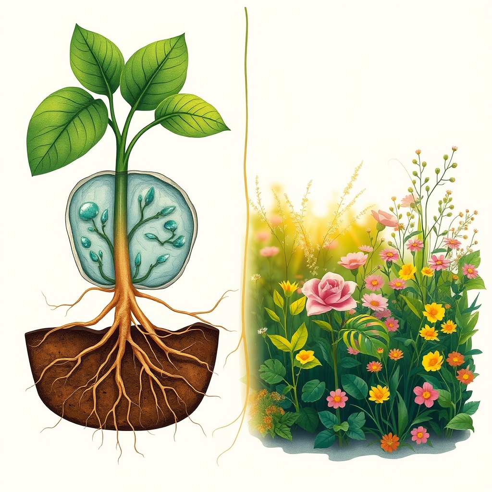

[Home](../index.md) > [Books](./index.md)  
# 🧑‍🌾🌿 A Gardener's Guide to Botany: The Biology Behind the Plants You Love, How They Grow, and What They Need  
  
[🛒 A Gardener's Guide to Botany: The Biology Behind the Plants You Love, How They Grow, and What They Need. As an Amazon Associate I earn from qualifying purchases.](https://amzn.to/3SwsHp6)  
  
## 📖 Book Report: 🪴 A Gardener's Guide to Botany  
  
### 🔎 Overview  
🌿 "A Gardener's Guide to Botany: The biology behind the plants you love, how they grow, and what they need" by Dr. Scott Zona is not a typical "how-to" gardening manual. 🔬 Instead, it's an accessible exploration of the science behind plants, explaining their inner workings in layman's terms. 🏆 Winner of a 2023 American Horticultural Society Book Award, this lushly illustrated guide aims to deepen a gardener's appreciation and understanding of the plant kingdom, whether they tend to indoor or outdoor plants. 🏡  
  
### 🔑 Key Themes/Content  
🌱 The book delves into the fundamental aspects of plant life, structured around what plants need to survive:  
* 🪴 **Plant Basics:** ❓ What defines a plant, separating it from other life forms.  
* 🦴 **Anatomy & Function:** 🪴 Explains the roles of roots, stems, 🍃 leaves (including stomata), 🌸 flowers, and 🍎 fruits.  
* ☀️ **Photosynthesis:** 💡 How plants convert sunlight, 💧 water, and 💨 air into energy and structure.  
* 🌍 **Environmental Response:** 🌡️ How plants perceive and react to their surroundings, including light's role in chemical reactions.  
* 💧 **Nutrient & Water Uptake:** 🌿 Explores how plants access resources, sometimes through partnerships with other organisms.  
* 🌸 **Reproduction:** 🔄 Discusses the diverse methods plants use, both sexual and asexual.  
* 🌬️ **Dispersal:** 🚀 Covers how seeds and genes are spread via various mechanisms (wind, water, animals, etc.).  
* 🛡️ **Adaptations & Defense:** 🪴 Details fascinating evolutionary adaptations for survival, including physical defenses (spines) and chemical defenses (toxins), and communication. 🗣️  
  
### 💪 Strengths  
* 📚 **Accessibility:** ✍️ Written by a botany expert and seasoned science communicator, the book makes complex botanical concepts understandable for beginners and experienced gardeners alike.  
* 🌱 **Engaging Content:** 🤔 Explores intriguing questions like whether plants sleep and why leaves have specific shapes, fostering curiosity. ❓  
* 🖼️ **Visually Appealing:** 📸 Features beautiful illustrations and full-color photographs of diverse plants from around the world.  
* 💯 **Credibility:** 🧑‍🎓 Authored by a Ph.D. botanist with extensive field experience and numerous publications.  
  
### 🎯 Target Audience  
🧑‍🌾 This guide is suitable for anyone interested in the "why" behind plant life, from novice plant parents to advanced horticulturists. 🌱 It's ideal for curious gardeners seeking a deeper understanding of the plants they cultivate. 🤔 While highly informative, some might find it slightly technical if seeking purely practical, step-by-step gardening instructions. 🪜  
  
### ✍️ Author  
🧑‍🔬 Dr. Scott Zona holds degrees in horticulture and botany, including a Ph.D., and has researched plants globally. 🌎 He is a respected expert, particularly on tropical plants, and has published extensively. 🌴 He currently serves as co-editor for the journal "PALMS" and is a Research Collaborator with the University of North Carolina at Chapel Hill Herbarium.  
  
## 📚 Further Reading Recommendations  
  
### 🌿 Similar Guides (Botany for Gardeners)  
* 📖 **[🌿🧑‍🌾 Botany for Gardeners](./botany-for-gardeners.md) (Fourth Edition)** by Brian Capon: 🪴 A classic text often used in horticulture programs, offering a comprehensive look at plant science for gardeners.  
* **[🌿🔬 How Plants Work: The Science Behind the Amazing Things Plants Do](./how-plants-work.md)** by Linda Chalker-Scott: 🌱 Explains the physiological processes of plants in an accessible manner, debunking common gardening myths. 🪴  
* 📖 **Teaming with Nutrients: The Organic Gardener's Guide to Optimizing Plant Nutrition** by Jeff Lowenfels: 🌿 Focuses specifically on plant nutrition and the soil food web, explaining the science behind organic practices. 🌎  
* 📖 **Practical Botany for Gardeners: Over 3000 Botanical Terms Explained and Explored** by Geoff Hodge: 🪴 A reference guide defining key botanical terms.  
* 📖 **A Botanist's Vocabulary: 1300 Terms Explained and Illustrated** by Susan K. Pell and Bobbi Angell: 🌿 Another helpful illustrated glossary for understanding botanical terminology. 🪴  
  
### 🧰 Contrasting Approaches (Practical Gardening Skills)  
* **[🪴 RHS How to Garden When You're New to Gardening: The Basics For Beginners](./rhs-how-to-garden-when-youre-new-to-gardening-the-basics-for-beginners.md)**: 🌱 A foundational guide from the Royal Horticultural Society focused on practical techniques.  
* 📖 **The Complete Book of Practical Gardening**: 🪴 A step-by-step guide covering planning, planting, and maintenance.  
* 📖 **RHS Encyclopedia of Practical Gardening series**: 🌿 Older but thorough guides covering various specific gardening areas like propagation, fruit, and vegetables.  
* **[🗓️🌷 RHS Gardening Through the Year](./rhs-gardening-through-the-year.md)** by Ian Spence: 📅 A month-by-month guide to garden tasks.  
* 📖 **Field Guide to Urban Gardening: How to Grow Plants, No Matter Where You Live** by Kevin Espiritu: 🏙️ Focuses on techniques suitable for urban environments like containers, raised beds, and hydroponics.  
* 📖 **Practical Organic Gardening: The No-Nonsense Guide to Growing Naturally** by Mark Highland: 🌱 A science-based guide focused on organic methods and soil health.  
  
### 🎨 Creative Connections (Botanical History, Art, Literature)  
* 📖 **The Botany of Desire: A Plant's-Eye View of the World** by Michael Pollan: 🍎 Explores the relationship between humans and four key plants (apple, tulip, marijuana, potato) from the plants' perspective. 🌷  
* 📖 **The Art of Botanical Illustration** by Wilfrid Blunt and William T. Stearn: 🎨 Considered the authoritative work on the history of botanical art.  
* 📖 **The Cabaret of Plants: Forty Thousand Years of Plant Life and the Human Imagination** by Richard Mabey: 🌳 A look at the cultural and historical significance of plants.  
* 📖 **Gathering Moss: A Natural and Cultural History of Mosses** by Robin Wall Kimmerer: 🌿 A mix of science and personal reflection on the world of mosses.  
* 📖 **[🪢🌾 Braiding Sweetgrass: Indigenous Wisdom, Scientific Knowledge, and the Teachings of Plants](./braiding-sweetgrass.md)** by Robin Wall Kimmerer: 🪴 Blends botanical knowledge with indigenous perspectives on plants and nature.  
* 📖 **The Drunken Botanist: The Plants That Create the World's Great Drinks** by Amy Stewart: 🍹 Explores the plants used in making alcoholic beverages.  
* 📖 **Wicked Plants: The Weed That Killed Lincoln's Mother and Other Botanical Atrocities** by Amy Stewart: ☠️ Focuses on poisonous, invasive, and notorious plants throughout history.  
  
## 💬 [Gemini](../software/gemini.md) Prompt (gemini-2.5-pro-exp-03-25)  
> Write a markdown-formatted (start headings at level H2) book report, followed by a plethora of additional similar, contrasting, and creatively related book recommendations on A Gardener's Guide to Botany. Be thorough in content discussed but concise and economical with your language. Structure the report with section headings and bulleted lists to avoid long blocks of text.