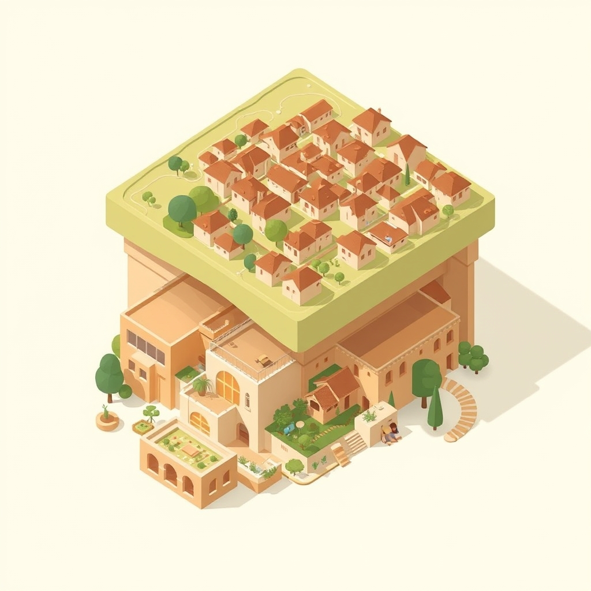

[Home](../index.md) > [Books](./index.md)  
# 🏘️🧱🏗️ A Pattern Language: Towns, Buildings, Construction  
  
[🛒 A Pattern Language: Towns, Buildings, Construction. As an Amazon Associate I earn from qualifying purchases.](https://amzn.to/43iEkWk)  
  
📚 A hierarchical system of 253 interconnected patterns to empower ordinary people to design human-centric towns, buildings, and construction elements.  
  
## 🏆 Christopher Alexander's Pattern Language Strategy  
  
### 🧠 Core Philosophy  
* 🤝 **Democratic Design:** Empower ordinary people, not just professionals, to design their environments.  
* ❤️ **Human-Centered:** Focus on creating spaces that "feel right," promoting comfort, health, and a sense of "aliveness" or "quality without a name" (QWAN).  
* ⏳ **Timeless Solutions:** Patterns represent perennial solutions to recurring design problems. These are hypotheses, open to evolution.  
* 🌐 **Holistic Approach:** Buildings/spaces are not isolated entities; they are embedded in larger patterns and supported by smaller ones. Design impacts the surrounding world.  
  
### ⚙️ Actionable Principles  
* 🧩 **Pattern Identification:** Each pattern describes a recurring problem, its context, and a core solution, often with illustrations.  
* 🪜 **Hierarchical Structure:** Patterns organized from large scale (regions, towns) to small (buildings, rooms, details), enabling a structured design process.  
* 🔗 **Interconnectedness:** Patterns reference each other, forming a "language" or network. Combining multiple patterns densely creates profound spaces.  
* 🌱 **Adaptability:** Solutions are general and abstract, allowing adaptation to specific preferences and local conditions.  
* 🔄 **Iterative Design:** Patterns are hypotheses; continuous observation and experience refine them.  
  
## ⚖️ Critical Evaluation  
  
* 🌍 **Influence Across Disciplines:** The book significantly influenced urban planning (New Urbanism) and, surprisingly, software engineering (design patterns, Agile, WikiWikiWeb). This cross-disciplinary adoption underscores its foundational ideas' transferability.  
* 🧑‍🤝‍🧑 **Empowering Non-Architects:** It provides a common vocabulary and framework, making design accessible to non-professionals, promoting community-led development.  
* 🤔 **Critiques of Prescriptiveness/Bias:** Some critics argue patterns can be seen as overly prescriptive formulas, reducing architecture to a "formula" rather than an art. Others find certain patterns outdated for modern lifestyles, expensive, or reflecting the authors' biases on how people *ought* to live, even suggesting "darker undertones" in some principles.  
* ✨ **Emphasis on "Quality Without a Name":** Alexander's assertion that good design is an objective truth (QWAN) rather than subjective is a central, yet often debated, aspect of his philosophy. This search for an objective "aliveness" contrasts with purely aesthetic or functional design.  
* 🎯 **Practicality vs. Ideology:** While lauded for practical advice, the book has also been seen as a blend of psychology, sociology, and architectural science, aiming for holistic human well-being. Its democratic premise implies a radical transformation of the architectural profession.  
  
📜 **Verdict on Core Claim:** A Pattern Language's core claim—that a shared "language" of design patterns can enable anyone to create more humane and functional environments—holds substantial merit, evidenced by its enduring influence and practical applications across various fields. While some patterns may be context-specific or open to interpretation, the underlying methodology of identifying recurring problems and proposing adaptable, human-centered solutions remains a powerful and relevant framework for design at all scales.  
  
## 🔍 Topics for Further Understanding  
  
* ✨ The "Quality Without a Name" (QWAN) and its empirical measurement in designed spaces.  
* 🏙️ Contemporary adaptations and extensions of Pattern Languages in urban planning (e.g., A New Pattern Language for Growing Regions).  
* 💻 The evolution of software design patterns and their divergence/convergence with Alexander's original architectural patterns.  
* 🏛️ The philosophical underpinnings of democratic design and participatory urbanism in the digital age.  
* 🏘️ The role of traditional building practices and vernacular architecture in informing pattern language development.  
  
## ❓ Frequently Asked Questions (FAQ)  
  
### 💡 Q: What is a "pattern" in A Pattern Language?  
✅ A: A pattern is a description of a recurring design problem in our environment and the core solution to that problem, articulated in a way that allows for varied application without being a rigid blueprint.  
  
### 💡 Q: How many patterns are in A Pattern Language?  
✅ A: The book contains 253 patterns, arranged hierarchically from large-scale regional and town planning down to detailed building construction elements.  
  
### 💡 Q: Is A Pattern Language still relevant today?  
✅ A: Yes, decades after its publication, A Pattern Language remains highly relevant and is considered one of the best-selling books on architecture. Its principles have influenced fields from urban design (New Urbanism) to software engineering and continue to be applied for creating human-centered environments.  
  
## 📚 Book Recommendations  
  
### ➕ Similar  
* ⏳ The Timeless Way of Building by Christopher Alexander (Explores the philosophy behind patterns).  
* 🗺️ The Image of the City by Kevin Lynch (Focuses on legibility and mental mapping of urban environments).  
* 🏘️ The Smart Growth Manual by Andres Duany and Jeff Speck (Modern patterns for community design).  
  
### ➖ Contrasting  
* 🎰 Learning from Las Vegas by Robert Venturi, Denise Scott Brown, and Steven Izenour (Challenges modernist orthodoxies, embraces pop culture and symbolism).  
* 🔀 Complexity and Contradiction in Architecture by Robert Venturi (Argues for richness and ambiguity over purity and clarity).  
  
### 🔗 Related  
* 💻 Design Patterns: Elements of Reusable Object-Oriented Software by Gamma, Helm, Johnson, Vlissides (The "Gang of Four" book that brought patterns to software).  
* 📐 The Organization of Space and Matter in Contemporary Urban Design by Bill Hillier and Julienne Hanson (Explores Space Syntax and its social implications).  
  
## 🫵 What Do You Think?  
❓ Which patterns from the book resonate most with your daily experiences, and how might they be applied in your own community or living space? 🤔 Are there new patterns you observe in contemporary life that warrant documentation?