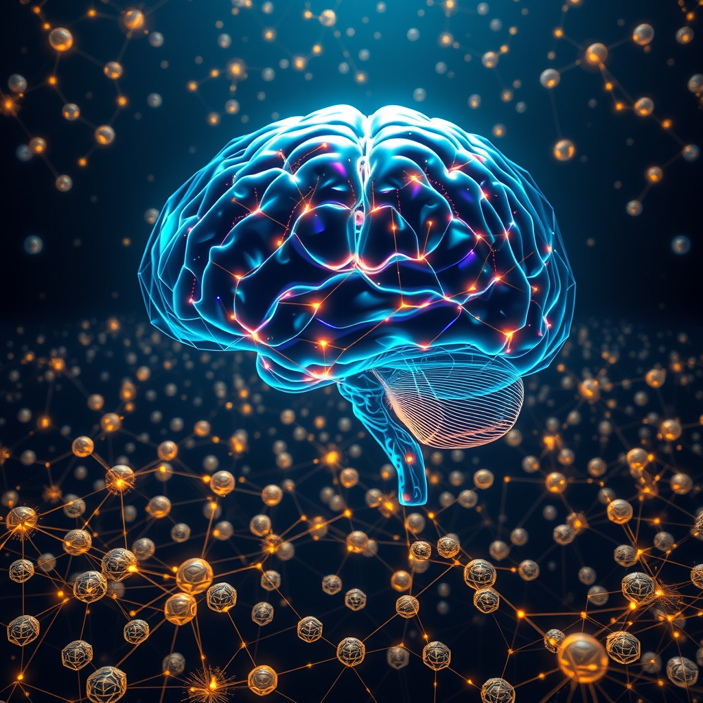

---
aliases:
  - "🧠🧠🧠🧠 A Thousand Brains: A New Theory of Intelligence"
title: "🧠🧠🧠🧠 A Thousand Brains: A New Theory of Intelligence"
Author: "[[jeff-hawkins]]"
Medium: "#Audiobook"
share: true
affiliate link: https://amzn.to/4jzV3d7
link_analysis_model: gemini-3.1-flash-lite-preview
link_analysis_time: 2026-04-21T00:00:00Z
force_analyze_links: false
link_analysis_version: "2"
image_date: 2026-04-22T13:41:20Z
image_model: "@cf/black-forest-labs/flux-1-schnell"
image_prompt: A central, glowing human brain rendered in a stylized, translucent glass aesthetic. Surrounding this central organ are hundreds of smaller, miniature, geometric brain-like nodes floating in a dark, infinite void. These miniature nodes are connected by intricate, shimmering golden lines of light, forming a complex, sprawling neural network that resembles both a biological cortex and a digital constellation. The color palette features deep navy blues and blacks, contrasted by vibrant pulses of cyan, electric purple, and warm gold. The composition should feel expansive and cerebral, emphasizing the concept of distributed intelligence and interconnected mental models.
---
[Home](../index.md) > [Books](./index.md)  
# 🧠🧠🧠🧠 A Thousand Brains: A New Theory of Intelligence  
  
[🛒 A Thousand Brains: A New Theory of Intelligence. As an Amazon Associate I earn from qualifying purchases.](https://amzn.to/4jzV3d7)  
  
## 🤖 AI Summary  
**Summary of *A Thousand Brains***    
Written by Jeff Hawkins, this book presents a groundbreaking theory of intelligence based on the structure and function of the human neocortex. Hawkins explores how our brains create models of the world and the implications for AI, neuroscience, and society.  
  
### Book Recommendations    
1. **Best Alternate on the Same Topic**: *On Intelligence* by Jeff Hawkins and Sandra Blakeslee – Hawkins’ earlier work introducing his ideas about the brain’s prediction-based mechanisms.    
2. **Best Tangentially Related Book**: [🤖⚠️📈 Superintelligence: Paths, Dangers, Strategies](./superintelligence-paths-dangers-strategies.md) by Nick Bostrom – Examines the future of artificial intelligence and its potential impacts on humanity.    
3. **Best Diametrically Opposed Book**: *The Blank Slate: The Modern Denial of Human Nature* by Steven Pinker – Critiques purely structural views of the brain, emphasizing innate behaviors and evolutionary psychology.    
4. **Best Fiction Book Incorporating Related Ideas**: *Blindsight* by Peter Watts – A sci-fi novel that explores consciousness, intelligence, and the limits of human cognition in the context of first contact with alien life.  
  
## References  
1. The mindful brain  
## Content  
### Opening Credits  
  
### Forward by Richard Dawkins  
  
### Part 1: A New Understanding of the Brain  
  
#### 1. Old Brain - New Brain  
  
#### 3. A Model of the World in Your Head  
The brain learns by observing changes in its inputs over time.  
  
#### 4. The Brain Reveals Its Secrets  
- Reference Frames  
-   
  
#### 5. Maps in the Brain  
- orientation cells  
- map cells  
- place cells  
-   
  
#### 6. Concepts, Language, and High-Level Thinking  
  
#### 7. The Thousand Brains Theory of Intelligence  
  
### Part 2: Machine Intelligence  
#### 8. Why There Is No "I" in AI  
#### 9. When Machines Are Conscious  
#### 10. The Future of Machine Intelligence  
#### 11. The Existential Risks of Machine Intelligence  
  
### Part 3: Human Intelligence  
#### 12. False Beliefs  
-   
  
#### 13. The Existential Risks of Human Intelligence  
-   
  
#### 14. Merging Brains and Machines  
#### 15. Estate Planning for Humanity  
#### 16. Genes Versus Knowledge  
### Final Thoughts  
### End Credits  
