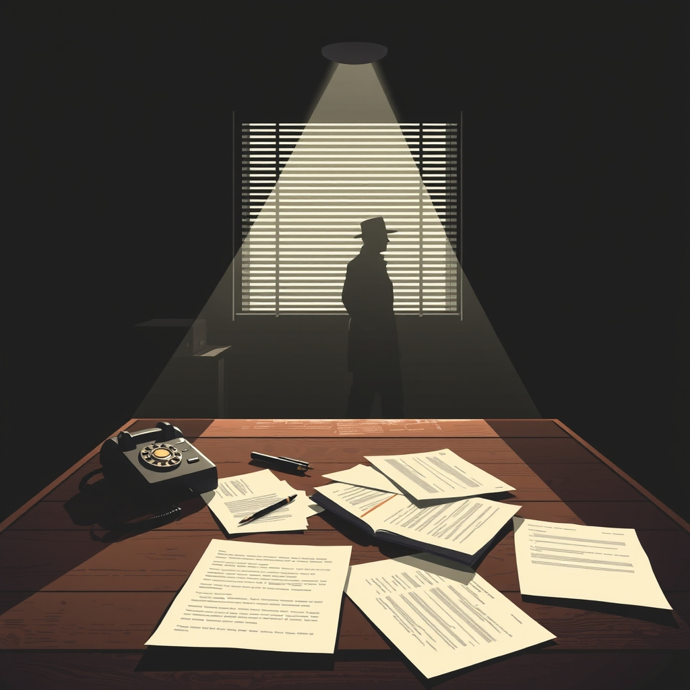

[Home](../index.md) > [Books](./index.md)  
# 🎭🤫 Active Measures: The Secret History of Disinformation and Political Warfare  
  
[🛒 Active Measures: The Secret History of Disinformation and Political Warfare. As an Amazon Associate I earn from qualifying purchases.](https://amzn.to/4qCazd8)  
  
🧐🕵️‍♂️🌐 State-sponsored disinformation is a century-old strategic weapon, often exploiting existing societal divisions and the inherent openness of democratic systems, rather than a novel digital-era phenomenon.  
  
## 🏆 Thomas Rid's Disinformation Strategy  
  
### 🧩 Core Philosophy  
* 🔄 **Continuity over Novelty:** Disinformation, termed active measures by the Soviets, is an evolved historical practice, not solely a digital age creation.  
* 🔓 **Exploitation of Openness:** Democratic societies' free press and open discourse are both strengths and vulnerabilities, readily exploited by foreign adversaries.  
* 🎭 **Blending Truth and Lies:** Most effective active measures weave entirely accurate information with minor falsehoods, making them difficult to debunk and reinforcing narratives.  
* 🎯 **Goal: Division and Distrust:** Primary objective is to sow discord, erode trust in institutions, and weaken opponents from within, rather than outright victory.  
* 📣 **Impact Amplification:** Foreign influence often succeeds not by direct manipulation, but by tempting domestic actors to amplify existing prejudices and divisions.  
  
### ⚙️ Tactical Elements  
* ✍️ **Forgery & Fabrication:** Creation of false documents, letters, or reports to discredit individuals or institutions.  
* 📢 **Propaganda & Influence:** Systematic dissemination of biased or misleading information through media channels.  
* 🏢 **Front Organizations:** Establishing seemingly independent groups to advance an agenda covertly.  
* 💰 **Covert Funding:** Providing financial support to sympathetic political movements, media outlets, or individuals.  
* 📰 **Leaks & Exploitation of Real Information:** Releasing genuine, often damaging, intelligence or private communications to strategic effect.  
* 🗺️ **Narrative Shaping:** Using real events, often grievances or societal fissures, to construct a persuasive, divisive storyline.  
* 🧠 **Psychological Operations (PSYOPs):** Targeting perceptions and cognitive vulnerabilities to alter behavior.  
  
## ⚖️ Critical Evaluation  
* 📜 **Historical Depth & Rigor:** The book is lauded for its meticulous historical research, drawing on declassified archives and primary sources from the Cold War era, particularly Soviet operations.  
* 💥 **Challenging Misconceptions:** Rid effectively shatters the notion that organized disinformation is unique to the digital age, providing essential historical context to contemporary debates.  
* ✅ **Balanced Assessment:** Unlike sensationalized accounts, Rid offers a clear-eyed perspective, acknowledging that active measures are often clumsy, imperfect, and can even be counterproductive.  
* 🇷🇺 **Focus on Soviet/Russian Campaigns:** While deep, the book's primary focus on US-Russia conflicts and Soviet-era active measures means less attention is given to campaigns by other state actors or American offensive disinformation.  
* 🇺🇸 **Limited Scope on Modern American Disinformation:** Critics note a relative lack of detailed examination of contemporary American disinformation campaigns or those by non-state actors.  
* 💯 **Core Claim Verdict:** Thomas Rid's core claim that active measures are a persistent, evolving tool of political warfare, deeply rooted in history and effectively leveraging societal divisions, stands as a thoroughly substantiated and critical contribution to understanding information operations today. The book powerfully demonstrates that modern digital influence campaigns are fundamentally new wine in old bottles.  
  
## 🔍 Topics for Further Understanding  
* 🎭 **The role of non-state actors and extremist groups in generating and disseminating disinformation.**  
* 🇨🇳 **Detailed comparative analysis of Chinese and Iranian active measures strategies.**  
* 🧠 **The psychological mechanisms and cognitive biases that make individuals susceptible to disinformation.**  
* 🛡️ **The ethics of defensive active measures or counter-disinformation operations by democratic states.**  
* 🤖 **The impact of AI and deepfake technologies on the future landscape of disinformation and attribution challenges.**  
* 🏛️ **Effective policy and platform governance solutions to mitigate disinformation without stifling free speech.**  
* 🌐 **The interplay between domestic political polarization and foreign active measures, beyond mere amplification.**  
  
## ❓ Frequently Asked Questions (FAQ)  
### 💡 Q: What are active measures?  
✅ A: Active measures is a term originating from Soviet intelligence, referring to covert influence operations designed to deceive, disrupt, and delegitimize adversaries through organized acts of deception, leaks, forgeries, and manipulation of public media.  
  
### 💡 Q: Is modern disinformation a new phenomenon?  
✅ A: No, Thomas Rid's book, Active Measures: The Secret History of Disinformation and Political Warfare, argues that organized disinformation is not a new problem unique to the digital age, but rather a sophisticated tool of statecraft with a history spanning over a century, evolving through different technological eras.  
  
### 💡 Q: How effective are active measures?  
✅ A: Rid suggests that active measures are often imperfect by design and can be clumsy or even counterproductive, yet they become highly effective when they exploit existing divisions and are amplified by credulous media or a polarized public.  
  
### 💡 Q: What was Russia's role in the 2016 US election disinformation?  
✅ A: Rid's analysis indicates that while Russian disinformation campaigns in 2016 were active, their primary goal was to sow distrust and division, and their true impact was often amplified by the subsequent public and media reactions, rather than direct electoral influence.  
  
## 📚 Book Recommendations  
### 🤝 Similar  
* [🤥📣 This Is Not Propaganda: Adventures in the War Against Reality](./this-is-not-propaganda.md) by Peter Pomerantsev  
* 💻 Sandworm: A New Era of Cyberwar and the Hunt for the Kremlin's Most Dangerous Hackers by Andy Greenberg  
* 📰 How to Lose the Information War: Russia, Fake News, and the Future of Conflict by Nina Jankowicz  
  
### 🙅 Contrasting  
* 🇺🇸 Myth America: Historians Take On the Biggest Legends and Lies About Our Past edited by Kevin M. Kruse and Julian E. Zelizer  
* 📰 Not Exactly Lying: Fake News and Fake Journalism in American History by Andie Tucher  
* 💥 Attack from Within: How Disinformation is Sabotaging America by Barbara McQuade  
  
### ➕ Related  
* ⚔️ The New Rules of War: Victory in the Age of Durable Disorder by Sean McFate  
* 🕵️ Spies: The Epic Intelligence War Between East and West by Calder Walton  
* [🤖🏛️ Lie Machines: How to Save Democracy from Troll Armies, Deceitful Robots, Junk News Operations, and Political Operatives](./lie-machines-how-to-save-democracy-from-troll-armies-deceitful-robots-junk-news-operations-and-political-operatives.md) by Philip N. Howard  
  
## 🫵 What Do You Think?  
Considering Rid's arguments, where do you believe the primary responsibility lies in countering active measures: with governments, technology platforms, individual media literacy, or somewhere else entirely? What historical active measure do you find most shocking or insightful?