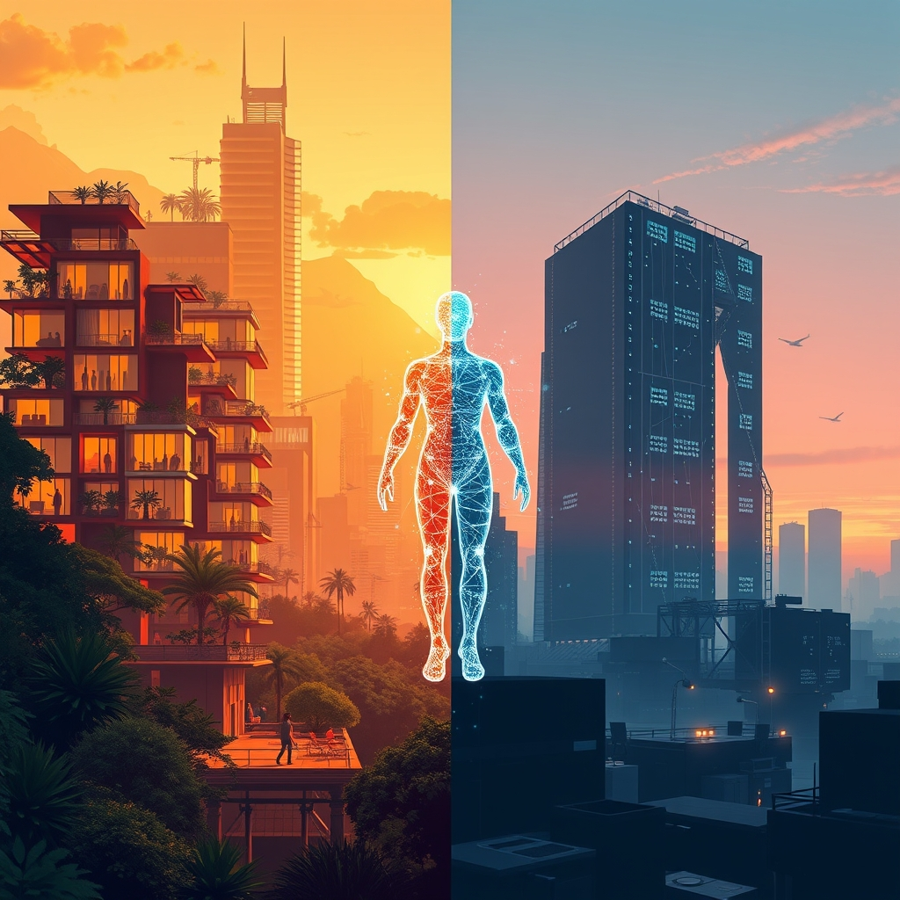

[Home](../index.md) > [Books](./index.md)  
# 🤖🔮🌍 AI 2041: Ten Visions for Our Future  
  
[🛒 AI 2041: Ten Visions for Our Future. As an Amazon Associate I earn from qualifying purchases.](https://www.amazon.com/dp/B08SFL53HL?tag=bagrounds-20)  
🤖🔮 A collection of ten fictional stories illustrates potential societal impacts of artificial intelligence by 2041, exploring both utopian and dystopian outcomes across various global settings.  
  
## 🤖 AI Summary  
### ✨ Core Themes  
* ⚙️ **Technological Advancement:** Depicts near-future AI capabilities (e.g., advanced robotics, quantum computing, digital twins, AI governance).  
* 🌍 **Societal Impact:** Explores AI's influence on jobs, education, healthcare, surveillance, relationships, and human identity.  
* ⚖️ **Ethical Dilemmas:** Addresses issues of privacy, data security, algorithmic bias, AI control, and the nature of consciousness.  
* 🌐 **Global Perspectives:** Presents diverse scenarios from different cultures and economies, highlighting varied AI adoption and challenges.  
  
### 🔮 Key Predictions & Visions  
* 📱 **AI in Daily Life:** Ubiquitous integration into personal assistants, autonomous vehicles, smart cities, and personalized services.  
* 💼 **Workforce Transformation:** Job displacement in some sectors, creation of new roles, demand for continuous reskilling.  
* ⚕️ **Healthcare Revolution:** AI-powered diagnostics, drug discovery, personalized medicine, extended lifespans.  
* 📚 **Education Evolution:** Adaptive learning systems, AI tutors, lifelong learning platforms.  
* ⚔️ **Geopolitical Shifts:** AI as a tool for national competition and cooperation, surveillance states, potential for autonomous warfare.  
* 🤝 **Human-AI Interaction:** Development of companion AI, ethical considerations of AI sentience.  
  
### 💡 Actionable Insights  
* 📜 **Policy & Governance:** Need for proactive legislation on AI ethics, data privacy, and algorithmic fairness.  
* 🧠 **Education System Reform:** Prioritize critical thinking, creativity, and interdisciplinary skills to complement AI.  
* 🌱 **Personal Adaptation:** Embrace lifelong learning, develop uniquely human skills, understand AI's limitations and biases.  
* ✨ **Ethical Frameworks:** Foster public dialogue and establish robust ethical guidelines for AI development and deployment.  
* 🌍 **Global Collaboration:** Encourage international cooperation on AI safety standards and shared benefits.  
  
## ⚖️ Evaluation  
* 📖 The book effectively uses a narrative approach to make complex AI concepts accessible and engaging, providing a human-centric view of future technology.  
* ✍️ Authors Kai-Fu Lee and Chen Qiufan combine technical expertise with literary skill, offering plausible scenarios that are grounded in current AI trends and research.  
* 🤔 Criticism often points to the book's sometimes overly optimistic or deterministic portrayal of AI's progression, potentially downplaying unforeseen complexities or societal resistance.  
* 🌐 The emphasis on diverse global settings is praised for moving beyond a Western-centric view of AI development and impact.  
* 🔍 Some reviewers suggest that while the stories are compelling, the solutions or mitigation strategies for the presented challenges are less developed than the problems themselves.  
* 📚 Comparatively, other futurists like Yuval Noah Harari (in Homo Deus) explore similar themes but often with a broader philosophical lens on humanity's future rather than specific AI applications [Yuval Noah Harari, 2016].  
* ❤️ In contrast to more purely technical AI predictions, AI 2041 focuses on the social and emotional dimensions, offering a more nuanced perspective on human-AI co-evolution.  
  
## 🔍 Topics for Further Understanding  
* 🌍 The geopolitical race for AI supremacy and its implications for international relations.  
* ⚡ The energy demands of advanced AI systems and their environmental impact.  
* 🧠 The philosophical implications of AI consciousness and rights for synthetic beings.  
* 📜 Regulatory frameworks and international treaties specifically addressing autonomous weapons systems.  
* ⚖️ The potential for AI to exacerbate or mitigate global inequalities and access to resources.  
* ⚛️ The role of quantum computing in accelerating AI capabilities beyond current predictions.  
* 🤝 The psychology of human-AI interaction, including attachment, trust, and manipulation.  
  
## ❓ Frequently Asked Questions (FAQ)  
### 💡 Q: What is AI 2041: Ten Visions for Our Future about?  
✅ A: AI 2041: Ten Visions for Our Future presents ten short science fiction stories, each set in a different part of the world, illustrating how artificial intelligence might transform human society by the year 2041, exploring both beneficial and challenging scenarios.  
  
### 💡 Q: Who wrote AI 2041: Ten Visions for Our Future?  
✅ A: AI 2041: Ten Visions for Our Future was co-authored by Kai-Fu Lee, a prominent AI venture capitalist and former head of Google China, and Chen Qiufan, an award-winning science fiction author.  
  
### 💡 Q: What are the main themes explored in AI 2041: Ten Visions for Our Future?  
✅ A: AI 2041: Ten Visions for Our Future explores themes such as the future of work, education, healthcare, surveillance, ethical dilemmas in AI, human relationships with AI, and the impact of AI on global geopolitics and individual identity.  
  
### 💡 Q: Is AI 2041: Ten Visions for Our Future a non-fiction book?  
✅ A: While AI 2041: Ten Visions for Our Future is presented as a collection of fictional stories, each story is prefaced by an essay from Kai-Fu Lee explaining the underlying AI technologies and their real-world potential, effectively blending fiction with non-fiction insights.  
  
### 💡 Q: How does AI 2041: Ten Visions for Our Future differ from other books about AI?  
✅ A: Unlike many purely technical or philosophical AI books, AI 2041: Ten Visions for Our Future uses a unique short-story format to vividly demonstrate the human experience of living with advanced AI, making complex concepts relatable and emotionally resonant.  
  
## 📚 Book Recommendations  
### ✨ Similar  
* 📖 [🧬👥💾 Life 3.0: Being Human in the Age of Artificial Intelligence](./life-3-0.md) by Max Tegmark  
* 📖 Homo Deus: A Brief History of Tomorrow by Yuval Noah Harari  
* 📖 [🤖⚠️📈 Superintelligence: Paths, Dangers, Strategies](./superintelligence-paths-dangers-strategies.md) by Nick Bostrom  
  
### 🚫 Contrasting  
* 📖 [👁️‍🗨️💰⛓️👤 The Age of Surveillance Capitalism: The Fight for a Human Future at the New Frontier of Power](./the-age-of-surveillance-capitalism.md) by Shoshana Zuboff  
* 📖 Technically Wrong: Sexist Apps, Biased Algorithms, and Other Threats of Toxic Tech by Sara Wachter-Boettcher  
* 📖 The Master Algorithm: How the Quest for the Ultimate Learning Machine Will Remake Our World by Pedro Domingos  
  
### 🔗 Related  
* 📖 The Three-Body Problem by Liu Cixin (for Chinese sci-fi perspective)  
* 📖 [📜🌍⏳ Sapiens: A Brief History of Humankind](./sapiens-a-brief-history-of-humankind.md) by Yuval Noah Harari (for broad historical context of humanity)  
* 📖 [🤔🌍📈✅ Factfulness: Ten Reasons We're Wrong About the World - and Why Things Are Better Than You Think](./factfulness.md): Ten Reasons We're Wrong About the World—and Why Things Are Better Than You Think by Hans Rosling (for data-driven optimism)  
  
## 🫵 What Do You Think?  
🤔 Which of the ten visions in AI 2041 do you find most plausible, and which gives you the most pause? How do you believe current societal structures need to adapt to the accelerating pace of AI development?  
  
## 🦋 Bluesky    
<blockquote class="bluesky-embed" data-bluesky-uri="at://did:plc:i4yli6h7x2uoj7acxunww2fc/app.bsky.feed.post/3mitloktcys2s" data-bluesky-cid="bafyreibzavs5iwvcrfwdeehf6q7ussjoyudtvnuivxonsxahadjzemultq">
🤖🔮🌍 AI 2041: Ten Visions for Our Future  
  
#AI Q: 🤖 Which aspect of a future dominated by artificial intelligence excites or terrifies you the most?  
  
🤖 Future Scenarios | 🌍 Global Impact | ⚙️ Tech Evolution | 🤔 Ethical Questions  
https://bagrounds.org/books/ai-2041-ten-visions-for-our-future
&mdash; <a href="https://bsky.app/profile/did:plc:i4yli6h7x2uoj7acxunww2fc?ref_src=embed">Bryan Grounds (@bagrounds.bsky.social)</a> <a href="https://bsky.app/profile/did:plc:i4yli6h7x2uoj7acxunww2fc/post/3mitloktcys2s?ref_src=embed">2026-04-06T15:35:02.000Z</a></blockquote>  
  
## 🐘 Mastodon    
<blockquote class="mastodon-embed" data-embed-url="https://mastodon.social/@bagrounds/116358493126817843/embed" style="background: #282c37; border-radius: 8px; border: 1px solid #393f4f; margin: 0; max-width: 540px; min-width: 270px; overflow: hidden; padding: 0;"> <a href="https://mastodon.social/@bagrounds/116358493126817843" target="_blank" style="align-items: center; color: #d9e1e8; display: flex; flex-direction: column; font-family: system-ui, -apple-system, BlinkMacSystemFont, 'Segoe UI', Oxygen, Ubuntu, Cantarell, 'Fira Sans', 'Droid Sans', 'Helvetica Neue', Roboto, sans-serif; font-size: 14px; justify-content: center; letter-spacing: 0.25px; line-height: 20px; padding: 24px; text-decoration: none;"> <svg xmlns="http://www.w3.org/2000/svg" xmlns:xlink="http://www.w3.org/1999/xlink" width="32" height="32" viewBox="0 0 79 75"><path d="M63 45.3v-20c0-4.1-1-7.3-3.2-9.7-2.1-2.4-5-3.7-8.5-3.7-4.1 0-7.2 1.6-9.3 4.7l-2 3.3-2-3.3c-2-3.1-5.1-4.7-9.2-4.7-3.5 0-6.4 1.3-8.6 3.7-2.1 2.4-3.1 5.6-3.1 9.7v20h8V25.9c0-4.1 1.7-6.2 5.2-6.2 3.8 0 5.8 2.5 5.8 7.4V37.7H44V27.1c0-4.9 1.9-7.4 5.8-7.4 3.5 0 5.2 2.1 5.2 6.2V45.3h8ZM74.7 16.6c.6 6 .1 15.7.1 17.3 0 .5-.1 4.8-.1 5.3-.7 11.5-8 16-15.6 17.5-.1 0-.2 0-.3 0-4.9 1-10 1.2-14.9 1.4-1.2 0-2.4 0-3.6 0-4.8 0-9.7-.6-14.4-1.7-.1 0-.1 0-.1 0s-.1 0-.1 0 0 .1 0 .1 0 0 0 0c.1 1.6.4 3.1 1 4.5.6 1.7 2.9 5.7 11.4 5.7 5 0 9.9-.6 14.8-1.7 0 0 0 0 0 0 .1 0 .1 0 .1 0 0 .1 0 .1 0 .1.1 0 .1 0 .1.1v5.6s0 .1-.1.1c0 0 0 0 0 .1-1.6 1.1-3.7 1.7-5.6 2.3-.8.3-1.6.5-2.4.7-7.5 1.7-15.4 1.3-22.7-1.2-6.8-2.4-13.8-8.2-15.5-15.2-.9-3.8-1.6-7.6-1.9-11.5-.6-5.8-.6-11.7-.8-17.5C3.9 24.5 4 20 4.9 16 6.7 7.9 14.1 2.2 22.3 1c1.4-.2 4.1-1 16.5-1h.1C51.4 0 56.7.8 58.1 1c8.4 1.2 15.5 7.5 16.6 15.6Z" fill="currentColor"/></svg> 
Post by @bagrounds@mastodon.social
 
View on Mastodon
 </a> </blockquote>   
