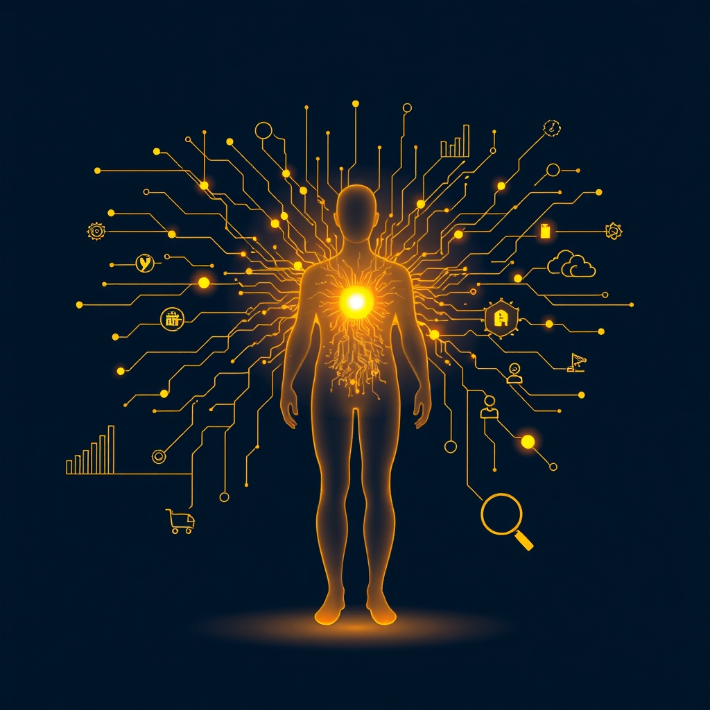

[Home](../index.md) > [Books](./index.md)  
# 🤖📈 AI for Marketing and Product Innovation: Powerful New Tools for Predicting Trends, Connecting with Customers, and Closing Sales  
  
[🛒 AI for Marketing and Product Innovation: Powerful New Tools for Predicting Trends, Connecting with Customers, and Closing Sales. As an Amazon Associate I earn from qualifying purchases.](https://amzn.to/47hWcmX)  
  
## 🤖 Book Report: 🧠 AI for Marketing and Product Innovation  
  
**🧠 AI for Marketing and Product Innovation: 🚀 Powerful New Tools for Predicting Trends, 🤝 Connecting with Customers, and 💰 Closing Sales**, ✍️ authored by A.K. Pradeep, Andrew Appel, and Stan Sthanunathan, 📚 serves as a non-technical guide for professionals in the marketing and creative fields. 📅 Published in 2018, 📖 the book demystifies the concepts of artificial intelligence (AI) and machine learning (ML), ⚙️ positioning them as transformative tools for revolutionizing sales and marketing strategies. 👨‍💻 The authors, a team of experts in neuroscience, technology, and marketing, 🌉 aim to bridge the gap between complex technological innovations and their practical, human-centric applications in the business world.  
  
### 🔑 Core Themes  
  
📖 The book's central premise is that AI and ML are no longer futuristic concepts but are present-day technologies that can be harnessed to gain a significant competitive advantage. ➡️ It moves beyond a simple explanation of "what" AI is to a more practical exploration of "how" it can be effectively implemented. Key themes include:  
  
* 🧑‍🤝‍🧑 **Humanizing Technology:** 🎯 A primary focus is on utilizing AI and ML to foster deeper, more meaningful connections with customers by understanding their conscious and subconscious needs.  
* 💡 **Actionable Insights:** 📊 The authors emphasize the power of AI to analyze vast amounts of data to produce actionable insights for product innovation, brand development, and targeted marketing.  
* 👨‍💻 **Practical Application over Theory:** 📚 The book is designed as a practical guide, offering real-world examples and best practices for implementing AI in marketing. 🗺️ It provides a roadmap for marketers to navigate the adoption of AI, regardless of their current level of expertise.  
* 🔮 **Predictive Power:** 📈 The text highlights AI's capability to predict consumer trends and behaviors, enabling more effective customer segmentation and personalized marketing efforts.  
  
📖 The book is structured to guide the reader from foundational concepts to practical applications. 🚀 It begins by outlining the major challenges modern marketers face and introduces the basic principles of AI and machine learning in an accessible manner. ➡️ Subsequent chapters delve into the intuition behind key AI techniques, such as neural networks, deep learning, clustering, and classification, as they apply to marketing. 🗄️ The authors also address the importance of data sources and data cleanup. 💰 A significant portion of the book is dedicated to specific applications of AI in product innovation, pricing dynamics, and media measurement, illustrating how these technologies can enhance ROI.  
  
## 📚 Book Recommendations  
  
### 🤝 Similar Reads: 🧰 The Practitioner's AI Toolkit  
  
* 🤖 **Marketing Artificial Intelligence: 🧠 AI, 📣 Marketing, and the 🔮 Future of Business** by Paul Roetzer and Mike Kaput: 🗺️ This book provides a blueprint for understanding and applying AI in marketing, focusing on how to make it a competitive advantage. 👍 It's praised for demystifying AI and offering a realistic framework for its implementation.  
* 🎨 **The AI Marketing Canvas: 🗺️ A Five-Stage Road Map to Implementing Artificial Intelligence In Marketing** by Raj Venkatesan and Jim Lecinski: 🛣️ This book offers a structured, five-stage approach for marketers to integrate AI into their strategies, emphasizing the use of AI to enhance authentic customer connections.  
* 🙋 **AI for Marketers: 📖 An Introduction and Primer** by Christopher S. Penn: 👨‍🏫 A comprehensive and accessible guide for those new to AI in marketing, this book explains the fundamentals and offers guidance on evaluating AI vendors.  
* 🧑‍💻 **Using AI in Marketing: 📖 An Introduction** by Greg Kihlström: 🚀 This book delves into key topics like generative AI, personalized customer experiences, and data analysis optimization, providing a solid introduction for marketing professionals.  
* 💰 **The AI Edge: 📈 Sales Strategies for Unleashing the Power of AI to ⏰ Save Time, 🚀 Sell More, and 🏆 Crush the Competition** by Anthony Iannarino and Jeb Blount: 🤝 This hands-on guide focuses on marrying sales strategies with the power of AI to streamline processes and empower engagement.  
  
### ⚖️ Contrasting Perspectives: 🔎 The Critical Lens on AI  
  
* **[📊📉🏛️ Weapons of Math Destruction: How Big Data Increases Inequality and Threatens Democracy](./weapons-of-math-destruction-how-big-data-increases-inequality-and-threatens-democracy.md)** by Cathy O'Neil: 🌑 This book explores the dark side of big data and algorithms, arguing that they can perpetuate and even worsen societal inequalities.  
* **[👁️‍🗨️💰⛓️👤 The Age of Surveillance Capitalism: The Fight for a Human Future at the New Frontier of Power](./the-age-of-surveillance-capitalism.md)** by Shoshana Zuboff: 🏛️ A seminal work that examines how technology companies are using our personal data to predict and control our behavior for profit.  
* 🌍 **Atlas of AI: ✊ Power, 🏛️ Politics, and the 💸 Planetary Costs of Artificial Intelligence** by Kate Crawford: 🌿 This book reveals the hidden costs of AI, from the natural resources it consumes to the human labor it exploits, and questions the narratives of AI as a neutral and objective technology.  
* 😇 **Ethical AI in Marketing: 🤝 Aligning Growth, ⚖️ Responsibility and 🫂 Customer Trust** by Nicole M. Alexander: 🛠️ This practical guide equips marketing professionals to navigate the ethical complexities of AI-driven marketing, focusing on fostering consumer trust.  
* 📢 **AI Marketing and Ethical Considerations in Consumer Engagement** by Business Science Reference: 📖 This book examines the use of AI in marketing practices with a focus on ethical issues like data privacy and sustainability.  
  
### ✨ Creatively Related: 🔭 Expanding the Horizons of Innovation  
  
* 🎨 **The Artist in the Machine: 🤖 The World of AI-Powered Creativity** by Arthur I. Miller: 🚀 This book explores the evolving landscape of AI-enhanced artistry and how AI can be a powerful tool for generating novel ideas and pushing creative boundaries.  
* ✨ **AI for Creativity** by Niklas Hageback: 💡 This book delves into the question of whether AI can learn to be creative and explores the applications of computational creativity.  
* 🧑‍🤝‍🧑 **Interaction Design: 🧑‍💻 Beyond Human-Computer Interaction** by Jenny Preece, Helen Sharp, and Yvonne Rogers: 👨‍🏫 A comprehensive introduction to the principles of designing for user experience, a crucial aspect of making technology that truly connects with people.  
* **[💺🚪💡🤔 The Design of Everyday Things](./the-design-of-everyday-things.md)** by Don Norman: 📖 A classic text that explains the principles of human-centered design, offering timeless insights into why some products satisfy customers while others frustrate them.  
* **[💡🤖💰💥🏢📉 The Innovator's Dilemma: When New Technologies Cause Great Firms to Fail](./the-innovators-dilemma.md)** by Clayton M. Christensen: 🚀 While not about AI specifically, this influential book provides a foundational understanding of how disruptive innovation can transform industries, a relevant concept for the AI revolution in marketing.  
  
## 💬 [Gemini](../software/gemini.md) Prompt (gemini-2.5-pro)  
> Write a markdown-formatted (start headings at level H2) book report, followed by a plethora of additional similar, contrasting, and creatively related book recommendations on AI for Marketing and Product Innovation: Powerful New Tools for Predicting Trends, Connecting with Customers, and Closing Sales. Never put book titles in quotes or italics. Be thorough in content discussed but concise and economical with your language. Structure the report with section headings and bulleted lists to avoid long blocks of text.