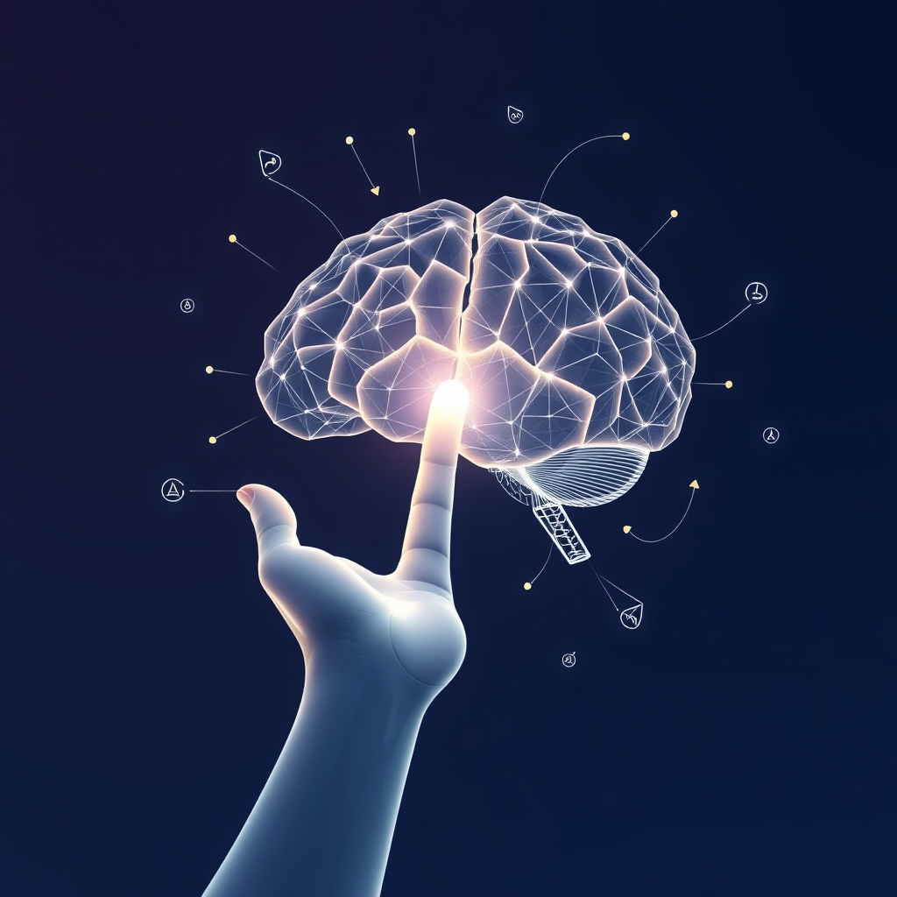

[Home](../index.md) > [Books](./index.md)  
# 🤖🖱️🤝 AI meets UX: Designing the Next Generation of User-Centered Products: Where innovation meets empathy to shape the future of design  
  
[🛒 AI meets UX: Designing the Next Generation of User-Centered Products: Where innovation meets empathy to shape the future of design. As an Amazon Associate I earn from qualifying purchases.](https://amzn.to/455KHfS)  
  
## 🤖 The Human Touch in the Machine: A Report on "AI meets UX"  
  
**📖 A guide for crafting empathetic and effective AI-powered products, "AI meets UX: Designing the Next Generation of User-Centered Products" by Wandher Souza and Patrick Kelly Shannon emerges as a timely and essential toolkit for navigating the intersection of artificial intelligence and user experience.** 👨‍💻 This book serves as a practical manual for a diverse audience, including UX designers, product managers, developers, and AI enthusiasts, who are all stakeholders in shaping our increasingly intelligent digital world. 🤝 Through a blend of foundational knowledge and actionable advice, the authors champion a user-centered approach to AI, emphasizing that innovation must be intrinsically linked with empathy.  
  
### 🧠 Core Concepts: Beyond the Algorithm  
  
 ⚙️ The book demystifies complex AI technologies, offering accessible explanations of machine learning and natural language processing and their profound impact on user interactions. 🚀 It moves beyond the technical to address the critical human elements of AI design. 💡 The authors posit that for AI to be truly successful and widely adopted, it must be built on a foundation of trust and transparency. ✅ This involves creating systems that are not only intelligent but also understandable and fair in their operations.  
  
🔑 Key tenets explored in the book include:  
  
* 🤝 **Designing for Trust:** 🛡️ The book provides frameworks for building user confidence by ensuring transparency in how AI features work, promoting fairness in algorithmic outcomes, and offering meaningful personalization.  
* ⚖️ **Tackling Ethical Challenges:** 🧐 Souza and Shannon confront the ethical complexities inherent in AI, offering guidance on addressing crucial issues like user privacy, algorithmic bias, and the importance of inclusivity in design.  
* 🧑‍🤝‍🧑 **Fostering Collaboration:** 🏗️ Recognizing that the creation of successful AI products is a multidisciplinary effort, the book emphasizes the need for seamless collaboration between designers, developers, and data scientists.  
* 🛠️ **Actionable Insights:** 🧑‍🏫 "AI meets UX" is designed to be a hands-on guide, incorporating exercises, real-world examples, and workshop ideas to help readers immediately apply the concepts they learn.  
  
### 🚀 A Toolkit for the Future of Design  
  
 💡 "AI meets UX" stands out as more than just a theoretical exploration. 🧰 It is positioned as a step-by-step toolkit for creating products that resonate with users on a human level. 👨‍🔬 The authors draw on their extensive experience to provide the necessary insights and tools to innovate and push the boundaries of what is possible in AI-driven design. 📣 The book is a call to action for creators to not only embrace the power of AI but to do so with a profound sense of responsibility and a commitment to user-centered principles.  
  
## 📚 Book Recommendations  
  
### 🔗 Similar Reads: Deepening the AI x UX Connection  
  
* 🗣️ **"Designing Voice User Interfaces: Principles of Conversational Experiences" by Cathy Pearl:** 🎧 This book offers a specialized dive into a key area of AI-powered interaction, providing a foundational understanding of how to design intuitive and effective voice-based experiences.  
* 🌍 **"The Age of AI: And Our Human Future" by Henry A. Kissinger, Eric Schmidt, and Daniel Huttenlocher:** 🔮 For a high-level perspective on the societal implications of AI, this book brings together three unique viewpoints to explore how AI will transform our world, a macro-context that is essential for any AI product designer.  
* ✅ **"Human-Centered AI" by Ben Shneiderman:** 👨‍🏫 A strong academic voice in the field, Shneiderman provides a robust framework for creating AI systems that are reliable, safe, and trustworthy, echoing the core tenets of "AI meets UX."  
  
### 🧐 Contrasting Perspectives: The Critical Lens on AI  
  
* **[📊📉🏛️ Weapons of Math Destruction: How Big Data Increases Inequality and Threatens Democracy](./weapons-of-math-destruction-how-big-data-increases-inequality-and-threatens-democracy.md) by Cathy O'Neil:** ⚠️ This serves as a crucial counterpoint, revealing the dark side of algorithmic decision-making and reinforcing the ethical urgency that "AI meets UX" advocates for.  
* **[💺🚪💡🤔 The Design of Everyday Things](./the-design-of-everyday-things.md) by Don Norman:** ✨ A foundational text in user-centered design, this book, while not focused on AI, provides the essential principles of intuitive and human-friendly design that must be applied to even the most complex AI systems.  
* **[🤖⚠️📈 Superintelligence: Paths, Dangers, Strategies](./superintelligence-paths-dangers-strategies.md) by Nick Bostrom:** 🤖 This book takes a philosophical and cautionary look at the long-term risks of advanced AI, offering a stark contrast to the more immediate, practical concerns of product design and encouraging a deeper consideration of the ultimate goals of artificial intelligence.  
  
### 🎨 Creatively Related: Expanding the Mind of the Designer  
  
* **[🤔🐇🐢 Thinking, Fast and Slow](./thinking-fast-and-slow.md) by Daniel Kahneman:** 🤔 To design for humans, one must understand how they think. 💡 Kahneman's exploration of the two systems that drive human thought provides invaluable insights for any designer seeking to create truly user-centric experiences.  
* **[✨🎭🧘‍♂️🌌 The Creative Act: A Way of Being](./the-creative-act.md) by Rick Rubin:** 🎵 While not a design book in the traditional sense, Rubin's reflections on creativity and artistry offer a wellspring of inspiration for those looking to innovate and bring a unique, human touch to their technological creations.  
* 💔 Klara and the Sun by Kazuo Ishiguro: 🌻 This work of fiction offers a poignant and empathetic exploration of what it means to be an artificial friend, providing a powerful narrative lens through which to consider the emotional and ethical dimensions of human-AI relationships.  
  
## 💬 [Gemini](../software/gemini.md) Prompt (gemini-2.5-pro)  
> Write a markdown-formatted (start headings at level H2) book report, followed by a plethora of additional similar, contrasting, and creatively related book recommendations on AI meets UX: Designing the Next Generation of User-Centered Products: Where innovation meets empathy to shape the future of design. Be thorough in content discussed but concise and economical with your language. Structure the report with section headings and bulleted lists to avoid long blocks of text.