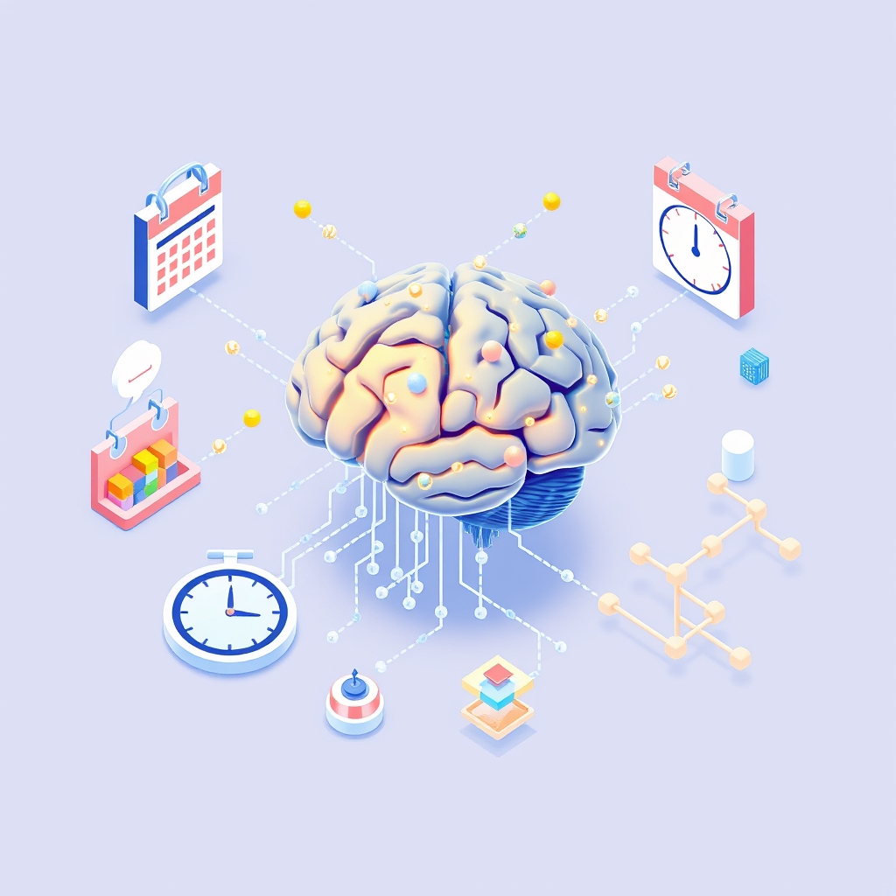

[Home](../index.md) > [Books](./index.md)  
# 🤔💻🧠 Algorithms to Live By: The Computer Science of Human Decisions  
  
[🛒 Algorithms to Live By: The Computer Science of Human Decisions. As an Amazon Associate I earn from qualifying purchases.](https://amzn.to/4kxUFwM)  
  
## 📚 Book Report: 🤖 Algorithms to Live By: 💻 The Computer Science of Human Decisions  
  
**🧑‍🤝‍🧑 Authors:** Brian Christian and Tom Griffiths  
**📚 Genre:** Non-fiction, 💻 Computer Science, 🧠 Psychology, 🙋 Self-Help  
  
### 💡 Introduction  
  
* 🤖 *Algorithms to Live By* explores the surprising connection between computer science principles and everyday human decision-making.  
* 🧑‍🤝‍🧑 Authors Brian Christian (author and researcher with degrees in Philosophy and Computer Science) and Tom Griffiths (cognitive scientist) demonstrate how algorithms developed for computers can offer strategies for tackling common human challenges involving limited time, space, and information.  
* ✍️ The book translates complex computer science concepts into accessible, practical advice for navigating life's choices.  
  
### 🔑 Key Concepts and Algorithms Discussed  
  
* 🛑 **Optimal Stopping:** Addresses "when to stop looking" problems, like searching for an 🏠 apartment, 💍 spouse, or 🅿️ parking spot. Suggests the "37% Rule" as a guideline: explore options for the first 37% of your search time/pool, then commit to the next option better than any seen before.  
* 🤔 **Explore/Exploit:** Balances trying new things (exploration) versus sticking with known favorites (exploitation), relevant for choosing 🍽️ restaurants, 🎶 music, or even 🔬 research topics.  
* 🗂️ **Sorting:** Discusses the efficiency of different sorting methods (like Bubble Sort, Merge Sort, Bucket Sort) and their trade-offs, relating them to organizing physical items (desks, closets) or digital information (emails).  
* 💾 **Caching:** Explains how computers manage limited, fast memory (cache) and relates it to human memory and organizing frequently used items (like clothes or desk files) for quick access. Suggests strategies like Least Recently Used (LRU).  
* 📅 **Scheduling:** Covers strategies for managing tasks and deadlines, such as minimizing lateness (Moore's Algorithm), reducing total completion time (Shortest Processing Time), or handling interruptions and context switching (Thrashing).  
* ⚖️ **Bayes' Rule:** Shows how to update beliefs and make predictions based on new evidence, combining prior knowledge with observed data. Useful for everything from medical diagnosis to everyday hunches.  
* 📈 **Overfitting:** Warns against creating overly complex models or plans based on limited data, which may perform worse than simpler approaches. Encourages regularization or "thinking less" in certain situations.  
* 🧘 **Relaxation:** Deals with hard, intractable problems by simplifying constraints or accepting "good enough" solutions instead of perfect ones.  
* 🎲 **Randomness:** Highlights the surprising utility of randomness in breaking ties, finding creative solutions, and avoiding getting stuck in suboptimal patterns.  
* 🌐 **Networking:** Applies concepts like network congestion and protocols to understand social dynamics, information flow, and communication bottlenecks.  
* 🤝 **Game Theory:** Explores strategic decision-making when outcomes depend on the choices of others, using concepts like the Prisoner's Dilemma to understand cooperation and competition.  
  
### 👍 Strengths  
  
* 🗣️ **Accessibility:** Translates complex computer science ideas into easily understandable language with relatable examples.  
* ✨ **Novel Perspective:** Offers a unique and rational framework for approaching everyday dilemmas.  
* 💪 **Practical Insights:** Provides actionable strategies for common problems like decision-making, organization, and time management.  
* ✍️ **Engaging Style:** Written with clarity, humor, and compelling anecdotes.  
* ➕ **Interdisciplinary:** Successfully blends computer science, cognitive psychology, and practical philosophy.  
  
### 👎 Weaknesses/Critiques  
  
* 🤏 **Oversimplification:** Some metaphors might feel like a stretch, and real-life complexity often exceeds algorithmic models. Direct application may not always work due to life's numerous constraints.  
* 🤓 **Limited Depth for Experts:** While accessible, it may lack technical depth for readers already familiar with computer science algorithms.  
* 🤔 **Rationality Focus:** Primarily emphasizes rational, optimal strategies, potentially downplaying emotional or intuitive aspects of decision-making (though some reviews note it embraces messy compromises).  
  
### 🏁 Conclusion  
  
* 🤖 *Algorithms to Live By* is a fascinating and thought-provoking read that successfully bridges the gap between computer science and human psychology. 🧠 It empowers readers with a new vocabulary and toolkit for making better decisions by understanding the underlying structure of the problems they face daily. 📚 It is highly recommended for anyone interested in decision-making, productivity, popular science, or simply understanding the human mind through a novel computational lens.  
  
## 📚 Book Recommendations  
  
### ➕ Similar Reads (Applying Science/Logic to Life)  
  
* 🤔 **[How Not to Be Wrong: The Power of Mathematical Thinking](./how-not-to-be-wrong.md)** by Jordan Ellenberg: Explores how mathematical thinking illuminates real-world issues and everyday life, similar to applying algorithmic thinking.  
* **[🔮🎨🔬 Superforecasting: The Art and Science of Prediction](./superforecasting-the-art-and-science-of-prediction.md)** by Philip E. Tetlock and Dan Gardner: Focuses on improving prediction skills, aligning with the book's theme of using structured thinking (like Bayes' Rule) for better judgment.  
* 🧠 **[Thinking, Fast and Slow](./thinking-fast-and-slow.md)** by Daniel Kahneman: While focusing more on cognitive biases (see Contrasting Reads), it deeply explores the mechanisms of human thought and decision-making, a core topic in *Algorithms to Live By*.  
* ⚖️ **The Logic of Life: The Rational Economics of an Irrational World** by Tim Harford: Argues that seemingly irrational behaviors often have underlying rational explanations based on incentives, echoing the application of logical frameworks to human actions.  
* 🤖 **Hello World: Being Human in the Age of Algorithms** by Hannah Fry: Explores the impact and function of algorithms in modern society, covering similar ground but perhaps with a broader societal focus.  
* 📊 **Dataclysm: Who We Are (When We Think No One's Looking)** by Christian Rudder: Uses data analysis (often algorithm-driven) from online behavior to understand human nature and decision-making.  
  
### ➖ Contrasting Reads (Behavioral Economics, Deeper CS, Philosophy)  
  
* 🤪 **[Predictably Irrational](./predictably-irrational.md): The Hidden Forces That Shape Our Decisions** by Dan Ariely: Focuses on the systematic *irrationality* of human decision-making, contrasting with the *optimal* strategies suggested by algorithms.  
* 👉 **[Nudge](./nudge.md): Improving Decisions About Health, Wealth, and Happiness** by Richard H. Thaler and Cass R. Sunstein: Explores how "choice architecture" can gently guide (nudge) people towards better decisions, acknowledging cognitive biases rather than purely rational optimization.  
* 🤝 **[Influence](./influence.md): The Psychology of Persuasion** by Robert Cialdini: Examines the psychological principles behind why people comply with requests, focusing on persuasion tactics rather than internal decision algorithms.  
* 💻 **Introduction to Algorithms** by Cormen, Leiserson, Rivest, and Stein (CLRS): A comprehensive, rigorous textbook on algorithms for those seeking a deeper, technical understanding far beyond the analogies in *Algorithms to Live By*.  
* ⚙️ **The Algorithm Design Manual** by Steven S. Skiena: Another well-regarded technical book focusing on practical algorithm design and implementation.  
* ♾️ **[Gödel, Escher, Bach: An Eternal Golden Braid](./godel-escher-bach.md)** by Douglas Hofstadter: A philosophical exploration of cognition, recursion, and formal systems, offering a much deeper, more abstract perspective on related concepts.  
* ✍️ **Designing for Behavior Change: Applying Psychology and Behavioral Economics** by Stephen Wendel: Focuses on using behavioral science to design products that influence user actions, a practical application contrasting with the personal decision focus of *Algorithms to Live By*.  
  
### 🎨 Creatively Related Reads (Complexity, Systems, Information, Thinking Tools)  
  
* **[🧑‍💻📈 The Pragmatic Programmer: Your Journey to Mastery](./the-pragmatic-programmer-your-journey-to-mastery.md)** by Andrew Hunt and David Thomas: While aimed at software developers, it offers practical advice on thinking, learning, and problem-solving that resonates with applying structured approaches to complex tasks.  
* 👨‍💻 **Code: The Hidden Language of Computer Hardware and Software** by Charles Petzold: Explains the fundamental building blocks of computers and computation, providing context for where algorithms operate.  
* 🖥️ **The Most Complex Machine: A Survey of Computers and Computing** by David Eck: Explains computation accessibly and connects it to daily life, similar in goal but perhaps broader in scope than just algorithms.  
* 💡 **Tools For Thought** by Howard Rheingold: An older but insightful look at the history and potential of computers to augment human intellect.  
* 📚 **From Computing to Computational Thinking** by Paul S. Wang: A guidebook explaining computational thinking concepts without programming knowledge, using everyday examples.  
* ⚔️ **Chip War: The Fight for the World's Most Critical Technology** by Chris Miller: Explores the geopolitical and technological battle over microchips, the hardware upon which algorithms run.  
* ℹ️ **The Information: A History, a Theory, a Flood** by James Gleick: A historical and conceptual exploration of information theory, which underlies much of computer science and algorithmic thinking.  
* **[🤖🧑‍ Human Compatible: Artificial Intelligence and the Problem of Control](./human-compatible-artificial-intelligence-and-the-problem-of-control.md)** by Stuart Russell: Discusses the future of AI and the importance of aligning machine objectives with human values, extending the algorithmic theme into existential considerations.  
  
## 💬 [Gemini](../software/gemini.md) Prompt (gemini-2.5-pro-exp-03-25)  
> Write a markdown-formatted (start headings at level H2) book report, followed by a plethora of additional similar, contrasting, and creatively related book recommendations on Algorithms to Live By: The Computer Science of Human Decisions. Be thorough in content discussed but concise and economical with your language. Structure the report with section headings and bulleted lists to avoid long blocks of text.