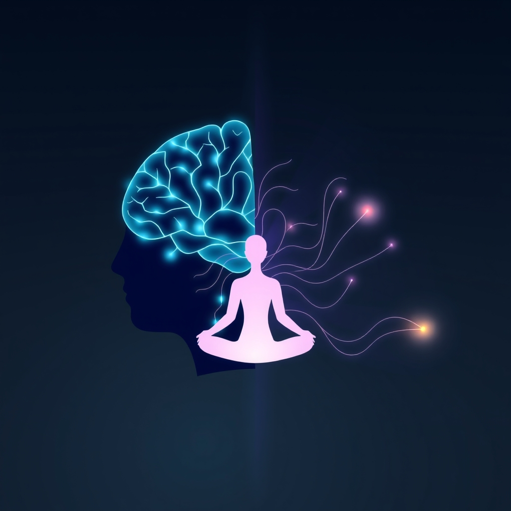

[Home](../index.md) > [Books](./index.md)  
# 🔬🧘🏼‍♀️🧠 Altered Traits: Science Reveals How Meditation Changes Your Mind, Brain, and Body  
  
[🛒 Altered Traits: Science Reveals How Meditation Changes Your Mind, Brain, and Body. As an Amazon Associate I earn from qualifying purchases.](https://amzn.to/43YvX2M)  
  
## 📖 Book Report: 🧠 Altered Traits: Science Reveals How Meditation Changes Your Mind, Brain, and Body  
  
### 📚 Overview  
  
*🧠 Altered Traits: Science Reveals How Meditation Changes Your Mind, Brain, and Body*, by ✍️ Daniel Goleman and 🧠 Richard J. Davidson, is a 🔬 rigorous examination of the scientific research on 🧘 meditation. 👨‍Authors, a renowned 📰 science journalist and a pioneering 🧠 neuroscientist, respectively, delve into how ⏳ sustained meditation practice can lead to 🔄 lasting changes in our minds, brains, and bodies, moving beyond temporary "altered states" to cultivate enduring "altered traits."  
  
### 🔑 Key Concepts and Findings  
  
* 🔄 **Beyond Altered States to Altered Traits:** 🔑 The central theme of the book is the distinction between temporary "altered states" experienced during 🧘 meditation and the lasting "altered traits" that result from consistent, long-term practice. 🪞 These traits are described as enduring changes in personality and behavior.  
* 🔬 **Rigorous Scientific Review:** 👨‍Authors emphasize the importance of evaluating 🧘 meditation research with a critical eye, sifting through studies to identify those with the highest methodological standards. 🔎 They conducted a literature review of over 6,000 studies, selecting 60 they deemed most rigorous.  
* 🛤️ **Two Paths of Practice:** 📖 The book discusses 🧘 meditation along a spectrum, from the "wide path" of less intensive practice accessible to many, to the "deep path" of intensive, long-term discipline that can lead to profound transformation.  
* 🧠 **Impact on the Brain:** 👨‍Authors explore how 🧘 meditation can reshape the brain over time through 🧠 neuroplasticity, leading to ingrained traits like ⚖️ equanimity and 💪 resilience. 🔬 Studies indicate that 🧘 meditation can lead to structural changes in the brain, with certain areas growing thicker with practice.  
* ✅ **Specific Benefits:** 📖 The book highlights various scientifically supported benefits of 🧘 meditation, including:  
    * ⬇️ Reduced reactivity to emotional cues and 😫 stress triggers.  
    * ⬆️ Improved attention and 🎯 focus, reducing 💭 mind-wandering.  
    * ❤️ Increased compassion and 🤝 altruism, particularly through loving-kindness 🧘 meditation.  
    * ⬆️ Enhanced emotional regulation.  
    * ⚠️ Potential for reducing the risk of 😔 depression.  
* ⏳ **Importance of Consistent and Smart Practice:** 👨‍Authors argue that lasting positive change requires more than short, infrequent 🧘 meditation sessions. 📅 Consistent practice is crucial, and "smart practice," which may include guidance from experienced 👨‍🏫 teachers and a less attached view of the self, is necessary for reaching the highest levels of lasting change.  
* ✔️ **Distinguishing Fact from Fiction:** 📖 The book aims to clear up common misconceptions and "neuromythology" surrounding 🧘 meditation, presenting what the science truly supports.  
  
### 📝 Conclusion  
  
*🧠 Altered Traits* provides a grounded, science-based perspective on the transformative potential of 🧘 meditation. By focusing on the concept of altered traits and critically examining the research, 👨‍Authors offer a nuanced understanding of how dedicated practice can lead to profound and lasting changes in our minds and lives.  
  
## 📚 Additional Book Recommendations  
  
### 🤝 Similar Books (Exploring Meditation, Neuroscience, and Well-being)  
  
* 🧠 ***The Emotional Life of Your Brain: How Its Unique Patterns Affect the Way You Think, Feel, and Live—and How You Can Change Them*** by Richard J. Davidson. 👨‍Co-authored by Davidson, this book delves deeper into the neuroscience of emotions and how understanding your brain's emotional style can lead to greater well-being.  
* 🧘 **[👣➡️🌍 Wherever You Go, There You Are](./wherever-you-go-there-you-are.md): Mindfulness Meditation in Everyday Life** by Jon Kabat-Zinn. 📖 A classic in the field of mindfulness, offering practical guidance and principles for incorporating mindfulness into daily life.  
* **[🧘🧠✅ Why Buddhism is True: The Science and Philosophy of Meditation and Enlightenment](./why-buddhism-is-true-the-science-and-philosophy-of-meditation-and-enlightenment.md)** by Robert Wright. 📖 This book explores the intersection of modern psychological science and ancient Buddhist thought, particularly mindful meditation, examining how meditation can help us understand distorted realities created by our minds.  
* 🧠 ***Buddha's Brain: The Practical Neuroscience of Happiness, Love, and Wisdom*** by Rick Hanson. 📖 Blends Buddhist teachings with neuroscience to explain how to change your outlook, increase happiness, and cultivate inner peace through understanding neural mechanisms.  
* 🔬 ***The Science of Meditation: How to Change Your Brain, Mind and Body*** by Daniel Goleman and Richard J. Davidson. 📖 This appears to be the British title for *Altered Traits*, covering the same core material on the science of how meditation changes the mind, brain, and body.  
* 🎯 ***Focus: The Hidden Driver of Excellence*** by Daniel Goleman. 📖 While not solely about meditation, this book by Goleman explores the science of attention and how developing focus is crucial for success, a concept deeply connected to meditation practices.  
* 🕊️ ***Mindfulness: A Practical Guide to Finding Peace in a Frantic World*** by Mark Williams and Danny Penman. 📖 Offers an 8-week program based on Mindfulness-Based Cognitive Therapy (MBCT) to help reduce stress, anxiety, and depression.  
* 🫀 ***Into the Magic Shop: A Neurosurgeon's Quest to Discover the Mysteries of the Brain and the Secrets of the Heart*** by James R. Doty. 📖 A neurosurgeon's personal journey exploring compassion, neuroscience, and the potential of the human mind.  
  
### ⚖️ Contrasting Books (Offering Different Perspectives or Critiques)  
  
* Although not directly contrasting, some books might offer a more critical or less overtly positive view on the accessibility or universality of meditation's profound effects, emphasizing the dedication required for "altered traits." *Altered Traits* itself does address the limitations of research and cautions against exaggerated claims.  
* 📖 Books focusing purely on the philosophical or spiritual aspects of meditation, without the scientific emphasis found in *Altered Traits*, could be seen as a contrast in approach. Examples might include texts from various spiritual traditions that discuss meditation as a path to enlightenment or spiritual insight without engaging with neuroscience.  
  
### ✨ Creatively Related Books (Exploring Broader Connections)  
  
* **[❤️🧠📈🤔 Emotional Intelligence: Why It Can Matter More Than IQ](./emotional-intelligence.md)** by Daniel Goleman. 📖 Goleman's seminal work on emotional intelligence provides a foundational understanding of the emotional skills that meditation can help cultivate, such as self-awareness and self-regulation.  
* 🧠 ***Breaking the Habit of Being Yourself: How to Lose Your Mind and Create a New One*** by Joe Dispenza. 📖 Explores how thoughts and emotions impact reality and how meditation can help reprogram the subconscious mind and break habitual patterns, blending neuroscience with quantum physics and spirituality.  
* **[😀📜 The Happiness Hypothesis: Finding Modern Truth in Ancient Wisdom](./the-happiness-hypothesis-finding-modern-truth-in-ancient-wisdom.md)** by Jonathan Haidt. 📖 Blends ancient philosophical wisdom with modern psychological findings to explore human happiness and the pursuit of a meaningful life, offering a broader context for the well-being aspects discussed in *Altered Traits*.  
* **[🎨🙏✨ The Artist's Way: A Spiritual Path to Higher Creativity](./the-artists-way.md)** by Julia Cameron. 📖 While focused on unlocking creativity, this book's emphasis on practices like "morning pages" and "artist dates" can be seen as a form of mindful self-exploration and cultivation, resonating with the idea of training the mind for positive outcomes.  
* 🌊 ***[Flow: The Psychology of Optimal Experience](./flow-the-psychology-of-optimal-experience.md)*** by Mihaly Csikszentmihalyi. 📖 This book explores the state of being completely absorbed and engaged in an activity, a state that can sometimes be accessed through deep meditative focus, and its connection to happiness and fulfillment.  
* ***[📜🌍⏳ Sapiens: A Brief History of Humankind](./sapiens-a-brief-history-of-humankind.md)** by Yuval Noah Harari. 📖 While a broad historical overview, Harari touches upon the evolution of consciousness and the human mind, providing a macro-level context for understanding the significance of practices that aim to shape our inner experience.  
* 🧘 ***Why We Meditate: The Science and Practice of Clarity and Compassion*** by Daniel Goleman. Another work by ✍️ Goleman that likely expands on the themes of compassion and clarity as cultivated through meditation, tying back to the "altered traits" concept.  
  
## 💬 [Gemini](../software/gemini.md) Prompt (gemini-2.5-flash-preview-04-17)  
> Write a markdown-formatted (start headings at level H2) book report, followed by a plethora of additional similar, contrasting, and creatively related book recommendations on Altered Traits: Science Reveals How Meditation Changes Your Mind, Brain, and Body. Be thorough in content discussed but concise and economical with your language. Structure the report with section headings and bulleted lists to avoid long blocks of text.