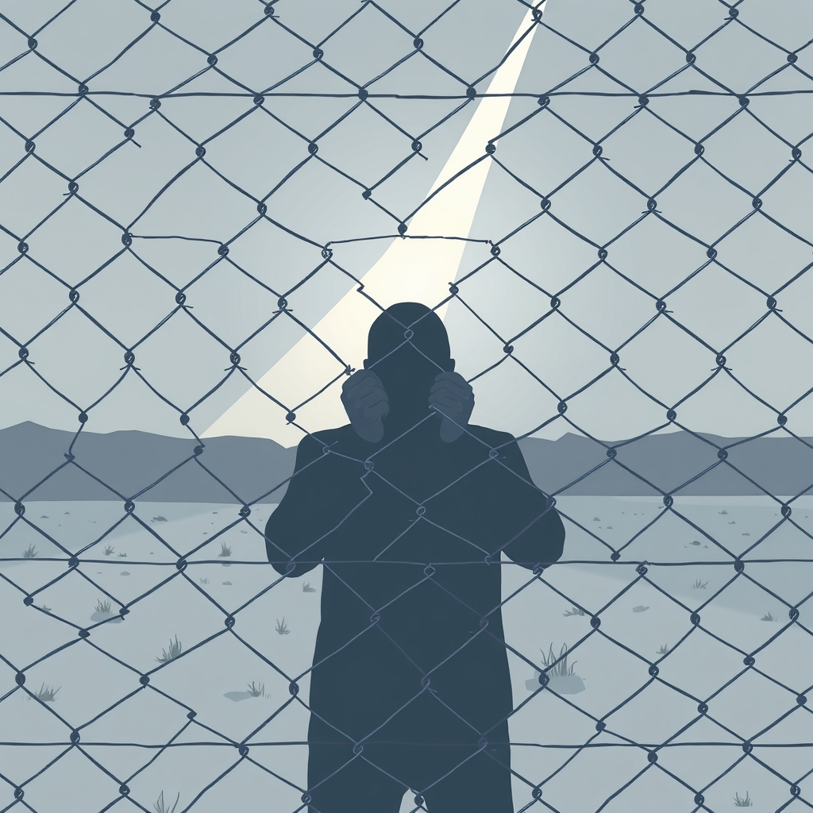

[Home](../index.md) > [Books](./index.md)  
# 🇺🇸🔒 American Gulag: Inside U.S. Immigration Prisons  
  
[🛒 American Gulag: Inside U.S. Immigration Prisons. As an Amazon Associate I earn from qualifying purchases.](https://amzn.to/4exgfzo)  
  
## 📚 Book Report: 🇺🇸 American Gulag: 🔒 Inside U.S. Immigration Prisons  
  
✍️ Mark Dow's *American Gulag: Inside U.S. Immigration Prisons*, 🗓️ published in 2004, serves as a 💥 powerful exposé of the 🇺🇸 U.S. immigration detention system. 📖 The book provides an 🔍 in-depth look at the ⛓️ conditions and 👤 experiences of individuals held in 🔒 detention facilities across the country, arguing that the system operates with a 😨 shocking lack of accountability. 👨‍💼 Dow's work is based on a 🗓️ decade of research and 🗣️ interviews with detainees, advocates, and even 👮 detention center personnel, offering a 📊 multifaceted perspective on a system often 🙈 hidden from public view.  
  
### 📝 Summary  
  
* *American Gulag* 🔎 investigates the 🙈 hidden world of immigration detention in the 🇺🇸 United States, 📊 detailing the growth and ⚙️ operation of these facilities.  
* The book 📣 highlights the ⚖️ arbitrary nature, 🤫 secrecy, and 😡 pervasive abuse within the system.  
* 👨‍💼 Dow uses 🗣️ personal stories and 📝 accounts from detainees and staff to 🧑 humanize the experiences of those held in immigration prisons.  
* The 📜 narrative also provides 🏛️ historical and ⚖️ legal context, 🗺️ tracing the development of 🇺🇸 U.S. immigration laws and practices, particularly in the years leading up to and following 🗓️ September 11, 2001.  
* The book argues that the system is less a response to 💣 terrorism and more a product of 👑 excessive authority and 👀 lack of oversight within the former 🛂 Immigration and Naturalization Service (INS) and its successor agencies.  
  
### 🔑 Key Themes  
  
* **👤 Dehumanization:** A central theme is the ⛓️ systematic dehumanization of detainees through 🤕 physical and 🧠 psychological abuse, ⚖️ lack of legal process, and 🏚️ poor conditions.  
* **🚫 Lack of Accountability and Oversight:** The book strongly criticizes the 🙅‍♀️ absence of adequate scrutiny and 📐 planning in the 🚀 rapidly expanding immigration detention system, leading to 😡 widespread abuses.  
* **🤫 Secrecy and 🙈 Hiddenness:** Dow emphasizes that the immigration detention system functions largely out of 👁️‍🗨️ public sight, allowing abuses to persist.  
* **👮 Criminalization of Immigrants:** The book highlights the practice of housing immigration detainees, who are held under administrative law, alongside individuals incarcerated for 👮 criminal offenses in public and private facilities.  
* **🏢 The Role of Private Prisons:** Dow examines the involvement of private companies in running detention facilities and the concerns about adequate oversight in these 💰 for-profit operations.  
* **💔 Violation of Rights:** The narrative underscores the 🚫 denial of basic 🏛️ civil and ❤️ human rights to immigration detainees, including 🔒 limited access to ⚖️ legal counsel and due process.  
  
### 👨‍💼 Author's Perspective  
  
✍️ Mark Dow, a 📰 journalist, approaches the subject through 📍 on-the-ground reporting and a 🎯 focus on personal narratives to make the impact of immigration detention 🖐 palpable to the reader. His stated purpose was to "✍️ leave a record" of the immigration detention system that the 🇺🇸 U.S. government preferred to keep 🙈 hidden. While aiming to ℹ️ inform, the book's detailed accounts of mistreatment often read as a 📣 call to action, though it primarily focuses on exposing the ⚠️ problems rather than proposing specific solutions. 👨‍💼 Dow contends that the abuses are a result of ⚙️ systemic issues, including the 🚀 rapid growth of detention and a 👀 lack of accountability and guidance.  
  
## 📚 Additional Book Recommendations  
  
### 🤝 Similar Books (Focus on Immigration Detention and the Carceral System)  
  
* ***Migrating to Prison: America's Obsession with Locking Up Immigrants*** by César Cuauhtémoc García Hernández: This book provides a 📊 comprehensive look at the 📜 history and 📈 growth of jailing immigrants in the 🇺🇸 U.S., examining the 🤝 intersection of immigration and the 👮 criminal justice system. It delves into the policies and practices that have led to the current mass incarceration of noncitizens.  
* ***Detain and Punish: Haitian Refugees and the Rise of the World's Largest Immigration Detention System*** by Astrea Camargo-Keys: This work focuses on a specific population – Haitian refugees – to illustrate the expansion of the immigration detention system. It highlights the policies and events that contributed to this growth.  
* ***In the Shadow of Liberty: The Invisible History of Immigrant Detention in the United States***: This book offers a 📜 historical perspective on immigrant detention, revealing its often-overlooked presence throughout 🇺🇸 U.S. history.  
* ***Caging Borders and Carceral States: Incarcerations, Immigration Detentions, and Resistance***: This volume includes case studies that explore the links between racial oppression, incarceration, and immigration detention, examining how various groups have been impacted and the forms of resistance that have emerged.  
* ***Inside Siglo XXI: Locked Up in Mexico's Largest Immigration Detention Center*** by Belén Fernández: While focusing on a detention center in 🇲🇽 Mexico, this book offers a look at the realities of migrant detention outside of the 🇺🇸 U.S. but within the broader context of migration paths towards the 🇺🇸 U.S. border.  
  
### ⚔️ Contrasting Books (Offering Different Perspectives or Solutions)  
  
* While direct "contrasting" books that *defend* the immigration detention system in the same investigative style as Dow's book are less common in critical literature, books focusing on immigration policy from a state or federal perspective, or those proposing alternative approaches to immigration management that *don't* rely heavily on detention, could offer a contrast in viewpoint.  
* Books that focus on 👍 successful integration programs for immigrants or alternative-to-detention programs could present a different angle by highlighting approaches outside of punitive incarceration. Finding specific titles without further search is difficult, but this category would include policy analyses or reports from organizations advocating for immigration reform.  
  
### 🧠 Creatively Related Books (Exploring Broader Themes or Using Different Forms)  
  
* ***Golden Gulag: Prisons, Surplus, Crisis, and Opposition in Globalizing California*** by Ruth Wilson Gilmore: While focused on the 🌉 California prison system, Gilmore's seminal work provides a crucial understanding of the 💰 economic, 🏛️ political, and 👥 social forces driving the 📈 growth of the carceral state, offering a framework applicable to understanding the expansion of immigration detention.  
* **[🧑🏿⛓️🙈 The New Jim Crow: Mass Incarceration in the Age of Colorblindness](./the-new-jim-crow-mass-incarceration-in-the-age-of-colorblindness.md)** by Michelle Alexander: This highly influential book examines the 🇺🇸 U.S. system of mass incarceration and its devastating impact on 🖤 Black communities, drawing parallels to the Jim Crow era. While not solely about immigration, it provides a broader context of how the 🇺🇸 U.S. uses carceral systems to control 👤 marginalized populations, a theme relevant to *American Gulag*.  
* ***Rightlessness: Citizens and the State in U.S. Law*** by Sally E. Merry: This book explores how legal status shapes individuals' rights and experiences in the 🇺🇸 U.S., a concept highly relevant to the situation of immigration detainees who often exist in a state of "subconstitutional" existence with 🔒 limited legal protections.  
* **📝 Memoirs or 🗣️ Personal Accounts of Detention:** Personal narratives from individuals who have experienced immigration detention could offer a powerful, intimate, and creatively related perspective, complementing Dow's investigative journalism with first-hand emotional and personal accounts. (Specific titles would require a search for memoirs by former detainees).  
* **🖼️ Works of Fiction or Poetry:** Creative works exploring the themes of 🚧 borders, 🏠 displacement, 🔒 detention, and the 🔎 search for home could offer an emotional and imaginative engagement with the issues raised in *American Gulag*.  
  
## 💬 [Gemini](../software/gemini.md) Prompt (gemini-2.5-flash-preview-04-17)  
> Write a markdown-formatted (start headings at level H2) book report, followed by a plethora of additional similar, contrasting, and creatively related book recommendations on American Gulag: Inside U.S. Immigration Prisons. Be thorough in content discussed but concise and economical with your language. Structure the report with section headings and bulleted lists to avoid long blocks of text.