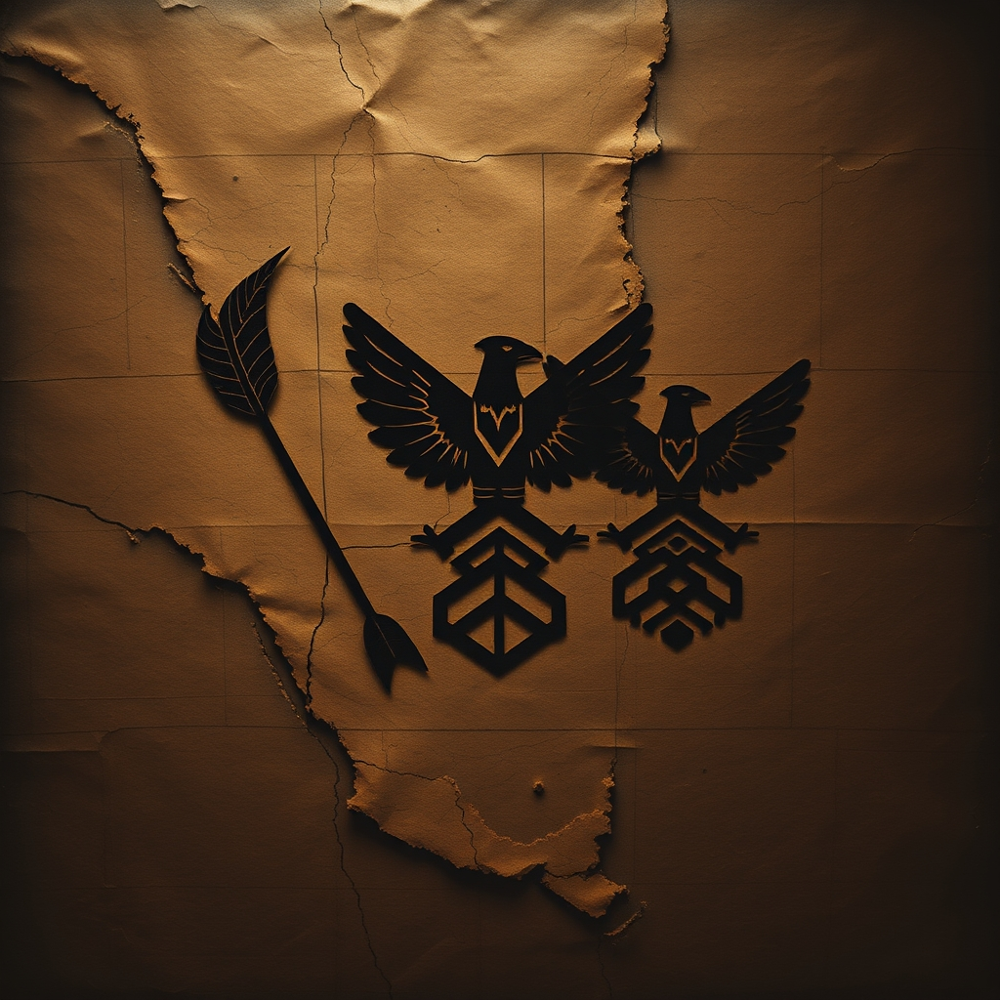

[Home](../index.md) > [Books](./index.md)  
# 🇺🇸🏹 An Indigenous Peoples' History of the United States  
  
[🛒 An Indigenous Peoples' History of the United States. As an Amazon Associate I earn from qualifying purchases.](https://amzn.to/4hSFyO1)  
  
🌍💔📜 The nation's origins and development are inextricably linked to settler colonialism and genocidal policies against Indigenous peoples, a perspective vital for understanding contemporary societal structures and injustices.  
  
## 🏆📚 Dunbar-Ortiz's Indigenous History Strategy  
  
### 🧱 Deconstructing U.S. Foundations  
* 🏘️ **Settler Colonialism:** U.S. established through systematic displacement, elimination of Indigenous populations.  
* 💀 **Genocide:** Policies and practices designed to terminate Indigenous existence as peoples, not individuals.  
* 📜 **Origin Myths:** Challenge discovery doctrine and Manifest Destiny as justifications for land theft.  
  
### 🗣️ Reclaiming Indigenous Narratives  
* ✊ **Resistance:** Highlight centuries of Indigenous struggles, strategies, and sites of resistance against colonization.  
* 🏞️ **Pre-Colonial Societies:** Emphasize complex, thriving Indigenous nations existing prior to European arrival, not primitive wilderness.  
* 🏞️ **Land Centrality:** History inextricably linked to land—its stewardship, theft, and commodification into real estate.  
  
### ⚔️ Challenging Settler Colonialism  
* 🪖 **Militarism:** U.S. military history rooted in genocidal warfare against Indigenous peoples, shaping later international interventions.  
* 👑 **White Supremacy:** Founding ideology intrinsically tied to white supremacy and African slavery alongside land theft.  
* 🌱 **Contemporary Relevance:** Understanding past policies crucial for addressing ongoing Indigenous rights, sovereignty, and reparations.  
  
## ⚖️🔎 Critical Evaluation  
  
* 📚 **Synthesis of Scholarship:** Dunbar-Ortiz's work is widely praised for synthesizing a vast body of existing scholarship, much of it by Indigenous academics, to offer a comprehensive counter-narrative to traditional U.S. history. It is not based on original research but on bringing together previously siloed information.  
* 🇺🇸 **Challenging American Exceptionalism:** Reviewers consistently note the book's effectiveness in dismantling myths of American exceptionalism, progress, and frontier conquest, instead centering settler colonization and its violent implications. This recontextualizes the nation's founding and subsequent expansion.  
* 💀 **Genocide Framework:** The book's use of genocide and settler colonialism to describe U.S. policies towards Indigenous peoples is a central, and often uncomfortable, assertion that has been widely acknowledged as a necessary and accurate lens for historical understanding by many scholars and reviewers.  
* 🗣️ **Activist Voice:** Dunbar-Ortiz's background as an activist and her clear moral outrage are evident, which some find makes the history impassioned and unflinchingly honest, while others might perceive it as acerbic. The intent is explicitly to provoke dialogue and transformation.  
* ✅ **Verdict on Core Claim:** The core claim of An Indigenous Peoples' History of the United States — that U.S. history is fundamentally a history of settler colonialism, genocide, and land theft, deliberately omitted from the national narrative — is overwhelmingly supported by the scholarly synthesis presented and affirmed by numerous reviews as an essential, if discomforting, historical reality necessary for a truthful understanding of the nation.  
  
## 🔍📚 Topics for Further Understanding  
  
* 🌍 The global history and comparative analysis of settler colonialism beyond the U.S. context.  
* 📜 The legal frameworks of Indigenous sovereignty and treaty rights in the 21st century.  
* 👩🏽‍🦱 The specific contributions of Indigenous women to resistance movements and cultural preservation.  
* 🌱 The role of environmental justice movements and Indigenous ecological knowledge in contemporary activism.  
* 💔 The psychological and intergenerational trauma of settler colonialism and pathways to healing.  
* 💰 Reparations and restitution debates concerning Indigenous lands and stolen resources.  
* 🤝 The intersectionality of Indigenous struggles with other liberation movements (e.g., Black civil rights).  
  
## ❓🤔 Frequently Asked Questions (FAQ)  
  
### 💡❓ Q: What is the main argument of An Indigenous Peoples' History of the United States?  
✅💡 A: The book argues that U.S. history is not one of benign expansion but a continuous process of settler colonialism and genocide against Indigenous peoples, driven by policies of land theft and elimination, which fundamentally shaped the nation.  
  
### 💡👩🏽‍🏫 Q: Who is Roxanne Dunbar-Ortiz?  
✅💡 A: Roxanne Dunbar-Ortiz is an American historian, writer, professor emerita of Ethnic Studies, and lifelong social justice and Indigenous rights activist, known for her comprehensive works on Native American history and settler colonialism.  
  
### 💡📖 Q: Why is An Indigenous Peoples' History of the United States important?  
✅💡 A: It offers a crucial, often omitted, perspective on U.S. history, challenging dominant narratives and providing historical context for contemporary issues facing Indigenous communities, thereby fostering a more accurate and comprehensive understanding of the nation's past and present.  
  
### 💡🏘️ Q: What does settler colonialism mean?  
✅💡 A: Settler colonialism refers to a distinct form of colonialism where colonizers permanently settle in a region, aiming to replace the original inhabitants and establish a new society on their land, often through violent means, rather than simply extracting resources.  
  
## 📚📖 Book Recommendations  
  
### 🤝 Similar  
* 📚 A People's History of the United States by Howard Zinn  
* 📚 The Heartbeat of Wounded Knee: Native America from 1890 to the Present by David Treuer  
* 📚 An African American and Latinx History of the United States by Paul Ortiz  
* 📚 American Holocaust: The Conquest of the New World by David E. Stannard  
  
### ⚔️ Contrasting  
* 📚 A Patriot's History of the United States by Larry Schweikart and Michael Allen  
* 📚 A History of the American People by Paul Johnson  
* 📚 1776 by David McCullough  
  
### 🔗 Related  
* [🪢🌾 Braiding Sweetgrass: Indigenous Wisdom, Scientific Knowledge, and the Teachings of Plants](./braiding-sweetgrass.md) by Robin Wall Kimmerer  
* 📚 The Inconvenient Indian: A Curious Account of Native People in North America by Thomas King  
* 📚 The Other Slavery: The Uncovered Story of Indian Enslavement in America by Andrés Reséndez  
* 📚 Our History Is the Future: Standing Rock Versus the Dakota Access Pipeline, and the Long Tradition of Indigenous Resistance by Nick Estes  
* 📚 Lies My Teacher Told Me: Everything Your American History Textbook Got Wrong by James W. Loewen  
  
## 🫵🤔 What Do You Think?  
  
❓ Which historical omission in U.S. education do you find most impactful, and what responsibilities do we, as a society, have to rectify these historical narratives?