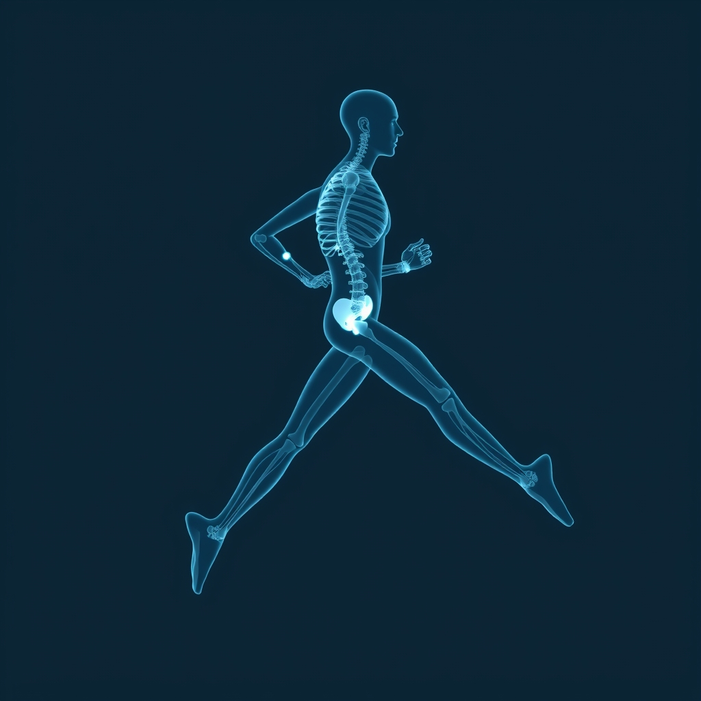

[Home](../index.md) > [Books](./index.md)  
# 🏃‍♀️🦴 Anatomy for Runners: Unlocking Your Athletic Potential for Health, Speed, and Injury Prevention  
  
[🛒 Anatomy for Runners: Unlocking Your Athletic Potential for Health, Speed, and Injury Prevention. As an Amazon Associate I earn from qualifying purchases.](https://amzn.to/4nuh7IA)  
  
## 📝🐒 Human Notes  
- ⚖️ Balance, 🎮 control, and 🤸 variety of movements  
- 🦶 Feet need feedback. 🩴 Prefer minimal shoes.  
  
## 📖 Book Report: 🏃‍♀️ Anatomy for Runners  
  
🏃‍♀️ Anatomy for Runners: 🔓 Unlocking Your Athletic Potential for Health, Speed, and Injury Prevention is a comprehensive guide by Jay Dicharry that delves into the intricate relationship between 🦴 human anatomy, 🏃‍♀️ running biomechanics, and 🌿 sustainable athletic performance. 📚 The book aims to empower runners with the knowledge to prevent injuries, improve efficiency, and unlock their full potential.  
  
### ✍️ Author  
  
👨‍⚕️ Jay Dicharry, MPT, SCS (Masters of Physical Therapy, Sports Clinical Specialist), is the author of Anatomy for Runners. 🏆 He is recognized as a leading expert in running biomechanics and sports medicine, serving as the Director of the SPEED Clinic and Motion Analysis Lab at the University of Virginia. 👨‍🏫 Dicharry is also a certified coach, bringing a blend of clinical expertise, research, and personal athletic experience to his work. 🤔 His motivation for writing the book stemmed from his frustration with ineffective treatments for his own running-related pain, leading him to combine clinical care, biomechanical analysis, and coaching insights.  
  
### 🔑 Main Themes  
  
The central themes of the book revolve around:  
* 🏃‍♀️ **Running Biomechanics:** A detailed exploration of how the body moves during running and the mechanical forces involved.  
* 🤕 **Injury Prevention:** Strategies and practical applications to avoid common running-related injuries by addressing their root causes rather than just symptoms.  
* 🚀 **Performance Optimization:** Enhancing running efficiency, speed, and overall athletic potential through a deeper understanding of one's body.  
* 💪 **Self-Assessment and Correction:** Providing tools and exercises for runners to identify their individual strengths, weaknesses, and imbalances.  
  
### 📝 Key Takeaways  
  
* 👤 **Individualized Anatomy Matters:** Understanding one's unique anatomical structure and how it influences running form is crucial for both performance and injury prevention.  
* 🏃‍♀️ **Running as a Skill:** The book emphasizes that running should be approached as a skill to be mastered, requiring a well-rounded athletic skill set beyond just logging miles.  
* 🤸‍♀️ **Dynamic Stability and Mobility:** Dicharry highlights the importance of dynamic stability, particularly in the core and hips, and adequate soft tissue mobility for efficient running form and injury prevention.  
* ⚙️ **Biomechanics for Efficiency:** Understanding concepts like the load-deformation curve, stress and strain, and viscoelasticity helps runners optimize their form, improve running economy, and reduce injury risk.  
* 🏋️‍♀️ **Practical Application:** The book includes mobility and stability tests to assess form, along with corrective exercises accompanied by step-by-step photos to improve core strength and overall performance. ❓ It also addresses common questions regarding stretching, ideal running form, causes of injuries, and appropriate footwear.  
  
### 🎯 Target Audience  
  
👥 Anatomy for Runners is recommended for a broad audience including runners of all levels (from casual joggers to competitive athletes), running coaches, and clinicians (such as physical therapists and sports medicine practitioners) who are interested in running injuries and assessment protocols.  
  
### 🥅 Overall Purpose  
  
Purpose: 🎯 The overall purpose of Anatomy for Runners is to provide runners with a comprehensive and understandable guide to enhance their performance and prevent injuries by fostering a deeper understanding of their body's mechanics. 🤕 It aims to shift the focus from merely treating symptoms to identifying and correcting the underlying biomechanical issues that lead to pain and inefficiency, ultimately promoting long-term health and joint integrity for runners.  
  
## 📚 Book Recommendations  
  
### 🤝 Similar Books  
  
* **[🏃🛠️⚡ Running Rewired: Reinvent Your Run for Stability, Strength, and Speed](./running-rewired-reinvent-your-run-for-stability-strength-and-speed.md) by Jay Dicharry:** Also by Dicharry, this book offers a continuation of his work on running biomechanics, injury prevention, and targeted exercises to build a stronger, more resilient runner.  
* **[🏃‍♂️🦴 Running Anatomy](./running-anatomy.md) by Joseph Puleo:** This illustrated guide provides detailed anatomical insights into the muscles involved in running, offering exercises to strengthen these groups and improve overall performance and injury prevention.  
* **[🏃🤕 Injury-Free Running: Your Illustrated Guide to Biomechanics, Gait Analysis, and Injury Prevention](./injury-free-running-your-illustrated-guide-to-biomechanics-gait-analysis-and-injury-prevention.md) by Tom Michaud:** This guide focuses on understanding anatomy, biomechanics, and gait analysis, coupled with strengthening exercises and rehabilitation protocols to help runners avoid injuries and improve efficiency.  
* 🔬 **Running Mechanics and Gait Analysis:** This resource offers a comprehensive review of recent research and clinical concepts related to gait and injury analysis, providing an advanced clinical assessment of gait and guidelines for treatment.  
  
### ⚖️ Contrasting Books  
  
* **[💪🧠 Endure: Mind, Body, and the Curiously Elastic Limits of Human Performance](./endure-mind-body-and-the-curiously-elastic-limits-of-human-performance.md) by Alex Hutchinson:** While Dicharry focuses on the physical, Hutchinson explores the psychological limits of endurance, challenging conventional notions of toughness and offering insights into the mental strategies athletes use to push their boundaries.  
* 🤔 **How Bad Do You Want It? Mastering the Psychology of Mind over Muscle by Matt Fitzgerald:** This book delves into the mental and psychological aspects of athletic performance, featuring inspiring stories and strategies for developing mental fortitude in sport, contrasting with the purely physical approach of Anatomy for Runners.  
* ✍️ **Let Your Mind Run by Deena Kastor:** An introspective memoir that draws parallels between running and writing, offering insights into discipline, self-discovery, and the power of mental fitness in achieving athletic success, providing a narrative contrast to Dicharry's clinical approach.  
* 🧠 **The Psychology of Running by Noel Brick and Stuart Holliday:** This book explores the psychological motivations and benefits of running, from evolutionary perspectives to evidence-based interventions for improving performance and mental well-being, offering a different lens through which to understand the sport.  
  
### ✨ Creatively Related Books  
  
* **[🤸🤕 Becoming a Supple Leopard: The Ultimate Guide to Resolving Pain, Preventing Injury, and Optimizing Athletic Performance](./becoming-a-supple-leopard-the-ultimate-guide-to-resolving-pain-preventing-injury-and-optimizing-athletic-performance.md) by Kelly Starrett:** This book provides a broad framework for understanding human movement, mobility, and stability across various athletic endeavors, offering a more general but highly applicable approach to physical potential beyond just running.  
* 💪 **Strength Training Anatomy by Frederic Delavier:** While not specific to running, this book offers a visually rich and detailed guide to human musculature and how different exercises target specific muscles, which can deepen a runner's understanding of their body's capabilities and limitations.  
* 🧬 **Move Your DNA: Restore Your Health Through Natural Movement by Katy Bowman:** Bowman's work challenges modern sedentary lifestyles and advocates for more varied, natural movement patterns. 🚶‍♀️ This offers a philosophical and biomechanical perspective that broadens the understanding of how daily movement (or lack thereof) impacts the body's overall function and resilience, going beyond the specific mechanics of running.  
* 🔬 **Kinesiology: The Mechanics and Pathomechanics of Human Movement by Carol A. Oatis:** A more academic textbook, this resource provides a foundational understanding of the mechanics and pathomechanics of human movement, offering a deeper scientific context for the biomechanical principles discussed in Anatomy for Runners.  
  
## 💬 [Gemini](https://gemini.google.com) Prompt (gemini-2.5-flash)  
> Write a markdown-formatted (start headings at level H2) book report, followed by similar, contrasting, and creatively related book recommendations on Anatomy for Runners: Unlocking Your Athletic Potential for Health, Speed, and Injury Prevention. Never quote or italicize titles. Be thorough but concise. Use section headings and bulleted lists to avoid long blocks of text.  
  
## 🐦 Tweet  
<blockquote class="twitter-tweet" data-theme="dark">
🏃‍♀️🦴 Anatomy for Runners: Unlocking Your Athletic Potential for Health, Speed, and Injury Prevention  🏃‍♀️ Biomechanics | 🤕 Injury Prevention | 🏋️‍♀️ Corrective Exercises | 👨‍⚕️ Running Experts<a href="https://t.co/6SGLWviQhy">https://t.co/6SGLWviQhy</a>
&mdash; Bryan Grounds (@bagrounds) <a href="https://twitter.com/bagrounds/status/1966292343256240552?ref_src=twsrc%5Etfw">September 12, 2025</a></blockquote> 