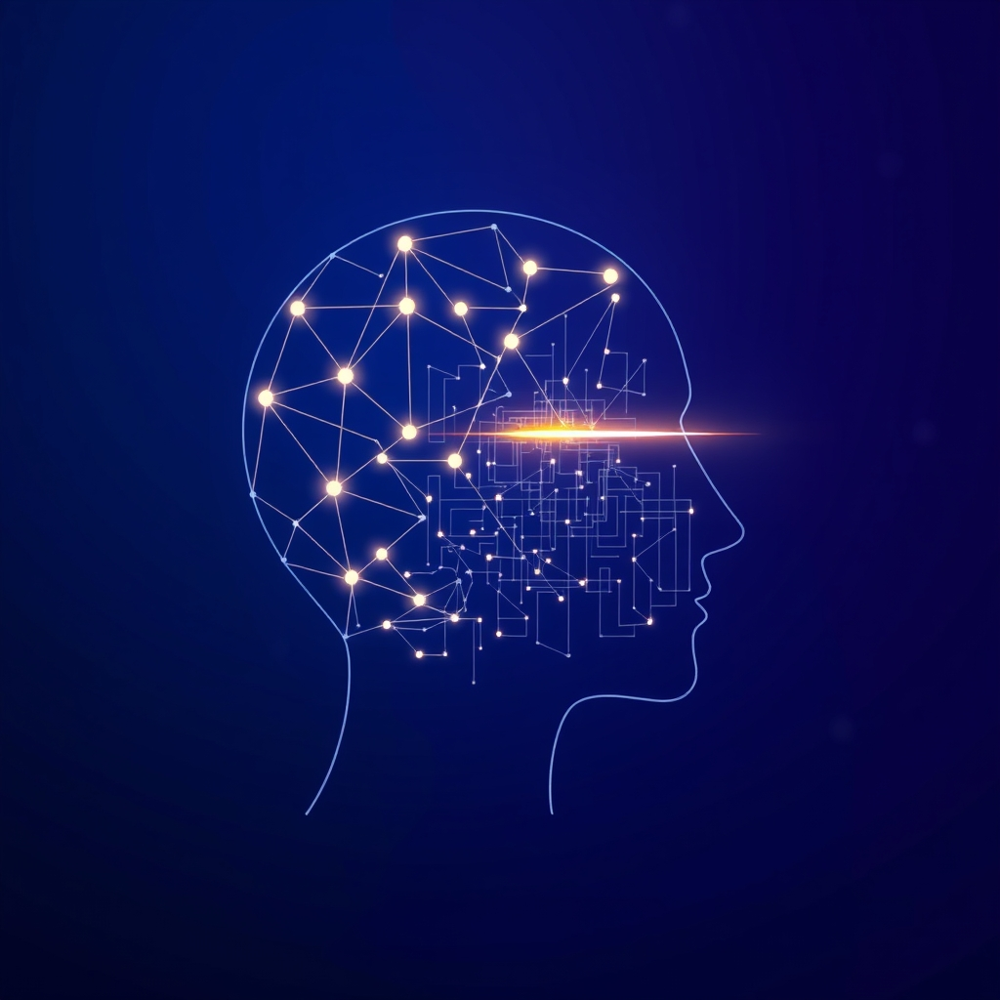

[Home](../index.md) > [Books](./index.md)  
# 🤖🧠 Artificial Intelligence: A Modern Approach  
  
[🛒 Artificial Intelligence: A Modern Approach. As an Amazon Associate I earn from qualifying purchases.](https://amzn.to/4obYudu)  
  
## 🤖 A Modern Approach to Understanding AI  
  
📖 A seminal work in the field of artificial intelligence, *Artificial Intelligence: A Modern Approach* by Stuart Russell and Norvig, now in its fourth edition, serves as a comprehensive and authoritative guide to the theory and practice of AI. 🌟 Often referred to as the standard text in the field, this book is widely used in university courses worldwide. 🎓 Its enduring popularity stems from its ability to present complex topics in a clear, accessible, and unified manner.  
  
### 🧠 Core Philosophy: The Rational Agent  
  
🎯 The book's central theme revolves around the concept of intelligent agents. 👤 An intelligent agent is an entity that perceives its environment through sensors and acts upon that environment through actuators to achieve its goals. 💡 This "rational agent" approach provides a unifying framework for the diverse subfields of AI, focusing on creating systems that act to achieve the best expected outcome.  
  
### 📚 A Comprehensive Exploration of AI  
  
🔎 *Artificial Intelligence: A Modern Approach* is notable for its remarkable breadth and depth, covering a vast landscape of AI topics. 🗺️ The book is structured into several parts, each dedicated to a fundamental area of artificial intelligence.  
  
* 🧩 **Problem Solving and Search:** 🧭 The initial sections delve into foundational concepts like problem-solving agents that use search algorithms to find solutions to problems. 📈 This includes both uninformed search strategies, such as breadth-first and depth-first search, and informed search algorithms like A* that use heuristics to guide the search more efficiently. 🕹️ The book also covers adversarial search in the context of games and constraint satisfaction problems.  
* 🧠 **Knowledge, Reasoning, and Planning:** 💭 A significant portion of the text is dedicated to how AI systems can represent knowledge and reason with it. 📜 This includes discussions on logical agents, propositional and first-order logic, and inference mechanisms. 🗺️ The book also explores automated planning, a critical aspect of intelligent behavior.  
* ❓ **Uncertain Knowledge and Reasoning:** 🤔 Recognizing that real-world environments are often uncertain, the book provides a thorough treatment of probabilistic reasoning. 🎲 Key topics include quantifying uncertainty, probabilistic reasoning over time, and the use of Bayesian networks.  
* ⚙️ **Machine Learning:** 🚀 This section, which has been significantly updated in later editions, covers the cornerstone of modern AI. 🎓 It explores various learning methods, including supervised learning (e.g., classification and regression), unsupervised learning (e.g., clustering), and reinforcement learning, where an agent learns from trial and error. 🤖 The latest edition includes expanded coverage of deep learning and its applications in areas like natural language processing.  
* 🗣️ **Communicating, Perceiving, and Acting:** 🌎 The final major sections address how agents interact with the world. ✍️ This includes topics such as natural language processing, 👁️ computer vision, and 🤖 robotics.  
* 🤔 **Philosophy and the Future of AI:** 🔮 The book concludes by exploring the philosophical foundations of AI, as well as the ethical implications and future directions of the field.  
  
🧑‍🏫 A Textbook for a Broad Audience  
  
📖 While it is a rigorous academic text suitable for undergraduate and graduate students, the authors have made the material accessible to a wider audience. ✍️ The book is well-written and engaging, with clear explanations and pseudocode for algorithms. ✅ It provides a strong foundation for both beginners and those already experienced in the field.  
  
## 📚  Book Recommendations  
  
### 📖 Similar Comprehensive Textbooks  
  
* **[🧠💻🤖 Deep Learning](./deep-learning.md) by Ian Goodfellow, Yoshua Bengio, and Aaron Courville:** 📚 Often considered the foundational text for deep learning, this book provides a thorough and mathematical treatment of the subject, making it an excellent next step for those particularly interested in this subfield of machine learning.  
* 📊 **"The Elements of Statistical Learning: Data Mining, Inference, and Prediction" by Trevor Hastie, Robert Tibshirani, and Jerome Friedman:** 📈 This book offers a more statistically-oriented perspective on machine learning, covering many of the same topics as the machine learning section of AIMA but with a greater emphasis on the underlying statistical theory.  
  
### 👓 Contrasting and Focused Perspectives  
  
* **[🤖⚠️📈 Superintelligence: Paths, Dangers, Strategies](./superintelligence-paths-dangers-strategies.md) by Nick Bostrom:** ⚠️ This book moves away from the technical implementation of AI and delves into the philosophical and existential questions surrounding the potential creation of artificial superintelligence. 🎯 It contrasts with AIMA's focus on building rational agents by exploring the long-term consequences of succeeding in that endeavor.  
* **[❓➡️💡 The Book of Why: The New Science of Cause and Effect](./the-book-of-why.md) by Judea Pearl and Dana Mackenzie:** ❓ Written by one of the pioneers of Bayesian networks, a topic covered in AIMA, this book argues for the importance of causal reasoning in AI. 💡 It presents a different paradigm for building intelligent systems, one that goes beyond pattern recognition to understand cause and effect.  
  
### ✨ Creatively Related and Inspirational Reads  
  
* **[♾️📐🎶🥨 Gödel, Escher, Bach: An Eternal Golden Braid](./godel-escher-bach.md) by Douglas Hofstadter:** 🏆 This Pulitzer Prize-winning book is a classic and creatively explores the foundations of intelligence and consciousness through the interconnectedness of mathematics, art, and music. 🤔 It provides a more philosophical and abstract counterpoint to AIMA's practical approach.  
* **[🧬👥💾 Life 3.0: Being Human in the Age of Artificial Intelligence](./life-3-0.md) by Max Tegmark:** 🌍 This book offers a highly accessible and engaging exploration of the potential futures of AI and its impact on humanity. 🔮 It covers many of the same future-oriented topics as the final chapters of AIMA but in a more narrative and speculative style.  
* 🎯 **"The Master Algorithm: How the Quest for the Ultimate Learning Machine Will Remake Our World" by Pedro Domingos:** 🔎 This book provides a high-level overview of the different paradigms within machine learning, framing them as a quest for a single "master algorithm" that can learn anything from data. 🔗 It offers a unifying narrative for the diverse learning techniques presented in AIMA.  
  
## 💬 [Gemini](../software/gemini.md) Prompt (gemini-2.5-pro)  
> Write a markdown-formatted (start headings at level H2) book report, followed by a plethora of additional similar, contrasting, and creatively related book recommendations on Artificial Intelligence: A Modern Approach. Be thorough in content discussed but concise and economical with your language. Structure the report with section headings and bulleted lists to avoid long blocks of text.