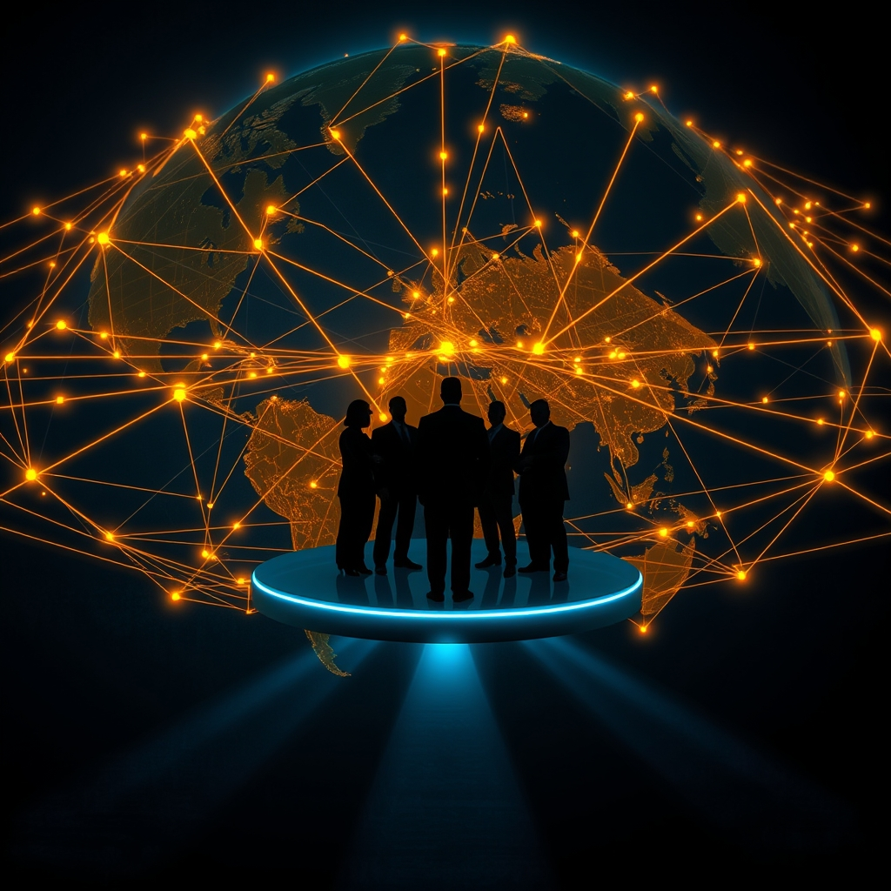

[Home](../index.md) > [Books](./index.md)  
# 👑🌎 Autocracy, Inc.: The Dictators Who Want to Run the World  
  
[🛒 Autocracy, Inc.: The Dictators Who Want to Run the World. As an Amazon Associate I earn from qualifying purchases.](https://amzn.to/4aiO4Ez)  
  
🍎 Modern autocracies, unlike historical dictatorships, form a global, interconnected 🌐 network of kleptocratic regimes sharing tactics, technology, and disinformation to undermine democracies and perpetuate their power and wealth 💰.  
  
## 🤖 AI Summary  
  
### 🍎 Core Argument: Autocracy as a Global Network  
* **🌐 Interconnected Regimes:** Modern autocracies (Russia, China, Iran, Venezuela, etc.) operate as a networked Inc. rather than isolated states.  
* **🤝 Shared Objectives:** United by a ruthless determination to preserve personal wealth and power, not by a common ideology.  
* **🚨 Threat to Democracy:** Actively work to destabilize and undermine liberal democracies globally.  
  
### ⚙️ Mechanisms of Autocratic Power  
* **💰 Kleptocracy:** State power used to extract resources, enrich ruling elites, and fund repression; money as a weapon of control.  
    * 💸 Manipulate global economic systems for personal gain.  
    * 🕵️ Hide wealth in international networks, exploit weak regulations.  
* **📣 Information Warfare:** Sophisticated propaganda, disinformation, and censorship campaigns to control narratives.  
    * 😵‍💫 Disorient and discourage, rather than persuade; target truth itself.  
    * 🗣️ Propagandists share resources and themes (e.g., degeneracy of democracy, stability of autocracy).  
* **📹 Technological Surveillance & Repression:** Leverage digital technologies (AI, facial recognition) for mass surveillance and control.  
    * 💻 Export digital tools and expertise to like-minded regimes.  
    * 🌍 Transnational repression: target dissidents beyond borders with impunity.  
* **💸 Economic Intrusion & Manipulation:** Use economic ties, trade, and financial systems to exert influence and bypass sanctions.  
    * 🤝 Cooperate on trade in weapons and technologies.  
    * 🏦 Exploit global financial centers (e.g., Dubai) to facilitate illicit flows.  
  
### 🌍 Democratic Response  
* **🤝 Unified Action:** Requires cooperation of democracies on a major scale.  
* **🔎 Transparency:** Increased transparency in international financial transactions, dismantling money laundering operations.  
* **⚖️ Regulation:** Increased regulation of social media platforms to combat disinformation.  
* **🛡️ Counter-Disinformation:** Focus intelligence services on discovering and disarming disinformation campaigns.  
* **🔄 Reframing:** Reframe defense of democracy as combating autocratic behaviors.  
  
## ⚖️ Evaluation  
  
* **✔️ Comprehensive Overview:** Autocracy, Inc. provides a compelling overview of how contemporary autocracies operate as a globally networked system, a perspective widely supported by other analyses of modern authoritarianism.  
* **➡️ Shift from Ideology to Kleptocracy:** The book effectively argues that modern autocracies are united by a desire for power and wealth rather than a shared ideology, a key distinction from 20th-century totalitarian regimes. This is a crucial update to understanding contemporary authoritarianism.  
* **📱 Digital Authoritarianism Emphasis:** Applebaum's focus on the role of surveillance technologies, propaganda, and disinformation in maintaining autocratic control is highly relevant and corroborated by research on digital authoritarianism. Experts agree digital tools have expanded means for societal control and narrative manipulation by authoritarian states.  
* **🔗 Interconnectedness Evidence:** The assertion that these regimes actively collaborate through financial dealings, security exchanges, and technology sharing is well-documented by various sources. This mutual assistance and connections is seen as a way autocracies thrive under the nose of the democratic world.  
* **🤔 Critique on Nuance of Confrontation:** While praised for its clear-sightedness, some critiques suggest the book could further explore whether autocracies seek a direct strategic confrontation with the West, or if their actions are more about self-preservation and undermining democratic norms. Some argue that the differences among these regimes can be as significant as their resemblances.  
* **📜 Comparison to Historical Dictatorships:** The book highlights that modern autocrats employ different tactics than 20th-century dictators, moving beyond outright mass violence and overt cults of personality to more subtle methods of control like disinformation and economic leverage. While 20th-century dictatorships often relied on force and ideology, modern autocracies increasingly use autocratic legalism to mimic the rule of law and maintain legitimacy.  
* **💡 Solutions Offered:** Applebaum concludes by offering actionable solutions for democracies, such as increasing transparency and regulating social media, which are echoed by other analyses on countering digital authoritarianism and kleptocracy.  
  
## 🔍 Topics for Further Understanding  
  
* 🏭 The weaponization of supply chains and critical minerals by autocratic regimes.  
* 🧠 The psychological impact of perpetual disinformation on public trust and social cohesion in democratic societies.  
* 🎭 The role of non-state actors and private corporations in facilitating or challenging autocratic networks.  
* 🌍 The evolving strategies of democratic resilience and counter-authoritarian movements in a globally interconnected world.  
* 🕰️ The historical parallels and divergences between current autocratic trends and pre-Cold War authoritarianism.  
* 🏛️ The specific challenges and opportunities for international law in addressing transnational repression and kleptocracy.  
* 🤖 The potential for AI and advanced technology to both enable and disrupt autocratic control in the coming decades.  
  
## ❓ Frequently Asked Questions (FAQ)  
  
### 💡 Q: What is Autocracy, Inc.: The Dictators Who Want to Run the World about?  
✅ A: Autocracy, Inc.: The Dictators Who Want to Run the World by Anne Applebaum explores how modern authoritarian regimes, such as Russia and China, operate as an interconnected global network, collaborating through financial dealings, disinformation, and technology to maintain power and undermine democratic institutions worldwide.  
  
### 💡 Q: How do modern autocracies differ from historical dictatorships according to Autocracy, Inc.?  
✅ A: Autocracy, Inc. argues that modern autocracies are not primarily driven by a single ideology like their 20th-century predecessors, but rather by a shared interest in preserving personal wealth and power. They employ sophisticated networks, kleptocratic financial structures, and advanced surveillance technology, often cooperating across borders, rather than relying solely on brute force or a cult of personality.  
  
### 💡 Q: What are some key strategies Autocracy, Inc. describes that these regimes use?  
✅ A: Autocracy, Inc. details several strategies, including using kleptocracy to enrich elites and fund repression, engaging in sophisticated information warfare through propaganda and disinformation, leveraging advanced surveillance technologies, and forming international alliances to resist democratic pressure and support each other's regimes.  
  
### 💡 Q: What role does money play in Autocracy, Inc.'s analysis?  
✅ A: In Autocracy, Inc., money is a crucial tool for modern autocrats, enabling them to extract state resources for personal gain, fund instruments of repression, and establish corrupt financial structures. These kleptocratic systems are central to maintaining power and bypassing international sanctions.  
  
### 💡 Q: Does Autocracy, Inc. offer solutions for democracies?  
✅ A: Yes, Autocracy, Inc. proposes that democracies respond by increasing transparency in international financial transactions, dismantling money laundering operations, regulating social media platforms more effectively to combat disinformation, and coordinating intelligence efforts to counteract propaganda campaigns. It calls for a unified international coalition to expose corruption and reform secretive financial practices.  
  
## 📚 Book Recommendations  
  
### 📚 Similar  
* [🥀 Twilight of Democracy: 🐍 The Seductive Lure of Authoritarianism](./twilight-of-democracy.md) by Anne Applebaum  
* 🛤️ The Road to Unfreedom: Russia, Europe, America by Timothy Snyder  
* [👑😈👎📈 The Dictator's Handbook: Why Bad Behavior Is Almost Always Good Politics](./the-dictators-handbook.md) by Bruce Bueno de Mesquita and Alastair Smith  
  
### 📚 Contrasting  
* [🌎👎👑💰🏚️ Why Nations Fail: The Origins of Power, Prosperity, and Poverty](./why-nations-fail-the-origins-of-power-prosperity-and-poverty.md) by Daron Acemoglu and James A. Robinson  
* 📜 The End of History and the Last Man by Francis Fukuyama  
* [💡🔬🧑‍🤝‍🧑📈 Enlightenment Now: The Case for Reason, Science, Humanism, and Progress](./enlightenment-now-the-case-for-reason-science-humanism-and-progress.md) by Steven Pinker  
  
### 📚 Related  
* [💰🤫 Dark Money: The Hidden History of the Billionaires Behind the Rise of the Radical Right](./dark-money-the-hidden-history-of-the-billionaires-behind-the-rise-of-the-radical-right.md) by Jane Mayer  
* 🔌 The Master Switch: The Rise and Fall of Information Empires by Tim Wu  
* 🗺️ Prisoners of Geography: Ten Maps That Tell You Everything You Need to Know About Global Politics by Tim Marshall  
  
## 🫵 What Do You Think?  
  
 Given the interconnected nature of modern autocracies described in Autocracy, Inc., which proposed democratic response do you believe is the most critical to implement first, and why? Share your thoughts on how individual citizens can contribute to these efforts!