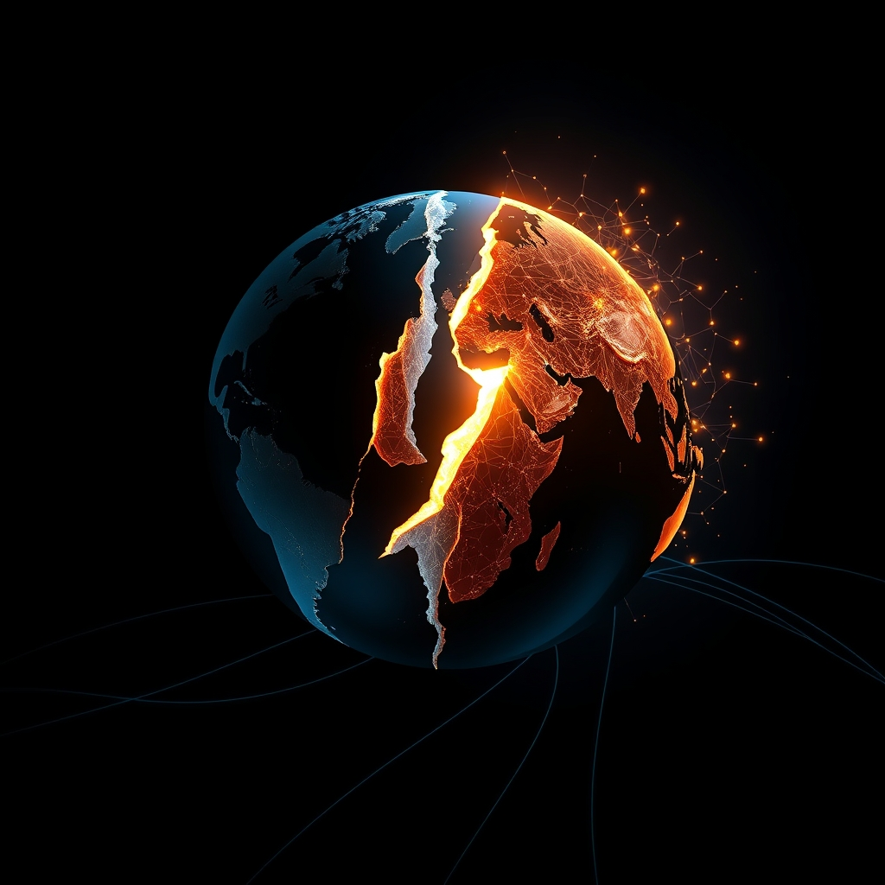

[Home](../index.md) > [Books](./index.md)  
# 👑⚔️🇺🇸 Autocrats vs Democrats: China, Russia, America, and the New Global Disorder  
  
[🛒 Autocrats vs Democrats: China, Russia, America, and the New Global Disorder. As an Amazon Associate I earn from qualifying purchases.](https://amzn.to/3JLty4g)  
  
🌍 An alliance of autocratic China and Russia, coupled with internal democratic challenges, necessitates a fresh American grand strategy for renewed global democratic leadership. ⚖️  
  
## 🏆 McFaul's Autocrats vs. Democrats Strategy  
  
### 🌍 Global Disorder Analysis  
* ❌ **Reject** Cold War 2.0: Current global challenges are distinct from the Soviet-era Cold War; avoid nostalgic paradigms.  
* 🎯 **Identify** New Threats:  
    * 🤝 **China-Russia** autocratic alliance.  
    * 💰 **China's** economic power as a distinct challenge.  
    * 🚩 **Rise** of the far-right in democracies.  
    * 🇺🇸 **US** isolationism and internal polarization.  
* 📜 **Historical** Context: Examine US-Russia and US-China relations from the 18th century, identifying eras of cooperation and confrontation.  
  
### 🗺️ Grand Strategy Prescription  
* 🧠 **Fresh** Thinking: Requires new, principled, collaborative democratic strategies, not old containment models.  
* 💪 **Renew** American Leadership: Essential for confronting autocratic threats and restoring global order.  
* 🤝 **Strengthen** Alliances: Bolster democratic partnerships and institutions.  
* 🎯 **Strategic** Nuance:  
    * 🔥 **Russia's** disruptive ambitions: Do not underestimate.  
    * 🚀 **China's** capabilities: Do not overestimate.  
    * 🚫 **Counter** Isolationism: Resist policies that weaken America’s global standing.  
* 🏠 **Internal** Renewal: Democratic world must renew itself from within to effectively counter external threats.  
  
## ⚖️ Critical Evaluation  
  
* 🤔 McFaul challenges the new Cold War orthodoxy, emphasizing the unique nature of current threats from autocratic China and Russia and internal democratic fragilities. 🗣️ Critics acknowledge this but argue the book sometimes offers a nostalgic read for foreign policy elites, potentially allowing them to avoid culpability for past policy failures.  
* 🗺️ The book advocates for a new American grand strategy focused on renewed democratic leadership and confronting autocracy. 🧐 However, some analyses suggest it exhibits an unshakeable faith in the righteousness of post-Cold War liberal foreign policy, without fully examining unintended consequences like NATO expansion or the Iraq War.  
* 👨‍💼 McFaul's detailed historical analysis and personal experience as former Ambassador to Russia are widely praised for providing depth and insight. ⚠️ Yet, critiques point to a selective engagement with American mistakes and a tendency to minimize past errors, which could weaken the credibility of future policy prescriptions.  
* ❓ The argument that renewed American leadership will automatically restore global peace is questioned as more asserted than rigorously demonstrated, possibly relying too heavily on American exceptionalism without fully addressing domestic democratic backsliding and polarization.  
* ✅ **Verdict:** Michael McFaul's core claim that a new global disorder demands fresh, non-Cold War-centric democratic strategies rooted in renewed American leadership is largely compelling due to his expert analysis of current geopolitical shifts. ⚠️ However, its effectiveness as a prescriptive guide is somewhat tempered by its perceived reluctance to fully grapple with past Western policy missteps and internal democratic vulnerabilities.  
  
## 🔍 Topics for Further Understanding  
  
* ⚔️ The weaponization of interdependence and its implications for global supply chains.  
* 🎭 The role of non-state actors and hybrid warfare in the new global disorder.  
* 💪 Comparative analysis of soft power strategies employed by democracies versus autocracies.  
* 🤖 The impact of artificial intelligence and emerging technologies on state sovereignty and international security.  
* 🇺🇸 Deep dive into internal political polarization dynamics within major democracies beyond the US.  
* 🏛️ The future of international institutions (e.g., UN, WTO) in an increasingly multipolar world.  
* 🌍 Examining the Global South's perspectives on the Autocrats vs. Democrats dichotomy.  
  
## ❓ Frequently Asked Questions (FAQ)  
  
### 💡 Q: What is the main argument of Autocrats vs. Democrats: China, Russia, America, and the New Global Disorder?  
✅ A: The book argues that the current global landscape, shaped by the rise of autocratic China and Russia and internal democratic challenges, is not a simple repeat of the Cold War and requires a fundamentally new American grand strategy focused on revitalizing democracy globally.  
  
### 💡 Q: Who is the author of Autocrats vs. Democrats?  
✅ A: The author is Michael McFaul, a former U.S. Ambassador to Russia and a professor of international studies at Stanford University.  
  
### 💡 Q: Why does McFaul reject the new Cold War idea?  
✅ A: McFaul contends that while there are some similarities to the Cold War, key differences exist, such as the China-Russia alliance, China's economic integration, and the internal challenges to democracy, which make a simple Cold War framework inadequate for understanding or addressing today's threats.  
  
### 💡 Q: What are some of the key challenges to democracy highlighted in Autocrats vs Democrats?  
✅ A: Key challenges include the alliance and coordinated actions of autocratic regimes (China and Russia), China's economic power, the rise of far-right populism in democratic nations, and increasing political polarization and isolationist tendencies within the United States and Europe.  
  
### 💡 Q: What solutions does Michael McFaul propose for democracies?  
✅ A: McFaul proposes renewed American leadership, fresh strategic thinking, strengthening democratic alliances, and a focus on internal democratic renewal to effectively counter autocratic challenges and maintain global stability.  
  
## 📚 Book Recommendations  
  
### 🤝 Similar  
* 📖 The World: A Brief Introduction to the Past, Present, and Future of American Foreign Policy by Richard Haass  
* 📖 The Age of Illiberalism by Fareed Zakaria  
* 📖 The Retreat of Western Liberalism by Edward Luce  
  
### 🆚 Contrasting  
* 📖 The End of History and the Last Man by Francis Fukuyama (early perspective)  
* 📖 The Tragedy of Great Power Politics by John J. Mearsheimer  
* 📖 Destined for War: Can America and China Escape Thucydides's Trap? by Graham Allison  
  
### 🔗 Related  
* 📖 Prisoners of Geography by Tim Marshall  
* [🌎👎👑💰🏚️ Why Nations Fail: The Origins of Power, Prosperity, and Poverty](./why-nations-fail-the-origins-of-power-prosperity-and-poverty.md) by Daron Acemoglu and James A. Robinson  
* [👑🚫📜2️⃣0️⃣ On Tyranny: Twenty Lessons from the Twentieth Century](./on-tyranny.md) by Timothy Snyder  
  
## 🫵 What Do You Think?  
🤔 Do you believe the new Cold War framework is entirely unhelpful, or are there aspects of it that still resonate with current global dynamics? ❓ What, in your view, is the most critical internal challenge facing democracies today?  
