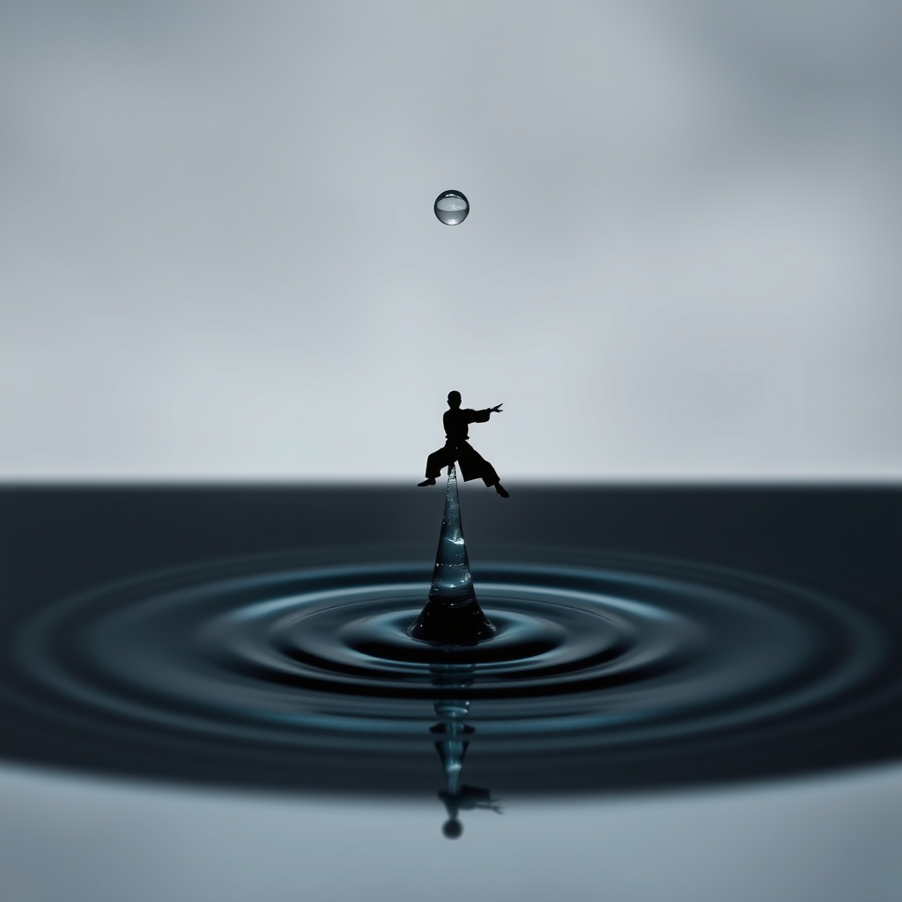

[Home](../index.md) > [Books](./index.md)  
# 🌊🥋 Be Water, My Friend: The Teachings of Bruce Lee  
  
[🛒 Be Water, My Friend: The Teachings of Bruce Lee. As an Amazon Associate I earn from qualifying purchases.](https://amzn.to/4jHtLTS)  
  
🌊💡🌱 Bruce Lee's philosophy of adaptability, self-actualization, and embracing life's constant change can empower individuals to cultivate authentic self-expression and navigate challenges with fluid strength.  
  
## 🤖 AI Summary  
### 💧 Core Philosophy: Be Water  
* 🔄 Adaptability: Fluidity in thought and action, shaping oneself to circumstances without losing inherent nature.  
* 🌬️ Formlessness: Rejecting rigid styles, dogma, or fixed patterns to remain open and responsive.  
* ☯️ Balance: Harmony of contrasting elements (yin/yang), recognizing interconnectedness.  
* 🏞️ Continuous Flow: Life as perpetual movement, not a static state or destination.  
  
### ✨ Self-Actualization & Expression  
* 🧘 Authenticity: Realizing one's full potential, being true to oneself, free from societal constraints or self-image.  
* 🔎 Self-Discovery: Internal exploration to understand strengths, weaknesses, and unique identity.  
* 🗑️ Discard the Unessential: Focusing on what is vital, eliminating unnecessary elements in life and practice.  
  
### 📚 Learning & Growth  
* 🧑‍🎓 Eternal Student: Cultivating an ongoing eagerness for knowledge; continuous self-enhancement over being an expert.  
* 💪 Embrace Obstacles: Viewing challenges as opportunities for insight and catalysts for growth.  
* 🧠 Mindfulness: Being present, fully aware of thoughts and surroundings; mental clarity and focus.  
  
### 🥋 Jeet Kune Do (JKD) Principles (as philosophical application)  
* ♾️ No Way As Way, No Limitation As Limitation: Beyond fixed styles, absorbing what is useful, discarding what is not.  
* 🎯 Efficiency & Directness: Simplest things work best, economy of motion in all actions.  
* 💥 Interception: Proactively meeting challenges; combining defense and attack.  
* 🥊 Four Ranges of Combat: Adaptability across different situations (kicking, punching, trapping, grappling).  
  
## ⚖️ Evaluation  
* 🌸 **Eastern Philosophy Roots:** Bruce Lee's philosophy is deeply influenced by Taoism and Zen Buddhism, especially the concept of wu wei (non-action) and the be like water metaphor for adaptability and flowing with life. This aligns with traditional Eastern wisdom emphasizing harmony and naturalness.  
* 🏛️ **Western Philosophical Integration:** Beyond Eastern thought, Lee integrated Western philosophies like Heraclitus's idea of everything flows, American Pragmatism (valuing effectiveness over tradition), Phenomenology (validating body's wisdom), and Existentialism (authentic self-expression). This distinguishes his work from purely traditional martial arts teachings.  
* 🚫 **Rejection of Dogma:** Lee's emphasis on no style as style and discarding the unessential directly challenged the rigidity of traditional martial arts and, by extension, dogmatic thinking in life. This resonates with modern critical thinking and individualistic approaches to knowledge.  
* 🛠️ **Practicality and Application:** His philosophy is highly lauded for its practical applicability beyond martial arts, influencing personal growth, business, and even modern combat sports like MMA, where adaptability across ranges of combat is key.  
* 🤔 **Critiques and Nuance:** While widely praised, some interpretations or criticisms touch on the difficulty of consistently living out such principles, especially concerning the desire for victory or the tension between striving for self-actualization and accepting what is. There are also discussions about the potential for misunderstanding the style of no style as merely an absence of structure rather than a deeper, personalized synthesis.  
  
## 🔍 Topics for Further Understanding  
* 🥊 The intersection of Jeet Kune Do principles and modern mixed martial arts (MMA) strategy.  
* 📚 Detailed exploration of the Western philosophical influences on Bruce Lee, such as American Pragmatism and Existentialism.  
* 🧠 Psychological frameworks for cultivating authenticity and overcoming self-image actualization.  
* 🧘 Comparative analysis of Be Water with other Eastern concepts of flow and spontaneity in practice (e.g., Zen archery, Taoist meditation).  
* ⛰️ The role of adversity and trauma in personal growth, as viewed through a Be Water lens.  
  
## ❓ Frequently Asked Questions (FAQ)  
### 💡 Q: What is the main message of Be Water, My Friend: The Teachings of Bruce Lee?  
✅ 🌊 A: Be Water, My Friend: The Teachings of Bruce Lee conveys the core philosophy of adaptability, urging readers to be flexible, embrace change, seek self-actualization, and live authentically by emptying their minds of rigid concepts and flowing with life like water.  
  
### 💡 Q: How does Bruce Lee's Be Water philosophy apply to everyday life?  
✅ 🌍 A: Bruce Lee's Be Water philosophy encourages individuals to remain open-minded, respond fluidly to challenges, shed rigid beliefs, and constantly learn and adapt in all aspects of life, from personal relationships to professional endeavors.  
  
### 💡 Q: What is Jeet Kune Do, as discussed in Be Water, My Friend: The Teachings of Bruce Lee?  
✅ 🥋 A: Jeet Kune Do (JKD), meaning Way of the Intercepting Fist, is Bruce Lee's hybrid martial arts philosophy that advocates for directness, simplicity, and efficiency over rigid styles, emphasizing adaptability to any situation and using what works for the individual.  
  
### 💡 Q: Who wrote Be Water, My Friend: The Teachings of Bruce Lee?  
✅ ✍️ A: Be Water, My Friend: The Teachings of Bruce Lee was written by Shannon Lee, Bruce Lee's daughter, offering her personal insights into her father's philosophies.  
  
### 💡 Q: How does Be Water, My Friend suggest one can achieve self-actualization?  
✅ ✨ A: The book, through Bruce Lee's teachings, suggests achieving self-actualization by focusing on honest self-expression, developing one's true potential, being grounded in reality, and not being swayed by societal expectations or self-image actualization.  
  
## 📚 Book Recommendations  
### 👯 Similar  
* [☯️🥋 Tao of Jeet Kune Do](./tao-of-jeet-kune-do.md) by Bruce Lee  
* [🇯🇵⚔️ A Book of Five Rings: The Classic Guide to Strategy](./a-book-of-five-rings-the-classic-guide-to-strategy.md) by Miyamoto Musashi  
* [🧘🏹 Zen in the Art of Archery](./zen-in-the-art-of-archery.md) by Eugen Herrigel  
  
### ↔️ Contrasting  
* [🎨⚔️ The Art of War](./the-art-of-war.md) by Sun Tzu (focus on strategic engagement vs. spontaneous flow)  
* 📖 Discipline Is Destiny by Ryan Holiday (emphasis on structure and self-control vs. formlessness)  
  
### 🔗 Related  
* [🔦💡 Man's Search for Meaning](./mans-search-for-meaning.md) by Viktor Frankl  
* 📖 Awareness by Anthony de Mello  
* [🌊🧘🏼‍♀️🧠📈 Flow: The Psychology of Optimal Experience](./flow-the-psychology-of-optimal-experience.md) by Mihaly Csikszentmihalyi  
  
## 🫵 What Do You Think?  
💬 How has embracing fluidity or challenging rigid thinking transformed an area of your life? Share your experiences applying Bruce Lee's Be Water philosophy!