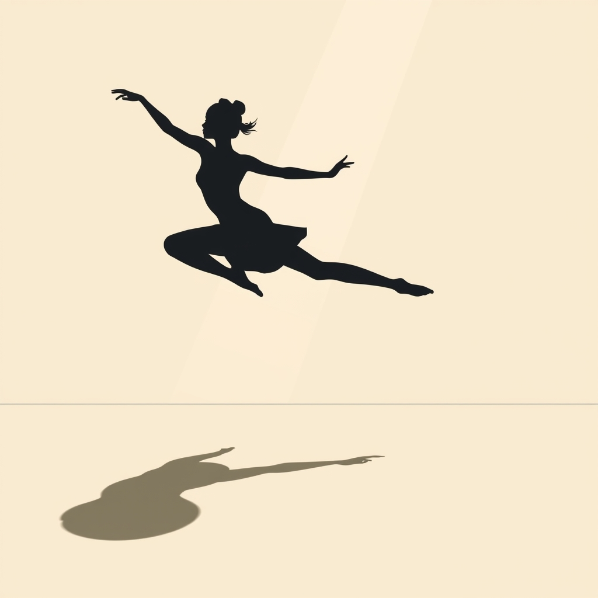

[Home](../index.md) > [Books](./index.md)  
# 💃➡️ Beginning Modern Dance  
  
[🛒 Beginning Modern Dance. As an Amazon Associate I earn from qualifying purchases.](https://amzn.to/3UwSu1e)  
  
📖 A comprehensive analysis of "Beginning Modern Dance" awaits, complete with a curated selection of recommendations for further reading. 📝 This report delves into the foundational text, offering a gateway to the expressive world of modern dance. 📚 Following the report, a diverse list of similar, contrasting, and creatively related books is provided to expand the reader's understanding and appreciation of the art form.  
  
## 💃 Book Report: *Beginning Modern Dance*  
  
💻 *Beginning Modern Dance*, often accompanied by a web resource with video clips, serves as an introductory guide to modern dance for high school and undergraduate students. 👩‍🎓 It aims to immerse students in the art form through a combination of practical participation, theoretical understanding, and historical appreciation.  
  
**💡 Core Content and Structure**  
  
🗂️ The book is thoughtfully structured to provide a holistic introduction to the world of modern dance. 🔑 Its key sections typically cover:  
  
* 🧑‍🏫 **Fundamentals of Modern Dance Class:** 🗓️ This section orients new students by outlining class structure, etiquette, and appropriate attire. 🩰 It helps to demystify the studio environment and set clear expectations for beginners.  
* 🕰️ **Historical Context:** 📜 The text delves into the origins and evolution of modern dance, tracing its development as a rejection of the rigid constraints of ballet. 🌟 It introduces the pioneering figures who shaped the art form, such as Isadora Duncan, Ruth St. Denis, Ted Shawn, Martha Graham, Doris Humphrey, and Lester Horton.  
* 🤸‍♀️ **Technical Foundations:** ✍️ A significant portion of the book is dedicated to introducing fundamental modern dance techniques. 📸 Through descriptions and often accompanying photos and videos, students learn basic movements and concepts. 👯 The text frequently explores the principles of key modern dance innovators, providing a comparative look at different approaches.  
* 💪 **Anatomy, Safety, and Health:** ⚕️ Recognizing the physical demands of dance, the book includes essential information on basic anatomy, kinesiology, injury prevention, and nutrition. 🍎 This section emphasizes the importance of a healthy and informed approach to dance training.  
* 🎨 **Choreography and Creative Process:** 🧠 Students are introduced to the elements of dance, aesthetic principles, and various choreographic techniques and structures. ✨ This encourages them to not only learn steps but also to begin thinking like creators.  
  
**👍 Key Strengths**  
  
* 👨‍🏫 **Accessibility for Beginners:** ✍️ The text is written in a clear and approachable manner, making it ideal for those with no prior dance experience.  
* 📹 **Multimedia Integration:** 🌐 The inclusion of online video resources significantly enhances the learning experience, allowing students to see the techniques in motion.  
* 🔄 **Holistic Approach:** 📚 By combining history, technique, and creative theory, the book provides a well-rounded education in modern dance.  
  
### 📚 A Plethora of Additional Recommendations  
  
✨ For those looking to continue their journey in dance, here is a curated list of books that are similar, offer contrasting viewpoints, or explore creatively related topics.  
  
#### 👯 Similar Foundational Texts  
  
* 📚 ***The Dancer Prepares: Modern Dance for Beginners*** **by James Penrod and Janice Gudde Plastino:** 🏋️ This book emphasizes that dance is a craft that can be learned and provides concrete information to help beginners and intermediates develop their skills.  
* 📚 ***Introduction to Modern Dance Techniques*** **by Joshua Legg:** 📊 This text offers a comparative approach to the major modern dance techniques of the last 80 years, including those of Martha Graham, Doris Humphrey, Lester Horton, and Merce Cunningham. 💪 It empowers students to find the technique that best suits them.  
* 📚 ***The Dance Bible: The Complete Resource for Aspiring Dancers*** **by Camille Lefevre:** 🌟 A great starting point for beginners, this book helps dancers translate their creative impulses into movement across various styles, including modern, jazz, and ballet.  
  
#### 🩰 Contrasting and Complementary Dance Styles  
  
* 📚 ***Beginning Ballet*** **by Human Kinetics:** 🦢 For those interested in the form that modern dance rebelled against, this book introduces ballet etiquette, class expectations, and history.  
* 📚 ***Beginning Jazz Dance*** **by Human Kinetics:** 🎷 This text provides the context and basic instruction needed to learn beginning jazz dance techniques.  
* 📚 ***Beginning Tap Dance*** **by Human Kinetics:** 👞 Explore the rhythms and history of tap dance with this introductory guide.  
  
#### 📜 Deep Dives into Modern Dance History and Theory  
  
* 📚 ***The Borzoi Book of Modern Dance*** **by Margaret Lloyd:** ✍️ Originally published in 1949, this book captures the early history of modern dance with witty and insightful overviews.  
* 📚 ***Modern Bodies: Dance and American Modernism From Martha Graham to Alvin Ailey*** **by Julia L. Foulkes:** 🇺🇸 This work examines the significant role modern dance played in shaping American culture.  
* 📚 ***The People Have Never Stopped Dancing: Native American Modern Dance Histories*** **by Jacqueline Shea Murphy:** Native American🪶 This book explores the influence of Native American dance on modern styles and challenges stereotypes.  
* 📚 ***Alien Bodies: Representations of Modernity, 'Race' and Nation in Early Modern Dance*** **by Ramsay Burt:** 🌍 An essential read for understanding the development of modern dance and ballet in the 20th century, this book examines themes of race, gender, and politics in dance.  
  
#### 🧠 The Art of Choreography and Creative Practice  
  
* 📚 ***The Intimate Act of Choreography*** **by Lynne Anne Blom and L. Tarin Chaplin:** 💭 This book delves into the creative process of making dances.  
* **[💡🌱♾️ The Creative Habit: Learn It and Use It for Life](./the-creative-habit.md)** **by Twyla Tharp:** ✨ A renowned choreographer shares her insights on creativity, which can be applied to dance and many other fields.  
* 📚 ***A Choreographer's Handbook*** **by Jonathan Burrows:** 🛠️ This book provides practical and philosophical guidance for those interested in creating their own dance works.  
  
#### 🎭 Biographies and the Dancer's Perspective  
  
* 📚 ***Blood Memory*** **by Martha Graham:** 🌟 The autobiography of one of modern dance's most influential figures, offering a personal look into her life and work.  
* 📚 ***Leaps in the Dark*** **by Agnes de Mille:** 🖋️ This collection of writings captures the experience of being a dancer and choreographer with rare eloquence.  
  
## 💬 [Gemini](../software/gemini.md) Prompt (gemini-2.5-pro)  
> Write a markdown-formatted (start headings at level H2) book report, followed by a plethora of additional similar, contrasting, and creatively related book recommendations on Beginning Modern Dance. Be thorough in content discussed but concise and economical with your language. Structure the report with section headings and bulleted lists to avoid long blocks of text.