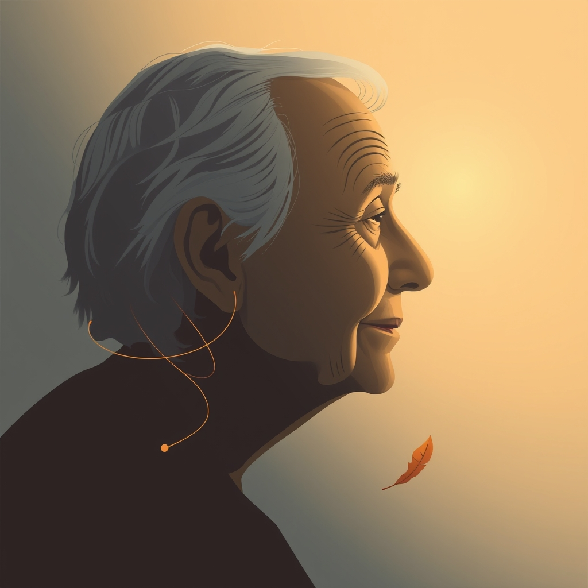

[Home](../index.md) > [Books](./index.md)  
# ⚕️💀 Being Mortal: Medicine and What Matters in the End  
  
[🛒 Being Mortal: Medicine and What Matters in the End. As an Amazon Associate I earn from qualifying purchases.](https://amzn.to/4nxP2jC)  
  
## 📚 Book Report: Being Mortal: Medicine and What Matters in the End  
  
### 📝 Summary  
  
In 👴 Being Mortal: Medicine and What Matters in the End, 👨‍⚕️ surgeon Atul Gawande explores the ⚠️ limitations of modern medicine in addressing the realities of 👵 aging and end-of-life 🏥 care. 👨‍⚕️ Gawande argues that while 💊 medicine has made incredible strides in extending ⏳ life and treating 🤒 illness, it often fails to adequately prepare 🧑‍⚕️ individuals and their 👨‍👩‍👧‍👦 families for the inevitable declines of 👴 old age and the process of 💀 dying. The 📖 book highlights a societal and medical 🙅‍♂️ reluctance to confront ⚰️ mortality, which often leads to an overmedicalized and ⚙️ technologically-driven end-of-life experience that prioritizes 🎗️ survival at any cost over the patient's 🧘‍♀️ quality of life and well-being.  
  
Through ✍️ personal anecdotes, 🧑‍🤝‍🧑 patient stories, and 🧐 insightful research, 👨‍⚕️ Gawande examines the evolution of 👵 elder care, from the 🏡 traditional multi-generational household to the 🏢 rise of nursing homes and assisted living facilities. He 👎 critiques how these institutions, often driven by 🛡️ safety and efficiency, can inadvertently strip individuals of their 🔑 autonomy, 🕊️ dignity, and 🎯 sense of purpose. The 📜 narrative emphasizes the critical need for 🗣️ open, honest conversations between 👨‍⚕️ doctors, 🧑‍🤝‍🧑 patients, and 👨‍👩‍👧‍👦 families about end-of-life priorities, ❤️ values, and 😨 fears. 👨‍⚕️ Gawande advocates for a 🔄 shift in focus towards enabling 🧘‍♀️ well-being, even when 🎗️ survival is no longer possible, by understanding what truly matters to 🧑‍🤝‍🧑 individuals in their final days. He discusses the importance of 🤕 palliative care and ⚕️ hospice as models that prioritize 😌 comfort, 🤝 support, and 🕊️ dignity, allowing 🧑‍🤝‍🧑 patients to live more fully until the very end.  
  
### 🔑 Key Themes  
  
* ⭐ **Quality of Life vs. Life Extension:** A central argument is that ⚕️ modern medicine and 🌐 society often prioritize prolonging ⏳ life, sometimes at great 💸 cost and 😔 suffering, over ensuring a high 🧘‍♀️ quality of life for the 👴 elderly and terminally ill. 👨‍⚕️ Gawande champions a re-evaluation of this approach, advocating for ✅ choices that align with a patient's ❤️ values and desires, even if it means a shorter ⏳ life.  
* 💊 **The Overmedicalization of Dying:** The 📖 book critiques how medical advancements have transformed 💀 death from a natural process into a medical event, leading to aggressive treatments with diminishing returns and often causing unnecessary 😔 suffering in a person's final stage of ⏳ life.  
* 🧑‍⚕️ **Patient-Centered Care and Autonomy:** 👨‍⚕️ Gawande stresses the importance of individualized 🏥 care that respects the patient's 🔑 autonomy and empowers them to make informed decisions about their own treatment and living arrangements. This includes candid 🗣️ conversations about prognosis, goals, and acceptable trade-offs.  
* 👵 **Challenges in Elder Care:** The 📖 book delves into the shortcomings of many 🏢 nursing homes and assisted living facilities, which, despite good intentions, can lead to a loss of 🔑 independence, 🔒 privacy, and 🔗 connection for residents. It explores alternative models that prioritize a sense of 🏘️ community, 🎯 purpose, and 🕹️ control for the 👴 elderly.  
* 🚫 **Destigmatizing Death and Illness:** 👨‍⚕️ Gawande encourages 🗣️ open dialogue about ⚰️ mortality, 👴 aging, and 🤒 illness to help 🧑‍🤝‍🧑 individuals and 👨‍👩‍👧‍👦 families better prepare for and navigate these inevitable aspects of ⏳ life, reducing 😨 fear and enabling more meaningful end-of-life experiences.  
* ⚕️ **The Role of Palliative and Hospice Care:** The 📖 book highlights these approaches as crucial for providing 😌 comfort, 🕊️ dignity, and 🤝 support to 🧑‍🤝‍🧑 patients facing terminal illnesses, focusing on symptom management and enhancing the 🧘‍♀️ quality of remaining ⏳ life rather than curative measures.  
  
## 📚 Similar Book Recommendations  
  
* 📖 **When Breath Becomes Air by Paul Kalanithi:** This ✍️ memoir, written by a neurosurgeon diagnosed with terminal lung cancer, offers a profound reflection on ⏳ life, 💀 death, and what makes ⏳ life worth living. It shares 👨‍⚕️ Gawande's medical perspective on ⚰️ mortality but from the direct experience of being a 🧑‍🤝‍🧑 patient, exploring the meaning of human existence when facing one's own end.  
* 📖 **The Bright Hour: A Memoir of Living and Dying by Nina Riggs:** A beautifully written ✍️ memoir by a poet diagnosed with terminal breast cancer. 👩‍⚕️ Riggs contemplates ⏳ life, 👨‍👩‍👧‍👦 family, and the challenges of 💀 dying, sharing her personal journey with wit and wisdom. Like 👨‍⚕️ Gawande, she grapples with how to live fully in the face of 💀 death and the practicalities of end-of-life 🏥 care.  
* 📖 **With the End in Mind: Dying, Death and Wisdom in an Age of Denial by Kathryn Mannix:** Written by a 🤕 palliative care 👨‍⚕️ doctor, this 📖 book shares real 🗣️ stories of 🧑‍🤝‍🧑 people facing the end of their ⏳ lives, demystifying the 💀 dying process and advocating for better 🗣️ conversations and understanding around 💀 death. It provides a compassionate and practical look at what it means to die well, echoing 👨‍⚕️ Gawande's call for more humane end-of-life 🏥 care.  
  
## 🆚 Contrasting Book Recommendations  
  
* 📖 **The Immortal Life of Henrietta Lacks by Rebecca Skloot:** While 👴 Being Mortal focuses on individual ✅ choices and the 🧘‍♀️ quality of ⏳ life at the end, The Immortal Life of Henrietta Lacks delves into the ⚕️ ethics of medical research and the complex history of cell lines taken without consent. It contrasts by exploring how medical advancements can persist beyond an individual's ⏳ life, raising questions about bodily autonomy and scientific progress separate from the immediate concerns of end-of-life 🏥 care.  
* 📖 **Salt, Sugar, Fat: How the Food Giants Hooked Us by Michael Moss:** This 📖 book exposes how the processed food industry intentionally designs products to be addictive and detrimental to ⚕️ health. It contrasts with 👴 Being Mortal by focusing on the societal and corporate factors that contribute to chronic 🤒 illness and shorter lifespans, rather than the medical system's response to an individual's declining ⚕️ health or ⚰️ mortality. It highlights preventative aspects of ⚕️ health that could lessen the need for extensive end-of-life 🏥 care.  
* 📖 **The Emperor of All Maladies: A Biography of Cancer by Siddhartha Mukherjee:** This comprehensive history of cancer details humanity's centuries-long fight against the disease, from ancient times to modern treatments. While it acknowledges the limits of 💊 medicine, its primary focus is on the relentless pursuit of cures and the scientific battle against a formidable 🤒 illness. This contrasts with 👨‍⚕️ Gawande's emphasis on accepting limits and prioritizing 🧘‍♀️ well-being when a cure is not possible.  
  
## 🎨 Creatively Related Book Recommendations  
  
* 📖 **Tuesdays with Morrie by Mitch Albom:** This heartwarming ✍️ memoir recounts the author's weekly visits with his former college professor, Morrie, who is 💀 dying of ALS. It's a series of lessons on ⏳ life, ❤️ love, 🙏 forgiveness, and 💀 death. It creatively relates to 👴 Being Mortal by illustrating a profoundly personal and philosophical approach to confronting one's ⚰️ mortality and finding meaning in the final stages of ⏳ life, focusing on human 🔗 connection and wisdom outside of medical interventions.  
* 📖 **A Man Called Ove by Fredrik Backman:** This novel tells the 🗣️ story of a curmudgeonly widower, Ove, who plans to end his ⏳ life but is repeatedly interrupted by his new neighbors and unexpected friendships. While fictional, it creatively relates to 👴 Being Mortal by exploring themes of 🎯 purpose, 🏘️ community, and the will to live in 👴 old age, demonstrating how 🔗 connection and meaning can profoundly impact an individual's later years, even when facing isolation and decline.  
* 📖 **When Things Fall Apart: Heart Advice for Difficult Times by Pema Chödrön:** This 📖 book offers Buddhist teachings on facing 😔 suffering, ❓ uncertainty, and the impermanence of ⏳ life. It creatively relates to 👴 Being Mortal by providing a spiritual and philosophical framework for accepting the inevitability of change, loss, and 💀 death. It offers practices for cultivating resilience and compassion in the face of ⏳ life's challenges, including the end of ⏳ life, complementing 👨‍⚕️ Gawande's practical medical perspective with inner wisdom.  
  
## 💬 [Gemini](https://gemini.google.com) Prompt (gemini-2.5-flash)  
> Write a markdown-formatted (start headings at level H2) book report, followed by similar, contrasting, and creatively related book recommendations on Being Mortal: Medicine and What Matters in the End. Never quote or italicize titles. Be thorough but concise. Use section headings and bulleted lists to avoid long blocks of text.