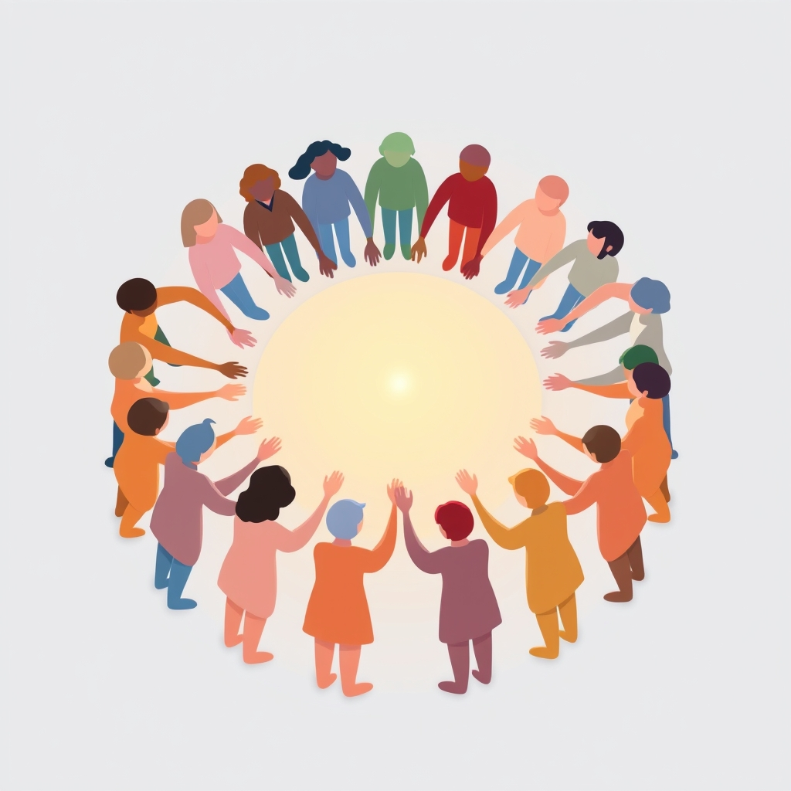

[Home](../index.md) > [Books](./index.md)  
# 🧑‍🤝‍🧑 Belonging: The Science of Creating Connection and Bridging Divides  
  
[🛒 Belonging: The Science of Creating Connection and Bridging Divides. As an Amazon Associate I earn from qualifying purchases.](https://amzn.to/4onq5YS)  
  
🤝💡 Situation-crafting, through small yet potent interventions, scientifically fosters crucial connections, bridges societal divides, and unlocks human potential by addressing our fundamental need to belong.  
  
## 🏆 Geoffrey Cohen's Belonging Strategy  
  
### 🔑 The Foundational Insight  
* 🫂 Belonging: Core human need, as vital as food/shelter. 💔 Absence causes social pain, impacts self-esteem, performance, health.  
* 🎨 Situation-Crafting: Art and science of creating environments that promote belonging. 🌍 Focus on context, not just personality.  
* 💪 Individual Power: Each person influences situations through words and deeds, enabling change.  
  
### 🔗 Core Principles for Connection  
* 🤔 Belonging Uncertainty: Perception is reality; same situation, different experiences based on background.  
* 🪄 Intervention Psychology: Small, wise interventions have disproportionately large, lasting benefits.  
* 🙅‍♂️ Beyond Stereotypes: Move past Fundamental Attribution Error (blaming person, not situation) and confirmation bias.  
  
### 🌉 Actionable Steps for Bridging Divides  
* 👂 Perspective-Getting: Ask good questions, practice deep listening, genuine curiosity. 💖 Fortifies belonging.  
* 👍 Constructive Encouragement: Express belief in others' potential, even when delivering criticism.  
* 🎯 Shared Purpose: Craft situations where all work toward common goals on equal footing.  
* 🌟 Value Affirmation: Encourage reflection on core values before challenges to bolster resilience.  
* 🗣️ Open Dialogue: Engage in good conversations, especially across political lines, to soften attitudes.  
* 🧘‍♀️ Mindful Interaction: Be polite, confirm others, avoid authoritarian language, use non-verbal cues.  
  
## ⚖️ Critical Evaluation  
  
* ✅ **Comprehensive & Pragmatic:** The book is lauded for offering a sociopsychological perspective, rich research, and pragmatic suggestions and solutions, making it highly useful for everyday application across various life aspects (school, work, politics).  
* 🔬 **Scientific Rigor:** Cohen, a Stanford professor, grounds his arguments in rigorously tested psychological concepts and empirical research, including situation-crafting and wise interventions, providing a science-backed guide for navigating modern social life.  
* ✨ **Hopeful and Action-Oriented:** Reviewers consistently highlight the book's hopeful tone and focus on actionable insights, offering concrete steps to foster belonging and reduce polarization rather than just diagnosing problems.  
* 📚 **Theoretical Integration:** One academic review places Cohen's situation-crafting framework within established theoretical frameworks, such as Kurt Lewin's behavioral field theory and intersubjective constructs, affirming its scholarly depth.  
* 🧐 **Acknowledged Nuances:** While largely positive, some reviews note that like many popular psychology books, the content's core thesis might sometimes oversimplify complex issues, focusing heavily on misunderstandings and biases. ⚠️ Another review points to minor flaws but emphasizes that these are not fatal to the book's overall purpose and usefulness.  
  
📝 **Verdict:** Geoffrey Cohen's *Belonging* stands as a highly relevant and expertly crafted work that effectively translates complex social psychology into actionable strategies for fostering connection and bridging divides. 🚀 Its robust scientific foundation, coupled with a practical and hopeful approach, makes it an essential read for individuals and leaders seeking to cultivate more inclusive environments.  
  
## 🔍 Topics for Further Understanding  
  
* 🧠 Neurobiological underpinnings of social pain and connection.  
* 🌍 Cross-cultural variations in the experience and expression of belonging.  
* 📱 The impact of digital platforms and social media on belonging formation and fragmentation.  
* 💸 Economic and policy implications of widespread loneliness and social disconnection.  
* 📈 Longitudinal studies on the efficacy and persistence of wise interventions in diverse populations.  
* ➕ The role of intersectionality in shaping belonging uncertainty and intervention effectiveness.  
  
## ❓ Frequently Asked Questions (FAQ)  
  
### 💡 Q: What is situation-crafting?  
✅ A: Situation-crafting is the deliberate act of designing or adjusting social environments to promote a sense of belonging, rather than solely focusing on individual traits. 🧱 It recognizes that context significantly shapes our feelings and behaviors.  
  
### 💡 Q: Why is a sense of belonging so important?  
✅ A: Belonging is a fundamental human need; its absence can lead to psychological distress, diminished performance, impaired health, increased hostility, and greater societal polarization. ❤️‍🩹 Conversely, belonging fosters well-being, motivation, and cooperation.  
  
### 💡 Q: How can I apply the concepts of Belonging in my daily life?  
✅ A: You can foster belonging through wise interventions such as practicing perspective-getting (asking good questions and listening), giving constructive feedback with reassurance, focusing on shared goals, and reflecting on your core values. 🤏 Small actions can have significant impacts.  
  
### 💡 Q: What are wise interventions in the context of Belonging?  
✅ A: Wise interventions are small, precisely timed, and often subtle actions or communications designed to change how individuals interpret a situation, thereby improving their sense of belonging and engagement, particularly for those from marginalized groups.  
  
## 📚 Book Recommendations  
  
### 🧑‍🤝‍🧑 Similar Books  
* 🎺 Whistling Vivaldi by Claude M. Steele  
* 🎉 The Art of Gathering by Priya Parker  
* 🤝 Connect by David Bradford and Carole Robin  
* 🌍 Together by Vivek Murthy  
  
### ⚔️ Contrasting Books  
* [🎳🏘️📉📈 Bowling Alone: The Collapse and Revival of American Community](./bowling-alone.md) by Robert D. Putnam (explores decline of social capital)  
* [😇🧠 The Righteous Mind: Why Good People Are Divided by Politics and Religion](./the-righteous-mind.md) by Jonathan Haidt (focuses on moral psychology and political division)  
* 🎭 Identity by Francis Fukuyama (examines demand for recognition)  
  
### 🔗 Related Books  
* [🕊️🤝 Nonviolent Communication: A Language of Life](./nonviolent-communication.md) by Marshall B. Rosenberg  
* [💡🎨 Originals](./originals.md) by Adam Grant  
* 📣 [🍃🧠🤝🏼 Influence: The Psychology of Persuasion](./influence.md) and Pre-Suasion by Robert B. Cialdini  
* 🧠 [🤔🐇🐢 Thinking, Fast and Slow](./thinking-fast-and-slow.md) by Daniel Kahneman  
  
## 🫵 What Do You Think?  
  
🤔 Which situation-crafting technique resonates most with your experiences, and how have you seen a lack of belonging manifest in either positive or negative ways in your own communities? 💬 Share your thoughts below!